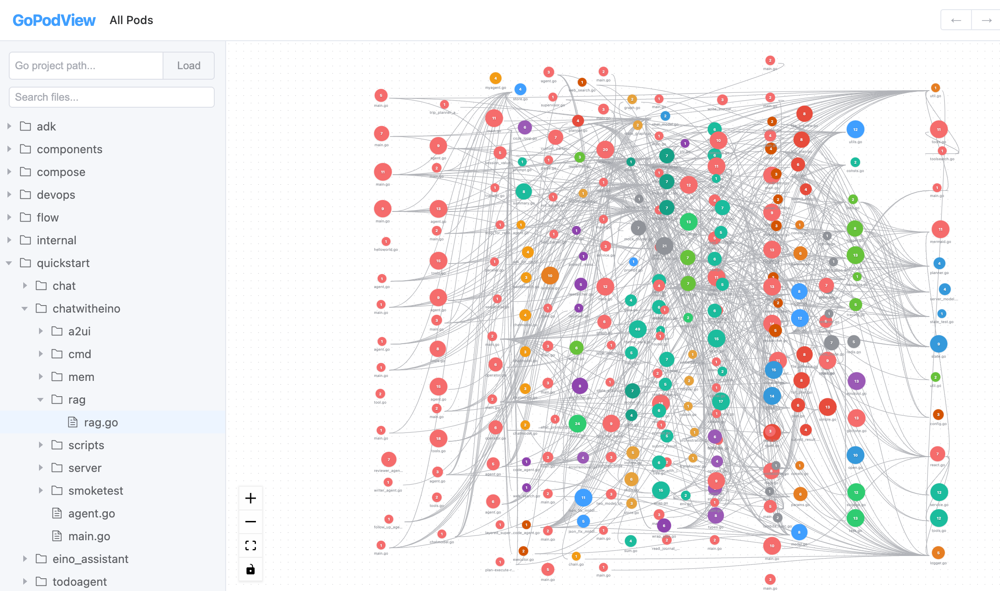
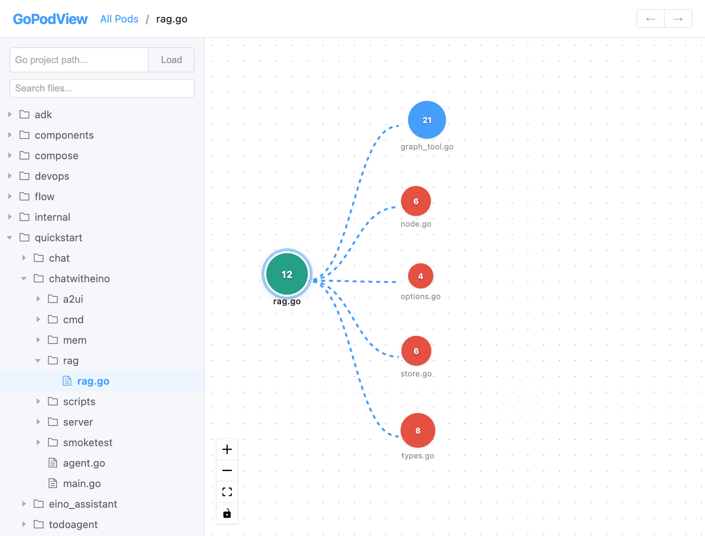
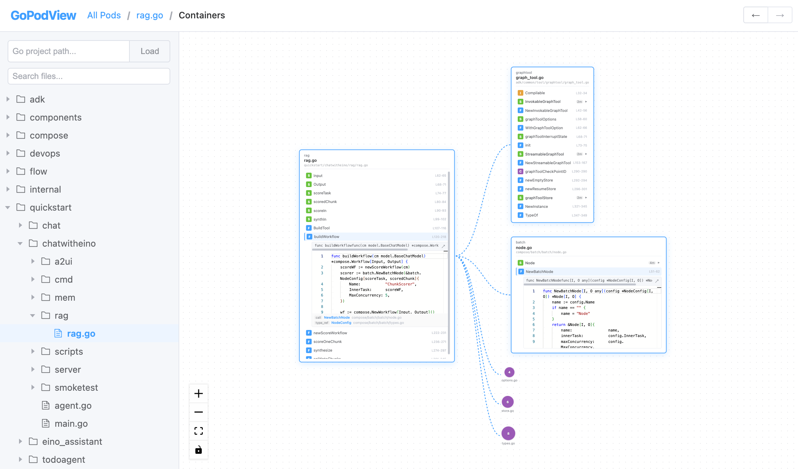

# GoPodView

**English** | [中文](README_CN.md)

A visual explorer for Go project code structure, inspired by Kubernetes concepts. Go source files are displayed as **Pods**, their internal declarations (functions, structs, interfaces, constants, variables) as **Containers**. Import dependencies render as edges in an interactive graph. Click any Container to view source code directly.

## Screenshots

> The screenshots below use [eino-examples](https://github.com/cloudwego/eino-examples) as the example project.

### Global Pod View
All Go files in the project rendered as colored dots. Dot size reflects the number of containers; color groups files by package.



### Focused View
Select a file in the sidebar tree to focus its Pod — only the selected Pod and its direct dependencies are shown, automatically relaid out in a mind-map tree pattern.



### Expanded View
Click the focused Pod again to expand — see all Containers inside the file. Struct methods are grouped under their receiver type.



## Features

- **File Tree** — browse the project directory on the left sidebar; click a file to focus its Pod (the only way to change focus)
- **Pod Dependency Graph** — interactive node graph powered by Vue Flow (zoom, pan, drag)
- **Focus Mode** — select a file in the tree to isolate its Pod with dependencies in a mind-map tree layout
- **Expand Mode** — click the focused Pod to expand and see its Containers (funcs, structs, interfaces, consts, vars); click any neighbor Pod to expand it inline
- **Floating Code Tabs** — pop out any code view into independent draggable tabs with Monaco Editor; multiple tabs can be open simultaneously
- **Inline Code View** — click any Container to preview its source code with Go syntax highlighting
- **Struct Method Grouping** — methods with receivers are nested under their struct/interface; click to toggle
- **Pod File Path** — each expanded Pod card displays its full file path in the header
- **VSCode-style Navigation** — `Cmd+[` back, `Cmd+]` forward, `Cmd+Click` to jump to references
- **URL State** — current project, focused file, view level, and expanded pods are synced to the URL
- **Package Coloring** — nodes are colored by package for visual grouping
- **Fixed Zoom** — navigation actions only pan the camera; zoom is controlled manually

## Tech Stack

| Layer | Technology |
|-------|-----------|
| Backend | Go (go/ast, go/parser), Gin |
| Frontend | Vue 3, TypeScript, Vite |
| Graph | Vue Flow |
| Code View | Monaco Editor |
| UI | Element Plus |
| State | Pinia |

## Quick Start

```bash
# One command (requires Make, Go, Node.js)
make run PROJECT=/path/to/your/go/project

# Or start separately
cd backend && go run main.go --project /path/to/your/go/project
cd frontend && npm install && npm run dev
```

Open http://localhost:5173 in your browser.

You can also load a project from the UI — enter a path in the sidebar input and click **Load**.

## API

| Endpoint | Method | Description |
|----------|--------|-------------|
| `/api/project` | POST | Set project path to analyze |
| `/api/filetree` | GET | Get project file tree |
| `/api/pods` | GET | Get all Pods and dependency edges |
| `/api/pod/:path` | GET | Get a single Pod with details |
| `/api/containers/:path` | GET | Get all Containers in a Pod (with source code) |
| `/api/container/:path?name=` | GET | Get a specific Container |
| `/api/dependencies/:path?depth=` | GET | Get N-level dependencies |

## Project Structure

```
GoPodView/
├── backend/                 # Go backend
│   ├── main.go              # Entry point
│   ├── internal/
│   │   ├── parser/          # AST parsing engine
│   │   ├── model/           # Data models (Pod, Container)
│   │   └── api/             # HTTP handlers + router
│   └── go.mod
├── frontend/                # Vue 3 frontend
│   ├── src/
│   │   ├── components/
│   │   │   ├── PodGraph/    # Vue Flow graph + custom PodNode
│   │   │   ├── FileTree/    # Sidebar file tree
│   │   │   ├── CodeView/    # Monaco Editor wrapper
│   │   │   ├── Breadcrumb/  # Navigation breadcrumb
│   │   │   └── Controls/    # UI controls
│   │   ├── stores/          # Pinia state management
│   │   ├── api/             # HTTP client
│   │   └── types/           # TypeScript interfaces
│   └── package.json
├── Makefile
└── README.md
```

## License

[Apache-2.0](LICENSE)
