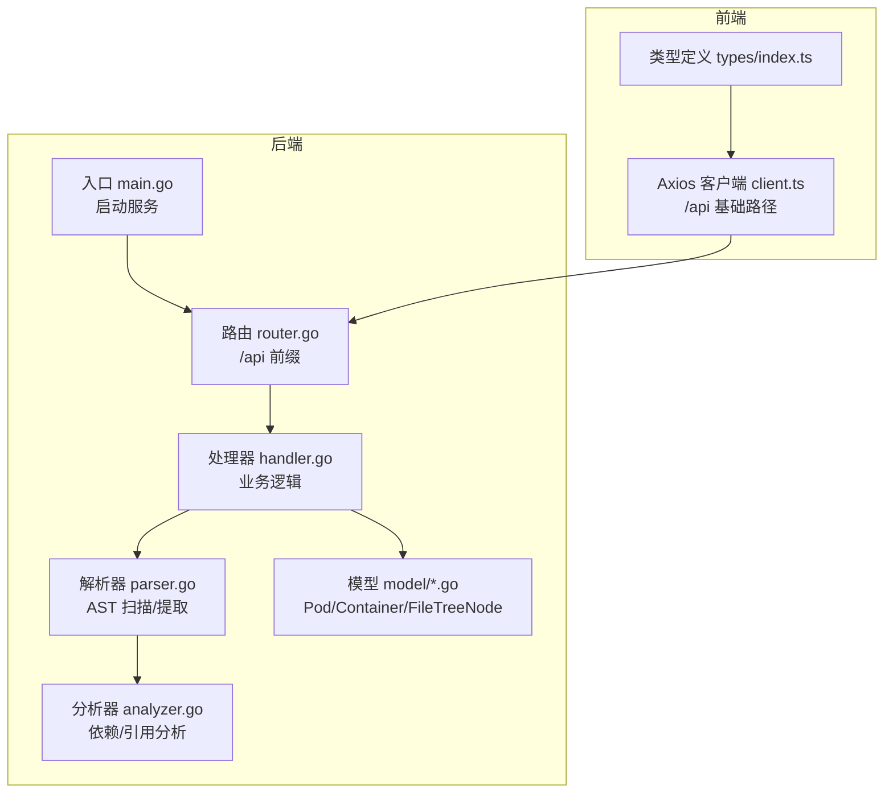
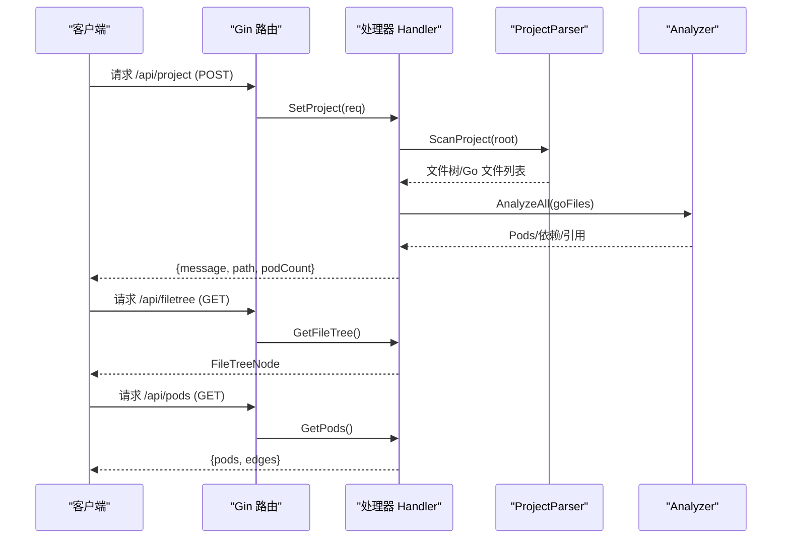
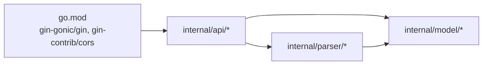

# API 接口参考

<cite>
**本文引用的文件**
- [backend/main.go](file://backend/main.go)
- [backend/internal/api/router.go](file://backend/internal/api/router.go)
- [backend/internal/api/handler.go](file://backend/internal/api/handler.go)
- [backend/internal/model/pod.go](file://backend/internal/model/pod.go)
- [backend/internal/model/container.go](file://backend/internal/model/container.go)
- [backend/internal/parser/parser.go](file://backend/internal/parser/parser.go)
- [backend/internal/parser/analyzer.go](file://backend/internal/parser/analyzer.go)
- [backend/go.mod](file://backend/go.mod)
- [frontend/src/api/client.ts](file://frontend/src/api/client.ts)
- [frontend/src/types/index.ts](file://frontend/src/types/index.ts)
- [Makefile](file://Makefile)
- [README.md](file://README.md)
</cite>

## 目录
1. [简介](#简介)
2. [项目结构](#项目结构)
3. [核心组件](#核心组件)
4. [架构总览](#架构总览)
5. [详细接口说明](#详细接口说明)
6. [依赖关系分析](#依赖关系分析)
7. [性能与限制](#性能与限制)
8. [故障排查指南](#故障排查指南)
9. [结论](#结论)
10. [附录](#附录)

## 简介
本文件为 GoPodView 后端 API 的完整接口参考，涵盖所有 RESTful 端点的请求方法、URL 模式、参数说明、响应格式、错误处理、认证与安全、性能限制以及客户端集成指南。后端基于 Go 语言与 Gin 框架实现，前端通过 Axios 客户端调用 /api 前缀下的接口。

## 项目结构
后端采用分层设计：
- 入口程序负责启动 HTTP 服务器并解析命令行参数
- 路由层定义 /api 前缀下的所有端点
- 处理器层封装业务逻辑（项目加载、文件树、Pods、容器、依赖图）
- 模型层定义数据结构（Pod、Container、FileTreeNode）
- 解析器层负责扫描项目、解析 AST 并构建依赖关系

图表来源
- [backend/main.go:11-30](file://backend/main.go#L11-L30)
- [backend/internal/api/router.go:8-31](file://backend/internal/api/router.go#L8-L31)
- [backend/internal/api/handler.go:15-29](file://backend/internal/api/handler.go#L15-L29)
- [backend/internal/parser/parser.go:16-30](file://backend/internal/parser/parser.go#L16-L30)
- [backend/internal/parser/analyzer.go:13-25](file://backend/internal/parser/analyzer.go#L13-L25)
- [backend/internal/model/pod.go:3-11](file://backend/internal/model/pod.go#L3-L11)
- [backend/internal/model/container.go:13-36](file://backend/internal/model/container.go#L13-L36)
- [frontend/src/api/client.ts:10-13](file://frontend/src/api/client.ts#L10-L13)

章节来源
- [backend/main.go:11-30](file://backend/main.go#L11-L30)
- [backend/internal/api/router.go:8-31](file://backend/internal/api/router.go#L8-L31)
- [backend/internal/api/handler.go:15-29](file://backend/internal/api/handler.go#L15-L29)
- [backend/internal/parser/parser.go:16-30](file://backend/internal/parser/parser.go#L16-L30)
- [backend/internal/parser/analyzer.go:13-25](file://backend/internal/parser/analyzer.go#L13-L25)
- [backend/internal/model/pod.go:3-11](file://backend/internal/model/pod.go#L3-L11)
- [backend/internal/model/container.go:13-36](file://backend/internal/model/container.go#L13-L36)
- [frontend/src/api/client.ts:10-13](file://frontend/src/api/client.ts#L10-L13)

## 核心组件
- 路由器：在 /api 下注册所有端点，启用 CORS 支持
- 处理器：维护项目根目录、文件树、Pod 映射与并发读写锁；提供项目加载、文件树、Pod 列表、单个 Pod、容器列表、单个容器、依赖图等接口
- 解析器与分析器：扫描 Go 源文件，提取声明（函数、结构体、接口、常量、变量），构建 Pod 与容器，计算依赖与引用
- 模型：定义 Pod、Container、FileTreeNode 等数据结构

章节来源
- [backend/internal/api/router.go:8-31](file://backend/internal/api/router.go#L8-L31)
- [backend/internal/api/handler.go:15-29](file://backend/internal/api/handler.go#L15-L29)
- [backend/internal/parser/parser.go:32-59](file://backend/internal/parser/parser.go#L32-L59)
- [backend/internal/parser/analyzer.go:27-39](file://backend/internal/parser/analyzer.go#L27-L39)
- [backend/internal/model/pod.go:3-11](file://backend/internal/model/pod.go#L3-L11)
- [backend/internal/model/container.go:13-36](file://backend/internal/model/container.go#L13-L36)

## 架构总览
后端以 Gin 作为 Web 框架，CORS 配置允许本地开发环境跨域访问。所有 API 均位于 /api 前缀下，处理器内部通过互斥读写锁保护共享状态。

图表来源
- [backend/internal/api/router.go:19-28](file://backend/internal/api/router.go#L19-L28)
- [backend/internal/api/handler.go:56-75](file://backend/internal/api/handler.go#L56-L75)
- [backend/internal/api/handler.go:77-86](file://backend/internal/api/handler.go#L77-L86)
- [backend/internal/api/handler.go:93-124](file://backend/internal/api/handler.go#L93-L124)
- [backend/internal/parser/parser.go:32-59](file://backend/internal/parser/parser.go#L32-L59)
- [backend/internal/parser/analyzer.go:27-39](file://backend/internal/parser/analyzer.go#L27-L39)

## 详细接口说明

### 认证与安全
- 当前实现未包含任何认证或授权逻辑，所有 /api 端点均为匿名访问
- CORS 已配置，允许本地开发源（如前端开发服务器）跨域访问
- 建议在生产环境中增加鉴权、速率限制与输入校验

章节来源
- [backend/internal/api/router.go:12-17](file://backend/internal/api/router.go#L12-L17)

### 端点概览
- 设置项目路径：POST /api/project
- 获取文件树：GET /api/filetree
- 获取所有 Pods 及依赖边：GET /api/pods
- 获取单个 Pod：GET /api/pod/:path
- 获取 Pod 内所有容器：GET /api/containers/:path
- 获取 Pod 中指定名称的容器：GET /api/container/:path?name=
- 获取 N 层依赖：GET /api/dependencies/:path?depth=

章节来源
- [README.md:67-78](file://README.md#L67-L78)
- [backend/internal/api/router.go:21-27](file://backend/internal/api/router.go#L21-L27)

### 1) 设置项目路径
- 方法：POST
- 路径：/api/project
- 请求体 JSON
  - 字段：path（字符串，必填）
- 成功响应：200 OK
  - 字段：message（字符串）、path（字符串）、podCount（整数）
- 错误响应：
  - 400 Bad Request：请求体无效
  - 500 Internal Server Error：项目加载失败（解析异常）

章节来源
- [backend/internal/api/router.go:21](file://backend/internal/api/router.go#L21)
- [backend/internal/api/handler.go:52-75](file://backend/internal/api/handler.go#L52-L75)

### 2) 获取文件树
- 方法：GET
- 路径：/api/filetree
- 查询参数：无
- 成功响应：200 OK
  - 结构：FileTreeNode（见“数据模型”）
- 错误响应：400 Bad Request（未加载项目）

章节来源
- [backend/internal/api/router.go:22](file://backend/internal/api/router.go#L22)
- [backend/internal/api/handler.go:77-86](file://backend/internal/api/handler.go#L77-L86)
- [backend/internal/model/pod.go:13-18](file://backend/internal/model/pod.go#L13-L18)

### 3) 获取所有 Pods 及依赖边
- 方法：GET
- 路径：/api/pods
- 查询参数：无
- 成功响应：200 OK
  - 字段：pods（数组，元素为 Pod）
  - 字段：edges（数组，元素为 PodEdge，包含 source/target）
- 错误响应：400 Bad Request（未加载项目）

章节来源
- [backend/internal/api/router.go:23](file://backend/internal/api/router.go#L23)
- [backend/internal/api/handler.go:88-124](file://backend/internal/api/handler.go#L88-L124)
- [backend/internal/model/pod.go:3-11](file://backend/internal/model/pod.go#L3-L11)

### 4) 获取单个 Pod
- 方法：GET
- 路径：/api/pod/:path
- 路径参数：path（字符串，必填，去除前导斜杠）
- 成功响应：200 OK
  - 结构：Pod（见“数据模型”）
- 错误响应：404 Not Found（Pod 不存在）

章节来源
- [backend/internal/api/router.go:24](file://backend/internal/api/router.go#L24)
- [backend/internal/api/handler.go:126-138](file://backend/internal/api/handler.go#L126-L138)
- [backend/internal/model/pod.go:3-11](file://backend/internal/model/pod.go#L3-L11)

### 5) 获取 Pod 内所有容器
- 方法：GET
- 路径：/api/containers/:path
- 路径参数：path（字符串，必填）
- 成功响应：200 OK
  - 结构：Container 数组（见“数据模型”）
- 错误响应：404 Not Found（Pod 不存在）

章节来源
- [backend/internal/api/router.go:25](file://backend/internal/api/router.go#L25)
- [backend/internal/api/handler.go:140-152](file://backend/internal/api/handler.go#L140-L152)
- [backend/internal/model/container.go:13-36](file://backend/internal/model/container.go#L13-L36)

### 6) 获取 Pod 中指定名称的容器
- 方法：GET
- 路径：/api/container/:path?name=
- 路径参数：path（字符串，必填）
- 查询参数：name（字符串，必填）
- 成功响应：200 OK
  - 结构：Container（见“数据模型”）
- 错误响应：
  - 404 Not Found：Pod 或容器不存在

章节来源
- [backend/internal/api/router.go:26](file://backend/internal/api/router.go#L26)
- [backend/internal/api/handler.go:154-175](file://backend/internal/api/handler.go#L154-L175)
- [backend/internal/model/container.go:13-36](file://backend/internal/model/container.go#L13-L36)

### 7) 获取 N 层依赖
- 方法：GET
- 路径：/api/dependencies/:path?depth=
- 路径参数：path（字符串，必填）
- 查询参数：depth（整数，默认 1，最小 1，最大 10）
- 成功响应：200 OK
  - 字段：root（字符串）
  - 字段：depth（整数）
  - 字段：pods（数组，元素为 Pod）
  - 字段：edges（数组，元素为 PodEdge）
- 错误响应：404 Not Found（Pod 不存在）

章节来源
- [backend/internal/api/router.go:27](file://backend/internal/api/router.go#L27)
- [backend/internal/api/handler.go:177-209](file://backend/internal/api/handler.go#L177-L209)
- [backend/internal/model/pod.go:3-11](file://backend/internal/model/pod.go#L3-L11)

### 数据模型
- Pod
  - 字段：path（字符串）、package（字符串）、fileName（字符串）、imports（字符串数组）、containers（Container 数组）、dependsOn（字符串数组）、dependedBy（字符串数组）
- Container
  - 字段：name（字符串）、type（枚举：func、struct、interface、const、var）、pod（字符串）、startLine（整数）、endLine（整数）、signature（字符串）、sourceCode（可选字符串）、references（Reference 数组）
- Reference
  - 字段：containerName（字符串）、podPath（字符串）、type（枚举：call、type_ref、embed）
- FileTreeNode
  - 字段：name（字符串）、path（字符串）、isDir（布尔）、children（可选数组）
- PodEdge
  - 字段：source（字符串）、target（字符串）

章节来源
- [backend/internal/model/pod.go:3-11](file://backend/internal/model/pod.go#L3-L11)
- [backend/internal/model/container.go:13-36](file://backend/internal/model/container.go#L13-L36)
- [frontend/src/types/index.ts:21-53](file://frontend/src/types/index.ts#L21-L53)

### 请求/响应 JSON 模式定义
- 设置项目
  - 请求体：{"path":"字符串"}
  - 响应体：{"message":"字符串","path":"字符串","podCount":整数}
- 获取文件树
  - 响应体：FileTreeNode 对象
- 获取 Pods 及依赖边
  - 响应体：{"pods":[Pod...],"edges":[{"source":"字符串","target":"字符串"}...]}
- 获取单个 Pod
  - 响应体：Pod 对象
- 获取容器列表
  - 响应体：[Container...]
- 获取指定容器
  - 响应体：Container 对象
- 获取依赖图
  - 响应体：{"root":"字符串","depth":整数,"pods":[Pod...],"edges":[{"source":"字符串","target":"字符串"}...]}

章节来源
- [backend/internal/api/handler.go:52-75](file://backend/internal/api/handler.go#L52-L75)
- [backend/internal/api/handler.go:77-86](file://backend/internal/api/handler.go#L77-L86)
- [backend/internal/api/handler.go:93-124](file://backend/internal/api/handler.go#L93-L124)
- [backend/internal/api/handler.go:126-138](file://backend/internal/api/handler.go#L126-L138)
- [backend/internal/api/handler.go:140-152](file://backend/internal/api/handler.go#L140-L152)
- [backend/internal/api/handler.go:154-175](file://backend/internal/api/handler.go#L154-L175)
- [backend/internal/api/handler.go:177-209](file://backend/internal/api/handler.go#L177-L209)

### 状态码说明
- 200 OK：成功
- 400 Bad Request：请求体无效或未加载项目
- 404 Not Found：资源不存在（Pod/容器）
- 500 Internal Server Error：服务器内部错误（项目加载失败）

章节来源
- [backend/internal/api/handler.go:58-66](file://backend/internal/api/handler.go#L58-L66)
- [backend/internal/api/handler.go:81-83](file://backend/internal/api/handler.go#L81-L83)
- [backend/internal/api/handler.go:97-99](file://backend/internal/api/handler.go#L97-L99)
- [backend/internal/api/handler.go:132-134](file://backend/internal/api/handler.go#L132-L134)
- [backend/internal/api/handler.go:146-148](file://backend/internal/api/handler.go#L146-L148)
- [backend/internal/api/handler.go:162-164](file://backend/internal/api/handler.go#L162-L164)
- [backend/internal/api/handler.go:192-194](file://backend/internal/api/handler.go#L192-L194)

### 使用示例（客户端集成）
- 基础 URL：/api（Axios 实例已设置）
- 示例调用（来自前端客户端）：
  - 设置项目：POST /api/project，请求体包含 path
  - 获取文件树：GET /api/filetree
  - 获取 Pods：GET /api/pods
  - 获取单个 Pod：GET /api/pod/:path
  - 获取容器列表：GET /api/containers/:path
  - 获取指定容器：GET /api/container/:path?name=NAME
  - 获取依赖图：GET /api/dependencies/:path?depth=DEPTH

章节来源
- [frontend/src/api/client.ts:15-52](file://frontend/src/api/client.ts#L15-L52)
- [frontend/src/types/index.ts:21-53](file://frontend/src/types/index.ts#L21-L53)

## 依赖关系分析
- 外部依赖
  - Gin Web 框架与 CORS 中间件
  - go/ast、go/parser、go/printer、go/token（Go 标准库）
- 内部模块
  - model：数据模型
  - parser：AST 解析与依赖分析
  - api：HTTP 路由与处理器

图表来源
- [backend/go.mod:5-8](file://backend/go.mod#L5-L8)
- [backend/internal/api/router.go:3-6](file://backend/internal/api/router.go#L3-L6)
- [backend/internal/api/handler.go:3-13](file://backend/internal/api/handler.go#L3-L13)

章节来源
- [backend/go.mod:5-8](file://backend/go.mod#L5-L8)
- [backend/internal/api/router.go:3-6](file://backend/internal/api/router.go#L3-L6)
- [backend/internal/api/handler.go:3-13](file://backend/internal/api/handler.go#L3-L13)

## 性能与限制
- 并发控制：处理器内部使用读写锁保护共享状态，避免竞态
- 依赖深度限制：/api/dependencies 接口对 depth 进行范围限制（最小 1，最大 10），防止过深遍历导致性能问题
- 数据裁剪：/api/pods 返回时会移除容器的源码字段，减少响应体积
- 解析策略：解析器按文件粒度解析，分析器构建索引与依赖映射，避免重复扫描
- 建议
  - 在生产环境启用鉴权与限流
  - 对大项目建议分页或懒加载
  - 前端缓存常用数据，减少重复请求

章节来源
- [backend/internal/api/handler.go:182-189](file://backend/internal/api/handler.go#L182-L189)
- [backend/internal/api/handler.go:107-113](file://backend/internal/api/handler.go#L107-L113)
- [backend/internal/parser/analyzer.go:27-39](file://backend/internal/parser/analyzer.go#L27-L39)

## 故障排查指南
- 无法连接后端
  - 确认后端监听地址与端口（默认 8080），可通过命令行参数设置
  - 检查 CORS 配置是否允许前端源
- 400 Bad Request
  - 检查请求体格式（JSON）与必填字段
  - 未加载项目时访问受保护端点会返回 400
- 404 Not Found
  - 路径参数或查询参数不正确（如 Pod/容器不存在）
- 500 Internal Server Error
  - 项目加载失败（解析异常），检查日志输出
- 前端集成
  - Axios 实例 baseURL 已设为 /api，确保代理或同源策略正确
  - 使用前端类型定义确保响应结构一致

章节来源
- [backend/main.go:19-29](file://backend/main.go#L19-L29)
- [backend/internal/api/router.go:12-17](file://backend/internal/api/router.go#L12-L17)
- [backend/internal/api/handler.go:58-66](file://backend/internal/api/handler.go#L58-L66)
- [backend/internal/api/handler.go:81-83](file://backend/internal/api/handler.go#L81-L83)
- [backend/internal/api/handler.go:132-134](file://backend/internal/api/handler.go#L132-L134)
- [frontend/src/api/client.ts:10-13](file://frontend/src/api/client.ts#L10-L13)

## 结论
本接口文档覆盖了 GoPodView 后端的所有 RESTful 端点，提供了清晰的请求/响应模式、错误处理与性能建议。结合前端客户端示例，开发者可快速完成集成与二次开发。建议在生产环境中增强安全与性能控制。

## 附录
- 快速启动
  - 使用 Makefile 一键启动后端与前端
  - 或分别启动后端（指定项目路径与端口）与前端（npm run dev）
- 命令行参数
  - --project：要分析的 Go 项目路径
  - --port：HTTP 服务器端口（默认 8080）

章节来源
- [Makefile:6-25](file://Makefile#L6-L25)
- [backend/main.go:12-13](file://backend/main.go#L12-L13)