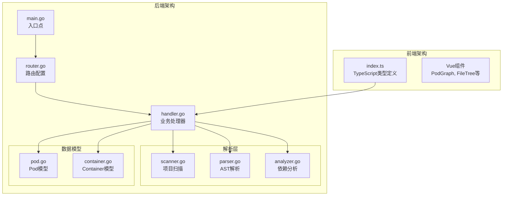
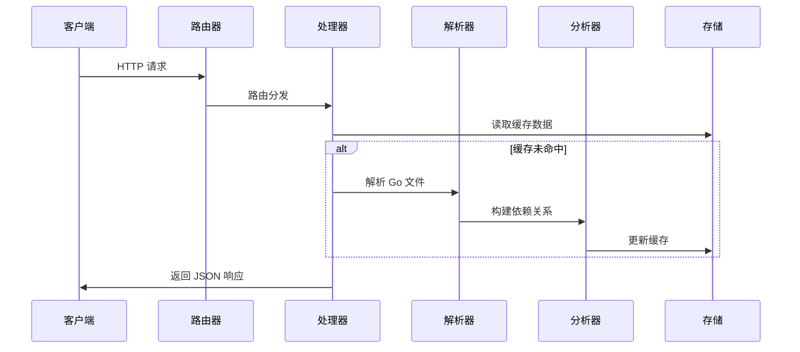
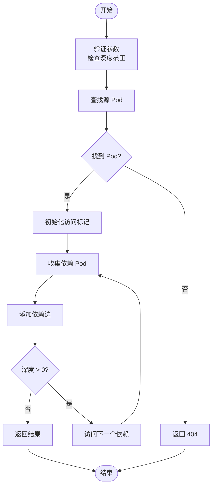
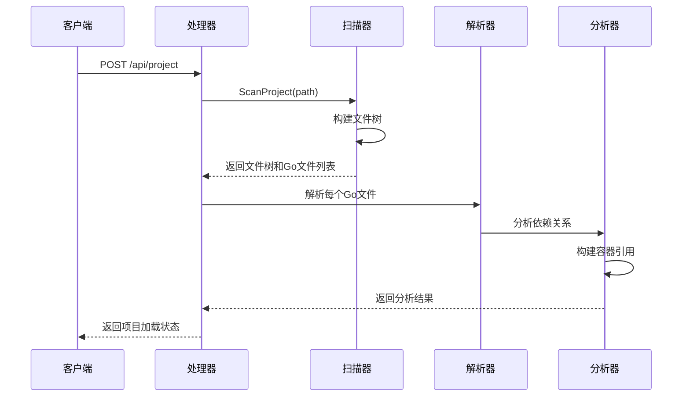
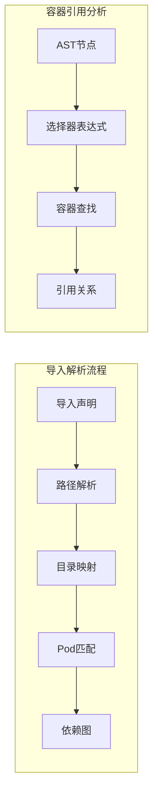

# Pod 数据接口

<cite>
**本文档引用的文件**
- [router.go](file://backend/internal/api/router.go)
- [handler.go](file://backend/internal/api/handler.go)
- [pod.go](file://backend/internal/model/pod.go)
- [container.go](file://backend/internal/model/container.go)
- [analyzer.go](file://backend/internal/parser/analyzer.go)
- [parser.go](file://backend/internal/parser/parser.go)
- [scanner.go](file://backend/internal/parser/scanner.go)
- [index.ts](file://frontend/src/types/index.ts)
- [main.go](file://backend/main.go)
- [go.mod](file://backend/go.mod)
- [README.md](file://README.md)
- [README_CN.md](file://README_CN.md)
</cite>

## 目录
1. [简介](#简介)
2. [项目结构](#项目结构)
3. [核心组件](#核心组件)
4. [架构概览](#架构概览)
5. [详细组件分析](#详细组件分析)
6. [依赖关系分析](#依赖关系分析)
7. [性能考虑](#性能考虑)
8. [故障排除指南](#故障排除指南)
9. [结论](#结论)

## 简介

GoPodView 是一个基于 Kubernetes Pod 概念的 Go 项目代码结构可视化工具。该项目将 Go 源文件抽象为 "Pod"，文件内的声明（函数、结构体、接口、常量、变量）抽象为 "Container"，并通过 import 依赖关系构建交互式依赖图。

本项目的核心是提供 RESTful API 来查询和分析 Pod 相关数据，支持：
- 获取所有 Pod 列表及其依赖关系
- 查询单个 Pod 的详细信息
- 分析 Pod 的依赖关系图
- 获取 Pod 内部的 Container 信息
- 解析容器间的引用关系

## 项目结构

GoPodView 采用前后端分离的架构设计，后端使用 Go 和 Gin 框架，前端使用 Vue 3 和 TypeScript。



**图表来源**
- [main.go:11-30](file://backend/main.go#L11-L30)
- [router.go:8-31](file://backend/internal/api/router.go#L8-L31)
- [handler.go:15-21](file://backend/internal/api/handler.go#L15-L21)

**章节来源**
- [main.go:1-31](file://backend/main.go#L1-L31)
- [router.go:1-32](file://backend/internal/api/router.go#L1-L32)

## 核心组件

### 数据模型

系统的核心数据模型包括 Pod 和 Container 两个主要实体：

#### Pod 数据结构
Pod 表示一个 Go 源文件，包含以下关键字段：
- `path`: 文件的相对路径
- `package`: Go 包名
- `fileName`: 文件名
- `imports`: 导入的包列表
- `containers`: 包含的 Container 列表
- `dependsOn`: 依赖的其他 Pod 路径
- `dependedBy`: 被哪些 Pod 依赖

#### Container 数据结构
Container 表示 Go 源文件中的声明，支持多种类型：
- `name`: 声明名称（函数包含接收者类型）
- `type`: Container 类型（func、struct、interface、const、var）
- `pod`: 所属 Pod 的路径
- `startLine/endLine`: 在源文件中的起止行号
- `signature`: 声明的签名字符串
- `sourceCode`: 源代码内容（可选）
- `references`: 对其他 Container 的引用列表

**章节来源**
- [pod.go:3-11](file://backend/internal/model/pod.go#L3-L11)
- [container.go:13-36](file://backend/internal/model/container.go#L13-L36)

### API 路由配置

后端通过 Gin 框架提供 RESTful API，主要路由包括：

| 端点 | 方法 | 描述 | 参数 |
|------|------|------|------|
| `/api/project` | POST | 设置要分析的项目路径 | JSON: `{path: string}` |
| `/api/filetree` | GET | 获取项目文件树 | 无 |
| `/api/pods` | GET | 获取所有 Pod 及依赖边 | 无 |
| `/api/pod/:path` | GET | 获取单个 Pod 详情 | 路径参数: `path` |
| `/api/containers/:path` | GET | 获取 Pod 内所有 Container | 路径参数: `path` |
| `/api/container/:path?name=` | GET | 获取指定 Container | 路径参数: `path`, 查询参数: `name` |
| `/api/dependencies/:path?depth=` | GET | 获取 N 级依赖 | 路径参数: `path`, 查询参数: `depth` |

**章节来源**
- [router.go:19-28](file://backend/internal/api/router.go#L19-L28)
- [README.md:69-78](file://README.md#L69-L78)

## 架构概览

系统采用分层架构设计，从底层的 AST 解析到高层的 API 服务：



**图表来源**
- [handler.go:31-50](file://backend/internal/api/handler.go#L31-L50)
- [parser.go:32-59](file://backend/internal/parser/parser.go#L32-L59)
- [analyzer.go:27-39](file://backend/internal/parser/analyzer.go#L27-L39)

## 详细组件分析

### Pod 列表获取接口

#### 接口定义
- **端点**: `GET /api/pods`
- **功能**: 获取所有 Pod 的基本信息和依赖关系边
- **响应格式**: 包含 Pod 列表和依赖边数组

#### 响应结构
```json
{
  "pods": [
    {
      "path": "string",
      "package": "string", 
      "fileName": "string",
      "imports": ["string"],
      "containers": [
        {
          "name": "string",
          "type": "func|struct|interface|const|var",
          "pod": "string",
          "startLine": integer,
          "endLine": integer,
          "signature": "string",
          "references": []
        }
      ],
      "dependsOn": ["string"],
      "dependedBy": ["string"]
    }
  ],
  "edges": [
    {
      "source": "string",
      "target": "string"
    }
  ]
}
```

#### 实现细节
处理器会：
1. 锁定共享状态以确保线程安全
2. 检查是否已加载项目
3. 创建 Pod 的浅拷贝以避免返回大量源代码
4. 清理容器的源代码字段
5. 收集所有依赖关系边

**章节来源**
- [handler.go:93-124](file://backend/internal/api/handler.go#L93-L124)

### 单个 Pod 查询接口

#### 接口定义
- **端点**: `GET /api/pod/:path`
- **功能**: 获取指定路径的 Pod 详细信息
- **参数**: `path` - Pod 的相对路径

#### 路径参数解析
系统会自动移除路径前缀的斜杠，然后在内存映射中查找对应的 Pod。

#### 响应处理
如果找到 Pod，直接返回完整数据；如果不存在，返回 404 错误。

**章节来源**
- [handler.go:126-138](file://backend/internal/api/handler.go#L126-L138)

### Container 信息查询接口

#### Pod 内 Container 列表
- **端点**: `GET /api/containers/:path`
- **功能**: 获取指定 Pod 内的所有 Container 信息
- **响应**: Container 数组，包含源代码内容

#### 单个 Container 查询
- **端点**: `GET /api/container/:path?name=`
- **功能**: 获取指定 Pod 中特定名称的 Container
- **参数**: 
  - `path`: Pod 路径
  - `name`: Container 名称

#### 实现逻辑
处理器会：
1. 解析路径参数并查找 Pod
2. 遍历 Pod 的 Container 列表
3. 匹配名称并返回对应 Container
4. 处理未找到的情况

**章节来源**
- [handler.go:140-175](file://backend/internal/api/handler.go#L140-L175)

### 依赖关系分析接口

#### 接口定义
- **端点**: `GET /api/dependencies/:path?depth=`
- **功能**: 获取指定 Pod 的 N 级依赖关系图
- **参数**:
  - `path`: 源 Pod 路径
  - `depth`: 依赖深度，默认 1，最大 10

#### 递归依赖收集算法


**图表来源**
- [handler.go:177-209](file://backend/internal/api/handler.go#L177-L209)
- [handler.go:211-224](file://backend/internal/api/handler.go#L211-L224)

**章节来源**
- [handler.go:177-224](file://backend/internal/api/handler.go#L177-L224)

### 项目加载机制

#### 接口定义
- **端点**: `POST /api/project`
- **功能**: 设置要分析的 Go 项目路径
- **请求格式**: `{path: string}`

#### 加载流程
1. 验证请求参数
2. 扫描项目结构，构建文件树
3. 解析所有 Go 文件
4. 分析依赖关系
5. 更新内存缓存



**图表来源**
- [handler.go:31-50](file://backend/internal/api/handler.go#L31-L50)
- [scanner.go:12-32](file://backend/internal/parser/scanner.go#L12-L32)

**章节来源**
- [handler.go:56-75](file://backend/internal/api/handler.go#L56-L75)

## 依赖关系分析

### 导入关系解析

系统通过以下步骤解析 Go 项目的导入关系：

#### 1. 项目扫描
- 使用 `ScanProject` 函数遍历项目目录
- 跳过 vendor、node_modules、.git 等目录
- 收集所有 .go 文件路径

#### 2. AST 解析
- 使用 Go 标准库的 `go/parser` 解析每个 Go 文件
- 提取包名和导入声明
- 识别函数、结构体、接口、常量、变量等声明

#### 3. 依赖关系构建
- 分析每个 Pod 的导入列表
- 解析导入路径到实际的目录结构
- 建立 Pod 之间的依赖关系图



**图表来源**
- [scanner.go:12-32](file://backend/internal/parser/scanner.go#L12-L32)
- [parser.go:45-58](file://backend/internal/parser/parser.go#L45-L58)
- [analyzer.go:59-81](file://backend/internal/parser/analyzer.go#L59-L81)

### 容器引用检测

系统能够智能检测容器间的引用关系：

#### 引用类型
- **调用引用** (`call`): 函数调用
- **类型引用** (`type_ref`): 结构体或接口的使用
- **嵌入引用** (`embed`): 结构体嵌入

#### 检测算法
1. 遍历 AST 节点
2. 限制在容器的源代码范围内
3. 识别选择器表达式
4. 解析导入别名
5. 查找目标容器
6. 记录引用关系

**章节来源**
- [analyzer.go:152-217](file://backend/internal/parser/analyzer.go#L152-L217)
- [container.go:24-30](file://backend/internal/model/container.go#L24-L30)

## 性能考虑

### 缓存策略

系统实现了多层缓存机制来提升性能：

#### 内存缓存
- 使用 `sync.RWMutex` 保证并发安全
- 缓存完整的项目结构和分析结果
- 支持快速的读写操作

#### 数据精简
- `/api/pods` 接口返回时清理容器源代码
- 避免传输不必要的大文本数据
- 减少网络传输开销

#### 并发优化
- 使用读写锁分离读写操作
- 支持多个并发查询
- 避免长时间持有写锁

### 性能优化建议

#### 1. API 使用优化
- 优先使用 `/api/pods` 获取基础信息
- 仅在需要时请求完整 Pod 数据
- 合理设置依赖查询的深度

#### 2. 前端集成优化
- 实现本地缓存机制
- 支持增量更新
- 优化图形渲染性能

#### 3. 后端扩展
- 考虑实现数据库持久化
- 添加查询结果缓存
- 支持分页查询大型项目

## 故障排除指南

### 常见错误及解决方案

#### 1. 项目未加载错误
**症状**: 请求 `/api/pods` 返回 400 错误
**原因**: 未设置有效的项目路径
**解决**: 先调用 `POST /api/project` 设置项目路径

#### 2. Pod 不存在错误  
**症状**: 请求 `/api/pod/:path` 返回 404
**原因**: 指定的 Pod 路径不存在
**解决**: 检查 Pod 路径是否正确，先调用 `/api/filetree` 获取有效路径

#### 3. 参数验证错误
**症状**: 请求失败并返回错误信息
**原因**: 请求参数不符合要求
**解决**: 检查请求格式，确保必填参数存在

#### 4. 性能问题
**症状**: API 响应缓慢
**原因**: 项目过大或依赖关系复杂
**解决**: 
- 减少查询深度
- 使用更精确的路径参数
- 实现客户端缓存

**章节来源**
- [handler.go:97-99](file://backend/internal/api/handler.go#L97-L99)
- [handler.go:132-134](file://backend/internal/api/handler.go#L132-L134)

## 结论

GoPodView 提供了一个完整且高效的 Go 项目代码结构可视化解决方案。通过精心设计的 API 接口和数据模型，系统能够：

1. **全面的数据覆盖**: 支持 Pod、Container、依赖关系的完整查询
2. **灵活的查询方式**: 提供多种查询参数组合满足不同需求
3. **高性能的实现**: 通过缓存和优化策略确保良好的用户体验
4. **清晰的扩展性**: 模块化的架构设计便于功能扩展

该系统特别适合大型 Go 项目的代码审查、架构分析和技术分享场景。通过直观的可视化界面和强大的 API 支持，开发者可以更高效地理解和探索复杂的 Go 项目结构。