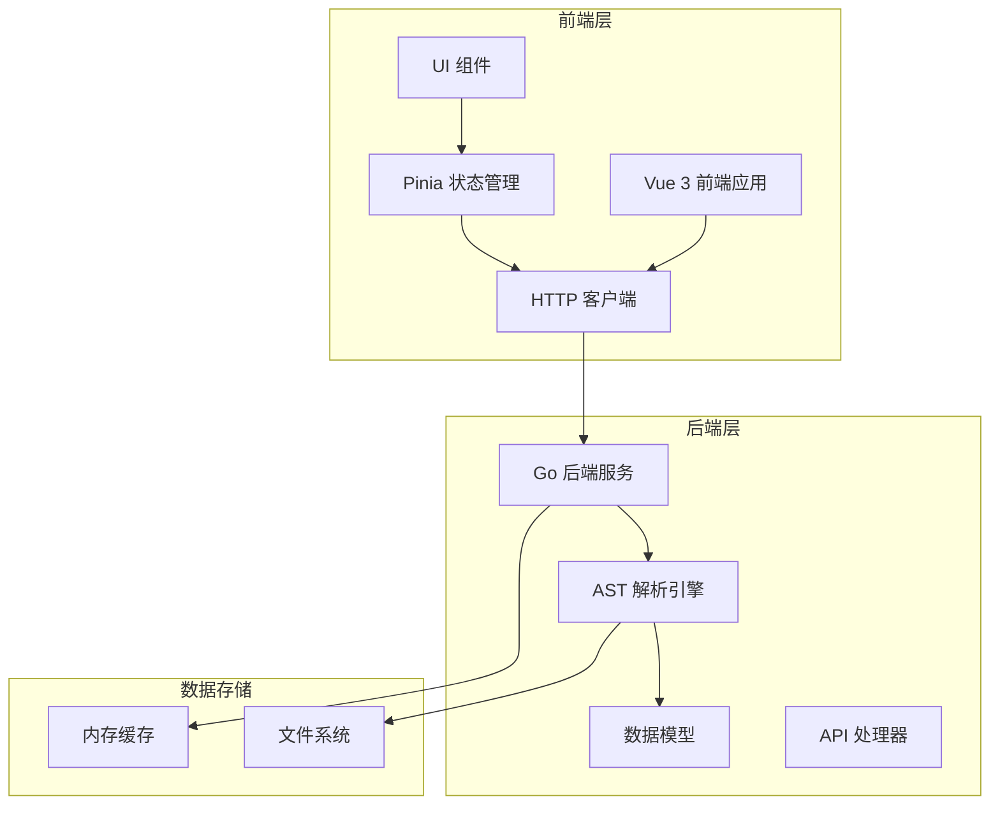
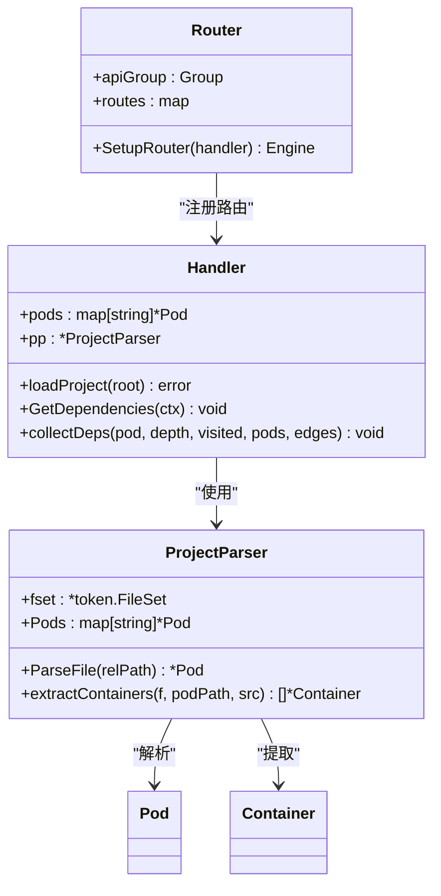
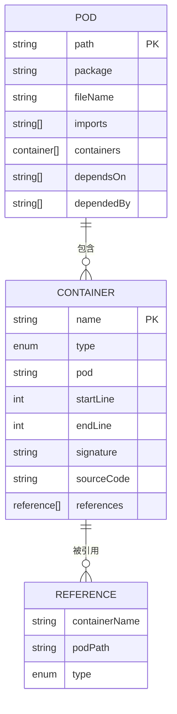
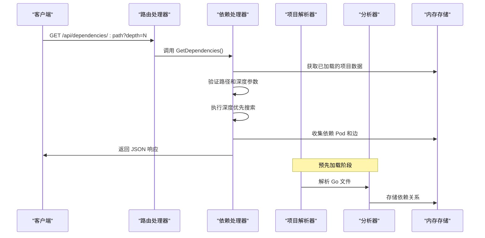
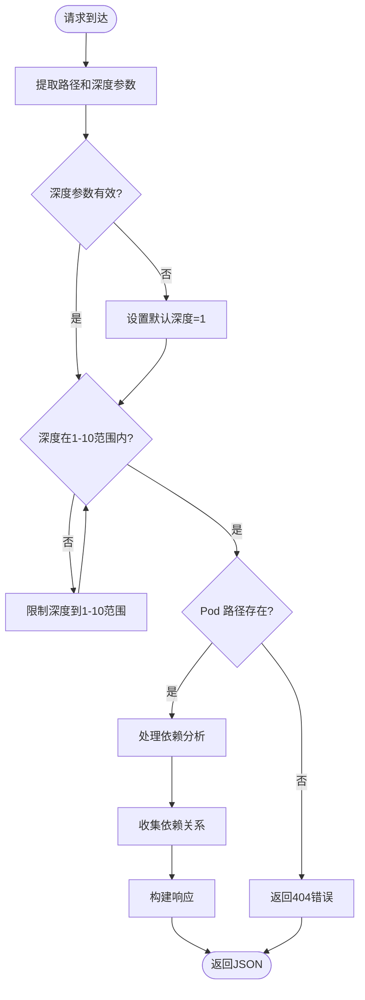
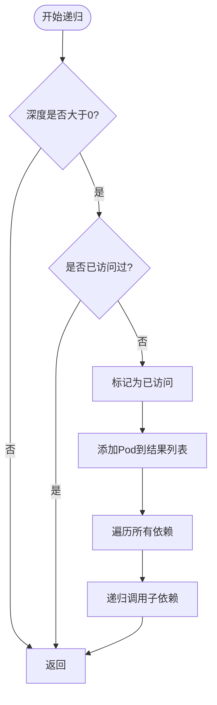
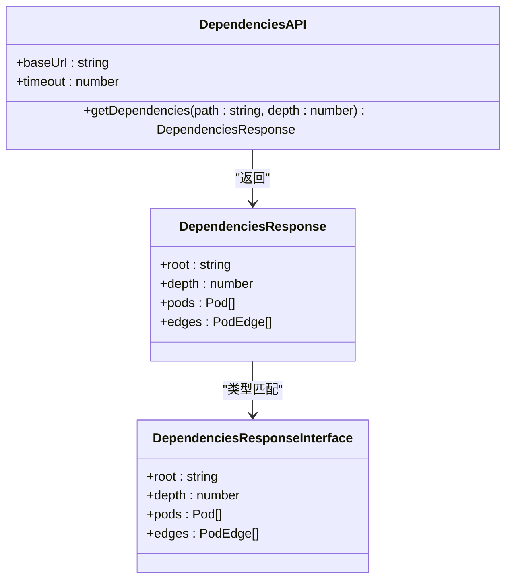
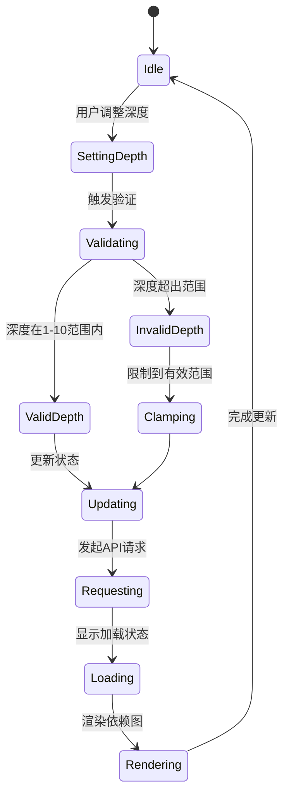

# 依赖分析接口

<cite>
**本文档引用的文件**
- [router.go](file://backend/internal/api/router.go)
- [handler.go](file://backend/internal/api/handler.go)
- [analyzer.go](file://backend/internal/parser/analyzer.go)
- [parser.go](file://backend/internal/parser/parser.go)
- [scanner.go](file://backend/internal/parser/scanner.go)
- [client.ts](file://frontend/src/api/client.ts)
- [index.ts](file://frontend/src/types/index.ts)
- [DepthControl.vue](file://frontend/src/components/Controls/DepthControl.vue)
- [project.ts](file://frontend/src/stores/project.ts)
- [pod.go](file://backend/internal/model/pod.go)
- [container.go](file://backend/internal/model/container.go)
- [README.md](file://README.md)
</cite>

## 目录
1. [简介](#简介)
2. [项目结构](#项目结构)
3. [核心组件](#核心组件)
4. [架构概览](#架构概览)
5. [详细组件分析](#详细组件分析)
6. [依赖分析算法](#依赖分析算法)
7. [性能考虑](#性能考虑)
8. [故障排除指南](#故障排除指南)
9. [结论](#结论)

## 简介

GoPodView 是一个受 Kubernetes 概念启发的 Go 项目代码结构可视化探索器。该项目的核心功能之一是依赖关系分析 API，它允许用户查询和可视化 Go 项目的多层依赖关系。该接口支持深度控制、循环依赖检测和依赖关系过滤，为开发者提供了强大的代码依赖分析能力。

本接口将 Go 源文件显示为 **Pods**，其内部声明（函数、结构体、接口、常量、变量）显示为 **Containers**。导入依赖在交互式图中渲染为边。点击任何 Container 即可直接查看源代码。

## 项目结构

GoPodView 采用前后端分离的架构设计，主要分为以下层次：



**图表来源**
- [router.go:8-31](file://backend/internal/api/router.go#L8-L31)
- [handler.go:15-29](file://backend/internal/api/handler.go#L15-L29)
- [parser.go:16-30](file://backend/internal/parser/parser.go#L16-L30)

**章节来源**
- [README.md:79-104](file://README.md#L79-L104)
- [router.go:1-32](file://backend/internal/api/router.go#L1-L32)
- [handler.go:1-225](file://backend/internal/api/handler.go#L1-L225)

## 核心组件

### API 路由系统

后端使用 Gin 框架构建 RESTful API，路由系统负责处理所有 HTTP 请求：



**图表来源**
- [router.go:8-31](file://backend/internal/api/router.go#L8-L31)
- [handler.go:15-29](file://backend/internal/api/handler.go#L15-L29)
- [parser.go:16-30](file://backend/internal/parser/parser.go#L16-L30)

### 数据模型

系统使用清晰的数据模型来表示 Go 项目的结构：



**图表来源**
- [pod.go:3-11](file://backend/internal/model/pod.go#L3-L11)
- [container.go:13-36](file://backend/internal/model/container.go#L13-L36)

**章节来源**
- [pod.go:1-19](file://backend/internal/model/pod.go#L1-L19)
- [container.go:1-37](file://backend/internal/model/container.go#L1-L37)

## 架构概览

依赖分析接口在整个系统中的位置和交互流程如下：



**图表来源**
- [router.go:27-27](file://backend/internal/api/router.go#L27-L27)
- [handler.go:177-209](file://backend/internal/api/handler.go#L177-L209)
- [analyzer.go:27-39](file://backend/internal/parser/analyzer.go#L27-L39)

## 详细组件分析

### 依赖分析 API 端点

#### 端点定义

依赖分析 API 提供 `/api/dependencies/:path` 端点，支持以下功能：

- **路径参数**: `:path` - 目标 Pod 的相对路径
- **查询参数**: `depth` - 依赖深度，默认值为 1，最大值为 10
- **响应格式**: 包含根节点、深度、Pod 列表和依赖边的 JSON 对象

#### 参数验证和限制



**图表来源**
- [handler.go:182-189](file://backend/internal/api/handler.go#L182-L189)
- [handler.go:191-195](file://backend/internal/api/handler.go#L191-L195)

#### 循环依赖检测机制

系统实现了智能的循环依赖检测，通过访问标记来防止无限递归：



**图表来源**
- [handler.go:211-224](file://backend/internal/api/handler.go#L211-L224)

**章节来源**
- [handler.go:177-224](file://backend/internal/api/handler.go#L177-L224)

### 前端集成方案

#### API 客户端封装

前端使用 Axios 封装了依赖分析 API：



**图表来源**
- [client.ts:47-52](file://frontend/src/api/client.ts#L47-L52)
- [index.ts:48-53](file://frontend/src/types/index.ts#L48-L53)

#### 深度控制组件

前端提供了可视化的深度控制界面：



**图表来源**
- [DepthControl.vue:10-18](file://frontend/src/components/Controls/DepthControl.vue#L10-L18)
- [project.ts:311-313](file://frontend/src/stores/project.ts#L311-L313)

**章节来源**
- [client.ts:1-53](file://frontend/src/api/client.ts#L1-L53)
- [DepthControl.vue:1-35](file://frontend/src/components/Controls/DepthControl.vue#L1-L35)
- [project.ts:311-313](file://frontend/src/stores/project.ts#L311-L313)

## 依赖分析算法

### 深度优先搜索实现

依赖分析使用深度优先搜索（DFS）算法来遍历依赖关系：

```mermaid
flowchart TD
DFS([DFS(root, depth)]) --> BaseCase{"depth <= 0 或 已访问?"}
BaseCase --> |是| ReturnEmpty["返回空结果"]
BaseCase --> |否| MarkVisited["标记为已访问"]
MarkVisited --> AddNode["添加当前Pod到结果"]
AddNode --> CheckChildren{"检查所有依赖"}
CheckChildren --> |无| ReturnResult["返回结果"]
CheckChildren --> |有| RecursiveCall["递归调用DFS(child, depth-1)"]
RecursiveCall --> MergeResults["合并子结果"]
MergeResults --> ReturnResult
```

**图表来源**
- [handler.go:211-224](file://backend/internal/api/handler.go#L211-L224)

### 依赖关系构建过程

系统通过以下步骤构建依赖关系：

1. **项目扫描**: 使用 `ScanProject` 函数扫描整个项目目录
2. **AST 解析**: 使用 Go 的 `go/ast` 和 `go/parser` 包解析 Go 文件
3. **容器提取**: 从解析的 AST 中提取函数、结构体、接口等容器
4. **依赖分析**: 分析导入语句并建立依赖关系映射
5. **图构建**: 将依赖关系转换为图结构用于可视化

**章节来源**
- [analyzer.go:27-39](file://backend/internal/parser/analyzer.go#L27-L39)
- [parser.go:32-59](file://backend/internal/parser/parser.go#L32-L59)
- [scanner.go:12-32](file://backend/internal/parser/scanner.go#L12-L32)

## 性能考虑

### 内存优化策略

系统采用了多种内存优化策略来处理大型项目：

- **延迟加载**: 只在需要时加载 Pod 的源代码
- **访问控制**: 使用读写锁确保并发安全
- **缓存机制**: 将解析后的项目数据存储在内存中
- **增量更新**: 支持项目刷新而不重新解析整个项目

### 大数据集处理策略

对于大型 Go 项目，系统提供了以下优化措施：

- **深度限制**: 默认最大深度为 10，防止过度递归
- **访问去重**: 使用哈希表避免重复访问相同的 Pod
- **分页加载**: 前端支持分页显示大量依赖关系
- **异步处理**: 使用 Promise 并行加载多个 API 请求

### 前端性能优化

前端实现了多项性能优化：

- **虚拟滚动**: 对于大量节点使用虚拟滚动技术
- **懒加载**: 图形组件按需加载
- **状态缓存**: 使用 Pinia 进行状态缓存
- **防抖处理**: 输入控件使用防抖减少请求频率

## 故障排除指南

### 常见问题及解决方案

#### 404 错误：Pod 未找到

**症状**: 请求 `/api/dependencies/:path` 返回 404 错误

**原因**: 指定的 Pod 路径不存在或项目尚未加载

**解决方案**:
1. 确认项目路径正确且项目已成功加载
2. 检查 Pod 路径格式是否正确
3. 重新加载项目数据

#### 500 错误：服务器内部错误

**症状**: 服务器返回 500 错误

**原因**: 解析过程中发生异常或内存不足

**解决方案**:
1. 检查项目文件权限
2. 确认 Go 版本兼容性
3. 尝试减小查询深度

#### 性能问题

**症状**: API 响应缓慢或超时

**原因**: 项目过大或依赖关系复杂

**解决方案**:
1. 减小 `depth` 参数值
2. 使用更精确的 Pod 路径
3. 考虑分批查询大型依赖图

**章节来源**
- [handler.go:192-195](file://backend/internal/api/handler.go#L192-L195)
- [handler.go:63-66](file://backend/internal/api/handler.go#L63-L66)

## 结论

GoPodView 的依赖分析接口提供了一个强大而灵活的工具，用于探索和可视化 Go 项目的依赖关系。通过深度控制、循环依赖检测和智能过滤，开发者可以有效地理解和分析复杂的代码结构。

该接口的设计充分考虑了性能和用户体验，支持大规模项目的依赖分析，并提供了直观的前端集成方案。无论是进行代码审查、架构分析还是学习新的开源项目，这个接口都能提供有价值的洞察。

未来的发展方向可能包括：
- 更高级的依赖关系过滤选项
- 实时依赖图更新
- 更丰富的可视化选项
- 支持更多编程语言的项目分析