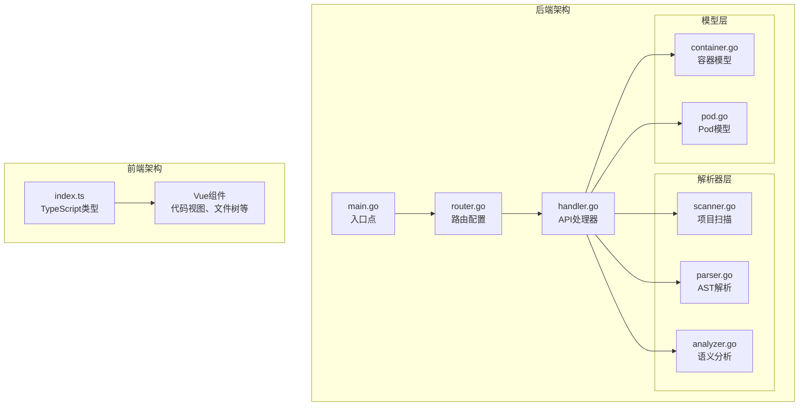
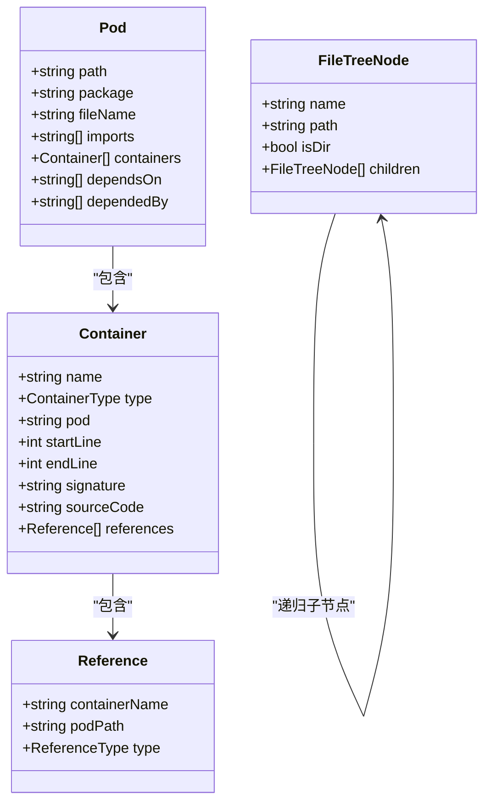
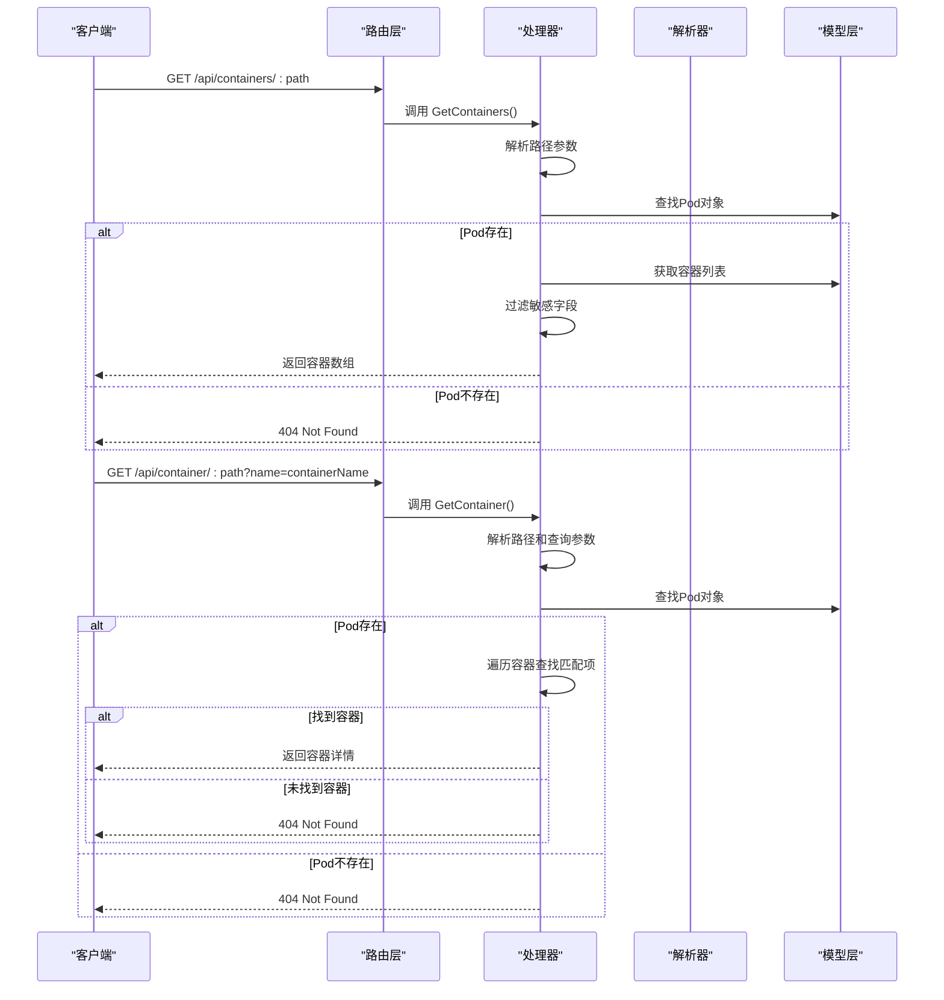
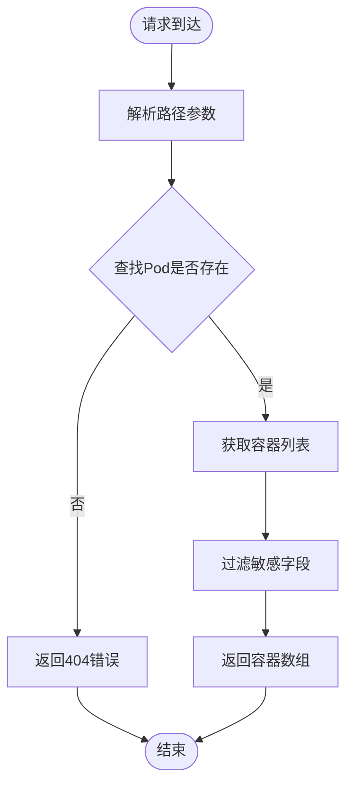
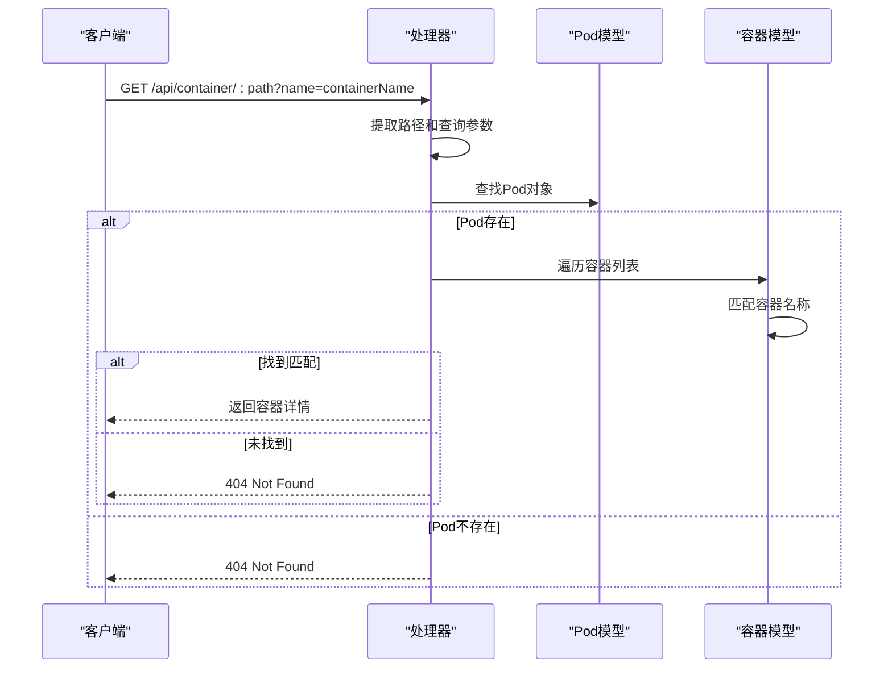
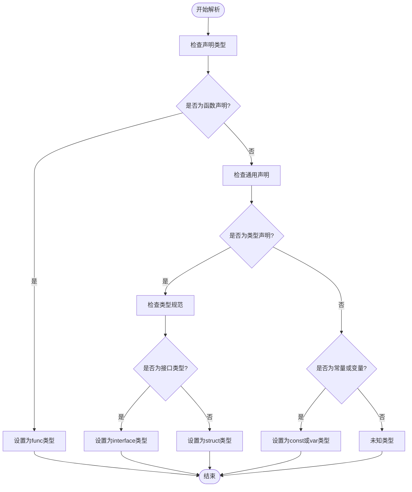
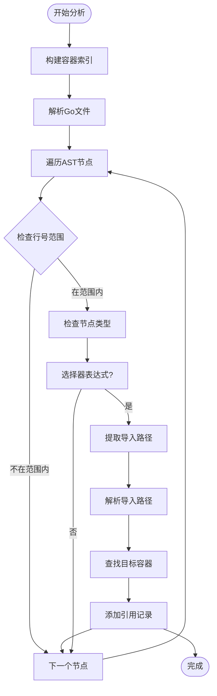
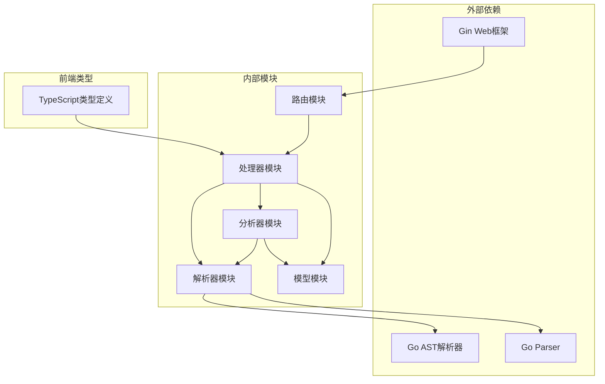

# 容器查询接口

<cite>
**本文档引用的文件**
- [router.go](file://backend/internal/api/router.go)
- [handler.go](file://backend/internal/api/handler.go)
- [container.go](file://backend/internal/model/container.go)
- [pod.go](file://backend/internal/model/pod.go)
- [parser.go](file://backend/internal/parser/parser.go)
- [analyzer.go](file://backend/internal/parser/analyzer.go)
- [scanner.go](file://backend/internal/parser/scanner.go)
- [index.ts](file://frontend/src/types/index.ts)
- [README.md](file://README.md)
- [README_CN.md](file://README_CN.md)
</cite>

## 目录
1. [简介](#简介)
2. [项目结构](#项目结构)
3. [核心组件](#核心组件)
4. [架构概览](#架构概览)
5. [详细组件分析](#详细组件分析)
6. [依赖分析](#依赖分析)
7. [性能考虑](#性能考虑)
8. [故障排除指南](#故障排除指南)
9. [结论](#结论)

## 简介

GoPodView 是一个受 Kubernetes 概念启发的 Go 项目代码结构可视化工具。该项目将 Go 源文件显示为 **Pods**，文件内部的声明（函数、结构体、接口、常量、变量）显示为 **Containers**。本文件专注于容器查询相关 API 的完整接口文档，涵盖 `/api/containers/*path` 和 `/api/container/*path` 端点的详细说明。

## 项目结构

GoPodView 采用前后端分离的架构设计，后端使用 Go 语言开发，前端使用 Vue 3 和 TypeScript 构建。



**图表来源**
- [main.go:1-31](file://backend/main.go#L1-L31)
- [router.go:1-32](file://backend/internal/api/router.go#L1-L32)
- [handler.go:1-225](file://backend/internal/api/handler.go#L1-L225)

**章节来源**
- [README.md:79-104](file://README.md#L79-L104)
- [README_CN.md:81-107](file://README_CN.md#L81-L107)

## 核心组件

### 容器类型系统

容器查询接口基于统一的容器类型系统，支持五种主要容器类型：

| 容器类型 | 描述 | 示例 |
|---------|------|------|
| `func` | 函数声明 | `func MyFunction(param Type) ReturnType` |
| `struct` | 结构体类型 | `type Person struct { Name string }` |
| `interface` | 接口类型 | `type Handler interface { Process() }` |
| `const` | 常量声明 | `const PI = 3.14` |
| `var` | 变量声明 | `var counter int` |

### 数据模型

容器查询接口的核心数据结构如下：



**图表来源**
- [container.go:13-37](file://backend/internal/model/container.go#L13-L37)
- [pod.go:3-11](file://backend/internal/model/pod.go#L3-L11)

**章节来源**
- [container.go:1-37](file://backend/internal/model/container.go#L1-L37)
- [pod.go:1-19](file://backend/internal/model/pod.go#L1-L19)

## 架构概览

容器查询接口的完整架构流程如下：



**图表来源**
- [router.go:25-26](file://backend/internal/api/router.go#L25-L26)
- [handler.go:140-175](file://backend/internal/api/handler.go#L140-L175)

## 详细组件分析

### 容器列表查询 API

#### 端点定义
- **路径**: `/api/containers/:path`
- **方法**: `GET`
- **功能**: 获取指定 Pod 中的所有容器列表

#### 请求参数
- **路径参数**:
  - `path`: Pod 的相对路径（如 `internal/api/handler.go`）

#### 响应格式
成功时返回 JSON 对象，包含容器数组：

```json
{
  "name": "Container名称",
  "type": "容器类型",
  "pod": "所属Pod路径",
  "startLine": 1,
  "endLine": 10,
  "signature": "函数签名或类型描述",
  "sourceCode": "源码片段",
  "references": [
    {
      "containerName": "被引用的容器名称",
      "podPath": "引用所在Pod路径",
      "type": "引用类型"
    }
  ]
}
```

#### 实现逻辑



**图表来源**
- [handler.go:140-152](file://backend/internal/api/handler.go#L140-L152)

**章节来源**
- [handler.go:140-152](file://backend/internal/api/handler.go#L140-L152)

### 单个容器查询 API

#### 端点定义
- **路径**: `/api/container/:path`
- **方法**: `GET`
- **功能**: 获取指定 Pod 中特定名称的容器详情

#### 请求参数
- **路径参数**:
  - `path`: Pod 的相对路径
- **查询参数**:
  - `name`: 容器名称（必需）

#### 响应格式
成功时返回单个容器对象的详细信息，包含完整的源码片段和引用关系。

#### 实现逻辑



**图表来源**
- [handler.go:154-175](file://backend/internal/api/handler.go#L154-L175)

**章节来源**
- [handler.go:154-175](file://backend/internal/api/handler.go#L154-L175)

### 容器类型识别机制

容器类型识别基于 Go AST 解析结果，通过检查抽象语法树节点类型来确定容器类型：



**图表来源**
- [parser.go:208-234](file://backend/internal/parser/parser.go#L208-L234)

**章节来源**
- [parser.go:61-206](file://backend/internal/parser/parser.go#L61-L206)

### 方法分组规则

GoPodView 实现了智能的方法分组功能，将带接收者的方法自动归类到其对应的接收者类型下：

#### 接收者类型识别
- **值接收者**: `func (p Person) Method()`
- **指针接收者**: `func (p *Person) Method()`
- **嵌入接收者**: `func (embedded Embedded) Method()`

#### 分组策略
1. **基础类型**: 直接显示在容器列表根部
2. **接收者类型**: 将方法嵌套在对应类型的子节点下
3. **展开显示**: 用户可以点击类型节点展开查看所有方法
4. **引用追踪**: 方法调用会显示在接收者类型的引用列表中

**章节来源**
- [parser.go:75-97](file://backend/internal/parser/parser.go#L75-L97)

### 引用关系查询

引用关系查询是容器查询的重要组成部分，用于构建代码依赖图谱：

#### 引用类型分类

| 引用类型 | 描述 | 示例场景 |
|---------|------|----------|
| `call` | 函数调用引用 | `obj.Method()` |
| `type_ref` | 类型引用 | `var p Person` |
| `embed` | 嵌入引用 | `struct { Embedded }` |

#### 引用检测算法



**图表来源**
- [analyzer.go:152-217](file://backend/internal/parser/analyzer.go#L152-L217)

**章节来源**
- [analyzer.go:100-134](file://backend/internal/parser/analyzer.go#L100-L134)
- [analyzer.go:152-217](file://backend/internal/parser/analyzer.go#L152-L217)

## 依赖分析

容器查询接口的依赖关系如下：



**图表来源**
- [router.go:3-6](file://backend/internal/api/router.go#L3-L6)
- [handler.go:3-13](file://backend/internal/api/handler.go#L3-L13)

**章节来源**
- [router.go:1-32](file://backend/internal/api/router.go#L1-L32)
- [handler.go:1-225](file://backend/internal/api/handler.go#L1-L225)

## 性能考虑

### 缓存策略
- 使用读写锁 (`sync.RWMutex`) 保护共享数据结构
- 支持并发读取，避免阻塞其他请求
- 项目加载完成后缓存解析结果

### 内存优化
- 容器详情响应中默认不包含源码内容
- 源码内容仅在需要时提供
- 引用关系按需构建和查询

### 查询优化
- 路径参数预处理，去除前缀斜杠
- 容器名称匹配使用哈希表加速
- AST 遍历限制在容器定义范围内

## 故障排除指南

### 常见错误及解决方案

| 错误类型 | HTTP状态码 | 错误原因 | 解决方案 |
|---------|------------|----------|----------|
| 项目未加载 | 400 | 未设置有效项目路径 | 调用 POST `/api/project` 设置项目路径 |
| Pod不存在 | 404 | 路径参数指向不存在的Pod | 检查Pod路径是否正确 |
| 容器不存在 | 404 | 容器名称在Pod中不存在 | 验证容器名称和Pod路径 |
| 参数缺失 | 400 | 必需参数未提供 | 确保提供完整的路径和查询参数 |

### 调试建议

1. **验证项目加载状态**：
   ```bash
   curl -X POST http://localhost:8080/api/project \
        -H "Content-Type: application/json" \
        -d '{"path": "/absolute/path/to/go/project"}'
   ```

2. **检查Pod列表**：
   ```bash
   curl http://localhost:8080/api/pods
   ```

3. **验证容器查询**：
   ```bash
   curl "http://localhost:8080/api/containers/internal/api/handler.go"
   curl "http://localhost:8080/api/container/internal/api/handler.go?name=GetContainers"
   ```

**章节来源**
- [handler.go:56-75](file://backend/internal/api/handler.go#L56-L75)
- [handler.go:140-175](file://backend/internal/api/handler.go#L140-L175)

## 结论

GoPodView 的容器查询接口提供了完整的 Go 项目代码结构可视化能力。通过 `/api/containers/*path` 和 `/api/container/*path` 端点，用户可以：

1. **全面了解代码结构**：获取 Pod 中所有容器的列表和详细信息
2. **精确查询特定容器**：通过名称快速定位和获取容器详情
3. **理解代码依赖关系**：通过引用关系构建完整的依赖图谱
4. **支持多种容器类型**：统一处理函数、结构体、接口、常量和变量

该接口设计遵循 RESTful 原则，具有良好的扩展性和维护性，为后续的功能扩展奠定了坚实的基础。