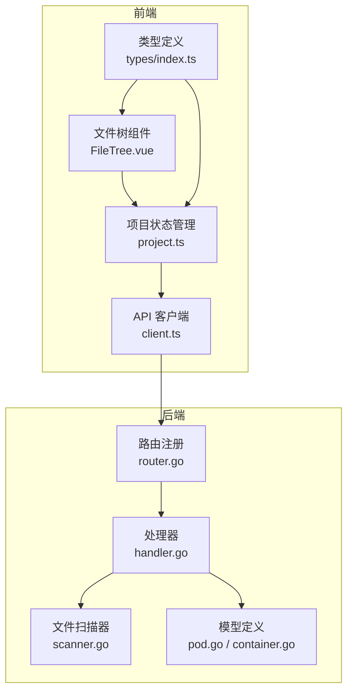
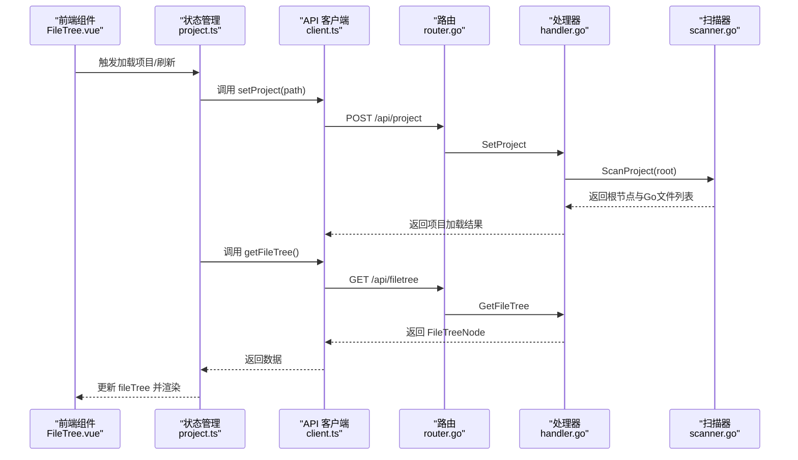
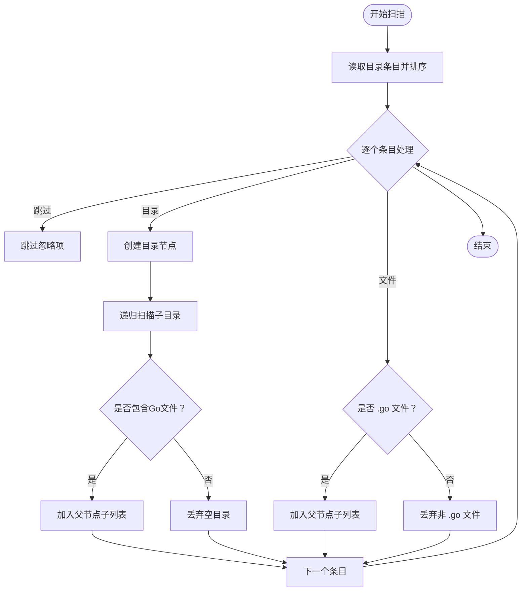
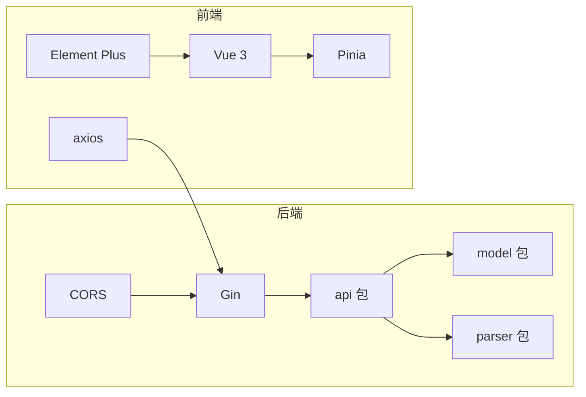

# 文件树接口

<cite>
**本文引用的文件列表**
- [backend/internal/api/router.go](file://backend/internal/api/router.go)
- [backend/internal/api/handler.go](file://backend/internal/api/handler.go)
- [backend/internal/parser/scanner.go](file://backend/internal/parser/scanner.go)
- [backend/internal/model/pod.go](file://backend/internal/model/pod.go)
- [backend/internal/model/container.go](file://backend/internal/model/container.go)
- [frontend/src/api/client.ts](file://frontend/src/api/client.ts)
- [frontend/src/components/FileTree/FileTree.vue](file://frontend/src/components/FileTree/FileTree.vue)
- [frontend/src/stores/project.ts](file://frontend/src/stores/project.ts)
- [frontend/src/types/index.ts](file://frontend/src/types/index.ts)
- [backend/main.go](file://backend/main.go)
- [frontend/package.json](file://frontend/package.json)
- [backend/go.mod](file://backend/go.mod)
</cite>

## 目录
1. [简介](#简介)
2. [项目结构](#项目结构)
3. [核心组件](#核心组件)
4. [架构总览](#架构总览)
5. [详细组件分析](#详细组件分析)
6. [依赖关系分析](#依赖关系分析)
7. [性能与缓存策略](#性能与缓存策略)
8. [故障排查指南](#故障排查指南)
9. [结论](#结论)
10. [附录：接口规范与示例](#附录接口规范与示例)

## 简介
本文件面向“文件树浏览”相关 API 的完整接口文档，重点覆盖后端 /api/filetree GET 端点，说明其功能、请求参数、响应数据结构、文件类型识别规则、文件树构建与过滤策略、以及前端集成与错误处理方案。同时给出性能优化建议（当前实现的缓存与并发策略）与常见问题排查方法。

## 项目结构
该仓库采用前后端分离架构：
- 后端使用 Go + Gin 提供 REST API，负责项目加载、文件树扫描、Pod 分析等。
- 前端使用 Vue 3 + TypeScript + Element Plus，负责展示文件树、搜索、聚焦与导航。

图表来源
- [backend/internal/api/router.go:8-31](file://backend/internal/api/router.go#L8-L31)
- [backend/internal/api/handler.go:15-29](file://backend/internal/api/handler.go#L15-L29)
- [backend/internal/parser/scanner.go:12-32](file://backend/internal/parser/scanner.go#L12-L32)
- [backend/internal/model/pod.go:3-18](file://backend/internal/model/pod.go#L3-L18)
- [frontend/src/api/client.ts:10-23](file://frontend/src/api/client.ts#L10-L23)
- [frontend/src/components/FileTree/FileTree.vue:17-82](file://frontend/src/components/FileTree/FileTree.vue#L17-L82)
- [frontend/src/stores/project.ts:57-92](file://frontend/src/stores/project.ts#L57-L92)
- [frontend/src/types/index.ts:36-41](file://frontend/src/types/index.ts#L36-L41)

章节来源
- [backend/internal/api/router.go:8-31](file://backend/internal/api/router.go#L8-L31)
- [backend/internal/api/handler.go:15-29](file://backend/internal/api/handler.go#L15-L29)
- [backend/internal/parser/scanner.go:12-32](file://backend/internal/parser/scanner.go#L12-L32)
- [frontend/src/api/client.ts:10-23](file://frontend/src/api/client.ts#L10-L23)
- [frontend/src/components/FileTree/FileTree.vue:17-82](file://frontend/src/components/FileTree/FileTree.vue#L17-L82)
- [frontend/src/stores/project.ts:57-92](file://frontend/src/stores/project.ts#L57-L92)
- [frontend/src/types/index.ts:36-41](file://frontend/src/types/index.ts#L36-L41)

## 核心组件
- 后端路由与处理器
  - 路由注册了 /api/filetree GET 端点，并在处理器中实现获取文件树逻辑。
- 文件扫描器
  - 扫描指定根路径，构建文件树节点，过滤非 Go 文件与隐藏/忽略目录。
- 数据模型
  - FileTreeNode 表示文件树节点；Pod/Container/Reference 描述容器与引用关系。
- 前端 API 客户端
  - 封装 /api/filetree 请求，返回 FileTreeNode 结构。
- 前端文件树组件与状态管理
  - 展示文件树、搜索、聚焦、展开同步等交互行为。

章节来源
- [backend/internal/api/router.go:21-27](file://backend/internal/api/router.go#L21-L27)
- [backend/internal/api/handler.go:77-86](file://backend/internal/api/handler.go#L77-L86)
- [backend/internal/parser/scanner.go:12-32](file://backend/internal/parser/scanner.go#L12-L32)
- [backend/internal/model/pod.go:13-18](file://backend/internal/model/pod.go#L13-L18)
- [frontend/src/api/client.ts:20-23](file://frontend/src/api/client.ts#L20-L23)
- [frontend/src/components/FileTree/FileTree.vue:17-82](file://frontend/src/components/FileTree/FileTree.vue#L17-L82)
- [frontend/src/stores/project.ts:57-92](file://frontend/src/stores/project.ts#L57-L92)

## 架构总览
后端通过 Gin 注册路由，处理器在读取锁下返回已加载项目的文件树。前端通过 axios 客户端发起请求，组件基于 Pinia 状态管理进行渲染与交互。

图表来源
- [backend/internal/api/router.go:21-27](file://backend/internal/api/router.go#L21-L27)
- [backend/internal/api/handler.go:56-75](file://backend/internal/api/handler.go#L56-L75)
- [backend/internal/api/handler.go:77-86](file://backend/internal/api/handler.go#L77-L86)
- [backend/internal/parser/scanner.go:12-32](file://backend/internal/parser/scanner.go#L12-L32)
- [frontend/src/api/client.ts:15-23](file://frontend/src/api/client.ts#L15-L23)
- [frontend/src/stores/project.ts:57-92](file://frontend/src/stores/project.ts#L57-L92)

## 详细组件分析

### 后端：/api/filetree GET 端点
- 功能概述
  - 在读取锁保护下返回当前已加载项目的文件树根节点，供前端渲染。
- 请求与响应
  - 方法：GET
  - 路径：/api/filetree
  - 成功：200 OK，返回 FileTreeNode 对象（根节点，包含 name、path、isDir、children）
  - 失败：400 Bad Request，当未加载项目时返回错误提示
- 错误处理
  - 若未加载项目，返回错误信息；否则返回文件树根节点。
- 并发与线程安全
  - 使用读写锁保护共享状态（fileTree、pods、pp），GetFileTree 仅读取，避免阻塞其他操作。

章节来源
- [backend/internal/api/router.go:21-27](file://backend/internal/api/router.go#L21-L27)
- [backend/internal/api/handler.go:77-86](file://backend/internal/api/handler.go#L77-L86)

### 文件树构建与过滤规则
- 构建流程
  - 从根目录开始递归扫描，排序目录优先于文件，名称升序排列。
  - 忽略特定目录（如 vendor、node_modules、.git、.idea、.vscode、testdata）与以 . 开头的隐藏项。
  - 仅保留 .go 文件作为叶子节点；仅当目录包含 .go 文件时才将其加入父节点的子节点列表。
- 文件类型识别
  - 叶子节点：以 .go 结尾的文件
  - 目录节点：非 .go 文件且包含 .go 子节点的目录
- 过滤与层级遍历
  - 前端可对文件树进行本地过滤（按名称匹配），后端不提供查询参数。

图表来源
- [backend/internal/parser/scanner.go:34-78](file://backend/internal/parser/scanner.go#L34-L78)
- [backend/internal/parser/scanner.go:80-88](file://backend/internal/parser/scanner.go#L80-L88)
- [backend/internal/parser/scanner.go:90-100](file://backend/internal/parser/scanner.go#L90-L100)
- [backend/internal/parser/scanner.go:102-112](file://backend/internal/parser/scanner.go#L102-L112)

章节来源
- [backend/internal/parser/scanner.go:12-32](file://backend/internal/parser/scanner.go#L12-L32)
- [backend/internal/parser/scanner.go:34-78](file://backend/internal/parser/scanner.go#L34-L78)
- [backend/internal/parser/scanner.go:80-88](file://backend/internal/parser/scanner.go#L80-L88)
- [backend/internal/parser/scanner.go:90-100](file://backend/internal/parser/scanner.go#L90-L100)
- [backend/internal/parser/scanner.go:102-112](file://backend/internal/parser/scanner.go#L102-L112)

### 数据模型与响应结构
- FileTreeNode
  - 字段：name、path、isDir、children（可选）
  - 用途：描述文件树节点，用于前端 Tree 组件渲染
- Container/Reference/Pod
  - 用于 Pod/Container/引用关系的数据结构，与文件树接口同属后端模型层
- 前端类型定义
  - FileTreeNode 与后端一致，便于强类型调用

章节来源
- [backend/internal/model/pod.go:13-18](file://backend/internal/model/pod.go#L13-L18)
- [backend/internal/model/container.go:13-36](file://backend/internal/model/container.go#L13-L36)
- [frontend/src/types/index.ts:36-41](file://frontend/src/types/index.ts#L36-L41)

### 前端集成与交互
- API 客户端
  - getFileTree() 返回 FileTreeNode 类型，供状态管理使用
- 状态管理
  - 加载项目后并行获取文件树与 Pod 列表，更新 store 中的 fileTree、pods、edges
  - 支持刷新数据、恢复 URL 状态、聚焦/展开 Pod 等
- 文件树组件
  - 渲染树形结构，支持搜索过滤、点击聚焦、高亮当前节点
  - 自动展开聚焦路径上的节点，保持 UI 一致性

章节来源
- [frontend/src/api/client.ts:20-23](file://frontend/src/api/client.ts#L20-L23)
- [frontend/src/stores/project.ts:57-92](file://frontend/src/stores/project.ts#L57-L92)
- [frontend/src/components/FileTree/FileTree.vue:17-82](file://frontend/src/components/FileTree/FileTree.vue#L17-L82)

## 依赖关系分析
- 后端依赖
  - Gin 路由框架、CORS 中间件
  - 内部模块：api、model、parser
- 前端依赖
  - axios、Element Plus、Vue 3、Pinia、Monaco Editor 等

图表来源
- [backend/go.mod:5-8](file://backend/go.mod#L5-L8)
- [frontend/package.json:11-22](file://frontend/package.json#L11-L22)

章节来源
- [backend/go.mod:5-8](file://backend/go.mod#L5-L8)
- [frontend/package.json:11-22](file://frontend/package.json#L11-L22)

## 性能与缓存策略
- 当前实现特性
  - 文件树与 Pod 数据在处理器中以共享结构保存，GetFileTree 通过读锁返回，避免重复扫描。
  - 前端在加载项目后并行获取文件树与 Pod 列表，减少等待时间。
- 缓存机制
  - 后端未实现额外的文件树缓存；当前缓存依赖于处理器持有的内存结构（fileTree、pods、pp）。
- 性能优化建议
  - 针对大型项目，可在后端增加文件树缓存（基于根路径与修改时间），并在处理器中实现缓存失效策略。
  - 对于频繁刷新场景，可引入增量更新或版本号字段，前端据此判断是否需要重新拉取。
  - 对于超大目录，可考虑分页或懒加载子树，减少一次性传输的数据量。
  - 前端可对搜索与聚焦操作进行防抖，降低不必要的请求频率。

[本节为通用性能讨论，不直接分析具体文件，故无章节来源]

## 故障排查指南
- 常见错误与处理
  - 未加载项目即请求 /api/filetree：返回 400，提示“no project loaded”。需先调用 POST /api/project 设置项目路径。
  - 项目路径无效或不可访问：后端扫描失败，返回 500。检查路径权限与存在性。
  - 前端无法渲染文件树：确认 store.fileTree 已正确赋值；检查网络请求是否成功。
- 排查步骤
  - 后端日志：启动时会打印项目路径与端口信息；若未加载项目，会提示使用 POST /api/project。
  - 前端控制台：查看 axios 请求状态码与响应体；确认 baseURL 与路由映射正确。
  - 文件树组件：确认 props 配置（label、children、isLeaf）与数据结构一致。

章节来源
- [backend/internal/api/handler.go:81-84](file://backend/internal/api/handler.go#L81-L84)
- [backend/main.go:21-25](file://backend/main.go#L21-L25)
- [frontend/src/components/FileTree/FileTree.vue:115-134](file://frontend/src/components/FileTree/FileTree.vue#L115-L134)

## 结论
- /api/filetree GET 端点提供简洁高效的文件树数据，配合后端扫描器与前端组件，实现了从项目加载到文件树渲染的完整链路。
- 当前实现以内存缓存为主，具备基本的并发安全与前端并行加载能力；针对大型项目，建议引入更完善的缓存与懒加载策略以进一步提升性能与用户体验。

[本节为总结性内容，不直接分析具体文件，故无章节来源]

## 附录：接口规范与示例

### 接口定义
- 端点：GET /api/filetree
- 请求参数：无
- 成功响应：200 OK，返回 FileTreeNode 根节点对象
- 失败响应：400 Bad Request，返回错误信息（例如“no project loaded”）

章节来源
- [backend/internal/api/router.go:21-27](file://backend/internal/api/router.go#L21-L27)
- [backend/internal/api/handler.go:77-86](file://backend/internal/api/handler.go#L77-L86)

### 响应数据结构
- FileTreeNode
  - name: 字符串，节点名称
  - path: 字符串，相对路径（根节点 path 为空）
  - isDir: 布尔值，是否为目录
  - children: FileTreeNode 数组（可选）

章节来源
- [backend/internal/model/pod.go:13-18](file://backend/internal/model/pod.go#L13-L18)
- [frontend/src/types/index.ts:36-41](file://frontend/src/types/index.ts#L36-L41)

### 文件类型识别与过滤规则
- 叶子节点：以 .go 结尾的文件
- 目录节点：非 .go 文件且至少包含一个 .go 子节点的目录
- 忽略项：vendor、node_modules、.git、.idea、.vscode、testdata、以 . 开头的隐藏项

章节来源
- [backend/internal/parser/scanner.go:69-75](file://backend/internal/parser/scanner.go#L69-L75)
- [backend/internal/parser/scanner.go:80-88](file://backend/internal/parser/scanner.go#L80-L88)
- [backend/internal/parser/scanner.go:90-100](file://backend/internal/parser/scanner.go#L90-L100)

### 前端集成要点
- 使用 API 客户端调用 getFileTree() 获取 FileTreeNode
- 在项目加载完成后并行获取文件树与 Pod 列表，提升首屏速度
- 文件树组件使用 props.label、props.children、props.isLeaf 映射节点属性
- 支持搜索过滤与聚焦同步，自动展开当前聚焦路径

章节来源
- [frontend/src/api/client.ts:20-23](file://frontend/src/api/client.ts#L20-L23)
- [frontend/src/stores/project.ts:57-92](file://frontend/src/stores/project.ts#L57-L92)
- [frontend/src/components/FileTree/FileTree.vue:115-134](file://frontend/src/components/FileTree/FileTree.vue#L115-L134)

### 不同文件类型的返回格式示例
- Go 源文件
  - 示例：叶子节点，isDir=false，name 以 .go 结尾，path 为相对路径
- 测试文件
  - 示例：叶子节点，isDir=false，name 以 _test.go 结尾，path 为相对路径
- 其他支持的文件类型
  - 示例：叶子节点，isDir=false，name 为任意非 .go 文件名，path 为相对路径（不会出现在最终文件树中，除非其所在目录包含 .go 文件）

说明：以上示例为概念性描述，实际返回取决于扫描器的过滤规则与目录结构。

[本节为概念性示例，不直接对应具体源码片段，故无章节来源]