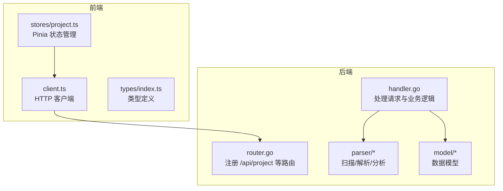
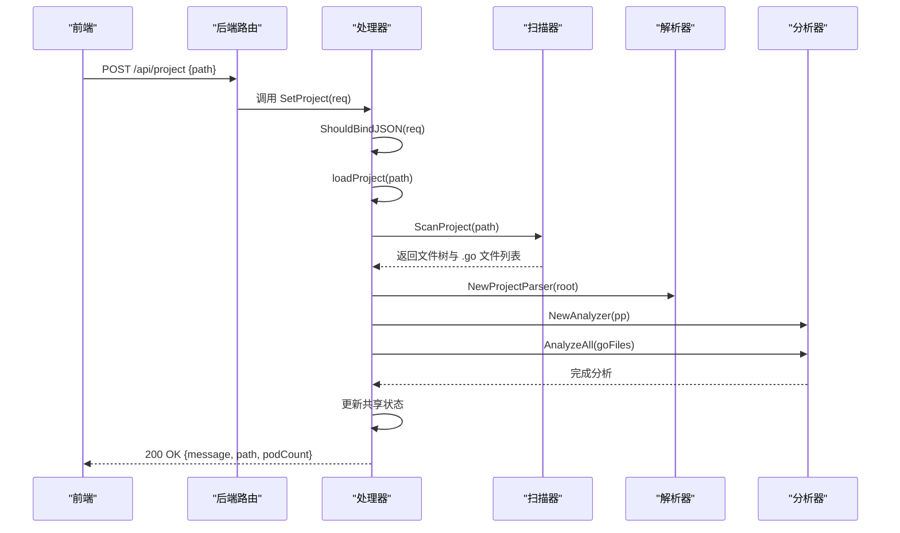
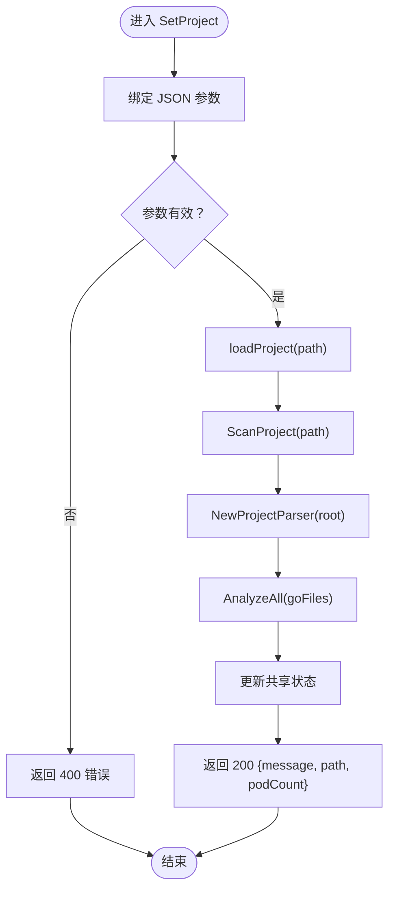
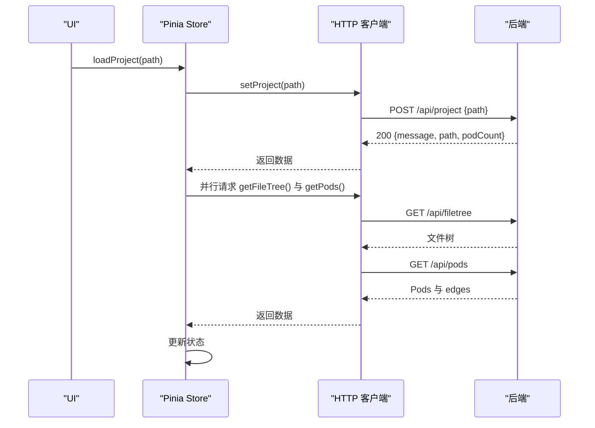
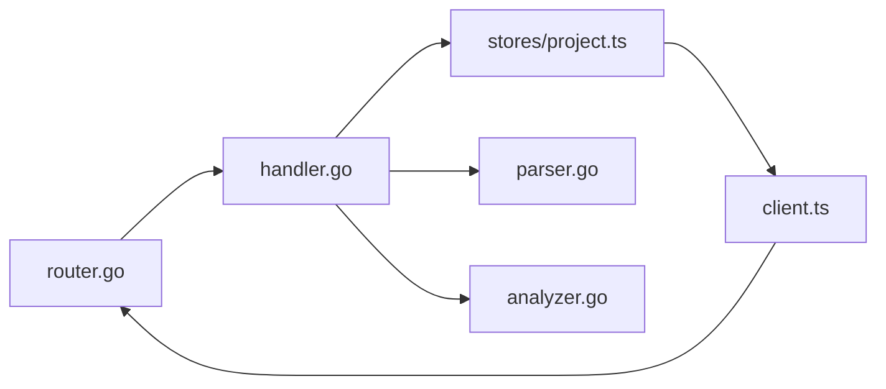

# 项目管理接口

<cite>
**本文档引用的文件**
- [backend/internal/api/router.go](file://backend/internal/api/router.go)
- [backend/internal/api/handler.go](file://backend/internal/api/handler.go)
- [backend/internal/parser/scanner.go](file://backend/internal/parser/scanner.go)
- [backend/internal/parser/analyzer.go](file://backend/internal/parser/analyzer.go)
- [backend/internal/parser/parser.go](file://backend/internal/parser/parser.go)
- [backend/internal/model/pod.go](file://backend/internal/model/pod.go)
- [backend/internal/model/container.go](file://backend/internal/model/container.go)
- [backend/main.go](file://backend/main.go)
- [frontend/src/api/client.ts](file://frontend/src/api/client.ts)
- [frontend/src/stores/project.ts](file://frontend/src/stores/project.ts)
- [frontend/src/types/index.ts](file://frontend/src/types/index.ts)
- [README.md](file://README.md)
- [README_CN.md](file://README_CN.md)
</cite>

## 目录
1. [简介](#简介)
2. [项目结构](#项目结构)
3. [核心组件](#核心组件)
4. [架构总览](#架构总览)
5. [详细组件分析](#详细组件分析)
6. [依赖关系分析](#依赖关系分析)
7. [性能考量](#性能考量)
8. [故障排查指南](#故障排查指南)
9. [结论](#结论)
10. [附录](#附录)

## 简介
本文件面向项目管理相关的 API，重点覆盖后端 /api/project 端点的 POST 请求，涵盖以下内容：
- 项目路径设置流程与数据流
- 项目加载与重新分析机制
- 请求参数格式、响应结构与错误处理
- 项目路径验证规则、支持的文件系统格式与项目规模限制
- 客户端集成示例与最佳实践

## 项目结构
后端采用分层设计：路由层负责注册 API，处理器层封装业务逻辑，解析器层负责扫描与分析 Go 项目，模型层定义数据结构。前端通过 HTTP 客户端调用后端 API，并通过状态管理模块维护 UI 状态。

图表来源
- [backend/internal/api/router.go:19-28](file://backend/internal/api/router.go#L19-L28)
- [backend/internal/api/handler.go:15-29](file://backend/internal/api/handler.go#L15-L29)
- [backend/internal/parser/scanner.go:12-32](file://backend/internal/parser/scanner.go#L12-L32)
- [backend/internal/model/pod.go:3-11](file://backend/internal/model/pod.go#L3-L11)

章节来源
- [backend/internal/api/router.go:8-31](file://backend/internal/api/router.go#L8-L31)
- [backend/internal/api/handler.go:15-29](file://backend/internal/api/handler.go#L15-L29)
- [backend/internal/parser/scanner.go:12-32](file://backend/internal/parser/scanner.go#L12-L32)
- [backend/internal/model/pod.go:3-11](file://backend/internal/model/pod.go#L3-L11)

## 核心组件
- 路由注册：在路由层注册 /api/project 的 POST 请求，绑定到处理器的 SetProject 方法。
- 处理器：负责接收请求、校验参数、加载项目、执行分析、返回响应。
- 扫描器：递归遍历项目目录，构建文件树并收集 .go 文件列表，跳过特定目录与隐藏文件。
- 解析器：基于 go/ast 对 Go 文件进行解析，提取 Pod 与 Container 结构。
- 分析器：建立包索引、计算 Pod 间依赖关系、构建容器引用关系。
- 前端客户端：封装 /api/* 的 HTTP 调用，与 Pinia 状态管理配合完成项目加载与刷新。

章节来源
- [backend/internal/api/router.go:21](file://backend/internal/api/router.go#L21)
- [backend/internal/api/handler.go:52-75](file://backend/internal/api/handler.go#L52-L75)
- [backend/internal/parser/scanner.go:12-32](file://backend/internal/parser/scanner.go#L12-L32)
- [backend/internal/parser/analyzer.go:27-39](file://backend/internal/parser/analyzer.go#L27-L39)
- [backend/internal/parser/parser.go:32-59](file://backend/internal/parser/parser.go#L32-L59)
- [frontend/src/api/client.ts:15-18](file://frontend/src/api/client.ts#L15-L18)

## 架构总览
下面的时序图展示了 /api/project POST 请求从客户端到后端再到解析器的整体流程。

图表来源
- [backend/internal/api/router.go:21](file://backend/internal/api/router.go#L21)
- [backend/internal/api/handler.go:56-75](file://backend/internal/api/handler.go#L56-L75)
- [backend/internal/parser/scanner.go:12-32](file://backend/internal/parser/scanner.go#L12-L32)
- [backend/internal/parser/analyzer.go:27-39](file://backend/internal/parser/analyzer.go#L27-L39)
- [backend/internal/parser/parser.go:23-30](file://backend/internal/parser/parser.go#L23-L30)

## 详细组件分析

### /api/project POST 请求
- 请求方法与路径
  - 方法：POST
  - 路径：/api/project
- 请求体参数
  - 字段：path（字符串，必填）
  - 校验：使用 Gin 的 ShouldBindJSON 进行绑定与基本校验
- 成功响应
  - 状态码：200 OK
  - 结构：包含 message、path、podCount
- 错误处理
  - 参数绑定失败：400 Bad Request，返回错误信息
  - 项目加载失败：500 Internal Server Error，返回错误信息
- 项目加载与分析流程
  - 调用扫描器构建文件树并收集 .go 文件
  - 初始化解析器与分析器，对所有 .go 文件进行分析
  - 更新共享状态（根路径、文件树、Pod 映射、解析器实例）

图表来源
- [backend/internal/api/handler.go:56-75](file://backend/internal/api/handler.go#L56-L75)
- [backend/internal/parser/scanner.go:12-32](file://backend/internal/parser/scanner.go#L12-L32)
- [backend/internal/parser/analyzer.go:27-39](file://backend/internal/parser/analyzer.go#L27-L39)

章节来源
- [backend/internal/api/router.go:21](file://backend/internal/api/router.go#L21)
- [backend/internal/api/handler.go:52-75](file://backend/internal/api/handler.go#L52-L75)
- [backend/internal/api/handler.go:31-50](file://backend/internal/api/handler.go#L31-L50)

### 项目路径验证规则
- 路径有效性
  - 使用 filepath.Abs 将相对路径转换为绝对路径
  - 若转换失败，返回错误
- 目录遍历与过滤
  - 跳过特定目录：vendor、node_modules、.git、.idea、.vscode、testdata
  - 跳过以 . 开头的隐藏目录
- 文件收集
  - 仅收集 .go 结尾的文件
  - 仅保留包含 .go 文件的目录节点

章节来源
- [backend/internal/parser/scanner.go:12-32](file://backend/internal/parser/scanner.go#L12-L32)
- [backend/internal/parser/scanner.go:34-78](file://backend/internal/parser/scanner.go#L34-L78)
- [backend/internal/parser/scanner.go:80-88](file://backend/internal/parser/scanner.go#L80-L88)
- [backend/internal/parser/scanner.go:102-112](file://backend/internal/parser/scanner.go#L102-L112)

### 支持的文件系统格式
- 输入路径支持任意有效的本地文件系统路径
- 解析器基于 go/ast 与 go/parser，因此要求目标项目为合法的 Go 项目（包含 .go 文件、正确的包声明与导入）

章节来源
- [backend/internal/parser/parser.go:32-59](file://backend/internal/parser/parser.go#L32-L59)
- [backend/internal/parser/analyzer.go:27-39](file://backend/internal/parser/analyzer.go#L27-L39)

### 项目大小限制
- 未设置硬性大小限制，但受以下因素影响：
  - 可用内存：解析器与分析器会读取并解析所有 .go 文件
  - CPU 时间：AST 解析与依赖分析的时间复杂度与文件数量、依赖深度相关
  - 建议：对于大型项目，建议在后台服务上运行，避免阻塞前端或长时间等待

章节来源
- [backend/internal/parser/analyzer.go:27-39](file://backend/internal/parser/analyzer.go#L27-L39)
- [backend/internal/parser/parser.go:32-59](file://backend/internal/parser/parser.go#L32-L59)

### 响应结构与数据模型
- 成功响应字段
  - message：字符串，提示“project loaded”
  - path：字符串，当前项目的绝对路径
  - podCount：整数，Pod 数量
- 数据模型
  - Pod：包含 path、package、fileName、imports、containers、dependsOn、dependedBy
  - Container：包含 name、type、pod、startLine、endLine、signature、sourceCode、references
  - FileTreeNode：用于文件树展示

章节来源
- [backend/internal/api/handler.go:70-74](file://backend/internal/api/handler.go#L70-L74)
- [backend/internal/model/pod.go:3-11](file://backend/internal/model/pod.go#L3-L11)
- [backend/internal/model/container.go:13-22](file://backend/internal/model/container.go#L13-L22)
- [backend/internal/model/pod.go:13-18](file://backend/internal/model/pod.go#L13-L18)

### 客户端集成示例
- 前端 HTTP 客户端
  - setProject(path)：向 /api/project 发送 POST 请求，返回 {message, path, podCount}
- 前端状态管理
  - useProjectStore.loadProject(path)：调用 setProject 并并行拉取文件树与 Pod 列表，更新状态
  - useProjectStore.refreshData()：在已有项目路径下刷新数据
- 类型定义
  - 前端 types/index.ts 中定义了与后端响应一致的数据结构

图表来源
- [frontend/src/stores/project.ts:57-76](file://frontend/src/stores/project.ts#L57-L76)
- [frontend/src/api/client.ts:15-18](file://frontend/src/api/client.ts#L15-L18)
- [frontend/src/api/client.ts:20-28](file://frontend/src/api/client.ts#L20-L28)
- [frontend/src/types/index.ts:43-46](file://frontend/src/types/index.ts#L43-L46)

章节来源
- [frontend/src/api/client.ts:15-18](file://frontend/src/api/client.ts#L15-L18)
- [frontend/src/stores/project.ts:57-76](file://frontend/src/stores/project.ts#L57-L76)
- [frontend/src/types/index.ts:21-29](file://frontend/src/types/index.ts#L21-L29)

### 最佳实践建议
- 路径规范
  - 建议传入绝对路径，避免相对路径导致的歧义
- 性能优化
  - 对大型项目，优先在后台服务上运行，前端仅负责展示
  - 避免频繁重复加载相同路径的项目
- 错误处理
  - 前端应捕获并提示 400/500 错误，引导用户检查路径与权限
- 并发加载
  - 使用并行请求获取文件树与 Pod 列表，提升首屏速度

章节来源
- [backend/internal/api/handler.go:58-66](file://backend/internal/api/handler.go#L58-L66)
- [frontend/src/stores/project.ts:63-66](file://frontend/src/stores/project.ts#L63-L66)

## 依赖关系分析
- 路由到处理器
  - /api/project -> Handler.SetProject
- 处理器到解析器
  - Handler.loadProject -> Scanner.ScanProject
  - Handler.loadProject -> Parser.NewProjectParser
  - Handler.loadProject -> Analyzer.AnalyzeAll
- 前端到后端
  - client.ts -> /api/*
  - stores/project.ts -> client.ts

图表来源
- [backend/internal/api/router.go:21](file://backend/internal/api/router.go#L21)
- [backend/internal/api/handler.go:31-50](file://backend/internal/api/handler.go#L31-L50)
- [backend/internal/parser/scanner.go:12-32](file://backend/internal/parser/scanner.go#L12-L32)
- [backend/internal/parser/analyzer.go:27-39](file://backend/internal/parser/analyzer.go#L27-L39)
- [frontend/src/api/client.ts:15-18](file://frontend/src/api/client.ts#L15-L18)

章节来源
- [backend/internal/api/router.go:21](file://backend/internal/api/router.go#L21)
- [backend/internal/api/handler.go:31-50](file://backend/internal/api/handler.go#L31-L50)
- [frontend/src/api/client.ts:15-18](file://frontend/src/api/client.ts#L15-L18)

## 性能考量
- 复杂度分析
  - 扫描阶段：O(N)，N 为文件总数
  - 解析阶段：O(M)，M 为 .go 文件总行数
  - 分析阶段：O(M + E)，E 为依赖边数
- 内存占用
  - 随项目规模线性增长，注意大项目可能占用较多内存
- 建议
  - 对大型项目启用缓存策略（如文件变更检测）
  - 限制并发解析任务数量
  - 前端避免频繁刷新

[本节为通用性能讨论，不直接分析具体文件]

## 故障排查指南
- 400 Bad Request
  - 可能原因：请求体缺少 path 字段或 JSON 格式错误
  - 处理建议：检查请求体格式与必填字段
- 500 Internal Server Error
  - 可能原因：路径无效、无法读取文件、解析失败
  - 处理建议：确认路径存在且可访问，检查权限与项目结构
- 无项目加载
  - 可能原因：尚未调用 /api/project 设置项目
  - 处理建议：先调用 /api/project，再请求其他端点

章节来源
- [backend/internal/api/handler.go:58-66](file://backend/internal/api/handler.go#L58-L66)
- [backend/internal/api/handler.go:81-84](file://backend/internal/api/handler.go#L81-L84)

## 结论
/api/project POST 请求提供了项目路径设置与重新分析的核心能力。通过扫描、解析与分析三个阶段，后端将 Go 项目转换为可交互的 Pod/Container 图结构，并通过统一的数据模型向前端提供一致的响应。前端通过状态管理与 HTTP 客户端实现流畅的项目加载与刷新体验。建议在生产环境中关注路径验证、权限与大规模项目的性能问题。

[本节为总结性内容，不直接分析具体文件]

## 附录
- 启动方式
  - 通过命令行参数指定项目路径与端口，启动后端服务
- API 概览
  - /api/project：POST 设置项目路径
  - /api/filetree：GET 获取文件树
  - /api/pods：GET 获取所有 Pod 与依赖边
  - /api/pod/:path：GET 获取单个 Pod
  - /api/containers/:path：GET 获取 Pod 内所有 Container
  - /api/container/:path?name=：GET 获取指定 Container
  - /api/dependencies/:path?depth=：GET 获取 N 级依赖

章节来源
- [backend/main.go:11-30](file://backend/main.go#L11-L30)
- [README.md:67-78](file://README.md#L67-L78)
- [README_CN.md:69-79](file://README_CN.md#L69-L79)