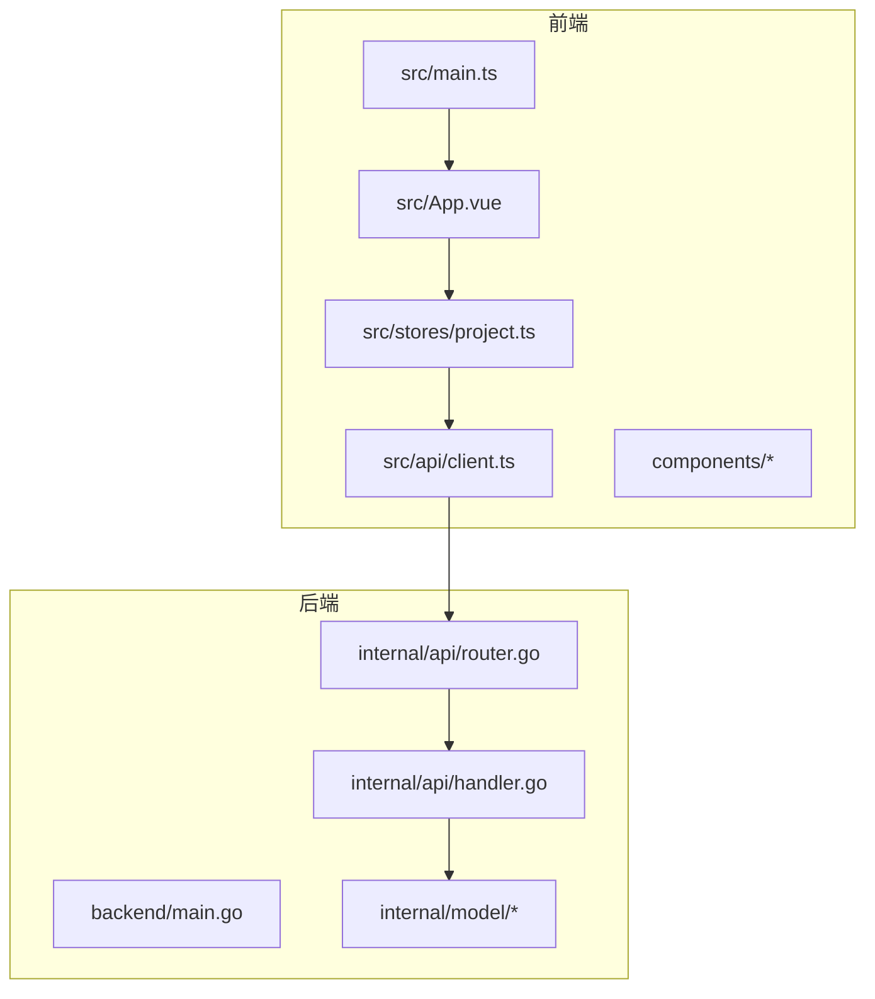
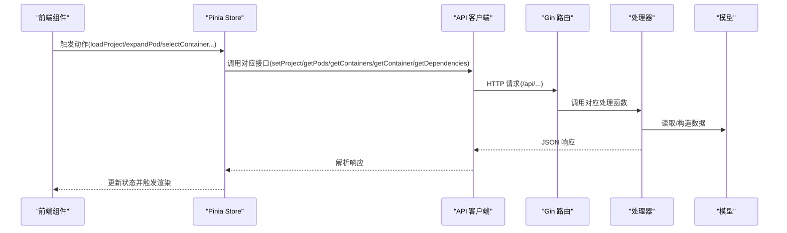
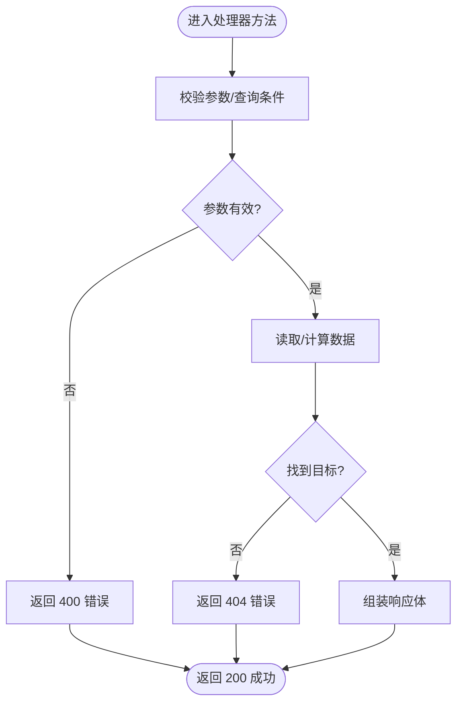
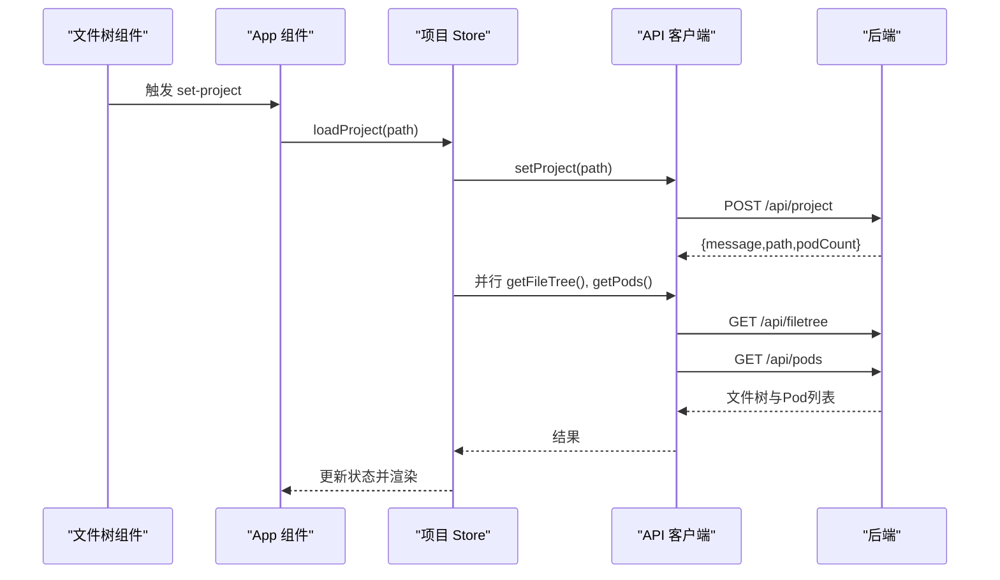
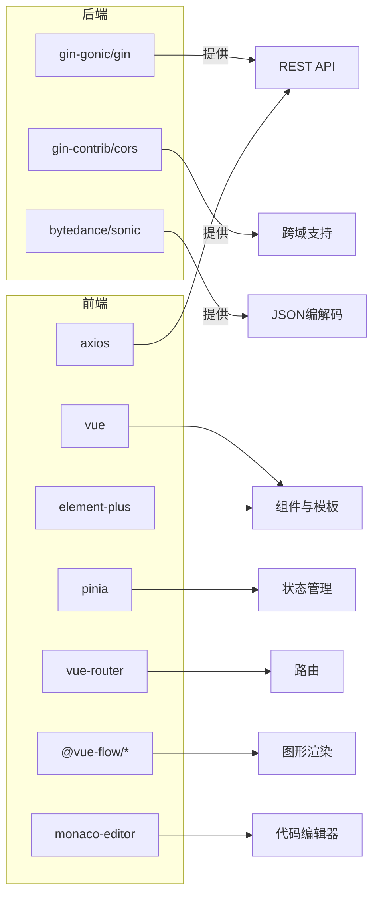

# 代码规范与最佳实践

<cite>
**本文档引用的文件**
- [backend/main.go](file://backend/main.go)
- [backend/internal/api/router.go](file://backend/internal/api/router.go)
- [backend/internal/api/handler.go](file://backend/internal/api/handler.go)
- [backend/internal/model/pod.go](file://backend/internal/model/pod.go)
- [backend/internal/model/container.go](file://backend/internal/model/container.go)
- [backend/go.mod](file://backend/go.mod)
- [frontend/src/main.ts](file://frontend/src/main.ts)
- [frontend/src/api/client.ts](file://frontend/src/api/client.ts)
- [frontend/src/types/index.ts](file://frontend/src/types/index.ts)
- [frontend/src/stores/project.ts](file://frontend/src/stores/project.ts)
- [frontend/src/App.vue](file://frontend/src/App.vue)
- [frontend/src/components/FileTree/FileTree.vue](file://frontend/src/components/FileTree/FileTree.vue)
- [frontend/src/components/PodGraph/PodGraph.vue](file://frontend/src/components/PodGraph/PodGraph.vue)
- [frontend/src/components/Breadcrumb/AppBreadcrumb.vue](file://frontend/src/components/Breadcrumb/AppBreadcrumb.vue)
- [frontend/src/components/CodeView/CodeView.vue](file://frontend/src/components/CodeView/CodeView.vue)
- [frontend/src/components/Controls/DepthControl.vue](file://frontend/src/components/Controls/DepthControl.vue)
- [frontend/package.json](file://frontend/package.json)
</cite>

## 目录
1. [简介](#简介)
2. [项目结构](#项目结构)
3. [核心组件](#核心组件)
4. [架构总览](#架构总览)
5. [详细组件分析](#详细组件分析)
6. [依赖分析](#依赖分析)
7. [性能考虑](#性能考虑)
8. [故障排查指南](#故障排查指南)
9. [结论](#结论)
10. [附录：代码规范与最佳实践清单](#附录代码规范与最佳实践清单)

## 简介
本指南面向 GoPodView 项目的 Go 后端与 TypeScript 前端团队，提供统一的编码规范、最佳实践与质量检查标准，涵盖变量命名、函数设计、错误处理、日志记录、组件命名、状态管理、类型定义与 API 调用规范，并给出代码审查清单与常见问题排查建议，帮助团队保持代码风格一致与可维护性。

## 项目结构
项目采用前后端分离架构：
- 后端使用 Gin 框架提供 REST API，负责扫描 Go 项目、解析依赖并返回数据。
- 前端基于 Vue 3 + Pinia，通过 Axios 访问后端接口，构建可视化界面（文件树、Pod 图、容器代码视图）。

图表来源
- [frontend/src/main.ts:1-12](file://frontend/src/main.ts#L1-L12)
- [frontend/src/App.vue:1-125](file://frontend/src/App.vue#L1-L125)
- [frontend/src/api/client.ts:1-53](file://frontend/src/api/client.ts#L1-L53)
- [frontend/src/stores/project.ts:1-476](file://frontend/src/stores/project.ts#L1-L476)
- [backend/main.go:1-31](file://backend/main.go#L1-L31)
- [backend/internal/api/router.go:1-32](file://backend/internal/api/router.go#L1-L32)
- [backend/internal/api/handler.go:1-225](file://backend/internal/api/handler.go#L1-L225)
- [backend/internal/model/pod.go:1-19](file://backend/internal/model/pod.go#L1-L19)
- [backend/internal/model/container.go:1-37](file://backend/internal/model/container.go#L1-L37)

章节来源
- [backend/main.go:1-31](file://backend/main.go#L1-L31)
- [backend/internal/api/router.go:1-32](file://backend/internal/api/router.go#L1-L32)
- [backend/internal/api/handler.go:1-225](file://backend/internal/api/handler.go#L1-L225)
- [backend/internal/model/pod.go:1-19](file://backend/internal/model/pod.go#L1-L19)
- [backend/internal/model/container.go:1-37](file://backend/internal/model/container.go#L1-L37)
- [frontend/src/main.ts:1-12](file://frontend/src/main.ts#L1-L12)
- [frontend/src/App.vue:1-125](file://frontend/src/App.vue#L1-L125)
- [frontend/src/api/client.ts:1-53](file://frontend/src/api/client.ts#L1-L53)
- [frontend/src/stores/project.ts:1-476](file://frontend/src/stores/project.ts#L1-L476)

## 核心组件
- 后端入口与路由
  - 入口程序负责解析命令行参数、初始化处理器与路由器，并启动 HTTP 服务。
  - 路由器配置 CORS 与 API 分组，暴露项目设置、文件树、Pod 列表、单个 Pod、容器列表、容器详情与依赖图等接口。
- 处理器
  - 提供并发安全的数据访问与缓存；支持加载项目、查询文件树、Pod 列表、单个 Pod、容器列表、容器详情与依赖图；对深度参数进行边界校验。
- 数据模型
  - 定义 Pod、Container、FileTreeNode 及其关联关系，用于前后端传输。
- 前端应用
  - 应用入口初始化 Vue、Pinia、Element Plus；App 组件组织布局与快捷键导航；组件化拆分文件树、Pod 图、面包屑、代码视图与深度控制。
- 状态管理
  - 使用 Pinia Store 管理项目路径、文件树、Pod 列表、边、视图级别、聚焦 Pod、展开集合、选中容器、历史导航、浮动标签页、URL 同步等。
- API 客户端
  - 封装 Axios 实例，统一前缀与超时；导出各接口方法，按需传参并返回强类型响应。

章节来源
- [backend/main.go:1-31](file://backend/main.go#L1-L31)
- [backend/internal/api/router.go:1-32](file://backend/internal/api/router.go#L1-L32)
- [backend/internal/api/handler.go:1-225](file://backend/internal/api/handler.go#L1-L225)
- [backend/internal/model/pod.go:1-19](file://backend/internal/model/pod.go#L1-L19)
- [backend/internal/model/container.go:1-37](file://backend/internal/model/container.go#L1-L37)
- [frontend/src/App.vue:1-125](file://frontend/src/App.vue#L1-L125)
- [frontend/src/stores/project.ts:1-476](file://frontend/src/stores/project.ts#L1-L476)
- [frontend/src/api/client.ts:1-53](file://frontend/src/api/client.ts#L1-L53)

## 架构总览
后端以处理器为中心，围绕并发读写锁保护共享状态；前端通过 Store 驱动 UI，Store 内部通过 API 客户端调用后端接口，形成“UI -> Store -> API -> Handler -> Parser/Model”的清晰链路。

图表来源
- [frontend/src/stores/project.ts:1-476](file://frontend/src/stores/project.ts#L1-L476)
- [frontend/src/api/client.ts:1-53](file://frontend/src/api/client.ts#L1-L53)
- [backend/internal/api/router.go:1-32](file://backend/internal/api/router.go#L1-L32)
- [backend/internal/api/handler.go:1-225](file://backend/internal/api/handler.go#L1-L225)
- [backend/internal/model/pod.go:1-19](file://backend/internal/model/pod.go#L1-L19)
- [backend/internal/model/container.go:1-37](file://backend/internal/model/container.go#L1-L37)

## 详细组件分析

### 后端：处理器与路由
- 设计要点
  - 并发安全：使用读写锁保护共享状态（根路径、文件树、Pod 映射、解析器实例），避免竞态。
  - 错误处理：请求参数绑定失败返回 400；内部错误返回 500；资源不存在返回 404。
  - 日志记录：启动信息与项目加载信息通过标准日志输出，便于运维观察。
  - 路由设计：统一前缀 /api，按功能分组；CORS 放通本地开发环境。
- 关键流程
  - 设置项目：接收路径，扫描与分析项目，回传消息与 Pod 数量。
  - 获取文件树：返回已缓存的树结构。
  - 获取 Pod 列表：返回精简 Pod 与依赖边，避免大字段冗余。
  - 获取单个 Pod/容器：按路径与名称精确匹配，缺失时返回 404。
  - 依赖图：根据深度参数收集可达 Pod 与边，限制最大深度防止过深遍历。

图表来源
- [backend/internal/api/handler.go:56-75](file://backend/internal/api/handler.go#L56-L75)
- [backend/internal/api/handler.go:93-124](file://backend/internal/api/handler.go#L93-L124)
- [backend/internal/api/handler.go:177-209](file://backend/internal/api/handler.go#L177-L209)

章节来源
- [backend/internal/api/handler.go:1-225](file://backend/internal/api/handler.go#L1-L225)
- [backend/internal/api/router.go:1-32](file://backend/internal/api/router.go#L1-L32)
- [backend/main.go:1-31](file://backend/main.go#L1-L31)

### 前端：状态管理与组件
- 设计要点
  - Store 聚合所有状态与行为，提供加载、刷新、导航、展开/折叠、选择容器、打开/关闭浮动标签页、URL 同步等功能。
  - 组件职责单一：文件树负责项目选择与聚焦；Pod 图负责布局与渲染；代码视图负责展示源码与引用跳转。
  - 类型驱动：通过统一类型定义确保前后端契约一致。
- 关键流程
  - 加载项目：并行拉取文件树与 Pod 列表，完成后重置视图。
  - 展开/聚焦：根据视图级别与展开集合动态计算可见节点与边。
  - URL 同步：监听关键状态变化，生成查询参数并更新浏览器地址栏。

图表来源
- [frontend/src/components/FileTree/FileTree.vue:1-201](file://frontend/src/components/FileTree/FileTree.vue#L1-L201)
- [frontend/src/App.vue:1-125](file://frontend/src/App.vue#L1-L125)
- [frontend/src/stores/project.ts:57-92](file://frontend/src/stores/project.ts#L57-L92)
- [frontend/src/api/client.ts:15-28](file://frontend/src/api/client.ts#L15-L28)

章节来源
- [frontend/src/stores/project.ts:1-476](file://frontend/src/stores/project.ts#L1-L476)
- [frontend/src/components/FileTree/FileTree.vue:1-201](file://frontend/src/components/FileTree/FileTree.vue#L1-L201)
- [frontend/src/components/PodGraph/PodGraph.vue:1-581](file://frontend/src/components/PodGraph/PodGraph.vue#L1-L581)
- [frontend/src/components/CodeView/CodeView.vue:1-191](file://frontend/src/components/CodeView/CodeView.vue#L1-L191)
- [frontend/src/components/Breadcrumb/AppBreadcrumb.vue:1-78](file://frontend/src/components/Breadcrumb/AppBreadcrumb.vue#L1-L78)
- [frontend/src/components/Controls/DepthControl.vue:1-35](file://frontend/src/components/Controls/DepthControl.vue#L1-L35)

### 数据模型与类型定义
- 后端模型
  - Pod：包含路径、包名、文件名、导入列表、容器数组、依赖与被依赖列表。
  - Container：包含名称、类型、所在 Pod、起止行、签名、源码与引用列表。
  - FileTreeNode：递归目录树节点。
- 前端类型
  - Pod、Container、FileTreeNode、PodEdge、PodsResponse、DependenciesResponse、ViewLevel、NavigationEntry、FloatingTab 等。
- 建议
  - 前后端类型保持一一对应，避免隐式转换；新增字段时同步更新双方定义。

章节来源
- [backend/internal/model/pod.go:1-19](file://backend/internal/model/pod.go#L1-L19)
- [backend/internal/model/container.go:1-37](file://backend/internal/model/container.go#L1-L37)
- [frontend/src/types/index.ts:1-74](file://frontend/src/types/index.ts#L1-L74)

## 依赖分析
- 后端依赖
  - Gin：Web 框架与路由。
  - Gin-CORS：跨域配置。
  - Sonic：高性能 JSON 编解码（间接依赖）。
- 前端依赖
  - Vue 3、Pinia、Element Plus、Vue Router、@vue-flow/*、Monaco Editor、Axios。
- 版本与工具
  - Go 1.21；TypeScript ~5.9；Vite/Vue-TS。

图表来源
- [backend/go.mod:1-39](file://backend/go.mod#L1-L39)
- [frontend/package.json:1-33](file://frontend/package.json#L1-L33)

章节来源
- [backend/go.mod:1-39](file://backend/go.mod#L1-L39)
- [frontend/package.json:1-33](file://frontend/package.json#L1-L33)

## 性能考虑
- 后端
  - 并发读写锁保护共享状态，避免频繁重建解析器与重复扫描。
  - 响应体裁剪：Pod 列表返回时移除容器源码，降低网络负载。
  - 参数边界：依赖深度限制在 1~10，防止深度过大导致计算爆炸。
- 前端
  - 并行请求：加载项目时并行获取文件树与 Pod 列表。
  - 懒加载：仅在需要时请求容器源码，减少初始数据量。
  - 布局算法：分层布局与分支树放置，合理设置间距与尺寸，提升渲染性能。
- 建议
  - 对于大型项目，可考虑分页或增量加载；对热点数据增加内存缓存；对复杂布局引入虚拟化。

章节来源
- [backend/internal/api/handler.go:93-124](file://backend/internal/api/handler.go#L93-L124)
- [backend/internal/api/handler.go:177-209](file://backend/internal/api/handler.go#L177-L209)
- [frontend/src/stores/project.ts:63-66](file://frontend/src/stores/project.ts#L63-L66)
- [frontend/src/stores/project.ts:249-258](file://frontend/src/stores/project.ts#L249-L258)
- [frontend/src/components/PodGraph/PodGraph.vue:401-498](file://frontend/src/components/PodGraph/PodGraph.vue#L401-L498)

## 故障排查指南
- 后端
  - 启动失败：检查端口占用与 CORS 配置是否允许当前前端地址。
  - 项目未加载：确认 POST /api/project 已成功调用且返回了 podCount。
  - 查询 404：确认路径与名称大小写、前缀斜杠处理是否正确。
  - 依赖深度异常：确认 depth 参数范围与默认值逻辑。
- 前端
  - 无法显示数据：检查 baseURL 是否指向 /api，网络拦截器是否生效。
  - 导航异常：确认 URL 同步逻辑与历史栈索引一致性。
  - 图形渲染卡顿：检查节点数量与布局算法参数，必要时降低展开范围。
- 建议
  - 在关键路径添加日志或错误提示；对用户输入进行预校验；对网络异常进行重试与降级。

章节来源
- [backend/main.go:19-30](file://backend/main.go#L19-L30)
- [backend/internal/api/router.go:12-17](file://backend/internal/api/router.go#L12-L17)
- [backend/internal/api/handler.go:56-75](file://backend/internal/api/handler.go#L56-L75)
- [backend/internal/api/handler.go:177-209](file://backend/internal/api/handler.go#L177-L209)
- [frontend/src/api/client.ts:10-13](file://frontend/src/api/client.ts#L10-L13)
- [frontend/src/stores/project.ts:342-378](file://frontend/src/stores/project.ts#L342-L378)

## 结论
本指南从架构、组件、数据与交互四个维度给出了 GoPodView 的编码规范与最佳实践。遵循这些规范有助于提升代码一致性、可维护性与运行效率。后续可在现有基础上补充单元测试、集成测试与自动化质量门禁，进一步完善工程化体系。

## 附录：代码规范与最佳实践清单

### Go 后端编码规范
- 命名
  - 包名小写、简洁；结构体与字段采用驼峰；常量使用 UPPER_SNAKE 或明确语义。
  - 方法名以动词开头，如 loadProject、GetPods。
- 函数设计
  - 单一职责；短小清晰；错误通过返回值显式传递。
  - 对外暴露的处理函数统一接收 *gin.Context，内部逻辑尽量纯函数化。
- 错误处理
  - 参数绑定失败返回 400；业务错误返回 4xx；内部错误返回 500。
  - 对外错误信息简洁明确，避免泄露内部细节。
- 日志记录
  - 启动与关键事件使用标准日志输出；错误路径记录上下文信息。
- 并发与锁
  - 共享状态使用读写锁；写入时加互斥锁，读多写少场景优先读锁。
- API 设计
  - 统一前缀 /api；按功能分组；CORS 仅放通开发环境；参数校验与边界控制。
- 示例与反面案例
  - 正例：参数绑定失败立即返回 400，不继续执行。
  - 反例：忽略绑定错误直接使用空值，导致后续逻辑异常。

章节来源
- [backend/internal/api/handler.go:56-75](file://backend/internal/api/handler.go#L56-L75)
- [backend/internal/api/handler.go:93-124](file://backend/internal/api/handler.go#L93-L124)
- [backend/internal/api/handler.go:177-209](file://backend/internal/api/handler.go#L177-L209)
- [backend/internal/api/router.go:12-17](file://backend/internal/api/router.go#L12-L17)
- [backend/main.go:19-30](file://backend/main.go#L19-L30)

### TypeScript 前端编码规范
- 命名
  - 组件文件采用 PascalCase，如 FileTree.vue；Store 函数 useXxx；类型名首字母大写。
- 组件设计
  - 单一职责；Props 明确；事件命名使用 kebab-case；样式作用域化。
- 状态管理
  - Store 中聚合状态与行为；避免在组件内直接发起网络请求；通过 Action 组织异步流程。
- 类型定义
  - 所有 API 响应与 UI 状态使用统一类型；避免 any；对可选字段进行判空。
- API 调用
  - Axios 实例统一配置 baseURL 与超时；对错误进行分类处理与用户提示。
- 交互与导航
  - URL 同步使用查询参数；历史栈管理保证可回退；键盘快捷键统一。
- 示例与反面案例
  - 正例：并行请求 getFileTree 与 getPods，完成后统一更新状态。
  - 反例：串行请求导致首屏延迟；在组件内直接拼接 baseURL 导致配置分散。

章节来源
- [frontend/src/stores/project.ts:57-92](file://frontend/src/stores/project.ts#L57-L92)
- [frontend/src/api/client.ts:10-13](file://frontend/src/api/client.ts#L10-L13)
- [frontend/src/components/FileTree/FileTree.vue:37-48](file://frontend/src/components/FileTree/FileTree.vue#L37-L48)
- [frontend/src/App.vue:19-28](file://frontend/src/App.vue#L19-L28)

### 代码审查清单
- Go 后端
  - 参数绑定与校验是否完整；错误返回码是否合理；锁粒度是否合适；日志是否充分。
- 前端
  - 类型覆盖是否完整；副作用是否集中在 Store；网络错误是否处理；URL 同步是否一致。
- 通用
  - 是否存在重复代码；是否有必要的注释与文档；是否通过基本的可读性与性能测试。

### 质量检查标准
- 可读性：命名清晰、结构合理、注释到位。
- 可维护性：模块职责单一、依赖方向明确、变更影响可控。
- 可靠性：错误处理完备、边界条件覆盖、日志可观测。
- 性能：避免不必要的网络与计算、合理缓存与懒加载。
- 一致性：前后端类型与接口契约一致，命名与风格统一。