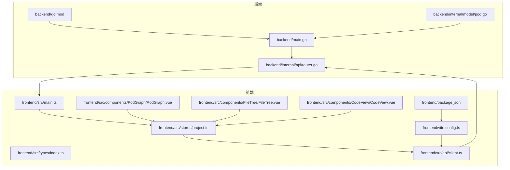
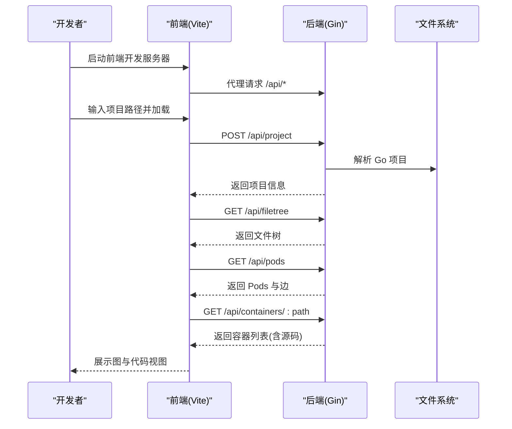
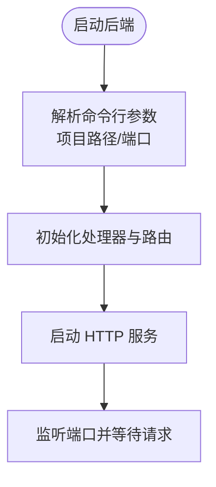
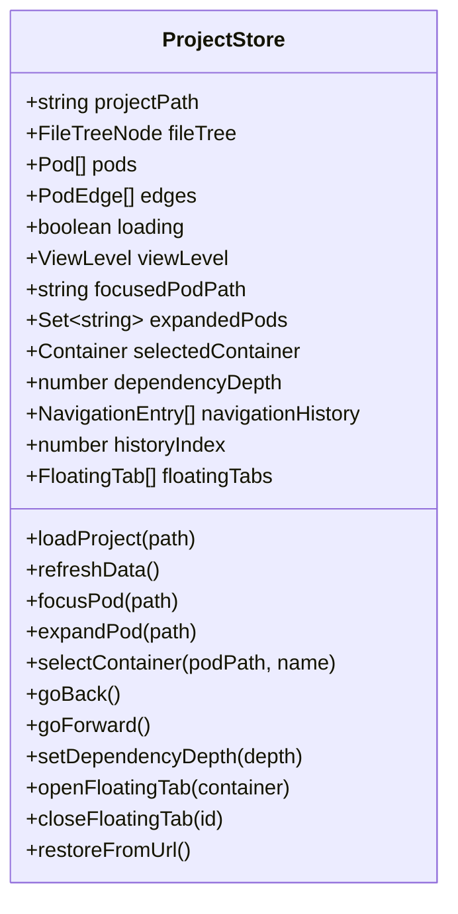
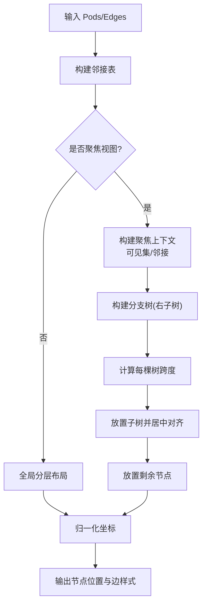
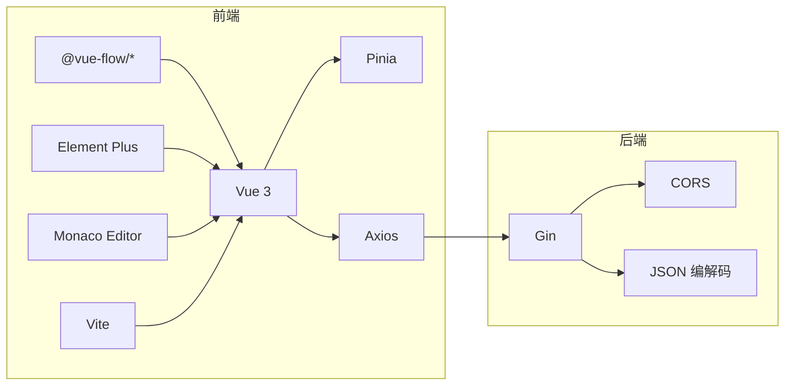

# 开发指南

<cite>
**本文档引用的文件**
- [README.md](file://README.md)
- [README_CN.md](file://README_CN.md)
- [Makefile](file://Makefile)
- [backend/main.go](file://backend/main.go)
- [backend/go.mod](file://backend/go.mod)
- [backend/internal/api/router.go](file://backend/internal/api/router.go)
- [backend/internal/model/pod.go](file://backend/internal/model/pod.go)
- [frontend/package.json](file://frontend/package.json)
- [frontend/vite.config.ts](file://frontend/vite.config.ts)
- [frontend/src/main.ts](file://frontend/src/main.ts)
- [frontend/src/stores/project.ts](file://frontend/src/stores/project.ts)
- [frontend/src/types/index.ts](file://frontend/src/types/index.ts)
- [frontend/src/api/client.ts](file://frontend/src/api/client.ts)
- [frontend/src/components/PodGraph/PodGraph.vue](file://frontend/src/components/PodGraph/PodGraph.vue)
- [frontend/src/components/FileTree/FileTree.vue](file://frontend/src/components/FileTree/FileTree.vue)
- [frontend/src/components/CodeView/CodeView.vue](file://frontend/src/components/CodeView/CodeView.vue)
</cite>

## 目录
1. [简介](#简介)
2. [项目结构](#项目结构)
3. [核心组件](#核心组件)
4. [架构总览](#架构总览)
5. [详细组件分析](#详细组件分析)
6. [依赖分析](#依赖分析)
7. [性能考虑](#性能考虑)
8. [故障排查指南](#故障排查指南)
9. [结论](#结论)
10. [附录](#附录)

## 简介
本指南面向新加入的开发者，帮助你快速搭建 GoPodView 的本地开发环境，理解前后端架构与数据流，掌握编码规范与最佳实践，并完成构建、测试与部署流程。同时提供常见问题的排查思路与调试技巧，确保你能高效参与项目贡献。

## 项目结构
项目采用前后端分离架构：
- 后端：Go + Gin，负责解析 Go 项目、生成 Pod/Container 结构与依赖图，提供 REST API。
- 前端：Vue 3 + TypeScript + Vite，负责可视化展示、状态管理与用户交互。
- 构建与运行：通过 Makefile 统一编排后端与前端的启动与安装。

图表来源
- [backend/main.go:1-31](file://backend/main.go#L1-L31)
- [backend/internal/api/router.go:1-32](file://backend/internal/api/router.go#L1-L32)
- [backend/go.mod:1-39](file://backend/go.mod#L1-L39)
- [backend/internal/model/pod.go:1-19](file://backend/internal/model/pod.go#L1-L19)
- [frontend/src/main.ts:1-12](file://frontend/src/main.ts#L1-L12)
- [frontend/src/stores/project.ts:1-476](file://frontend/src/stores/project.ts#L1-L476)
- [frontend/src/types/index.ts:1-74](file://frontend/src/types/index.ts#L1-L74)
- [frontend/src/api/client.ts:1-53](file://frontend/src/api/client.ts#L1-L53)
- [frontend/src/components/PodGraph/PodGraph.vue:1-581](file://frontend/src/components/PodGraph/PodGraph.vue#L1-L581)
- [frontend/src/components/FileTree/FileTree.vue:1-201](file://frontend/src/components/FileTree/FileTree.vue#L1-L201)
- [frontend/src/components/CodeView/CodeView.vue:1-191](file://frontend/src/components/CodeView/CodeView.vue#L1-L191)
- [frontend/vite.config.ts:1-15](file://frontend/vite.config.ts#L1-L15)
- [frontend/package.json:1-33](file://frontend/package.json#L1-L33)

章节来源
- [README.md:79-104](file://README.md#L79-L104)
- [README_CN.md:81-107](file://README_CN.md#L81-L107)

## 核心组件
- 后端入口与路由
  - 后端入口负责解析命令行参数、初始化处理器与路由，并启动 HTTP 服务。
  - 路由注册了项目设置、文件树、Pod 列表、单个 Pod、容器列表、容器详情、依赖查询等接口。
- 前端应用与状态
  - 应用入口初始化 Vue、Pinia、Element Plus 并挂载根组件。
  - 项目状态集中管理：当前项目路径、文件树、Pod/边集合、视图层级、聚焦 Pod、展开集合、选中的容器、依赖深度、历史导航、浮动标签页等。
- 前端类型系统
  - 定义了容器类型、引用类型、Pod/Container/边、文件树节点、响应结构、视图层级、导航条目、浮动标签页等类型。
- 前端 API 客户端
  - 基于 Axios 创建带基础路径的客户端，封装项目设置、文件树、Pod、容器、依赖查询等请求。
- 前端组件
  - Pod 图：基于 Vue Flow 渲染节点与边，实现全局/聚焦/展开三种布局与动画样式。
  - 文件树：Element Plus Tree 展示项目文件，支持搜索、聚焦、高亮当前节点。
  - 代码视图：Monaco Editor 展示容器源码，支持返回展开视图、跳转引用等。

章节来源
- [backend/main.go:11-30](file://backend/main.go#L11-L30)
- [backend/internal/api/router.go:8-31](file://backend/internal/api/router.go#L8-L31)
- [frontend/src/main.ts:1-12](file://frontend/src/main.ts#L1-L12)
- [frontend/src/stores/project.ts:14-476](file://frontend/src/stores/project.ts#L14-L476)
- [frontend/src/types/index.ts:1-74](file://frontend/src/types/index.ts#L1-L74)
- [frontend/src/api/client.ts:10-53](file://frontend/src/api/client.ts#L10-L53)
- [frontend/src/components/PodGraph/PodGraph.vue:1-581](file://frontend/src/components/PodGraph/PodGraph.vue#L1-L581)
- [frontend/src/components/FileTree/FileTree.vue:1-201](file://frontend/src/components/FileTree/FileTree.vue#L1-L201)
- [frontend/src/components/CodeView/CodeView.vue:1-191](file://frontend/src/components/CodeView/CodeView.vue#L1-L191)

## 架构总览
后端通过 Gin 提供 REST API，前端通过 Vite 进行开发服务器与代理，跨域访问后端。前端状态通过 Pinia 管理，组件通过 API 客户端调用后端接口，最终渲染可视化图与代码视图。

图表来源
- [frontend/vite.config.ts:6-13](file://frontend/vite.config.ts#L6-L13)
- [backend/internal/api/router.go:19-28](file://backend/internal/api/router.go#L19-L28)
- [frontend/src/api/client.ts:15-52](file://frontend/src/api/client.ts#L15-L52)
- [frontend/src/stores/project.ts:57-92](file://frontend/src/stores/project.ts#L57-L92)

章节来源
- [README.md:67-78](file://README.md#L67-L78)
- [README_CN.md:69-79](file://README_CN.md#L69-L79)

## 详细组件分析

### 后端：入口与路由
- 入口逻辑
  - 解析项目路径与端口参数，初始化处理器与路由，启动服务并记录日志。
- 路由设计
  - 使用 CORS 中间件允许前端域名访问，统一前缀 /api，注册项目设置、文件树、Pod、容器、依赖等接口。

图表来源
- [backend/main.go:11-30](file://backend/main.go#L11-L30)
- [backend/internal/api/router.go:8-17](file://backend/internal/api/router.go#L8-L17)

章节来源
- [backend/main.go:11-30](file://backend/main.go#L11-L30)
- [backend/internal/api/router.go:8-31](file://backend/internal/api/router.go#L8-L31)

### 前端：应用初始化与状态管理
- 初始化
  - 创建 Vue 应用，注册 Pinia、Element Plus，引入全局样式并挂载。
- 状态管理
  - 项目路径、文件树、Pod/边、视图层级、聚焦 Pod、展开集合、选中容器、依赖深度、导航历史、浮动标签页等。
  - 提供加载项目、刷新数据、聚焦/展开/折叠、选择容器、回退/前进、依赖深度设置、浮动标签页管理、URL 状态同步与恢复等功能。

图表来源
- [frontend/src/stores/project.ts:14-476](file://frontend/src/stores/project.ts#L14-L476)
- [frontend/src/types/index.ts:21-73](file://frontend/src/types/index.ts#L21-L73)

章节来源
- [frontend/src/main.ts:1-12](file://frontend/src/main.ts#L1-L12)
- [frontend/src/stores/project.ts:14-476](file://frontend/src/stores/project.ts#L14-L476)

### 前端：Pod 图组件
- 节点与边
  - 使用 Vue Flow 渲染 Pod 节点与依赖边，支持动画边与不同透明度。
- 布局算法
  - 全局布局：基于入度分层与目录分组，计算列/子列/行位置并归一化。
  - 聚焦布局：围绕中心 Pod 构建可达展开分支树，递归放置左右子树与剩余节点，动态计算横向间距与节点尺寸。
- 样式与颜色
  - 按包名映射颜色，区分主边与次边，支持展开态节点尺寸自适应。

图表来源
- [frontend/src/components/PodGraph/PodGraph.vue:138-498](file://frontend/src/components/PodGraph/PodGraph.vue#L138-L498)

章节来源
- [frontend/src/components/PodGraph/PodGraph.vue:1-581](file://frontend/src/components/PodGraph/PodGraph.vue#L1-L581)

### 前端：文件树组件
- 功能
  - 支持输入项目路径加载、搜索过滤、点击文件聚焦 Pod、高亮当前节点、展开到聚焦路径。
- 交互
  - 通过 Element Plus Tree 实现，监听聚焦变化并同步展开与选中。

章节来源
- [frontend/src/components/FileTree/FileTree.vue:1-201](file://frontend/src/components/FileTree/FileTree.vue#L1-L201)

### 前端：代码视图组件
- 功能
  - 基于 Monaco Editor 展示容器源码，只读、自动布局、行号、换行、最小化缩略图关闭。
  - 显示容器类型、名称、行号范围、签名，支持引用跳转与返回展开视图。

章节来源
- [frontend/src/components/CodeView/CodeView.vue:1-191](file://frontend/src/components/CodeView/CodeView.vue#L1-L191)

## 依赖分析
- 后端依赖
  - Gin、CORS、JSON 编解码等，Go 版本要求与模块清单见 go.mod。
- 前端依赖
  - Vue 3、Vue Router、Pinia、Element Plus、@vue-flow 生态、Monaco Editor、Axios、Vite、TypeScript 等，详见 package.json 与 vite.config.ts。

图表来源
- [backend/go.mod:5-38](file://backend/go.mod#L5-L38)
- [frontend/package.json:11-31](file://frontend/package.json#L11-L31)
- [frontend/vite.config.ts:1-15](file://frontend/vite.config.ts#L1-L15)

章节来源
- [backend/go.mod:1-39](file://backend/go.mod#L1-L39)
- [frontend/package.json:1-33](file://frontend/package.json#L1-L33)

## 性能考虑
- 前端
  - 批量请求：加载项目时并行获取文件树与 Pods，减少总等待时间。
  - 懒加载：仅在展开或选择容器时请求源码，避免一次性传输大量文本。
  - 布局优化：全局布局按目录分组与分层，聚焦布局按展开集合递归放置，减少重绘与布局抖动。
- 后端
  - 使用并发解析与缓存策略（如需扩展），避免重复解析同一文件。
  - 接口幂等：项目设置接口幂等，避免重复解析。
- 资源与网络
  - 前端代理仅转发 /api 前缀，减少不必要的跨域与代理开销。

章节来源
- [frontend/src/stores/project.ts:63-66](file://frontend/src/stores/project.ts#L63-L66)
- [frontend/src/stores/project.ts:249-257](file://frontend/src/stores/project.ts#L249-L257)
- [frontend/vite.config.ts:7-12](file://frontend/vite.config.ts#L7-L12)

## 故障排查指南
- 启动失败
  - 后端端口占用：检查端口占用并调整端口参数。
  - 项目路径为空：确保通过命令行或 UI 正确设置项目路径。
- 跨域问题
  - 前端代理未生效：确认 Vite 代理配置与后端允许的来源一致。
- 请求超时
  - 后端解析大型项目耗时：适当增加 Axios 超时或分批加载。
- 布局异常
  - 节点尺寸未测量：等待节点渲染完成后重新计算布局版本。
- 状态不同步
  - URL 与 UI 不一致：检查状态同步与 URL 恢复逻辑，必要时禁用同步再启用。

章节来源
- [backend/main.go:21-28](file://backend/main.go#L21-L28)
- [frontend/vite.config.ts:6-13](file://frontend/vite.config.ts#L6-L13)
- [frontend/src/stores/project.ts:342-378](file://frontend/src/stores/project.ts#L342-L378)
- [frontend/src/stores/project.ts:380-439](file://frontend/src/stores/project.ts#L380-L439)

## 结论
本指南提供了从环境搭建到开发、测试与部署的全流程说明，结合代码级架构图与组件分析，帮助你快速上手并高质量贡献代码。建议在开发过程中遵循本文的编码规范与最佳实践，持续关注性能与用户体验。

## 附录

### 开发环境搭建
- 前端
  - 安装依赖：在 frontend 目录执行安装脚本。
  - 启动开发服务器：使用 Vite 提供的开发服务器，默认代理 /api 到后端。
- 后端
  - 安装依赖：在 backend 目录执行模块整理。
  - 启动服务：传入项目路径与端口参数。
- 一键启动
  - 使用 Makefile 的 run 目标，同时启动后端与前端。

章节来源
- [README.md:52-66](file://README.md#L52-L66)
- [README_CN.md:54-67](file://README_CN.md#L54-L67)
- [Makefile:6-18](file://Makefile#L6-L18)
- [frontend/package.json:6-10](file://frontend/package.json#L6-L10)
- [frontend/vite.config.ts:6-13](file://frontend/vite.config.ts#L6-L13)
- [backend/go.mod:1-39](file://backend/go.mod#L1-L39)

### 代码规范与最佳实践
- Go 后端
  - 使用 Gin 提供简洁的路由与中间件，保持接口幂等与错误处理一致。
  - 数据模型与 JSON 字段命名保持与前端一致，避免字段不匹配。
- TypeScript 前端
  - 使用 Pinia 管理全局状态，避免组件间耦合。
  - 组件职责单一，通过 props 与事件通信，避免跨层级直接访问状态。
  - 类型定义集中管理，确保 API 响应与 UI 数据结构一致。
- 构建与测试
  - 前端使用 Vite 构建与预览，TypeScript 类型检查在构建阶段执行。
  - 后端使用 go run 与 go mod 管理依赖，建议在 CI 中添加静态检查与单元测试步骤（如需扩展）。

章节来源
- [frontend/src/types/index.ts:1-74](file://frontend/src/types/index.ts#L1-L74)
- [frontend/src/api/client.ts:10-53](file://frontend/src/api/client.ts#L10-L53)
- [frontend/package.json:6-10](file://frontend/package.json#L6-L10)

### API 定义概览
- 项目设置：POST /api/project
- 文件树：GET /api/filetree
- Pods 与边：GET /api/pods
- 单个 Pod：GET /api/pod/:path
- 容器列表：GET /api/containers/:path
- 单个容器：GET /api/container/:path?name=
- 依赖查询：GET /api/dependencies/:path?depth=

章节来源
- [backend/internal/api/router.go:19-28](file://backend/internal/api/router.go#L19-L28)
- [README.md:67-78](file://README.md#L67-L78)
- [README_CN.md:69-79](file://README_CN.md#L69-L79)

### 贡献指南
- 提交 Issue
  - 描述问题背景、复现步骤、期望行为与实际行为，附上截图或日志。
- 提交 PR
  - 保持功能单一、提供测试用例与变更说明，遵循现有代码风格。
- 维护与协作
  - 关注代码审查反馈，及时更新与合并主干分支。

章节来源
- [README.md:106-109](file://README.md#L106-L109)
- [README_CN.md:109-112](file://README_CN.md#L109-L112)