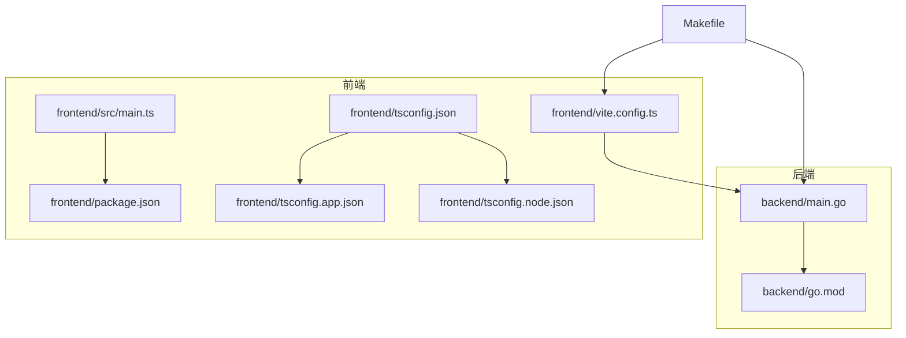
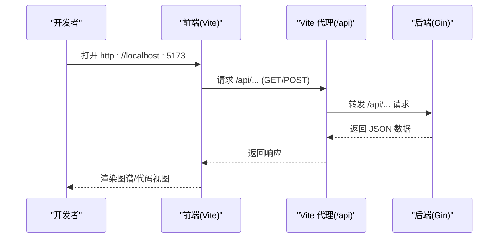
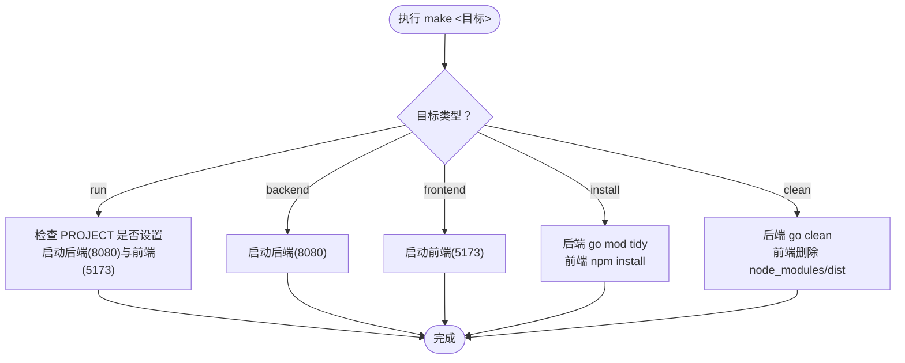
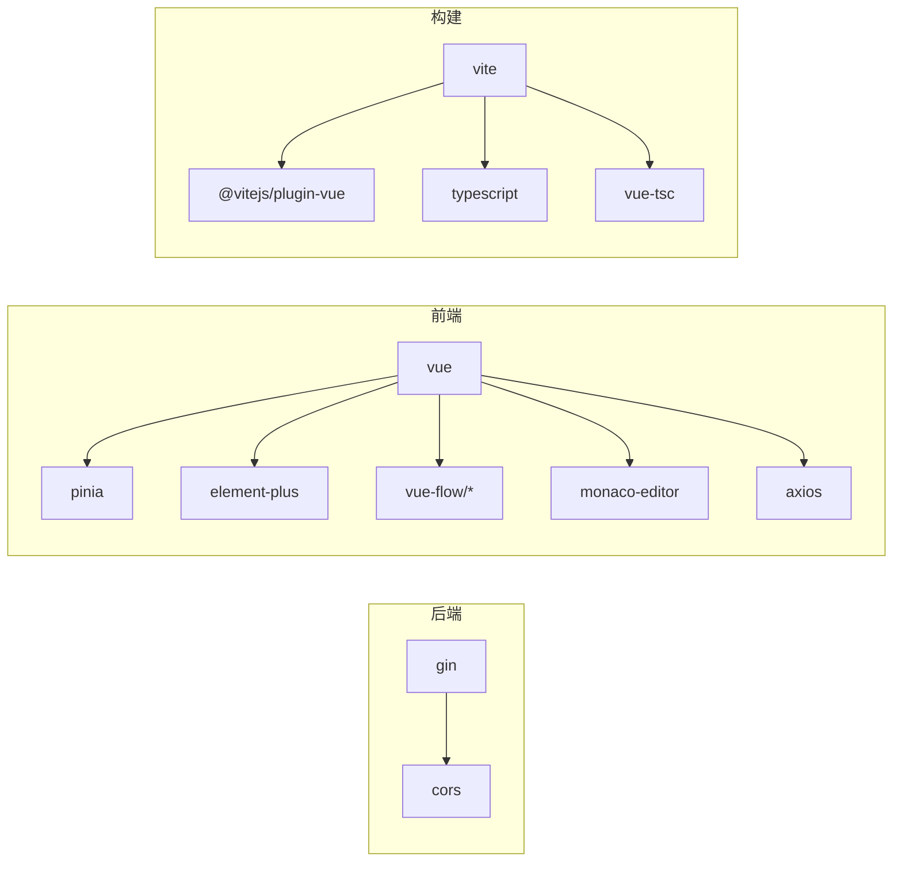

# 开发环境搭建

<cite>
**本文引用的文件**
- [README.md](file://README.md)
- [README_CN.md](file://README_CN.md)
- [Makefile](file://Makefile)
- [backend/go.mod](file://backend/go.mod)
- [backend/main.go](file://backend/main.go)
- [frontend/package.json](file://frontend/package.json)
- [frontend/vite.config.ts](file://frontend/vite.config.ts)
- [frontend/src/main.ts](file://frontend/src/main.ts)
- [frontend/tsconfig.json](file://frontend/tsconfig.json)
- [frontend/tsconfig.app.json](file://frontend/tsconfig.app.json)
- [frontend/tsconfig.node.json](file://frontend/tsconfig.node.json)
- [frontend/.gitignore](file://frontend/.gitignore)
</cite>

## 目录
1. [简介](#简介)
2. [项目结构](#项目结构)
3. [核心组件](#核心组件)
4. [架构总览](#架构总览)
5. [详细组件分析](#详细组件分析)
6. [依赖分析](#依赖分析)
7. [性能考虑](#性能考虑)
8. [故障排查指南](#故障排查指南)
9. [结论](#结论)
10. [附录](#附录)

## 简介
本指南面向希望在本地搭建 GoPodView 开发环境的开发者，覆盖系统要求、依赖安装、IDE 设置与调试配置，并对 Makefile 各目标进行逐项说明。同时提供跨平台安装建议与常见问题解决方案，帮助你快速完成从零到运行的全流程。

## 项目结构
GoPodView 采用前后端分离架构：后端使用 Go（基于 gin 框架与 go/ast），前端使用 Vue 3 + TypeScript + Vite，通过代理将前端请求转发至后端服务。项目根目录提供统一的构建与运行入口，便于本地开发与调试。

**图表来源**
- [backend/main.go:1-31](file://backend/main.go#L1-L31)
- [backend/go.mod:1-39](file://backend/go.mod#L1-L39)
- [frontend/package.json:1-33](file://frontend/package.json#L1-L33)
- [frontend/vite.config.ts:1-15](file://frontend/vite.config.ts#L1-L15)
- [frontend/src/main.ts:1-12](file://frontend/src/main.ts#L1-L12)
- [frontend/tsconfig.json:1-8](file://frontend/tsconfig.json#L1-L8)
- [frontend/tsconfig.app.json:1-17](file://frontend/tsconfig.app.json#L1-L17)
- [frontend/tsconfig.node.json:1-27](file://frontend/tsconfig.node.json#L1-L27)
- [Makefile:1-37](file://Makefile#L1-L37)

**章节来源**
- [README.md:79-104](file://README.md#L79-L104)
- [README_CN.md:81-107](file://README_CN.md#L81-L107)

## 核心组件
- 后端服务
  - 使用 Gin 提供 REST API，监听本地端口，默认 8080。
  - 支持通过命令行参数指定项目路径与端口。
- 前端应用
  - 使用 Vite 启动开发服务器，默认 5173。
  - 通过代理将 /api 前缀请求转发至后端。
  - 使用 Pinia 进行状态管理，Element Plus 提供 UI 组件，Monaco Editor 提供代码编辑体验。
- 构建与运行
  - Makefile 提供 run、backend、frontend、install、clean 等常用目标，简化本地开发流程。

**章节来源**
- [backend/main.go:11-30](file://backend/main.go#L11-L30)
- [frontend/vite.config.ts:4-14](file://frontend/vite.config.ts#L4-L14)
- [frontend/src/main.ts:1-12](file://frontend/src/main.ts#L1-L12)
- [frontend/package.json:6-10](file://frontend/package.json#L6-L10)
- [Makefile:4-37](file://Makefile#L4-L37)

## 架构总览
本地开发时，前端通过 Vite 代理访问后端 API；后端负责扫描指定 Go 项目并返回数据模型，前端据此渲染图谱与代码视图。

**图表来源**
- [frontend/vite.config.ts:6-13](file://frontend/vite.config.ts#L6-L13)
- [backend/main.go:16-29](file://backend/main.go#L16-L29)

## 详细组件分析

### 系统要求与版本约束
- Go 版本
  - 后端模块明确要求 Go 1.21.0。
- Node.js 版本
  - 前端使用 Vite 8 与 TypeScript ~5.9，建议使用较新 LTS 版本（如 18.x 或 20.x）以获得最佳兼容性。
- 浏览器兼容性
  - 前端使用现代 ES 特性与 Vue 3 生态，建议使用主流现代浏览器（Chrome/Firefox/Safari/Edge）最新稳定版。

**章节来源**
- [backend/go.mod:3](file://backend/go.mod#L3)
- [frontend/package.json:24-31](file://frontend/package.json#L24-L31)
- [frontend/tsconfig.node.json:4-8](file://frontend/tsconfig.node.json#L4-L8)

### 依赖安装与初始化
- 安装后端依赖
  - 进入 backend 目录执行模块整理。
- 安装前端依赖
  - 进入 frontend 目录执行依赖安装。
- 初始化脚本
  - Makefile 提供 install 目标，一键完成前后端依赖安装。

**章节来源**
- [Makefile:30-32](file://Makefile#L30-L32)
- [backend/go.mod:1-39](file://backend/go.mod#L1-L39)
- [frontend/package.json:1-33](file://frontend/package.json#L1-L33)

### IDE 设置与调试配置
- Go 后端
  - 建议使用 VS Code 并安装 Go 扩展，启用内置 linter 与 formatter。
  - 启动参数建议设置为：--project [你的 Go 项目路径] --port 8080。
- 前端
  - 建议使用 VS Code 并安装 Vue 扩展与 TypeScript 相关插件。
  - Vite 默认开发服务器端口为 5173，无需额外配置即可热重载。
- 调试建议
  - 前端：在浏览器中打开开发者工具，观察网络面板与控制台输出。
  - 后端：关注日志输出，确认项目路径与端口是否正确。

**章节来源**
- [backend/main.go:12-14](file://backend/main.go#L12-L14)
- [frontend/vite.config.ts:6-13](file://frontend/vite.config.ts#L6-L13)

### Makefile 目标详解
- run
  - 作用：同时启动后端与前端，自动打印服务地址与项目路径。
  - 使用：需传入 PROJECT 参数，否则会提示用法。
- backend
  - 作用：仅启动后端服务，适合后端单独调试。
- frontend
  - 作用：仅启动前端开发服务器。
- install
  - 作用：安装后端模块与前端依赖。
- clean
  - 作用：清理后端构建缓存与前端 node_modules、dist 等产物。

**图表来源**
- [Makefile:6-36](file://Makefile#L6-L36)

**章节来源**
- [Makefile:4-37](file://Makefile#L4-L37)

### 前端代理与跨域
- Vite 代理
  - 将 /api 前缀请求代理至后端默认地址，避免开发阶段的跨域问题。
- CORS
  - 后端引入了 CORS 中间件，确保跨域请求正常。

**章节来源**
- [frontend/vite.config.ts:7-12](file://frontend/vite.config.ts#L7-L12)
- [backend/go.mod:6](file://backend/go.mod#L6)

### TypeScript 与构建配置
- tsconfig 结构
  - 顶层 tsconfig.json 通过 references 引用 app 与 node 两套配置。
  - app 配置启用严格模式与多项 lint 规则，适配 Vue SFC。
  - node 配置用于 Vite 与工具链，目标与库设置为 ES2023。
- 构建脚本
  - 前端 package.json 提供 dev/build/preview 三类脚本，分别对应开发、生产构建与预览。

**章节来源**
- [frontend/tsconfig.json:1-8](file://frontend/tsconfig.json#L1-L8)
- [frontend/tsconfig.app.json:3-14](file://frontend/tsconfig.app.json#L3-L14)
- [frontend/tsconfig.node.json:2-15](file://frontend/tsconfig.node.json#L2-L15)
- [frontend/package.json:6-10](file://frontend/package.json#L6-L10)

### 跨平台安装指导
- macOS
  - 安装 Go 与 Node.js（建议使用 Homebrew）。
  - 使用 Makefile 的 run 目标启动，或分别进入 backend/frontend 子目录执行相应命令。
- Windows
  - 安装 Go 与 Node.js（建议使用官方安装包）。
  - 使用 Git Bash 或 WSL 执行 Makefile；或直接在 PowerShell 中分别启动后端与前端。
- Linux
  - 使用发行版包管理器安装 Go 与 Node.js。
  - 直接使用 Makefile run 目标，或分别启动后端与前端。

**章节来源**
- [README.md:52-66](file://README.md#L52-L66)
- [README_CN.md:54-67](file://README_CN.md#L54-L67)

## 依赖分析
- 后端依赖
  - Gin：Web 框架；CORS：跨域中间件。
- 前端依赖
  - Vue 3、Pinia、Element Plus、Vue Flow、Monaco Editor、Axios 等。
- 构建工具
  - Vite、TypeScript、vue-tsc、@vitejs/plugin-vue。

**图表来源**
- [backend/go.mod:5-8](file://backend/go.mod#L5-L8)
- [frontend/package.json:11-22](file://frontend/package.json#L11-L22)
- [frontend/package.json:24-31](file://frontend/package.json#L24-L31)

**章节来源**
- [backend/go.mod:1-39](file://backend/go.mod#L1-L39)
- [frontend/package.json:1-33](file://frontend/package.json#L1-L33)

## 性能考虑
- 代理与端口
  - 前端默认 5173，后端默认 8080，避免端口冲突。
- 依赖体积
  - 前端依赖较多，首次安装可能耗时较长；建议使用较快的网络与合适的镜像源。
- 构建优化
  - 生产构建使用 vue-tsc 与 Vite，建议在 CI 环境中开启缓存以提升速度。

[本节为通用建议，不涉及具体文件分析]

## 故障排查指南
- 无法启动后端
  - 确认已设置 PROJECT 参数；检查 Go 版本是否满足要求。
- 无法访问前端页面
  - 确认 Vite 开发服务器已启动且未被占用；检查浏览器代理配置。
- 跨域错误
  - 确认后端已启用 CORS；检查代理是否正确转发 /api 请求。
- 依赖安装失败
  - 清理缓存后重试；更换 npm/yarn/pnpm 源；确保 Node.js 版本符合要求。
- Makefile 执行异常
  - 确保 Makefile 所在目录具备可执行权限；在 Windows 上使用 Git Bash 或 WSL。

**章节来源**
- [Makefile:7-10](file://Makefile#L7-L10)
- [backend/go.mod:3](file://backend/go.mod#L3)
- [frontend/vite.config.ts:6-13](file://frontend/vite.config.ts#L6-L13)
- [frontend/.gitignore:10-11](file://frontend/.gitignore#L10-L11)

## 结论
通过本指南，你可以完成 GoPodView 的开发环境搭建与日常开发工作流。建议优先使用 Makefile 的 run 目标进行一体化启动，遇到问题时结合日志与代理配置逐步排查。后续可根据团队规范进一步完善 IDE 插件与代码风格。

[本节为总结性内容，不涉及具体文件分析]

## 附录

### 常用命令速查
- 一键启动：make run PROJECT=[你的 Go 项目路径]
- 后端单独启动：make backend PROJECT=[你的 Go 项目路径]
- 前端单独启动：make frontend
- 安装依赖：make install
- 清理构建：make clean

**章节来源**
- [Makefile:6-36](file://Makefile#L6-L36)

### 开发工具推荐
- 编辑器：VS Code（安装 Go、Vue、TypeScript 相关扩展）
- 浏览器：Chrome/Firefox 最新版（便于调试与预览）
- 包管理：npm（或 yarn/pnpm），根据团队约定选择

[本节为通用建议，不涉及具体文件分析]