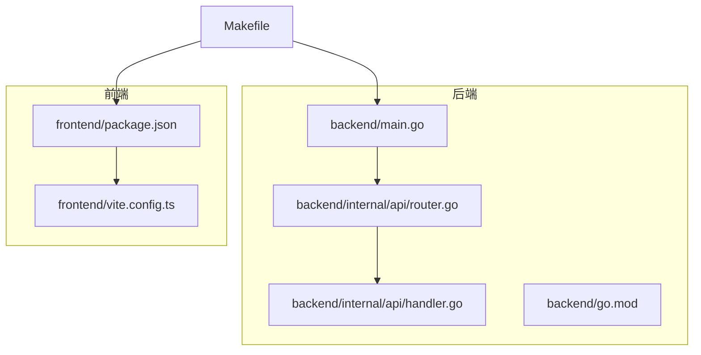
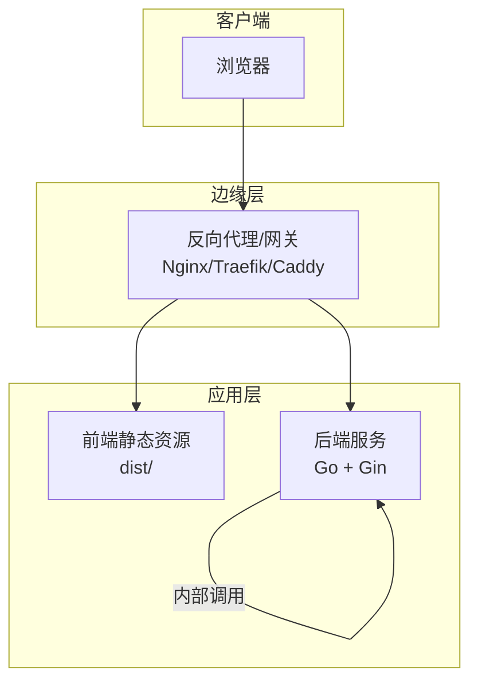
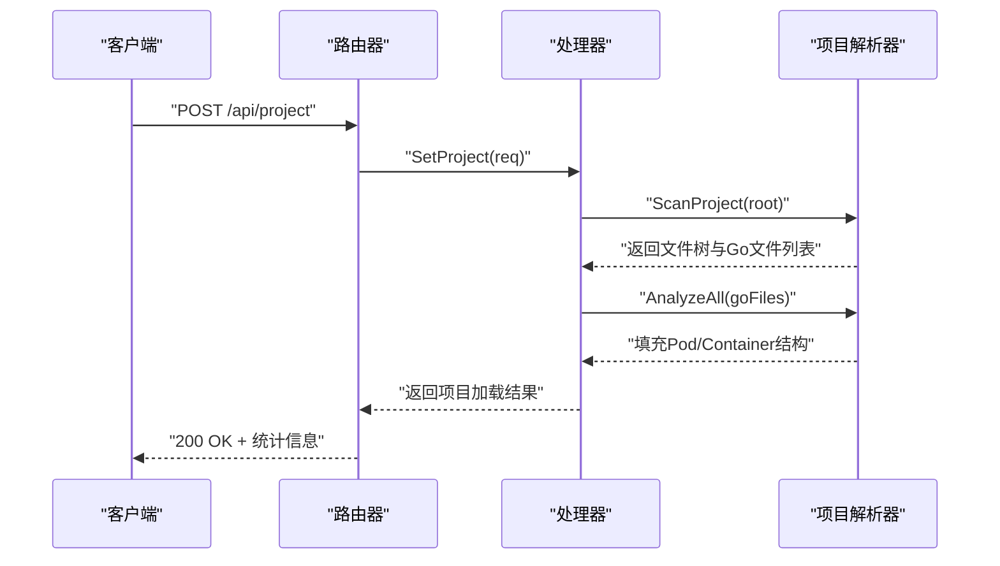
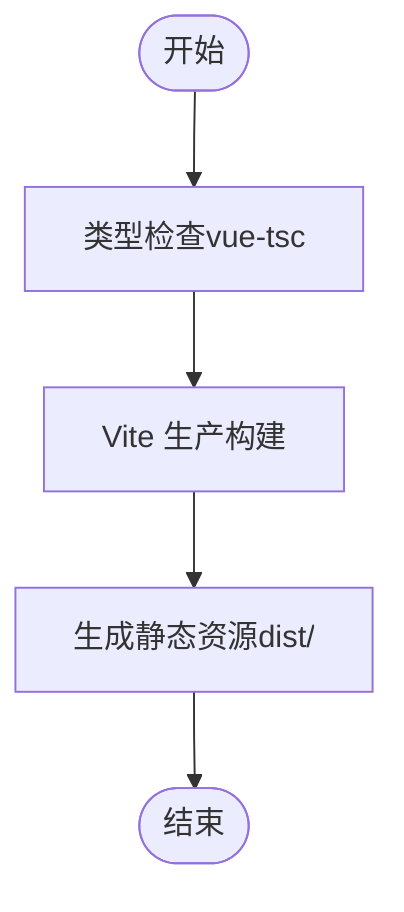
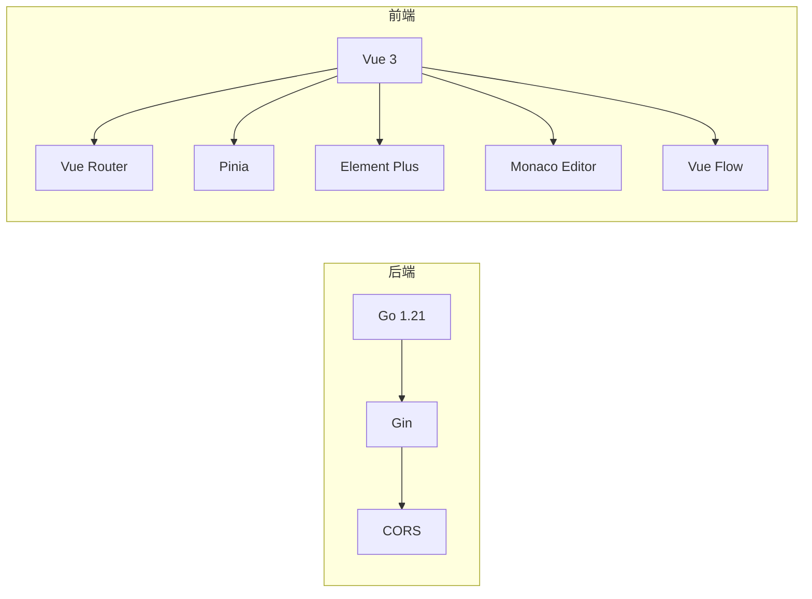

# 构建与部署

<cite>
**本文引用的文件**
- [backend/go.mod](file://backend/go.mod)
- [backend/main.go](file://backend/main.go)
- [backend/internal/api/router.go](file://backend/internal/api/router.go)
- [backend/internal/api/handler.go](file://backend/internal/api/handler.go)
- [frontend/package.json](file://frontend/package.json)
- [frontend/vite.config.ts](file://frontend/vite.config.ts)
- [Makefile](file://Makefile)
- [README.md](file://README.md)
</cite>

## 目录
1. [简介](#简介)
2. [项目结构](#项目结构)
3. [核心组件](#核心组件)
4. [架构总览](#架构总览)
5. [详细组件分析](#详细组件分析)
6. [依赖分析](#依赖分析)
7. [性能考虑](#性能考虑)
8. [故障排查指南](#故障排查指南)
9. [结论](#结论)
10. [附录](#附录)

## 简介
本指南面向 GoPodView 项目的生产环境构建与部署，覆盖以下方面：
- 前端打包配置与产物生成
- 后端编译与运行参数
- 静态资源处理与代理配置
- 部署策略：Docker 容器化、云平台部署与本地部署
- CI/CD 流水线配置思路与自动化部署脚本
- 性能优化、缓存策略与监控配置
- 版本发布与回滚操作

## 项目结构
项目采用前后端分离架构：
- 后端使用 Go（Gin）提供 REST API，负责扫描与解析 Go 项目，输出文件树、Pod 图谱与容器详情等数据
- 前端使用 Vue 3 + Vite 提供可视化界面，通过代理访问后端 API
- Makefile 提供一键启动与开发调试命令

图表来源
- [backend/main.go:1-31](file://backend/main.go#L1-L31)
- [backend/internal/api/router.go:1-32](file://backend/internal/api/router.go#L1-L32)
- [backend/internal/api/handler.go:1-225](file://backend/internal/api/handler.go#L1-L225)
- [backend/go.mod:1-39](file://backend/go.mod#L1-L39)
- [frontend/package.json:1-33](file://frontend/package.json#L1-L33)
- [frontend/vite.config.ts:1-15](file://frontend/vite.config.ts#L1-L15)
- [Makefile:1-37](file://Makefile#L1-L37)

章节来源
- [README.md:79-104](file://README.md#L79-L104)
- [Makefile:1-37](file://Makefile#L1-L37)

## 核心组件
- 后端入口与参数
  - 支持通过命令行参数设置项目路径与监听端口
  - 初始化处理器与路由，并以 Release 模式运行
- 路由与跨域
  - 使用 Gin 注册 /api 前缀的 REST 接口
  - 配置 CORS 允许本地开发源与凭证传递
- 处理器与数据模型
  - 负责加载项目、扫描 AST、构建文件树与 Pod/Container 结构
  - 提供文件树、Pod 列表、单个 Pod、容器列表、容器详情与依赖图谱等接口
- 前端构建与代理
  - 使用 Vite 进行开发与生产构建
  - 开发时通过代理将 /api 请求转发至后端服务

章节来源
- [backend/main.go:11-30](file://backend/main.go#L11-L30)
- [backend/internal/api/router.go:8-31](file://backend/internal/api/router.go#L8-L31)
- [backend/internal/api/handler.go:15-29](file://backend/internal/api/handler.go#L15-L29)
- [frontend/package.json:6-10](file://frontend/package.json#L6-L10)
- [frontend/vite.config.ts:6-14](file://frontend/vite.config.ts#L6-L14)

## 架构总览
下图展示生产环境下的典型部署形态：前端静态资源由反向代理或 Web 服务器提供，后端以独立进程运行并通过内网访问；也可将前端产物打包进后端镜像中统一对外提供。

## 详细组件分析

### 后端构建与运行
- 编译目标与工具链
  - 使用 Go 1.21，模块管理由 go.mod 管理
- 运行参数
  - --project：要分析的 Go 项目根路径
  - --port：HTTP 服务监听端口，默认 8080
- 生产模式
  - 路由器在 Release 模式下运行，减少日志开销
- API 端点
  - /api/project（POST）：设置分析项目
  - /api/filetree（GET）：获取文件树
  - /api/pods（GET）：获取所有 Pod 及依赖边
  - /api/pod/:path（GET）：获取单个 Pod
  - /api/containers/:path（GET）：获取 Pod 内所有容器
  - /api/container/:path?name=（GET）：按名称获取容器
  - /api/dependencies/:path?depth=（GET）：获取 N 层依赖

图表来源
- [backend/internal/api/router.go:19-28](file://backend/internal/api/router.go#L19-L28)
- [backend/internal/api/handler.go:56-75](file://backend/internal/api/handler.go#L56-L75)

章节来源
- [backend/go.mod:1-39](file://backend/go.mod#L1-L39)
- [backend/main.go:11-30](file://backend/main.go#L11-L30)
- [backend/internal/api/router.go:8-31](file://backend/internal/api/router.go#L8-L31)
- [backend/internal/api/handler.go:31-50](file://backend/internal/api/handler.go#L31-L50)

### 前端构建与静态资源
- 构建脚本
  - 生产构建顺序：先类型检查，再打包
- 开发代理
  - 将 /api 请求代理到后端地址，便于联调
- 产物位置
  - 生产构建产物位于前端工程的默认输出目录（由 Vite 默认行为决定）

图表来源
- [frontend/package.json:8](file://frontend/package.json#L8)
- [frontend/vite.config.ts:6-14](file://frontend/vite.config.ts#L6-L14)

章节来源
- [frontend/package.json:6-10](file://frontend/package.json#L6-L10)
- [frontend/vite.config.ts:6-14](file://frontend/vite.config.ts#L6-L14)

### 开发与本地运行（参考）
- 一键启动
  - 通过 Makefile 的 run 目标同时启动后端与前端
  - 后端监听端口可配置，前端默认 5173
- 分别启动
  - 后端：进入 backend 并运行带参数的 main.go
  - 前端：安装依赖后启动开发服务器

章节来源
- [Makefile:6-28](file://Makefile#L6-L28)
- [README.md:52-66](file://README.md#L52-L66)

## 依赖分析
- 后端依赖
  - Web 框架与 JSON 解析、CORS 中间件等
- 前端依赖
  - Vue 3、Vue Router、Pinia、Element Plus、Monaco Editor、Vue Flow 等
- 构建工具
  - Vite、TypeScript、vue-tsc

图表来源
- [backend/go.mod:5-38](file://backend/go.mod#L5-L38)
- [frontend/package.json:11-23](file://frontend/package.json#L11-L23)

章节来源
- [backend/go.mod:1-39](file://backend/go.mod#L1-L39)
- [frontend/package.json:1-33](file://frontend/package.json#L1-L33)

## 性能考虑
- 后端
  - 使用 Release 模式运行，降低日志与调试开销
  - 对响应体中的大字段（如源码）在部分接口中进行裁剪，避免传输冗余数据
  - 使用读写锁保护共享状态，提升并发读取性能
- 前端
  - 生产构建启用压缩与 Tree-shaking
  - 通过 CDN 加速第三方依赖（可选）
- 网络与缓存
  - 反向代理层开启静态资源缓存与 Gzip/Br 压缩
  - 对 API 响应设置合理的缓存控制头（根据业务需求调整）
- 监控与可观测性
  - 后端记录关键请求日志与错误日志
  - 前端上报关键交互事件与错误（可选）

## 故障排查指南
- 后端无法启动
  - 检查端口占用与权限
  - 确认传入的项目路径存在且可读
- CORS 错误
  - 确认浏览器访问地址在允许列表中
  - 若为生产环境，确保代理层正确透传 Origin 与凭证
- 前端代理无效
  - 确认开发服务器已启动且代理配置指向正确的后端地址
- API 返回“未加载项目”
  - 先调用 /api/project 设置项目，再请求其他接口
- 依赖安装失败
  - 后端：执行模块整理
  - 前端：重新安装依赖

章节来源
- [backend/internal/api/router.go:12-17](file://backend/internal/api/router.go#L12-L17)
- [backend/internal/api/handler.go:56-75](file://backend/internal/api/handler.go#L56-L75)
- [frontend/vite.config.ts:7-12](file://frontend/vite.config.ts#L7-L12)
- [Makefile:30-36](file://Makefile#L30-L36)

## 结论
本指南提供了 GoPodView 在生产环境的构建与部署实践路径：后端以 Gin 提供稳定 API，前端通过 Vite 产出静态资源，二者可通过反向代理统一对外提供。结合缓存、压缩与监控，可在保证性能的同时提升用户体验。后续可根据实际运行环境进一步完善容器化与 CI/CD 流水线。

## 附录

### 生产构建流程（步骤说明）
- 后端
  - 准备 Go 工具链与模块依赖
  - 编译后端二进制（可指定 CGO 等编译选项）
  - 运行时通过命令行参数设置项目路径与端口
- 前端
  - 执行类型检查与生产构建
  - 产出静态资源目录（dist/）
- 部署
  - 方案一：将前端静态资源与后端二进制分别部署，通过反向代理转发 /api 请求
  - 方案二：将前端产物复制到后端可访问的静态目录，统一由后端提供

章节来源
- [backend/go.mod:1-39](file://backend/go.mod#L1-L39)
- [backend/main.go:11-30](file://backend/main.go#L11-L30)
- [frontend/package.json:8](file://frontend/package.json#L8)
- [frontend/vite.config.ts:6-14](file://frontend/vite.config.ts#L6-L14)

### 部署策略与最佳实践
- Docker 容器化（思路）
  - 后端镜像：基于精简基础镜像，拷贝后端二进制与最小化配置
  - 前端镜像：使用多阶段构建，仅保留生产构建产物
  - 反向代理镜像：Nginx/Traefik，配置静态资源缓存与 API 代理
- 云平台部署（思路）
  - 容器编排：Kubernetes Deployment + Service + Ingress
  - 存储：持久卷挂载（如需保存用户状态或缓存）
  - 网络：Ingress 控制器暴露域名与证书
- 本地部署（思路）
  - 使用 systemd 或 Docker Compose 管理后端与反向代理
  - 通过环境变量或配置文件注入端口、项目路径等参数

### CI/CD 流水线配置示例（思路）
- 触发条件
  - push 到主分支或打标签
- 步骤
  - 安装依赖：后端模块整理、前端依赖安装
  - 构建：后端编译、前端生产构建
  - 测试：可选的单元测试与 E2E 测试
  - 打包：生成镜像并推送至镜像仓库
  - 部署：触发蓝绿/滚动发布或直接替换
- 自动化脚本
  - 一键安装与清理：复用现有 Makefile 目标
  - 发布脚本：封装构建、打包与部署命令

章节来源
- [Makefile:30-36](file://Makefile#L30-L36)

### 版本发布与回滚
- 发布
  - 以 Git 标签标记版本
  - 生成镜像标签（语义化版本），推送镜像仓库
  - 更新编排配置并滚动升级
- 回滚
  - 回退到上一个稳定镜像标签
  - 如需快速恢复，可回滚到上一个已知可用的配置版本

### 监控与告警（建议）
- 后端
  - 指标：请求量、错误率、响应时间、并发连接数
  - 日志：结构化日志，区分访问日志与业务日志
- 前端
  - 指标：页面加载时间、首屏时间、错误上报
  - 告警：针对异常指标阈值触发