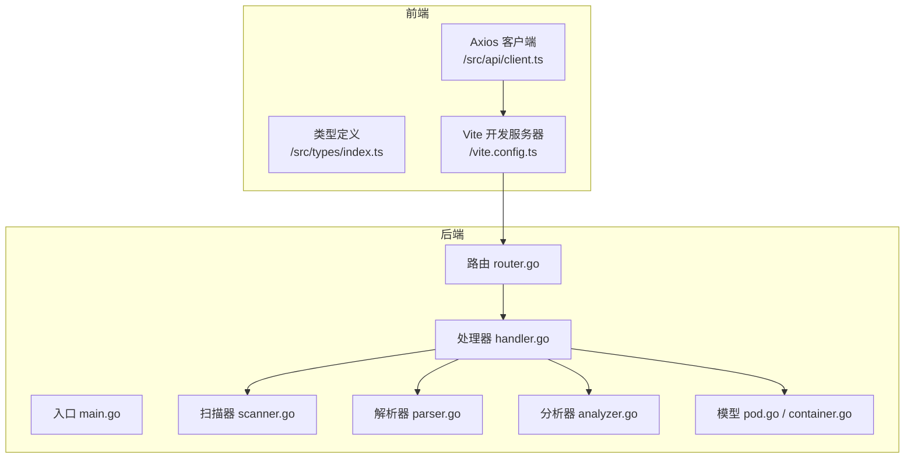
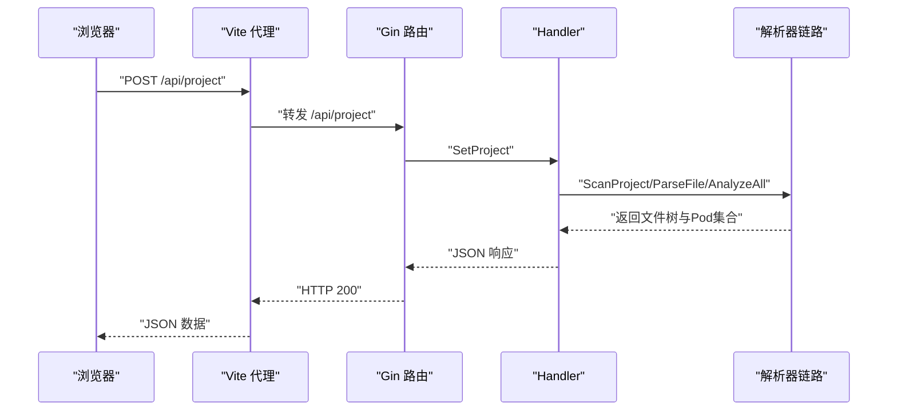
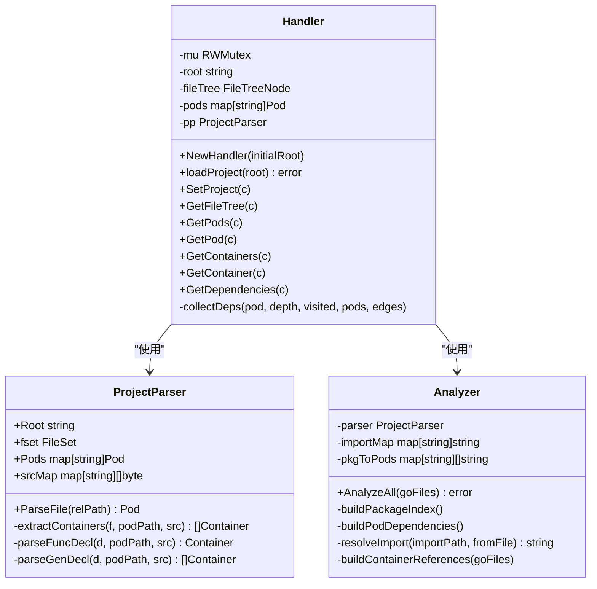
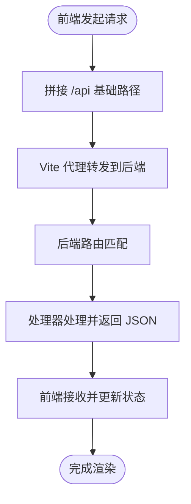
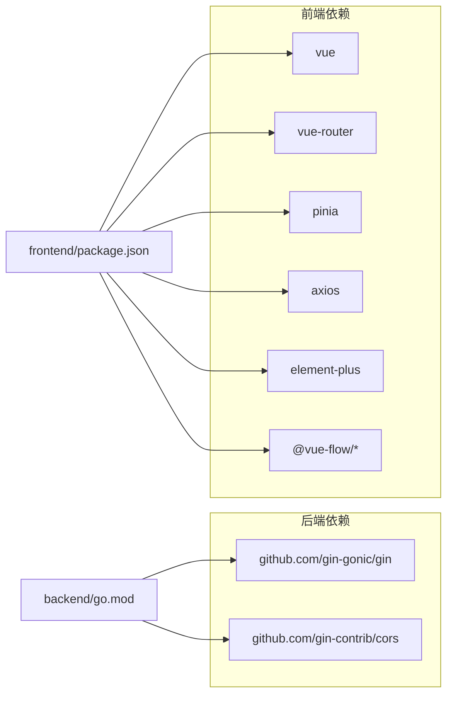

# 测试与调试

<cite>
**本文引用的文件**
- [backend/main.go](file://backend/main.go)
- [backend/internal/api/router.go](file://backend/internal/api/router.go)
- [backend/internal/api/handler.go](file://backend/internal/api/handler.go)
- [backend/internal/parser/scanner.go](file://backend/internal/parser/scanner.go)
- [backend/internal/parser/parser.go](file://backend/internal/parser/parser.go)
- [backend/internal/parser/analyzer.go](file://backend/internal/parser/analyzer.go)
- [backend/internal/model/pod.go](file://backend/internal/model/pod.go)
- [backend/internal/model/container.go](file://backend/internal/model/container.go)
- [frontend/src/api/client.ts](file://frontend/src/api/client.ts)
- [frontend/src/types/index.ts](file://frontend/src/types/index.ts)
- [frontend/vite.config.ts](file://frontend/vite.config.ts)
- [backend/go.mod](file://backend/go.mod)
- [frontend/package.json](file://frontend/package.json)
- [Makefile](file://Makefile)
</cite>

## 目录
1. [简介](#简介)
2. [项目结构](#项目结构)
3. [核心组件](#核心组件)
4. [架构总览](#架构总览)
5. [详细组件分析](#详细组件分析)
6. [依赖分析](#依赖分析)
7. [性能考虑](#性能考虑)
8. [故障排查指南](#故障排查指南)
9. [结论](#结论)
10. [附录](#附录)

## 简介
本指南面向 GoPodView 项目的测试与调试实践，覆盖后端（Go）与前端（Vue）的单元测试与集成测试策略，调试工具与技巧（浏览器开发者工具、Go 调试器、网络请求调试），性能分析与内存泄漏检测方法，以及常见问题诊断与质量门禁建议。文档基于仓库现有代码结构与接口定义，提供可操作的落地步骤。

## 项目结构
- 后端采用 Gin 框架，提供 REST 接口；解析器模块负责扫描与分析 Go 项目，生成文件树、Pod、容器与依赖图数据。
- 前端通过 Axios 访问后端 /api 前缀接口，Vite 提供开发服务器与代理到后端本地服务。
- Makefile 提供一键启动前后端与安装脚本。

图表来源
- [backend/main.go:1-31](file://backend/main.go#L1-L31)
- [backend/internal/api/router.go:1-32](file://backend/internal/api/router.go#L1-L32)
- [backend/internal/api/handler.go:1-225](file://backend/internal/api/handler.go#L1-L225)
- [backend/internal/parser/scanner.go:1-113](file://backend/internal/parser/scanner.go#L1-L113)
- [backend/internal/parser/parser.go:1-253](file://backend/internal/parser/parser.go#L1-L253)
- [backend/internal/parser/analyzer.go:1-236](file://backend/internal/parser/analyzer.go#L1-L236)
- [backend/internal/model/pod.go:1-19](file://backend/internal/model/pod.go#L1-L19)
- [backend/internal/model/container.go:1-37](file://backend/internal/model/container.go#L1-L37)
- [frontend/src/api/client.ts:1-53](file://frontend/src/api/client.ts#L1-L53)
- [frontend/src/types/index.ts:1-74](file://frontend/src/types/index.ts#L1-L74)
- [frontend/vite.config.ts:1-15](file://frontend/vite.config.ts#L1-L15)

章节来源
- [Makefile:1-37](file://Makefile#L1-L37)
- [backend/go.mod:1-39](file://backend/go.mod#L1-L39)
- [frontend/package.json:1-33](file://frontend/package.json#L1-L33)

## 核心组件
- 后端入口与路由：后端通过命令行参数接收项目路径与端口，初始化处理器并挂载路由组 /api。
- 处理器：封装并发安全的数据访问与业务逻辑，提供设置项目、获取文件树、Pod 列表、单个 Pod、容器列表、容器详情、依赖图等接口。
- 解析器链路：扫描器构建文件树并收集 .go 文件；解析器按文件提取函数、类型、常量/变量等容器；分析器建立包索引、Pod 依赖与容器引用。
- 前端客户端：统一的 Axios 实例，封装 /api 前缀调用，类型定义与响应结构保持一致。

章节来源
- [backend/main.go:11-30](file://backend/main.go#L11-L30)
- [backend/internal/api/router.go:8-31](file://backend/internal/api/router.go#L8-L31)
- [backend/internal/api/handler.go:15-225](file://backend/internal/api/handler.go#L15-L225)
- [backend/internal/parser/scanner.go:12-32](file://backend/internal/parser/scanner.go#L12-L32)
- [backend/internal/parser/parser.go:32-206](file://backend/internal/parser/parser.go#L32-L206)
- [backend/internal/parser/analyzer.go:27-134](file://backend/internal/parser/analyzer.go#L27-L134)
- [frontend/src/api/client.ts:10-53](file://frontend/src/api/client.ts#L10-L53)
- [frontend/src/types/index.ts:1-74](file://frontend/src/types/index.ts#L1-L74)

## 架构总览
后端以 Gin 为核心，处理来自前端的 REST 请求；处理器内部持有并发读写锁保护共享状态，并通过解析器链路产出数据。前端通过 Vite 代理将 /api 请求转发至后端本地服务。

图表来源
- [frontend/vite.config.ts:6-14](file://frontend/vite.config.ts#L6-L14)
- [backend/internal/api/router.go:19-28](file://backend/internal/api/router.go#L19-L28)
- [backend/internal/api/handler.go:56-75](file://backend/internal/api/handler.go#L56-L75)
- [backend/internal/parser/scanner.go:12-32](file://backend/internal/parser/scanner.go#L12-L32)
- [backend/internal/parser/parser.go:32-59](file://backend/internal/parser/parser.go#L32-L59)
- [backend/internal/parser/analyzer.go:27-39](file://backend/internal/parser/analyzer.go#L27-L39)

## 详细组件分析

### 后端处理器与并发安全
- 并发控制：使用读写锁保护 root、fileTree、pods、pp 字段，确保多请求下的数据一致性。
- 项目加载：首次加载或切换项目时，执行扫描、解析与分析流程，随后回填共享状态。
- 错误处理：对缺失项目、未找到资源、参数错误分别返回相应状态码与错误信息。

图表来源
- [backend/internal/api/handler.go:15-50](file://backend/internal/api/handler.go#L15-L50)
- [backend/internal/parser/parser.go:16-30](file://backend/internal/parser/parser.go#L16-L30)
- [backend/internal/parser/analyzer.go:13-25](file://backend/internal/parser/analyzer.go#L13-L25)

章节来源
- [backend/internal/api/handler.go:15-225](file://backend/internal/api/handler.go#L15-L225)
- [backend/internal/parser/parser.go:16-253](file://backend/internal/parser/parser.go#L16-L253)
- [backend/internal/parser/analyzer.go:13-236](file://backend/internal/parser/analyzer.go#L13-L236)

### 前端 API 客户端与类型定义
- Axios 实例：统一 baseURL 为 /api，超时时间配置，便于与后端对接。
- 类型定义：与后端响应结构一一对应，保证前端消费接口时的类型安全。
- Vite 代理：将 /api 请求转发至后端本地地址，避免跨域问题。

图表来源
- [frontend/src/api/client.ts:10-53](file://frontend/src/api/client.ts#L10-L53)
- [frontend/vite.config.ts:6-14](file://frontend/vite.config.ts#L6-L14)

章节来源
- [frontend/src/api/client.ts:10-53](file://frontend/src/api/client.ts#L10-L53)
- [frontend/src/types/index.ts:1-74](file://frontend/src/types/index.ts#L1-L74)
- [frontend/vite.config.ts:1-15](file://frontend/vite.config.ts#L1-L15)

## 依赖分析
- 后端依赖：Gin、CORS 中间件；间接依赖包括 JSON 编解码、文本处理等。
- 前端依赖：Vue 3、Vue Router、Pinia、Element Plus、Monaco Editor、Axios、@vue-flow 系列等。
- 构建与运行：Makefile 提供安装、清理、前后端独立/联合启动。

图表来源
- [backend/go.mod:5-38](file://backend/go.mod#L5-L38)
- [frontend/package.json:11-31](file://frontend/package.json#L11-L31)

章节来源
- [backend/go.mod:1-39](file://backend/go.mod#L1-L39)
- [frontend/package.json:1-33](file://frontend/package.json#L1-L33)
- [Makefile:30-37](file://Makefile#L30-L37)

## 性能考虑
- 并发安全与锁粒度：处理器使用读写锁，读多写少场景下可提升吞吐；注意在高并发下避免长时间持锁。
- 解析与分析复杂度：扫描与解析 .go 文件的时间复杂度与文件数量、大小相关；建议对大型项目启用增量分析或缓存。
- 依赖图深度限制：后端对依赖查询深度做了上限控制，防止过深遍历导致性能问题。
- 前端渲染优化：仅在需要时传输源码片段，避免大字段传输；组件按需加载与虚拟滚动可降低渲染压力。

章节来源
- [backend/internal/api/handler.go:15-225](file://backend/internal/api/handler.go#L15-L225)
- [backend/internal/parser/analyzer.go:182-189](file://backend/internal/parser/analyzer.go#L182-L189)

## 故障排查指南

### 单元测试策略（后端）
- 覆盖点
  - 扫描器：目录遍历、跳过规则、Go 文件收集。
  - 解析器：函数声明、类型声明、常量/变量声明、签名生成。
  - 分析器：包索引、导入解析、依赖关系、容器引用查找。
  - 处理器：设置项目、获取文件树、Pod/容器/依赖查询、错误分支。
- 断言建议
  - 返回结构体字段完整性（如 Pod 的 imports、containers、dependsOn）。
  - 错误码与错误消息一致性（如 400/404/500 对应不同场景）。
  - 并发安全：多个 goroutine 并发调用处理器接口，验证读写锁正确性。
- 示例断言位置
  - 扫描器：[scan.go:12-32](file://backend/internal/parser/scanner.go#L12-L32)
  - 解析器：[parse.go:32-206](file://backend/internal/parser/parser.go#L32-L206)
  - 分析器：[analyzer.go:27-134](file://backend/internal/parser/analyzer.go#L27-L134)
  - 处理器：[handler.go:56-225](file://backend/internal/api/handler.go#L56-L225)

章节来源
- [backend/internal/parser/scanner.go:12-113](file://backend/internal/parser/scanner.go#L12-L113)
- [backend/internal/parser/parser.go:32-253](file://backend/internal/parser/parser.go#L32-L253)
- [backend/internal/parser/analyzer.go:27-236](file://backend/internal/parser/analyzer.go#L27-L236)
- [backend/internal/api/handler.go:56-225](file://backend/internal/api/handler.go#L56-L225)

### 集成测试策略（后端）
- 场景
  - 设置项目 → 获取文件树 → 获取 Pod 列表 → 获取单个 Pod → 获取容器列表 → 获取容器 → 获取依赖图。
  - 参数校验：非法路径、不存在的 Pod/容器、非法深度。
- 工具
  - 使用 net/http/httptest 或直接启动 Gin 路由进行端到端请求。
  - 可结合 Docker 运行后端，前端通过代理访问。

章节来源
- [backend/internal/api/router.go:19-28](file://backend/internal/api/router.go#L19-L28)
- [backend/internal/api/handler.go:56-225](file://backend/internal/api/handler.go#L56-L225)

### 单元测试策略（前端）
- 覆盖点
  - Axios 客户端：请求构造、参数传递、响应解析。
  - 类型定义：接口字段与后端一致性的校验。
  - 组件：在测试中注入 mock 的 API 函数，验证渲染与交互。
- 断言建议
  - 请求 URL 与参数（如 GET /api/dependencies?depth=1）。
  - 响应数据结构与类型定义一致。
  - 错误分支：空项目、网络异常、404 场景。

章节来源
- [frontend/src/api/client.ts:10-53](file://frontend/src/api/client.ts#L10-L53)
- [frontend/src/types/index.ts:1-74](file://frontend/src/types/index.ts#L1-L74)

### 集成测试策略（前端）
- 场景
  - 启动后端与前端，通过代理访问 /api。
  - 在真实浏览器中验证导航、节点展开、悬浮标签页、依赖图渲染。
- 工具
  - Cypress、Playwright 或 Vitest + @vue/test-utils。

### 调试技巧与工具
- 浏览器开发者工具
  - Network：检查 /api 请求是否成功、响应体结构是否符合类型定义。
  - Console：查看前端错误与日志。
  - Elements：定位组件渲染结果。
- Go 调试器
  - Delve：在后端 main.go 入口与关键处理器处设置断点，观察共享状态与解析过程。
  - 日志：利用 Gin 默认日志与自定义 log 输出，定位请求处理路径。
- 网络请求调试
  - Vite 代理：确认 /api 前缀被正确转发到后端地址。
  - CORS：确认允许的来源与方法已配置。

章节来源
- [frontend/vite.config.ts:6-14](file://frontend/vite.config.ts#L6-L14)
- [backend/internal/api/router.go:12-17](file://backend/internal/api/router.go#L12-L17)
- [backend/main.go:20-29](file://backend/main.go#L20-L29)

### 性能分析与内存泄漏检测
- 后端
  - pprof：启用 net/http/pprof，采集 CPU/内存 profile，定位热点函数与内存分配。
  - 并发压测：使用 go test -bench 或 wrk 压测 /api/pods 与 /api/dependencies。
- 前端
  - Chrome DevTools Performance：录制交互过程，查看主线程耗时与重排重绘。
  - Memory：Heap Snapshot 检测组件卸载后的残留引用。
- 通用
  - 依赖图深度限制：避免深度过大导致内存膨胀。
  - 源码片段传输：仅在需要时拉取源码，减少前端内存占用。

章节来源
- [backend/internal/api/handler.go:182-189](file://backend/internal/api/handler.go#L182-L189)

### 常见问题与诊断
- 问题：设置项目失败或返回 500
  - 检查项目路径是否存在、权限是否足够；查看后端日志与解析器错误。
- 问题：获取文件树为空或报 400
  - 确认已先设置项目；检查处理器中的空状态判断。
- 问题：依赖图不完整或深度异常
  - 检查深度参数边界与递归终止条件；核对 importMap 与 pkgToPods 构建逻辑。
- 问题：前端无法访问 /api
  - 检查 Vite 代理配置与后端 CORS 允许来源；确认后端已启动且端口正确。

章节来源
- [backend/internal/api/handler.go:63-74](file://backend/internal/api/handler.go#L63-L74)
- [backend/internal/api/handler.go:81-85](file://backend/internal/api/handler.go#L81-L85)
- [backend/internal/api/handler.go:182-209](file://backend/internal/api/handler.go#L182-L209)
- [frontend/vite.config.ts:6-14](file://frontend/vite.config.ts#L6-L14)
- [backend/internal/api/router.go:12-17](file://backend/internal/api/router.go#L12-L17)

## 结论
通过明确的测试分层（单元/集成）、完善的调试工具链与性能监控手段，可以有效保障 GoPodView 的稳定性与可维护性。建议在 CI 中引入覆盖率统计与质量门禁，持续迭代测试用例与性能优化策略。

## 附录

### 测试覆盖率要求与质量门禁（建议）
- 后端
  - 行覆盖率：≥ 70%
  - 分支覆盖率：≥ 50%
  - 关键路径：100% 覆盖（如设置项目、解析与分析主流程）
- 前端
  - 行覆盖率：≥ 60%
  - 组件覆盖率：关键组件 100% 覆盖
- 质量门禁
  - 未达阈值禁止合并
  - 严重缺陷（崩溃、数据不一致）必须修复后方可合并
  - 性能回归（CPU/内存显著上升）需评估与修复

### 快速开始（本地联调）
- 启动后端与前端
  - make install
  - make run PROJECT=/path/to/go/project PORT=8080
- 前端访问
  - http://localhost:5173
  - /api 请求自动代理到 http://localhost:8080

章节来源
- [Makefile:30-37](file://Makefile#L30-L37)
- [Makefile:6-28](file://Makefile#L6-L28)