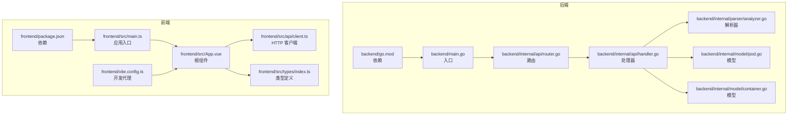
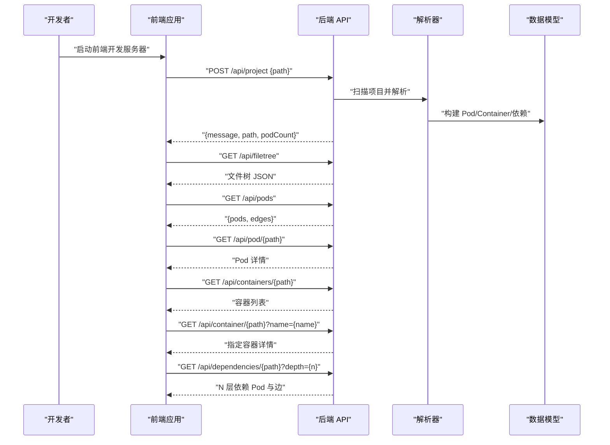
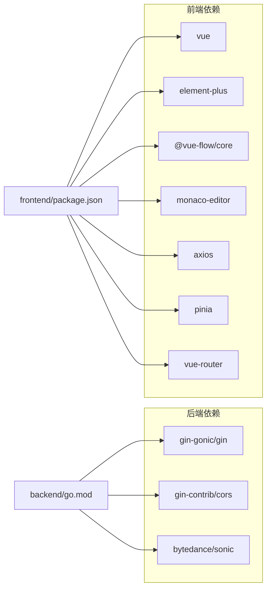

# 贡献指南

<cite>
**本文档引用的文件**
- [README.md](file://README.md)
- [README_CN.md](file://README_CN.md)
- [Makefile](file://Makefile)
- [backend/go.mod](file://backend/go.mod)
- [frontend/package.json](file://frontend/package.json)
- [backend/main.go](file://backend/main.go)
- [backend/internal/api/router.go](file://backend/internal/api/router.go)
- [backend/internal/api/handler.go](file://backend/internal/api/handler.go)
- [backend/internal/parser/analyzer.go](file://backend/internal/parser/analyzer.go)
- [backend/internal/model/pod.go](file://backend/internal/model/pod.go)
- [backend/internal/model/container.go](file://backend/internal/model/container.go)
- [frontend/src/main.ts](file://frontend/src/main.ts)
- [frontend/vite.config.ts](file://frontend/vite.config.ts)
- [frontend/src/App.vue](file://frontend/src/App.vue)
- [frontend/src/api/client.ts](file://frontend/src/api/client.ts)
- [frontend/src/types/index.ts](file://frontend/src/types/index.ts)
</cite>

## 目录
1. [简介](#简介)
2. [项目结构](#项目结构)
3. [核心组件](#核心组件)
4. [架构总览](#架构总览)
5. [详细组件分析](#详细组件分析)
6. [依赖分析](#依赖分析)
7. [性能考虑](#性能考虑)
8. [故障排查指南](#故障排查指南)
9. [结论](#结论)
10. [附录](#附录)

## 简介
本项目旨在为 Go 语言项目提供可视化的代码结构探索工具，灵感来源于 Kubernetes 的 Pod 概念：将 Go 源文件抽象为“Pod”，文件内的函数、结构体、接口、常量、变量等声明抽象为“Container”。通过交互式图谱展示模块间的导入依赖关系，并支持在浏览器中直接预览与跳转到源代码位置。

贡献者可通过本指南了解如何参与开发、提交 Issue、发起 Pull Request、遵循代码审查标准、理解项目架构与开发工作流、掌握分支管理策略与版本发布流程，以及社区行为准则与沟通渠道。

## 项目结构
项目采用前后端分离架构，后端使用 Go + Gin 提供 REST API，前端使用 Vue 3 + TypeScript + Vite 构建交互界面，图可视化基于 Vue Flow，代码编辑与预览使用 Monaco Editor。

图表来源
- [backend/main.go:1-31](file://backend/main.go#L1-L31)
- [backend/internal/api/router.go:1-32](file://backend/internal/api/router.go#L1-L32)
- [backend/internal/api/handler.go:1-225](file://backend/internal/api/handler.go#L1-L225)
- [backend/internal/parser/analyzer.go:1-236](file://backend/internal/parser/analyzer.go#L1-L236)
- [backend/internal/model/pod.go:1-19](file://backend/internal/model/pod.go#L1-L19)
- [backend/internal/model/container.go:1-37](file://backend/internal/model/container.go#L1-L37)
- [frontend/src/main.ts:1-12](file://frontend/src/main.ts#L1-L12)
- [frontend/src/App.vue:1-125](file://frontend/src/App.vue#L1-L125)
- [frontend/vite.config.ts:1-15](file://frontend/vite.config.ts#L1-L15)
- [frontend/src/api/client.ts:1-52](file://frontend/src/api/client.ts#L1-L52)
- [frontend/src/types/index.ts:1-74](file://frontend/src/types/index.ts#L1-L74)
- [backend/go.mod:1-39](file://backend/go.mod#L1-L39)
- [frontend/package.json:1-33](file://frontend/package.json#L1-L33)

章节来源
- [README.md:79-104](file://README.md#L79-L104)
- [README_CN.md:81-107](file://README_CN.md#L81-L107)

## 核心组件
- 后端入口与服务启动：负责解析命令行参数、初始化处理器与路由，并启动 HTTP 服务器。
- API 路由与处理器：提供项目设置、文件树、Pod 列表、单个 Pod、容器列表、指定容器、依赖查询等接口。
- 解析器：基于 go/ast 与 go/parser 扫描项目、构建包索引、计算 Pod 依赖、收集容器引用。
- 数据模型：定义 Pod、Container、Reference 等核心数据结构。
- 前端应用：基于 Vue 3 + Pinia 管理状态，Axios 发起 API 请求，Vue Flow 渲染图，Monaco Editor 显示代码。
- 开发工具链：Makefile 提供一键启动与安装清理；Vite 配置本地代理至后端。

章节来源
- [backend/main.go:11-30](file://backend/main.go#L11-L30)
- [backend/internal/api/router.go:8-31](file://backend/internal/api/router.go#L8-L31)
- [backend/internal/api/handler.go:15-29](file://backend/internal/api/handler.go#L15-L29)
- [backend/internal/parser/analyzer.go:13-25](file://backend/internal/parser/analyzer.go#L13-L25)
- [backend/internal/model/pod.go:3-11](file://backend/internal/model/pod.go#L3-L11)
- [backend/internal/model/container.go:13-36](file://backend/internal/model/container.go#L13-L36)
- [frontend/src/main.ts:1-12](file://frontend/src/main.ts#L1-L12)
- [frontend/src/App.vue:1-33](file://frontend/src/App.vue#L1-L33)
- [frontend/src/api/client.ts:1-52](file://frontend/src/api/client.ts#L1-L52)
- [frontend/vite.config.ts:1-15](file://frontend/vite.config.ts#L1-L15)
- [Makefile:6-18](file://Makefile#L6-L18)

## 架构总览
后端通过 Gin 提供 REST API，前端通过 Axios 调用这些接口，实现项目加载、文件树展示、Pod 依赖图、容器详情与代码预览等功能。开发时前端通过 Vite 代理将 /api 请求转发到后端。

图表来源
- [backend/internal/api/router.go:19-28](file://backend/internal/api/router.go#L19-L28)
- [backend/internal/api/handler.go:56-75](file://backend/internal/api/handler.go#L56-L75)
- [backend/internal/api/handler.go:77-86](file://backend/internal/api/handler.go#L77-L86)
- [backend/internal/api/handler.go:93-124](file://backend/internal/api/handler.go#L93-L124)
- [backend/internal/api/handler.go:126-138](file://backend/internal/api/handler.go#L126-L138)
- [backend/internal/api/handler.go:140-152](file://backend/internal/api/handler.go#L140-L152)
- [backend/internal/api/handler.go:154-175](file://backend/internal/api/handler.go#L154-L175)
- [backend/internal/api/handler.go:177-209](file://backend/internal/api/handler.go#L177-L209)
- [frontend/src/api/client.ts:15-52](file://frontend/src/api/client.ts#L15-L52)

章节来源
- [README.md:67-78](file://README.md#L67-L78)
- [README_CN.md:69-79](file://README_CN.md#L69-L79)
- [frontend/vite.config.ts:7-12](file://frontend/vite.config.ts#L7-L12)

## 详细组件分析

### 后端入口与路由
- 入口负责解析命令行参数，初始化处理器与路由，并启动服务。
- 路由统一挂载 /api 前缀，提供项目设置、文件树、Pod、容器、依赖等接口。
- CORS 中间件允许前端 localhost:5173 与 localhost:3000 访问。

章节来源
- [backend/main.go:11-30](file://backend/main.go#L11-L30)
- [backend/internal/api/router.go:8-31](file://backend/internal/api/router.go#L8-L31)

### API 处理器与并发安全
- 使用互斥锁保护共享状态（项目根、文件树、Pod 映射、解析器实例），确保读写安全。
- 支持设置项目、获取文件树、获取所有 Pod 及依赖边、获取单个 Pod、容器列表、指定容器、N 层依赖收集。
- 对深度参数进行边界校验，防止过度递归。

章节来源
- [backend/internal/api/handler.go:15-29](file://backend/internal/api/handler.go#L15-L29)
- [backend/internal/api/handler.go:31-50](file://backend/internal/api/handler.go#L31-L50)
- [backend/internal/api/handler.go:177-209](file://backend/internal/api/handler.go#L177-L209)

### 解析器与依赖分析
- 扫描项目文件，构建包索引与 Pod 依赖映射。
- 通过 go/ast 解析文件，建立容器索引，查找跨文件引用，区分调用与类型引用。
- 提供导入路径解析与去重逻辑，避免重复边。

章节来源
- [backend/internal/parser/analyzer.go:27-39](file://backend/internal/parser/analyzer.go#L27-L39)
- [backend/internal/parser/analyzer.go:59-81](file://backend/internal/parser/analyzer.go#L59-L81)
- [backend/internal/parser/analyzer.go:100-134](file://backend/internal/parser/analyzer.go#L100-L134)
- [backend/internal/parser/analyzer.go:152-217](file://backend/internal/parser/analyzer.go#L152-L217)

### 数据模型
- Pod：包含路径、包名、文件名、导入列表、容器集合、依赖与其他反向依赖。
- Container：包含名称、类型、所在 Pod、起止行、签名、源码、引用列表。
- Reference：记录被引用的容器名与所在 Pod 路径及引用类型。

章节来源
- [backend/internal/model/pod.go:3-11](file://backend/internal/model/pod.go#L3-L11)
- [backend/internal/model/container.go:13-36](file://backend/internal/model/container.go#L13-L36)

### 前端应用与状态管理
- 应用入口注册 Pinia 与 Element Plus，挂载根组件。
- 根组件负责恢复 URL 状态、绑定键盘快捷键（Cmd+[ / Cmd+]）、触发项目加载。
- 通过 Axios 客户端封装 API 调用，类型定义与后端保持一致。

章节来源
- [frontend/src/main.ts:1-12](file://frontend/src/main.ts#L1-L12)
- [frontend/src/App.vue:10-33](file://frontend/src/App.vue#L10-L33)
- [frontend/src/api/client.ts:1-52](file://frontend/src/api/client.ts#L1-L52)
- [frontend/src/types/index.ts:1-74](file://frontend/src/types/index.ts#L1-L74)

### 开发工具链
- Makefile 提供 run、backend、frontend、install、clean 等目标，支持一键启动前后端与安装依赖。
- Vite 配置将 /api 代理到后端，默认端口 8080，前端默认端口 5173。

章节来源
- [Makefile:6-18](file://Makefile#L6-L18)
- [Makefile:30-36](file://Makefile#L30-L36)
- [frontend/vite.config.ts:6-14](file://frontend/vite.config.ts#L6-L14)

## 依赖分析
- 后端依赖：Gin Web 框架、CORS 中间件、高性能 JSON 编解码库等。
- 前端依赖：Vue 3、Element Plus、Vue Flow、Monaco Editor、Axios、Pinia、Vue Router 等。
- 项目通过 go.mod 与 package.json 管理依赖，开发时使用 Makefile 进行统一安装与清理。

图表来源
- [backend/go.mod:5-38](file://backend/go.mod#L5-L38)
- [frontend/package.json:11-31](file://frontend/package.json#L11-L31)

章节来源
- [backend/go.mod:1-39](file://backend/go.mod#L1-L39)
- [frontend/package.json:1-33](file://frontend/package.json#L1-L33)

## 性能考虑
- 并发安全：处理器对共享状态加读写锁，避免竞态条件；在高频请求场景下，建议减少不必要的深拷贝与大对象传输。
- 数据裁剪：返回 Pod 列表时仅返回必要字段，容器源码在概览接口中清空，降低响应体积。
- 依赖深度限制：后端对依赖查询深度进行边界检查，防止过深遍历导致性能问题。
- 前端渲染优化：图节点布局与位置归一化，避免大规模重绘；容器引用查找限定在容器起止行范围内，减少 AST 遍历成本。

章节来源
- [backend/internal/api/handler.go:102-124](file://backend/internal/api/handler.go#L102-L124)
- [backend/internal/api/handler.go:182-189](file://backend/internal/api/handler.go#L182-L189)
- [backend/internal/parser/analyzer.go:163-171](file://backend/internal/parser/analyzer.go#L163-L171)

## 故障排查指南
- 启动失败或端口占用
  - 检查后端端口是否被占用，调整 PORT 或停止冲突进程。
  - 确认项目路径有效且可访问。
- CORS 跨域错误
  - 确保前端运行在允许的源（如 localhost:5173），后端 CORS 配置已生效。
- API 返回“未加载项目”
  - 先调用 POST /api/project 设置项目路径，再请求其他接口。
- 依赖查询异常
  - 检查 depth 参数范围（建议 1~10），避免过大导致超时。
- 前端无法访问 /api
  - 确认 Vite 代理配置正确，后端已启动并监听 8080 端口。

章节来源
- [Makefile:1-37](file://Makefile#L1-L37)
- [frontend/vite.config.ts:7-12](file://frontend/vite.config.ts#L7-L12)
- [backend/internal/api/router.go:12-17](file://backend/internal/api/router.go#L12-L17)
- [backend/internal/api/handler.go:56-75](file://backend/internal/api/handler.go#L56-L75)
- [backend/internal/api/handler.go:177-209](file://backend/internal/api/handler.go#L177-L209)

## 结论
本项目通过清晰的前后端分层与明确的数据模型，提供了从项目扫描、AST 解析到图可视化与代码预览的完整链路。贡献者可依据本文档的流程与规范参与开发，共同提升工具的可用性与扩展性。

## 附录

### 新贡献者入门指导
- 环境准备
  - 安装 Go、Node.js、Make。
  - 克隆仓库后执行安装脚本，安装后端与前端依赖。
- 快速启动
  - 使用一键命令启动前后端，或分别进入 backend 与 frontend 目录启动。
  - 在浏览器中打开前端地址，输入项目路径后加载。
- 开发流程
  - 建议先熟悉后端解析器与前端 API 客户端，再进行功能扩展。
  - 修改后端接口或前端组件后，确保接口契约与类型定义保持一致。

章节来源
- [README.md:52-66](file://README.md#L52-L66)
- [README_CN.md:54-67](file://README_CN.md#L54-L67)
- [Makefile:30-36](file://Makefile#L30-L36)

### Issue 提交规范
- 描述清晰的问题背景与复现步骤。
- 提供最小可复现项目路径或相关日志。
- 标注优先级与影响范围（UI、解析、性能等）。

### Pull Request 流程
- 分支命名：feature/xxx、fix/xxx、docs/xxx。
- 提交前确保通过本地测试与格式化检查。
- PR 描述需包含变更内容、影响面与测试验证结果。

### 代码审查标准
- 代码风格：遵循 Go 与 TypeScript 社区惯例，保持一致性。
- 并发安全：涉及共享状态的修改必须加锁。
- 错误处理：对外暴露的接口需返回明确的错误信息与状态码。
- 性能：避免在热路径上进行昂贵操作，必要时添加缓存或限制深度。

### 分支管理策略
- 主分支：稳定版本，合并前需通过 CI 与审查。
- 开发分支：feature/* 用于功能开发，完成后合并到主干。
- 修复分支：fix/* 用于紧急修复，快速回归到主干与发布分支。

### 版本发布流程
- 语义化版本：小版本用于新增兼容功能，大版本用于破坏性变更。
- 发布前检查：更新版本号、Changelog、依赖版本锁定。
- 发布后同步文档与示例。

### 社区行为准则与沟通渠道
- 尊重与包容：维护友好、开放的社区氛围。
- 建设性反馈：以解决问题为导向，避免人身攻击。
- 沟通渠道：通过 Issue 讨论问题，PR 进行代码评审，保持讨论公开透明。