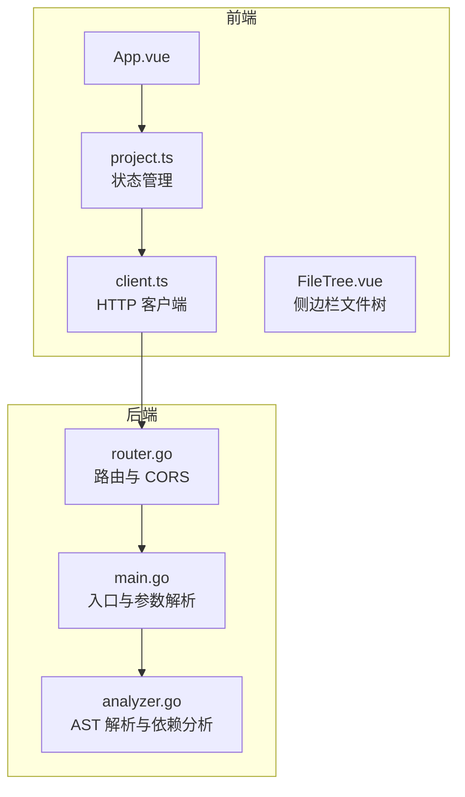
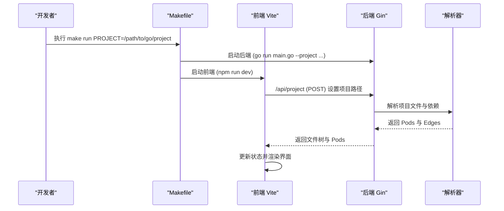
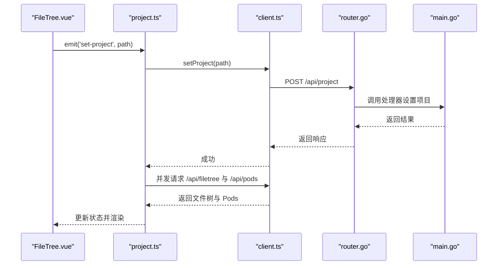
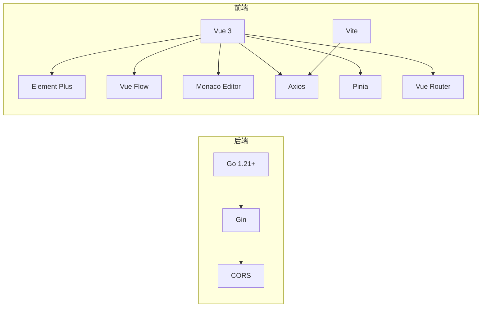

# 快速开始

<cite>
**本文引用的文件**
- [README.md](file://README.md)
- [README_CN.md](file://README_CN.md)
- [Makefile](file://Makefile)
- [backend/main.go](file://backend/main.go)
- [backend/internal/api/router.go](file://backend/internal/api/router.go)
- [backend/go.mod](file://backend/go.mod)
- [backend/internal/parser/analyzer.go](file://backend/internal/parser/analyzer.go)
- [frontend/package.json](file://frontend/package.json)
- [frontend/vite.config.ts](file://frontend/vite.config.ts)
- [frontend/src/main.ts](file://frontend/src/main.ts)
- [frontend/src/api/client.ts](file://frontend/src/api/client.ts)
- [frontend/src/stores/project.ts](file://frontend/src/stores/project.ts)
- [frontend/src/App.vue](file://frontend/src/App.vue)
- [frontend/src/components/FileTree/FileTree.vue](file://frontend/src/components/FileTree/FileTree.vue)
</cite>

## 目录
1. [简介](#简介)
2. [项目结构](#项目结构)
3. [核心组件](#核心组件)
4. [架构总览](#架构总览)
5. [详细组件分析](#详细组件分析)
6. [依赖分析](#依赖分析)
7. [性能考虑](#性能考虑)
8. [故障排除指南](#故障排除指南)
9. [结论](#结论)
10. [附录](#附录)

## 简介
本指南面向新用户，帮助你在 5 分钟内成功运行 GoPodView，并加载本地 Go 项目进行可视化分析。你将学到：
- 环境要求与依赖安装
- 一键启动与分别启动两种方式
- 通过命令行参数或 Web 界面加载项目
- 常见问题与故障排除

## 项目结构
GoPodView 采用前后端分离架构：
- 后端：Go + Gin，提供 REST API，负责扫描与解析 Go 项目，构建 Pod/Container 依赖图
- 前端：Vue 3 + TypeScript + Vite，提供交互式图形界面与代码查看器

图表来源
- [frontend/src/App.vue:1-125](file://frontend/src/App.vue#L1-L125)
- [frontend/src/stores/project.ts:1-476](file://frontend/src/stores/project.ts#L1-L476)
- [frontend/src/api/client.ts:1-53](file://frontend/src/api/client.ts#L1-L53)
- [frontend/src/components/FileTree/FileTree.vue:1-201](file://frontend/src/components/FileTree/FileTree.vue#L1-L201)
- [backend/main.go:1-31](file://backend/main.go#L1-L31)
- [backend/internal/api/router.go:1-32](file://backend/internal/api/router.go#L1-L32)
- [backend/internal/parser/analyzer.go:1-236](file://backend/internal/parser/analyzer.go#L1-L236)

章节来源
- [README.md:52-66](file://README.md#L52-L66)
- [README_CN.md:54-67](file://README_CN.md#L54-L67)

## 核心组件
- 后端入口与参数
  - 支持通过命令行参数设置项目路径与端口
  - 启动时打印服务地址与项目信息
- 前端应用与状态
  - 使用 Pinia 管理全局状态（项目路径、文件树、Pod/Container、视图层级等）
  - Axios 封装统一 API 客户端，代理 /api 到后端
- 路由与跨域
  - Gin 路由组 /api，允许前端 localhost:5173 访问
- 解析器
  - 基于 go/ast/go/parser 构建 Pod（文件）与 Container（函数/结构体/接口等）的索引与依赖关系

章节来源
- [backend/main.go:11-30](file://backend/main.go#L11-L30)
- [frontend/src/main.ts:1-12](file://frontend/src/main.ts#L1-L12)
- [frontend/src/api/client.ts:10-13](file://frontend/src/api/client.ts#L10-L13)
- [backend/internal/api/router.go:8-31](file://backend/internal/api/router.go#L8-L31)
- [backend/internal/parser/analyzer.go:13-39](file://backend/internal/parser/analyzer.go#L13-L39)

## 架构总览
下面的序列图展示了从启动到加载项目的典型流程。

图表来源
- [Makefile:6-18](file://Makefile#L6-L18)
- [backend/main.go:11-30](file://backend/main.go#L11-L30)
- [backend/internal/api/router.go:21-28](file://backend/internal/api/router.go#L21-L28)
- [frontend/src/api/client.ts:15-18](file://frontend/src/api/client.ts#L15-L18)
- [frontend/src/stores/project.ts:57-76](file://frontend/src/stores/project.ts#L57-L76)
- [backend/internal/parser/analyzer.go:27-39](file://backend/internal/parser/analyzer.go#L27-L39)

## 详细组件分析

### 启动方式一：一键启动（推荐）
- 环境要求
  - Make、Go、Node.js
- 步骤
  - 在项目根目录执行一键启动命令，指定你的 Go 项目路径
  - 后端默认监听 8080，前端默认监听 5173
  - 浏览器访问 http://localhost:5173
- 示例命令与预期输出
  - 命令：make run PROJECT=/path/to/your/go/project
  - 预期输出：后端与前端分别启动，终端打印服务地址与项目路径
  - 浏览器：出现界面，输入框可加载项目或从侧边栏选择文件

章节来源
- [README.md:52-66](file://README.md#L52-L66)
- [README_CN.md:54-67](file://README_CN.md#L54-L67)
- [Makefile:6-18](file://Makefile#L6-L18)

### 启动方式二：分别启动后端与前端
- 后端启动
  - 进入 backend 目录，运行 go run main.go --project /path/to/your/go/project --port 8080
  - 预期输出：后端启动日志，打印服务地址与分析项目路径
- 前端启动
  - 进入 frontend 目录，先安装依赖再启动开发服务器
  - 预期输出：Vite 启动完成，浏览器访问 http://localhost:5173
- 注意
  - 前端通过 Vite 代理 /api 到后端 8080 端口
  - 若端口冲突，请调整后端端口并在前端配置中保持一致

章节来源
- [README.md:58-61](file://README.md#L58-L61)
- [README_CN.md:60-63](file://README_CN.md#L60-L63)
- [backend/main.go:11-30](file://backend/main.go#L11-L30)
- [frontend/vite.config.ts:6-13](file://frontend/vite.config.ts#L6-L13)

### 加载本地 Go 项目（两种方式）
- 方式一：命令行参数
  - 后端启动时通过 --project 指定项目路径
  - 后端启动后，前端自动连接并加载数据
- 方式二：Web 界面
  - 在左侧输入框中输入项目路径，点击 Load
  - 前端调用 /api/project 设置项目，随后拉取文件树与 Pods
- 交互流程
  - 前端 store 调用 setProject，随后并发请求文件树与 Pods
  - 界面根据返回数据渲染文件树与图谱

图表来源
- [frontend/src/components/FileTree/FileTree.vue:30-48](file://frontend/src/components/FileTree/FileTree.vue#L30-L48)
- [frontend/src/stores/project.ts:57-76](file://frontend/src/stores/project.ts#L57-L76)
- [frontend/src/api/client.ts:15-28](file://frontend/src/api/client.ts#L15-L28)
- [backend/internal/api/router.go:21-22](file://backend/internal/api/router.go#L21-L22)
- [backend/main.go:16-25](file://backend/main.go#L16-L25)

章节来源
- [README.md:65-66](file://README.md#L65-L66)
- [README_CN.md:67-67](file://README_CN.md#L67-L67)
- [frontend/src/components/FileTree/FileTree.vue:43-48](file://frontend/src/components/FileTree/FileTree.vue#L43-L48)
- [frontend/src/stores/project.ts:57-76](file://frontend/src/stores/project.ts#L57-L76)

### 关键 API 一览
- /api/project (POST)：设置要分析的项目路径
- /api/filetree (GET)：获取项目文件树
- /api/pods (GET)：获取所有 Pods 与依赖边
- /api/pod/:path (GET)：获取单个 Pod 详情
- /api/containers/:path (GET)：获取 Pod 内所有 Container（含源码）
- /api/container/:path?name= (GET)：获取单个 Container
- /api/dependencies/:path?depth= (GET)：获取 N 级依赖

章节来源
- [README.md:67-78](file://README.md#L67-L78)
- [README_CN.md:69-79](file://README_CN.md#L69-L79)
- [backend/internal/api/router.go:21-28](file://backend/internal/api/router.go#L21-L28)

## 依赖分析
- 后端依赖
  - Gin：Web 框架
  - Gin-CORS：跨域支持
- 前端依赖
  - Vue 3、Element Plus、Vue Flow、Monaco Editor、Axios、Pinia、Vue Router
  - Vite：开发服务器与代理
- 版本与工具
  - Go 1.21+
  - Node.js（满足前端依赖）
  - Make（一键启动）

图表来源
- [backend/go.mod:5-8](file://backend/go.mod#L5-L8)
- [frontend/package.json:11-23](file://frontend/package.json#L11-L23)
- [frontend/vite.config.ts:1-15](file://frontend/vite.config.ts#L1-L15)

章节来源
- [backend/go.mod:3-8](file://backend/go.mod#L3-L8)
- [frontend/package.json:1-33](file://frontend/package.json#L1-L33)
- [Makefile:1-4](file://Makefile#L1-L4)

## 性能考虑
- 并发加载：前端在设置项目后并发请求文件树与 Pods，减少等待时间
- 懒加载容器源码：仅在展开 Pod 时请求容器源码，避免一次性加载全部内容
- 依赖深度控制：通过 /api/dependencies?depth= 控制依赖层级，降低渲染压力
- 建议
  - 对大型项目，优先使用“聚焦视图”与“展开视图”，避免一次性渲染过多节点
  - 合理设置依赖深度，平衡信息密度与性能

章节来源
- [frontend/src/stores/project.ts:63-66](file://frontend/src/stores/project.ts#L63-L66)
- [frontend/src/stores/project.ts:249-258](file://frontend/src/stores/project.ts#L249-L258)
- [backend/internal/api/router.go:27-27](file://backend/internal/api/router.go#L27-L27)

## 故障排除指南
- 后端无法启动
  - 检查 Go 版本是否满足要求（Go 1.21+）
  - 确认项目路径存在且可读
  - 查看后端启动日志中的错误信息
- 前端无法访问后端
  - 确认前端代理配置指向后端地址（默认 8080）
  - 检查浏览器网络面板，确认 /api 请求被正确转发
- CORS 错误
  - 后端已启用 CORS，允许前端 localhost:5173 访问
  - 如自定义前端端口，请在后端 CORS 配置中添加对应 Origin
- 项目加载失败
  - 确认通过 /api/project 设置了正确的项目路径
  - 检查后端日志中是否报告解析错误
- 端口占用
  - 默认后端端口 8080，前端端口 5173
  - 使用 make run 时可通过 PORT 参数调整后端端口
  - 修改后需同步前端代理目标端口

章节来源
- [backend/go.mod:3-3](file://backend/go.mod#L3-L3)
- [backend/main.go:20-25](file://backend/main.go#L20-L25)
- [frontend/vite.config.ts:6-13](file://frontend/vite.config.ts#L6-L13)
- [backend/internal/api/router.go:12-17](file://backend/internal/api/router.go#L12-L17)
- [frontend/src/api/client.ts:15-18](file://frontend/src/api/client.ts#L15-L18)

## 结论
按照本指南，你可以快速完成环境准备、启动后端与前端，并加载本地 Go 项目进行可视化探索。建议优先使用一键启动命令，若需调试或定制，可分别启动后端与前端。遇到问题时，结合本指南的故障排除部分逐步排查。

## 附录
- 环境要求
  - Go 1.21+
  - Node.js（满足前端依赖）
  - Make（可选，用于一键启动）
- 常用命令
  - 一键启动：make run PROJECT=/path/to/your/go/project
  - 分别启动：cd backend && go run main.go --project /path/to/your/go/project --port 8080；cd frontend && npm install && npm run dev
  - 浏览器访问：http://localhost:5173

章节来源
- [README.md:52-66](file://README.md#L52-L66)
- [README_CN.md:54-67](file://README_CN.md#L54-L67)
- [Makefile:6-18](file://Makefile#L6-L18)