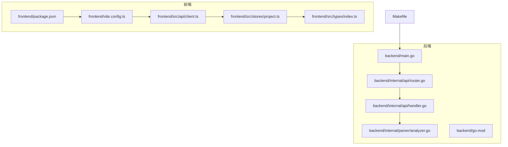
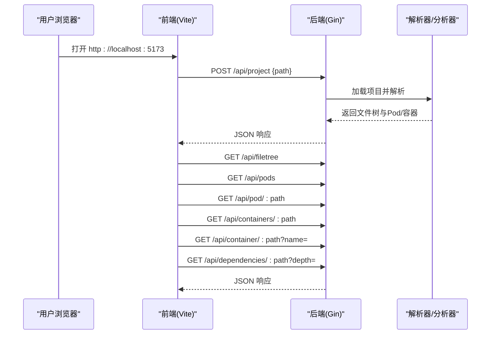
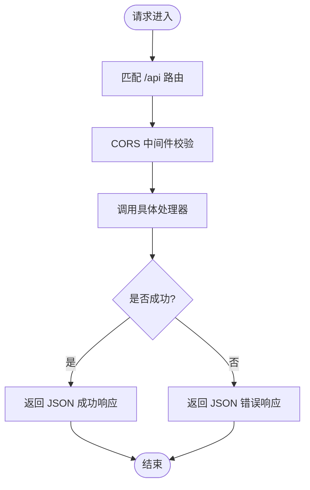
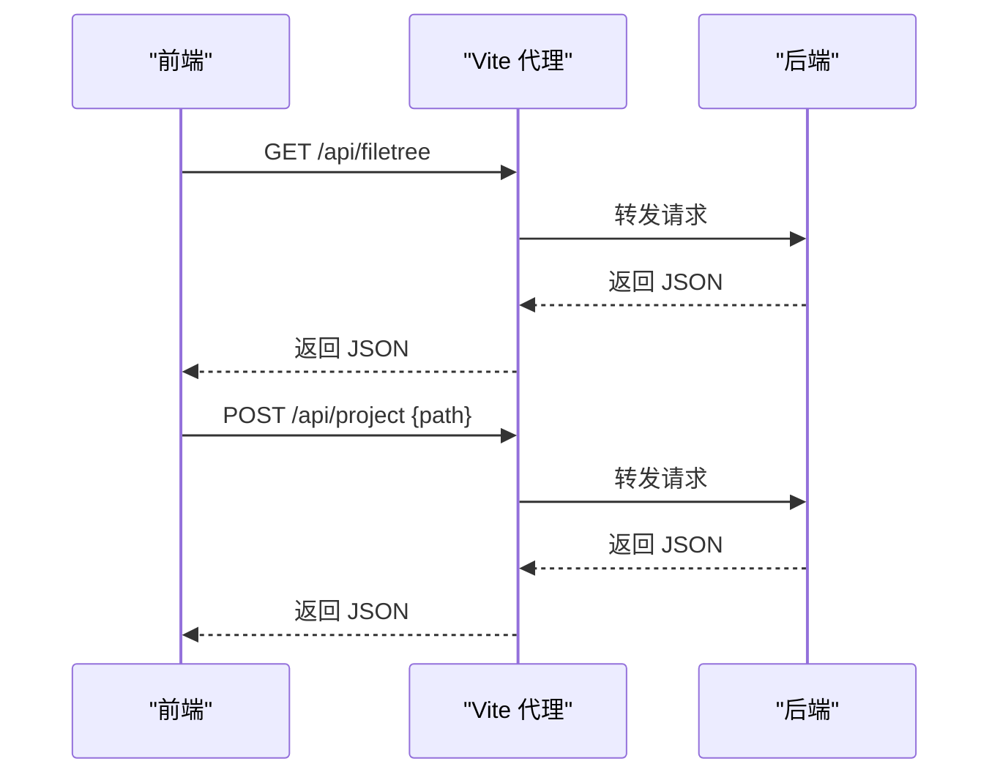
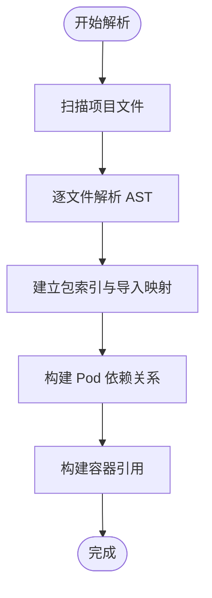
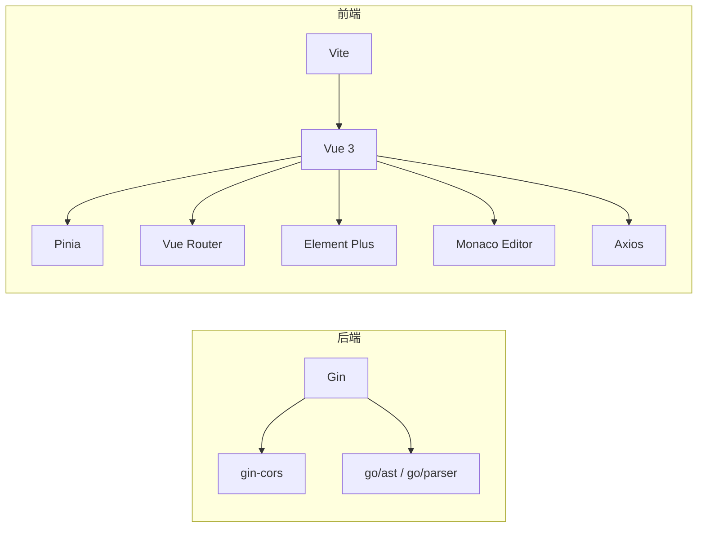

# 故障排除

<cite>
**本文引用的文件**
- [README.md](file://README.md)
- [README_CN.md](file://README_CN.md)
- [Makefile](file://Makefile)
- [backend/main.go](file://backend/main.go)
- [backend/internal/api/router.go](file://backend/internal/api/router.go)
- [backend/internal/api/handler.go](file://backend/internal/api/handler.go)
- [backend/internal/parser/analyzer.go](file://backend/internal/parser/analyzer.go)
- [backend/go.mod](file://backend/go.mod)
- [frontend/package.json](file://frontend/package.json)
- [frontend/vite.config.ts](file://frontend/vite.config.ts)
- [frontend/src/api/client.ts](file://frontend/src/api/client.ts)
- [frontend/src/stores/project.ts](file://frontend/src/stores/project.ts)
- [frontend/src/types/index.ts](file://frontend/src/types/index.ts)
</cite>

## 目录
1. [简介](#简介)
2. [项目结构](#项目结构)
3. [核心组件](#核心组件)
4. [架构总览](#架构总览)
5. [详细组件分析](#详细组件分析)
6. [依赖分析](#依赖分析)
7. [性能考虑](#性能考虑)
8. [故障排除指南](#故障排除指南)
9. [结论](#结论)
10. [附录](#附录)

## 简介
本指南面向 GoPodView 用户与维护者，提供系统化的安装、配置与运行问题排查方法，涵盖日志分析、网络连接检查、权限问题排查、错误信息解读、性能识别与优化建议，并给出社区支持与问题反馈渠道。目标是帮助用户独立解决常见问题，降低技术支持负担。

## 项目结构
GoPodView 采用前后端分离架构：后端使用 Go + Gin 提供 REST API；前端使用 Vue 3 + Vite，通过代理访问后端 API；构建与运行可通过 Makefile 一键完成。

图表来源
- [backend/main.go:1-31](file://backend/main.go#L1-L31)
- [backend/internal/api/router.go:1-32](file://backend/internal/api/router.go#L1-L32)
- [backend/internal/api/handler.go:1-225](file://backend/internal/api/handler.go#L1-L225)
- [backend/internal/parser/analyzer.go:1-236](file://backend/internal/parser/analyzer.go#L1-L236)
- [backend/go.mod:1-39](file://backend/go.mod#L1-L39)
- [frontend/package.json:1-33](file://frontend/package.json#L1-L33)
- [frontend/vite.config.ts:1-15](file://frontend/vite.config.ts#L1-L15)
- [frontend/src/api/client.ts:1-53](file://frontend/src/api/client.ts#L1-L53)
- [frontend/src/stores/project.ts:1-476](file://frontend/src/stores/project.ts#L1-L476)
- [frontend/src/types/index.ts:1-74](file://frontend/src/types/index.ts#L1-L74)
- [Makefile:1-37](file://Makefile#L1-L37)

章节来源
- [README.md:79-104](file://README.md#L79-L104)
- [README_CN.md:81-107](file://README_CN.md#L81-L107)
- [Makefile:1-37](file://Makefile#L1-L37)

## 核心组件
- 后端入口与路由
  - 后端入口负责解析命令行参数、初始化处理器与路由，并启动 HTTP 服务。
  - 路由层启用 CORS 并注册 /api 前缀下的全部端点。
- 处理器与业务逻辑
  - 处理器封装项目加载、文件树、Pod 列表、容器详情、依赖查询等接口。
  - 使用读写锁保护共享数据，避免并发访问冲突。
- 解析器与分析器
  - 解析器负责扫描项目、解析 AST、建立 Pod 与容器索引。
  - 分析器负责构建包索引、依赖关系与容器引用。
- 前端客户端与状态管理
  - Axios 客户端统一发起 /api 请求，设置基础路径与超时。
  - Pinia 状态管理负责项目加载、视图状态、导航历史、浮动标签页等。

章节来源
- [backend/main.go:11-30](file://backend/main.go#L11-L30)
- [backend/internal/api/router.go:8-31](file://backend/internal/api/router.go#L8-L31)
- [backend/internal/api/handler.go:15-29](file://backend/internal/api/handler.go#L15-L29)
- [backend/internal/parser/analyzer.go:13-25](file://backend/internal/parser/analyzer.go#L13-L25)
- [frontend/src/api/client.ts:10-13](file://frontend/src/api/client.ts#L10-L13)
- [frontend/src/stores/project.ts:14-476](file://frontend/src/stores/project.ts#L14-L476)

## 架构总览
后端与前端通过本地代理通信，前端通过 /api 前缀访问后端接口；后端解析 Go 项目并返回结构化数据，前端负责渲染与交互。

图表来源
- [frontend/vite.config.ts:6-13](file://frontend/vite.config.ts#L6-L13)
- [frontend/src/api/client.ts:15-52](file://frontend/src/api/client.ts#L15-L52)
- [backend/internal/api/router.go:19-28](file://backend/internal/api/router.go#L19-L28)
- [backend/internal/api/handler.go:56-75](file://backend/internal/api/handler.go#L56-L75)
- [backend/internal/api/handler.go:77-124](file://backend/internal/api/handler.go#L77-L124)
- [backend/internal/api/handler.go:126-152](file://backend/internal/api/handler.go#L126-L152)
- [backend/internal/api/handler.go:154-175](file://backend/internal/api/handler.go#L154-L175)
- [backend/internal/api/handler.go:177-209](file://backend/internal/api/handler.go#L177-L209)

## 详细组件分析

### 后端路由与错误响应
- CORS 配置允许前端 localhost:5173 与 localhost:3000 访问，支持跨域请求。
- /api 前缀下提供项目设置、文件树、Pod、容器、依赖查询等接口。
- 错误响应遵循统一格式，便于前端识别与提示。

图表来源
- [backend/internal/api/router.go:8-31](file://backend/internal/api/router.go#L8-L31)
- [backend/internal/api/handler.go:56-75](file://backend/internal/api/handler.go#L56-L75)
- [backend/internal/api/handler.go:77-86](file://backend/internal/api/handler.go#L77-L86)
- [backend/internal/api/handler.go:93-124](file://backend/internal/api/handler.go#L93-L124)
- [backend/internal/api/handler.go:126-138](file://backend/internal/api/handler.go#L126-L138)
- [backend/internal/api/handler.go:140-152](file://backend/internal/api/handler.go#L140-L152)
- [backend/internal/api/handler.go:154-175](file://backend/internal/api/handler.go#L154-L175)
- [backend/internal/api/handler.go:177-209](file://backend/internal/api/handler.go#L177-L209)

章节来源
- [backend/internal/api/router.go:8-31](file://backend/internal/api/router.go#L8-L31)
- [backend/internal/api/handler.go:56-209](file://backend/internal/api/handler.go#L56-L209)

### 前端代理与 API 客户端
- Vite 代理将 /api 请求转发至 http://localhost:8080，避免跨域问题。
- Axios 客户端设置 baseURL 为 /api，统一超时时间，便于集中处理错误。
- 前端状态管理在加载项目时并行拉取文件树与 Pod 列表，提升首屏体验。

图表来源
- [frontend/vite.config.ts:6-13](file://frontend/vite.config.ts#L6-L13)
- [frontend/src/api/client.ts:10-13](file://frontend/src/api/client.ts#L10-L13)
- [frontend/src/stores/project.ts:57-76](file://frontend/src/stores/project.ts#L57-L76)

章节来源
- [frontend/vite.config.ts:1-15](file://frontend/vite.config.ts#L1-L15)
- [frontend/src/api/client.ts:1-53](file://frontend/src/api/client.ts#L1-L53)
- [frontend/src/stores/project.ts:57-92](file://frontend/src/stores/project.ts#L57-L92)

### 解析器与分析器流程
- 解析器扫描项目并逐文件解析，建立 Pod 与容器索引。
- 分析器构建包索引、Pod 依赖关系与容器引用，支持跨文件引用定位。

图表来源
- [backend/internal/parser/analyzer.go:27-39](file://backend/internal/parser/analyzer.go#L27-L39)
- [backend/internal/parser/analyzer.go:41-53](file://backend/internal/parser/analyzer.go#L41-L53)
- [backend/internal/parser/analyzer.go:59-81](file://backend/internal/parser/analyzer.go#L59-L81)
- [backend/internal/parser/analyzer.go:100-134](file://backend/internal/parser/analyzer.go#L100-L134)

章节来源
- [backend/internal/parser/analyzer.go:1-236](file://backend/internal/parser/analyzer.go#L1-L236)

## 依赖分析
- 后端依赖
  - Gin 用于 HTTP 路由与中间件；gin-cors 用于跨域配置。
  - go/ast、go/parser 用于 Go 源码解析。
- 前端依赖
  - Vue 3、Pinia、Vue Router、Element Plus、Monaco Editor、Axios 等。
  - Vite 作为开发服务器与打包工具。

图表来源
- [backend/go.mod:5-8](file://backend/go.mod#L5-L8)
- [frontend/package.json:11-22](file://frontend/package.json#L11-L22)
- [frontend/vite.config.ts:1-15](file://frontend/vite.config.ts#L1-L15)

章节来源
- [backend/go.mod:1-39](file://backend/go.mod#L1-L39)
- [frontend/package.json:1-33](file://frontend/package.json#L1-L33)

## 性能考虑
- 并行加载
  - 前端在设置项目后并行请求文件树与 Pod 列表，减少等待时间。
- 懒加载源码
  - 仅在展开 Pod 或跳转容器时请求容器源码，避免一次性加载全部内容。
- 依赖深度限制
  - 依赖查询默认深度为 1，最大限制为 10，防止过深遍历导致性能问题。
- 缓存与去重
  - 依赖构建时对重复路径进行去重，避免重复计算。

章节来源
- [frontend/src/stores/project.ts:63-66](file://frontend/src/stores/project.ts#L63-L66)
- [frontend/src/stores/project.ts:249-258](file://frontend/src/stores/project.ts#L249-L258)
- [backend/internal/api/handler.go:182-189](file://backend/internal/api/handler.go#L182-L189)
- [backend/internal/parser/analyzer.go:228-235](file://backend/internal/parser/analyzer.go#L228-L235)

## 故障排除指南

### 一、安装与环境准备
- 必需工具
  - 需要 Make、Go、Node.js 环境；Makefile 提供一键启动脚本。
  - 后端使用 Go 1.21；前端使用 Node 与 npm。
- 依赖安装
  - 后端：执行 go mod tidy。
  - 前端：执行 npm install。
- 常见问题
  - 缺少 Make：无法使用 make run，请分别启动后端与前端。
  - Go 版本不兼容：升级到 1.21 或以上。
  - Node/npm 不可用：安装 Node.js 并确保 npm 可用。

章节来源
- [README.md:52-66](file://README.md#L52-L66)
- [README_CN.md:54-67](file://README_CN.md#L54-L67)
- [Makefile:30-36](file://Makefile#L30-L36)
- [backend/go.mod:3](file://backend/go.mod#L3)
- [frontend/package.json:1-33](file://frontend/package.json#L1-L33)

### 二、启动与端口占用
- 后端默认端口 8080，前端默认端口 5173。
- 若端口被占用，可通过命令行参数或 Makefile 环境变量调整端口。
- 启动顺序
  - 使用 make run 时，后端与前端并行启动；若失败，分别启动后端与前端排查。

章节来源
- [backend/main.go:12-14](file://backend/main.go#L12-L14)
- [Makefile:1-18](file://Makefile#L1-L18)

### 三、跨域与代理问题
- 前端代理配置将 /api 转发至 http://localhost:8080。
- 后端 CORS 允许 http://localhost:5173 与 http://localhost:3000。
- 常见症状
  - 浏览器报跨域错误：确认前端代理与后端 CORS 配置一致。
  - 404 或代理未生效：检查 Vite 代理配置与后端监听地址。

章节来源
- [frontend/vite.config.ts:6-13](file://frontend/vite.config.ts#L6-L13)
- [backend/internal/api/router.go:12-17](file://backend/internal/api/router.go#L12-L17)

### 四、项目加载与路径问题
- 通过 /api/project 设置项目路径，或在 UI 输入框中点击 Load。
- 常见错误
  - 400 错误：请求体缺失或格式不正确。
  - 500 错误：解析项目失败，检查路径是否存在且可读。
- 建议
  - 使用绝对路径；确保路径指向 Go 项目根目录。
  - 检查项目权限与依赖完整性（如 go.mod/go.sum）。

章节来源
- [backend/internal/api/handler.go:56-75](file://backend/internal/api/handler.go#L56-L75)
- [backend/internal/api/router.go:21](file://backend/internal/api/router.go#L21)
- [README.md:67-78](file://README.md#L67-L78)
- [README_CN.md:69-79](file://README_CN.md#L69-L79)

### 五、接口调用与数据异常
- 文件树为空：确认已设置有效项目路径。
- Pods/依赖为空：检查解析过程是否成功，关注后端日志。
- 容器详情缺失：前端会在展开时懒加载源码，确认网络可达。
- 依赖查询深度异常：depth 参数会被限制在 1~10，默认 1。

章节来源
- [backend/internal/api/handler.go:77-86](file://backend/internal/api/handler.go#L77-L86)
- [backend/internal/api/handler.go:93-124](file://backend/internal/api/handler.go#L93-L124)
- [backend/internal/api/handler.go:177-209](file://backend/internal/api/handler.go#L177-L209)
- [frontend/src/stores/project.ts:249-258](file://frontend/src/stores/project.ts#L249-L258)

### 六、日志分析与错误定位
- 后端日志
  - 启动信息：监听地址与项目路径。
  - 错误信息：服务器启动失败、项目加载失败、解析失败等。
- 前端日志
  - 控制台错误：网络请求失败、JSON 解析异常、组件渲染错误。
  - 网络面板：检查 /api 请求状态码与响应体。
- 建议
  - 后端开启详细日志（默认 Release 模式），必要时临时切换为 Debug。
  - 前端开启浏览器开发者工具 Network 面板，观察请求与响应。

章节来源
- [backend/main.go:20-29](file://backend/main.go#L20-L29)
- [frontend/src/api/client.ts:10-13](file://frontend/src/api/client.ts#L10-L13)

### 七、权限与安全
- 文件系统权限
  - 确保用户对目标 Go 项目具有读取权限。
  - 避免在受保护目录下运行，必要时使用 sudo 或调整目录权限。
- CORS 与凭据
  - 后端允许 Credentials，前端代理需正确配置 changeOrigin。
- 生产部署建议
  - 限制允许的 Origin，避免通配符暴露风险。

章节来源
- [backend/internal/api/router.go:12-17](file://backend/internal/api/router.go#L12-L17)
- [frontend/vite.config.ts:10](file://frontend/vite.config.ts#L10)

### 八、性能问题识别与优化
- 症状
  - 页面卡顿、长时间无响应、CPU 占用高。
- 可能原因
  - 项目规模过大、依赖层级过深、一次性请求过多数据。
- 优化建议
  - 减少依赖查询深度（depth ≤ 3）。
  - 使用“聚焦视图”缩小分析范围。
  - 关闭不必要的浮动标签页，减少 DOM 与内存占用。
  - 清理缓存与重新加载项目。

章节来源
- [backend/internal/api/handler.go:182-189](file://backend/internal/api/handler.go#L182-L189)
- [frontend/src/stores/project.ts:311-313](file://frontend/src/stores/project.ts#L311-L313)

### 九、常见错误信息与解决措施
- “no project loaded”
  - 含义：尚未设置有效项目路径。
  - 解决：先调用 /api/project 设置路径，再请求其他接口。
- “pod not found”
  - 含义：请求的 Pod 路径不存在。
  - 解决：确认路径正确且已在项目中存在。
- “container not found”
  - 含义：指定容器名称在目标 Pod 中不存在。
  - 解决：核对容器名与 Pod 路径。
- “Failed to start server”
  - 含义：后端启动失败（端口占用、权限不足等）。
  - 解决：更换端口、检查权限、查看系统日志。

章节来源
- [backend/internal/api/handler.go:81-85](file://backend/internal/api/handler.go#L81-L85)
- [backend/internal/api/handler.go:132-135](file://backend/internal/api/handler.go#L132-L135)
- [backend/internal/api/handler.go:173-175](file://backend/internal/api/handler.go#L173-L175)
- [backend/main.go:27-29](file://backend/main.go#L27-L29)

### 十、网络连接检查清单
- 本地连通性
  - curl http://localhost:8080/api/pods 检查后端可达。
  - 浏览器打开 http://localhost:5173 检查前端代理。
- 代理与 CORS
  - 确认 Vite 代理将 /api 转发到后端。
  - 确认后端允许前端 Origin。
- DNS 与防火墙
  - 避免代理或防火墙拦截本地回环地址。

章节来源
- [frontend/vite.config.ts:6-13](file://frontend/vite.config.ts#L6-L13)
- [backend/internal/api/router.go:12-17](file://backend/internal/api/router.go#L12-L17)

### 十一、社区支持与问题反馈
- 文档与示例
  - 参考项目 README 与截图了解功能与使用方式。
- 反馈渠道
  - 通过项目仓库 Issues 提交问题，附带：
    - 环境信息（操作系统、Go 版本、Node 版本、浏览器版本）
    - 复现步骤与期望结果
    - 后端与前端日志片段
    - 项目规模与关键依赖情况

章节来源
- [README.md:1-109](file://README.md#L1-L109)
- [README_CN.md:1-112](file://README_CN.md#L1-L112)

## 结论
通过本指南，用户可以系统地排查 GoPodView 的安装、配置与运行问题，理解前后端交互与错误响应机制，并掌握性能优化与社区支持渠道。建议在日常使用中结合日志与网络面板进行快速定位，优先采用最小复现方案进行问题验证。

## 附录

### A. 快速自检清单
- 环境与依赖
  - Make、Go、Node.js 是否可用？
  - 后端 go.mod、前端 package.json 是否完整？
- 启动与端口
  - 后端 8080、前端 5173 是否被占用？
  - make run 是否能并行启动？
- 代理与 CORS
  - Vite 代理是否将 /api 转发到后端？
  - 后端是否允许前端 Origin？
- 项目路径
  - /api/project 是否返回成功？
  - /api/filetree 与 /api/pods 是否有数据？

章节来源
- [Makefile:1-18](file://Makefile#L1-L18)
- [frontend/vite.config.ts:6-13](file://frontend/vite.config.ts#L6-L13)
- [backend/internal/api/router.go:12-17](file://backend/internal/api/router.go#L12-L17)
- [backend/internal/api/handler.go:56-86](file://backend/internal/api/handler.go#L56-L86)