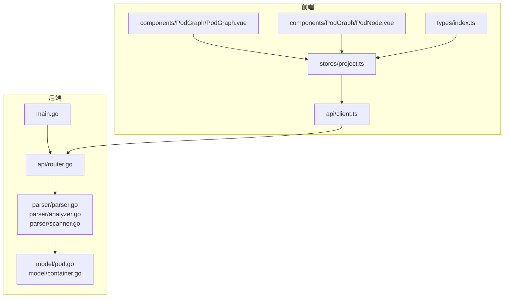
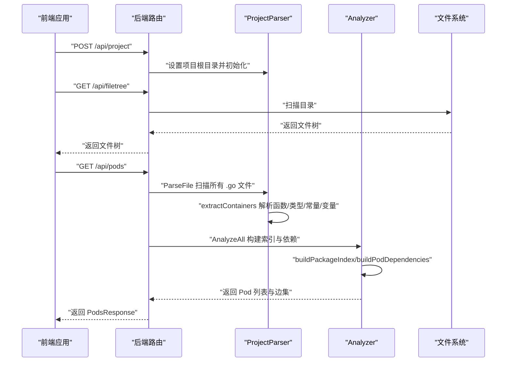
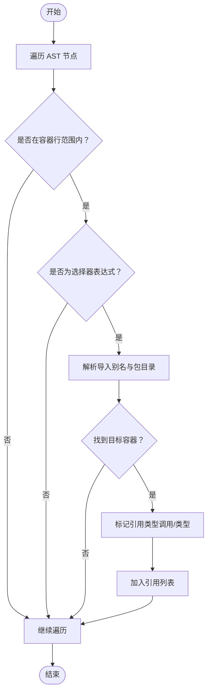
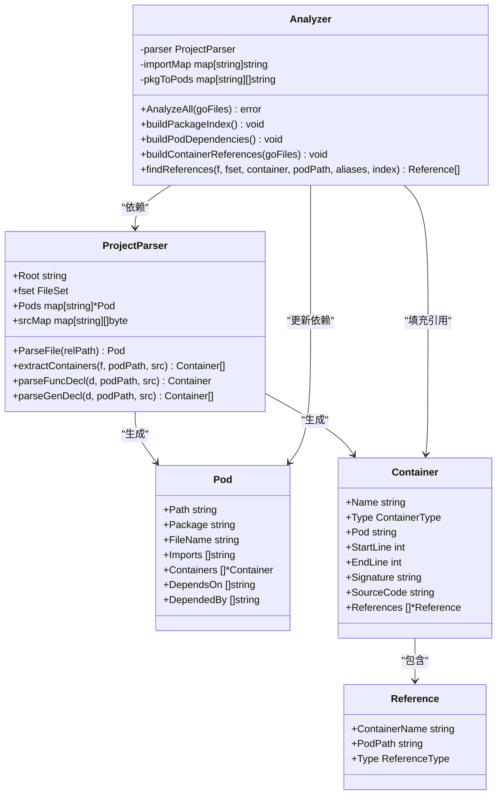
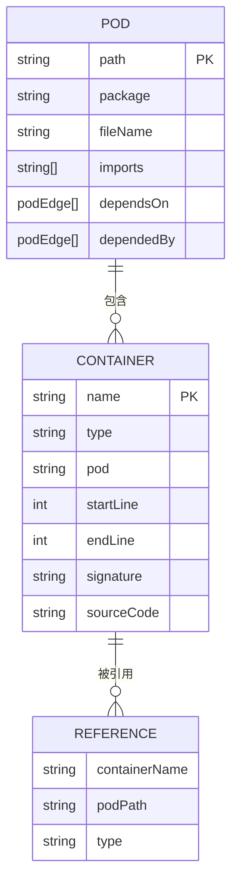
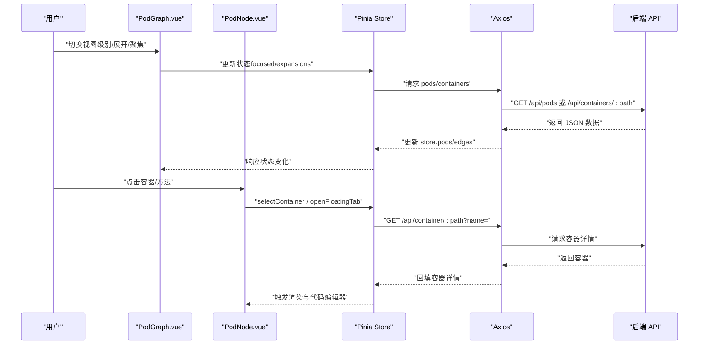
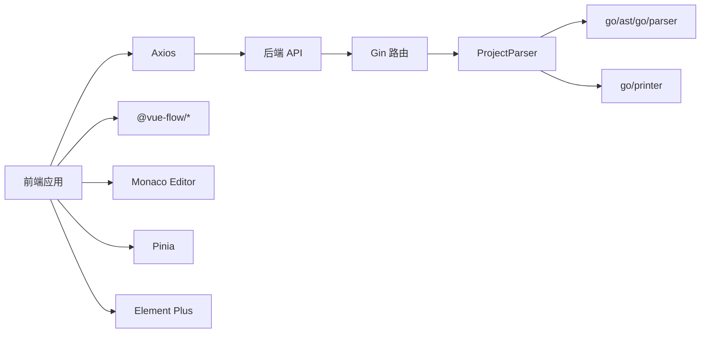

# 数据模型

<cite>
**本文引用的文件**
- [backend/internal/model/pod.go](file://backend/internal/model/pod.go)
- [backend/internal/model/container.go](file://backend/internal/model/container.go)
- [backend/internal/parser/parser.go](file://backend/internal/parser/parser.go)
- [backend/internal/parser/analyzer.go](file://backend/internal/parser/analyzer.go)
- [backend/internal/parser/scanner.go](file://backend/internal/parser/scanner.go)
- [backend/internal/api/router.go](file://backend/internal/api/router.go)
- [backend/main.go](file://backend/main.go)
- [frontend/src/types/index.ts](file://frontend/src/types/index.ts)
- [frontend/src/stores/project.ts](file://frontend/src/stores/project.ts)
- [frontend/src/components/PodGraph/PodGraph.vue](file://frontend/src/components/PodGraph/PodGraph.vue)
- [frontend/src/components/PodGraph/PodNode.vue](file://frontend/src/components/PodGraph/PodNode.vue)
- [frontend/src/api/client.ts](file://frontend/src/api/client.ts)
- [backend/go.mod](file://backend/go.mod)
- [frontend/package.json](file://frontend/package.json)
- [README.md](file://README.md)
</cite>

## 目录
1. [引言](#引言)
2. [项目结构](#项目结构)
3. [核心组件](#核心组件)
4. [架构总览](#架构总览)
5. [详细组件分析](#详细组件分析)
6. [依赖分析](#依赖分析)
7. [性能考虑](#性能考虑)
8. [故障排查指南](#故障排查指南)
9. [结论](#结论)
10. [附录](#附录)

## 引言
本文件系统性阐述 GoPodView 的数据模型与实现，重点围绕后端模型与前端类型之间的映射关系，解析 Pod 与 Container 的结构设计、字段语义、关系映射与可视化支撑，并说明序列化/反序列化与持久化策略、数据验证与约束、业务逻辑与演进方向。

## 项目结构
- 后端采用 Go 语言，基于 go/ast 与 go/parser 进行源码扫描与解析，生成 Pod/Container 模型并通过 Gin 提供 REST 接口。
- 前端采用 Vue 3 + TypeScript，通过 Pinia 管理状态，Axios 访问后端接口，使用 Monaco Editor 展示代码，Vue Flow 渲染依赖图。

**图表来源**
- [backend/internal/model/pod.go:1-19](file://backend/internal/model/pod.go#L1-L19)
- [backend/internal/model/container.go:1-37](file://backend/internal/model/container.go#L1-L37)
- [backend/internal/parser/parser.go:1-253](file://backend/internal/parser/parser.go#L1-L253)
- [backend/internal/parser/analyzer.go:1-236](file://backend/internal/parser/analyzer.go#L1-L236)
- [backend/internal/parser/scanner.go:1-113](file://backend/internal/parser/scanner.go#L1-L113)
- [backend/internal/api/router.go:1-32](file://backend/internal/api/router.go#L1-L32)
- [backend/main.go:1-31](file://backend/main.go#L1-L31)
- [frontend/src/types/index.ts:1-74](file://frontend/src/types/index.ts#L1-L74)
- [frontend/src/stores/project.ts:1-476](file://frontend/src/stores/project.ts#L1-L476)
- [frontend/src/components/PodGraph/PodGraph.vue:1-581](file://frontend/src/components/PodGraph/PodGraph.vue#L1-L581)
- [frontend/src/components/PodGraph/PodNode.vue:1-425](file://frontend/src/components/PodGraph/PodNode.vue#L1-L425)
- [frontend/src/api/client.ts:1-53](file://frontend/src/api/client.ts#L1-L53)

**章节来源**
- [README.md:79-104](file://README.md#L79-L104)

## 核心组件
- Pod：代表一个 Go 源文件（包内），包含路径、包名、文件名、导入列表、容器集合、依赖与其他被依赖的 Pod 集合。
- Container：代表源文件内的声明实体（函数、结构体、接口、常量、变量），包含名称、类型、所在 Pod 路径、起止行号、签名、可选源码片段、引用列表。
- Reference：表示容器间的引用关系，包含目标容器名、目标 Pod 路径、引用类型（调用或类型引用）。

这些模型在后端以结构体形式存在，在前端以 TypeScript 接口形式存在，二者字段一一对应，确保前后端一致的序列化/反序列化契约。

**章节来源**
- [backend/internal/model/pod.go:3-11](file://backend/internal/model/pod.go#L3-L11)
- [backend/internal/model/container.go:13-36](file://backend/internal/model/container.go#L13-L36)
- [frontend/src/types/index.ts:21-46](file://frontend/src/types/index.ts#L21-L46)

## 架构总览
后端负责扫描项目、解析 AST、构建 Pod/Container 图谱并计算依赖；前端负责渲染文件树、Pod 依赖图、容器详情与代码视图，并通过 API 获取数据。

**图表来源**
- [backend/internal/api/router.go:19-28](file://backend/internal/api/router.go#L19-L28)
- [backend/internal/parser/parser.go:32-59](file://backend/internal/parser/parser.go#L32-L59)
- [backend/internal/parser/analyzer.go:27-39](file://backend/internal/parser/analyzer.go#L27-L39)
- [backend/internal/parser/scanner.go:12-32](file://backend/internal/parser/scanner.go#L12-L32)

**章节来源**
- [backend/internal/api/router.go:1-32](file://backend/internal/api/router.go#L1-L32)
- [backend/internal/parser/parser.go:1-253](file://backend/internal/parser/parser.go#L1-L253)
- [backend/internal/parser/analyzer.go:1-236](file://backend/internal/parser/analyzer.go#L1-L236)
- [backend/internal/parser/scanner.go:1-113](file://backend/internal/parser/scanner.go#L1-L113)

## 详细组件分析

### Pod 数据模型
- 字段与语义
  - path：相对路径，唯一标识 Pod。
  - package：Go 包名。
  - fileName：文件名。
  - imports：该文件的导入路径列表。
  - containers：该文件内的容器集合。
  - dependsOn：直接依赖的其他 Pod 路径集合。
  - dependedBy：直接被哪些 Pod 依赖。
- 关系映射
  - dependsOn/dependedBy 由 Analyzer 基于导入解析与包目录映射构建，形成有向无环图的边集。
- 可视化支撑
  - 全局视图以点表示，大小与容器数相关；聚焦/展开视图以卡片呈现容器详情与分组。

**章节来源**
- [backend/internal/model/pod.go:3-11](file://backend/internal/model/pod.go#L3-L11)
- [backend/internal/parser/analyzer.go:59-81](file://backend/internal/parser/analyzer.go#L59-L81)

### Container 数据模型
- 类型枚举
  - func、struct、interface、const、var。
- 字段与语义
  - name：容器名（方法为接收者.方法名）。
  - type：容器类型。
  - pod：所在 Pod 路径。
  - startLine/endLine：在源文件中的起止行。
  - signature：人类可读的签名摘要。
  - sourceCode：可选的源码片段。
  - references：对该容器的引用集合。
- 可视化支撑
  - PodNode 将 struct/interface 方法按接收者分组，支持展开/折叠与内联代码预览。
  - PodGraph 使用颜色区分容器类型，辅助识别结构体、接口、函数等。

**章节来源**
- [backend/internal/model/container.go:3-36](file://backend/internal/model/container.go#L3-L36)
- [frontend/src/types/index.ts:10-19](file://frontend/src/types/index.ts#L10-L19)
- [frontend/src/components/PodGraph/PodNode.vue:45-87](file://frontend/src/components/PodGraph/PodNode.vue#L45-L87)

### Reference 数据模型
- 字段与语义
  - containerName：目标容器名。
  - podPath：目标容器所在 Pod 路径。
  - type：引用类型（call 或 type_ref）。
- 生成逻辑
  - Analyzer 在每个容器的起止行范围内扫描 AST，匹配选择器表达式与导入别名，推断跨文件引用并标注类型。

**图表来源**
- [backend/internal/parser/analyzer.go:152-217](file://backend/internal/parser/analyzer.go#L152-L217)

**章节来源**
- [backend/internal/model/container.go:32-36](file://backend/internal/model/container.go#L32-L36)
- [backend/internal/parser/analyzer.go:152-217](file://backend/internal/parser/analyzer.go#L152-L217)

### 解析与依赖分析流程
- 扫描项目
  - scanner 递归遍历目录，过滤 vendor/node_modules/.git 等，收集 .go 文件并构建文件树。
- 解析 AST
  - parser 对每个 .go 文件进行解析，提取导入、函数、类型、常量/变量声明，生成容器列表。
- 构建索引与依赖
  - analyzer 构建包到目录映射、Pod 到容器索引，解析导入路径，建立 dependsOn/dependedBy 边集。
- 生成引用
  - analyzer 在每个容器的源码范围内再次扫描 AST，识别跨文件引用并填充 Reference。

**图表来源**
- [backend/internal/parser/parser.go:16-21](file://backend/internal/parser/parser.go#L16-L21)
- [backend/internal/parser/analyzer.go:13-25](file://backend/internal/parser/analyzer.go#L13-L25)
- [backend/internal/model/pod.go:3-11](file://backend/internal/model/pod.go#L3-L11)
- [backend/internal/model/container.go:13-36](file://backend/internal/model/container.go#L13-L36)

**章节来源**
- [backend/internal/parser/scanner.go:12-113](file://backend/internal/parser/scanner.go#L12-L113)
- [backend/internal/parser/parser.go:32-206](file://backend/internal/parser/parser.go#L32-L206)
- [backend/internal/parser/analyzer.go:27-134](file://backend/internal/parser/analyzer.go#L27-L134)

### 前后端数据契约与序列化
- 后端模型
  - Pod/Container/Reference 通过 JSON 标签导出，字段名与前端类型保持一致。
- 前端类型
  - TypeScript 接口与后端 JSON 字段一一对应，确保 Axios 请求/响应自动序列化/反序列化。
- API 定义
  - /api/pods 返回 PodsResponse（包含 pods 与 edges），/api/containers/:path 返回容器数组，/api/container/:path 返回单个容器。

**图表来源**
- [backend/internal/model/pod.go:3-11](file://backend/internal/model/pod.go#L3-L11)
- [backend/internal/model/container.go:13-36](file://backend/internal/model/container.go#L13-L36)
- [frontend/src/types/index.ts:21-46](file://frontend/src/types/index.ts#L21-L46)

**章节来源**
- [frontend/src/types/index.ts:1-74](file://frontend/src/types/index.ts#L1-L74)
- [frontend/src/api/client.ts:15-52](file://frontend/src/api/client.ts#L15-L52)
- [backend/internal/api/router.go:19-28](file://backend/internal/api/router.go#L19-L28)

### 可视化与交互
- PodGraph
  - 基于 Vue Flow 渲染节点与边，支持全局布局与聚焦/展开模式下的层次布局。
  - 通过 edges 过滤可见节点，动态调整边样式（主干高亮、非主干弱化）。
- PodNode
  - 结构体/接口方法分组显示，点击方法或结构体展开内联代码编辑器（Monaco）。
  - 支持 Ctrl/Cmd + 点击跳转到引用目标容器。
- 浮动代码标签页
  - 将任意容器弹出为独立标签页，支持多标签并存与拖拽。

**图表来源**
- [frontend/src/components/PodGraph/PodGraph.vue:79-125](file://frontend/src/components/PodGraph/PodGraph.vue#L79-L125)
- [frontend/src/components/PodGraph/PodNode.vue:135-159](file://frontend/src/components/PodGraph/PodNode.vue#L135-L159)
- [frontend/src/stores/project.ts:260-284](file://frontend/src/stores/project.ts#L260-L284)
- [frontend/src/api/client.ts:25-45](file://frontend/src/api/client.ts#L25-L45)

**章节来源**
- [frontend/src/components/PodGraph/PodGraph.vue:1-581](file://frontend/src/components/PodGraph/PodGraph.vue#L1-L581)
- [frontend/src/components/PodGraph/PodNode.vue:1-425](file://frontend/src/components/PodGraph/PodNode.vue#L1-L425)
- [frontend/src/stores/project.ts:1-476](file://frontend/src/stores/project.ts#L1-L476)

## 依赖分析
- 后端依赖
  - Gin 提供 Web 框架与 CORS 中间件；go/ast/go/parser 用于 AST 解析；go/printer 用于生成签名字符串。
- 前端依赖
  - Vue 3 + TypeScript + Vite；@vue-flow/* 用于图渲染；Monaco Editor 用于代码高亮；Element Plus 与 Pinia 提供 UI 与状态管理。
- 外部集成
  - 前端通过 /api 基础路径访问后端接口，CORS 已允许本地开发环境跨域。

**图表来源**
- [backend/go.mod:5-8](file://backend/go.mod#L5-L8)
- [frontend/package.json:11-22](file://frontend/package.json#L11-L22)
- [backend/internal/api/router.go:4-17](file://backend/internal/api/router.go#L4-L17)

**章节来源**
- [backend/go.mod:1-39](file://backend/go.mod#L1-L39)
- [frontend/package.json:1-33](file://frontend/package.json#L1-L33)

## 性能考虑
- 解析阶段
  - 单文件解析使用 go/parser，建议限制并发度或分批处理大型项目，避免内存峰值过高。
  - AST 遍历在容器行范围内进行，减少无关节点扫描。
- 依赖计算
  - importMap/pkgToPods 为 O(1) 查找，构建依赖时注意去重（appendUnique）。
- 前端渲染
  - PodGraph 采用分层布局与可见性裁剪，仅渲染可见节点与边；Monaco 编辑器按需挂载，避免不必要的实例化。
- 网络与缓存
  - /api/containers/:path 按需加载容器源码，避免一次性传输大量数据；Pinia store 维护视图状态，减少重复请求。

[本节为通用性能建议，无需特定文件引用]

## 故障排查指南
- 无法加载项目
  - 确认 /api/project 已正确设置项目路径；检查后端日志输出与 CORS 配置。
- 文件树为空
  - 检查 scanner 是否正确过滤了 vendor/node_modules/.git 等目录；确认 .go 文件存在且可读。
- 依赖边缺失
  - 检查 analyzer 的 importMap 与 pkgToPods 构建逻辑；确认导入路径与包目录映射正确。
- 容器引用不准确
  - 检查 findReferences 的行范围判断与选择器匹配逻辑；确认导入别名解析正确。
- 前端空白或报错
  - 检查 /api/pods 与 /api/containers/:path 的响应格式；确认前端类型与后端 JSON 字段一致。

**章节来源**
- [backend/internal/api/router.go:12-17](file://backend/internal/api/router.go#L12-L17)
- [backend/internal/parser/analyzer.go:59-98](file://backend/internal/parser/analyzer.go#L59-L98)
- [frontend/src/api/client.ts:15-52](file://frontend/src/api/client.ts#L15-L52)

## 结论
GoPodView 的数据模型以 Pod 与 Container 为核心，通过 AST 解析与依赖分析，将 Go 源码结构映射为可交互的图与卡片视图。后端模型与前端类型严格对齐，配合分层布局与按需加载，实现了从全局概览到细节探索的完整可视化体验。未来可在增量解析、缓存策略、引用类型细化与图布局算法优化等方面持续演进。

[本节为总结性内容，无需特定文件引用]

## 附录

### API 定义（节选）
- POST /api/project：设置项目路径
- GET /api/filetree：获取文件树
- GET /api/pods：获取所有 Pod 与依赖边
- GET /api/pod/:path：获取单个 Pod
- GET /api/containers/:path：获取 Pod 内所有容器（含源码）
- GET /api/container/:path?name=：获取指定容器
- GET /api/dependencies/:path?depth=：获取 N 层依赖

**章节来源**
- [README.md:67-78](file://README.md#L67-L78)
- [frontend/src/api/client.ts:15-52](file://frontend/src/api/client.ts#L15-L52)