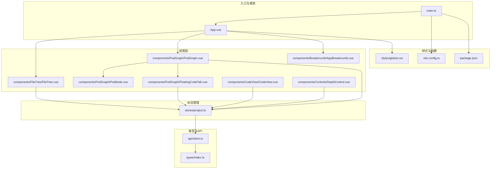
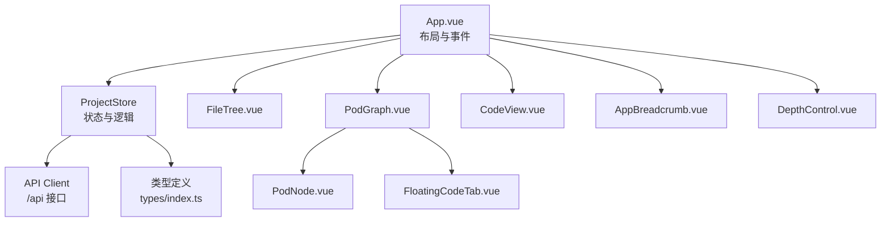
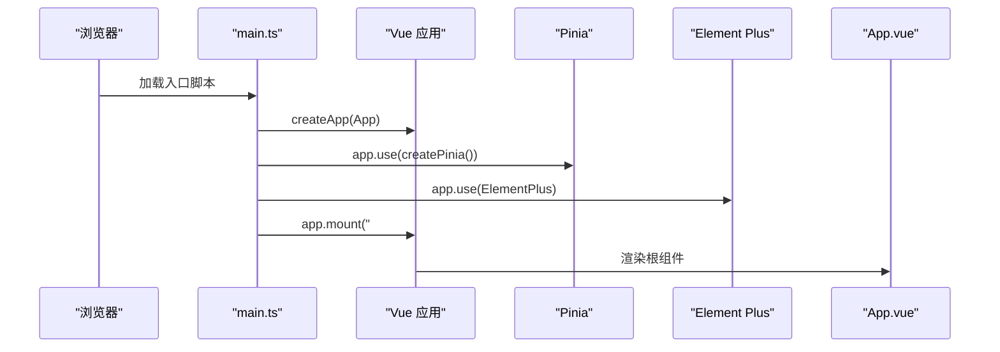
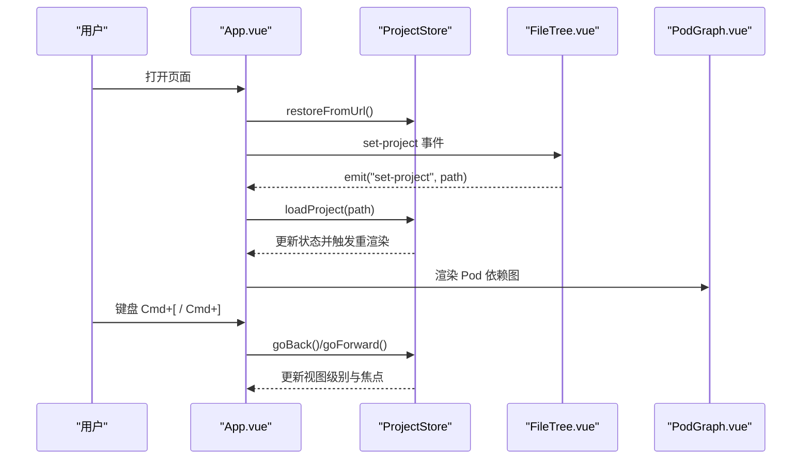
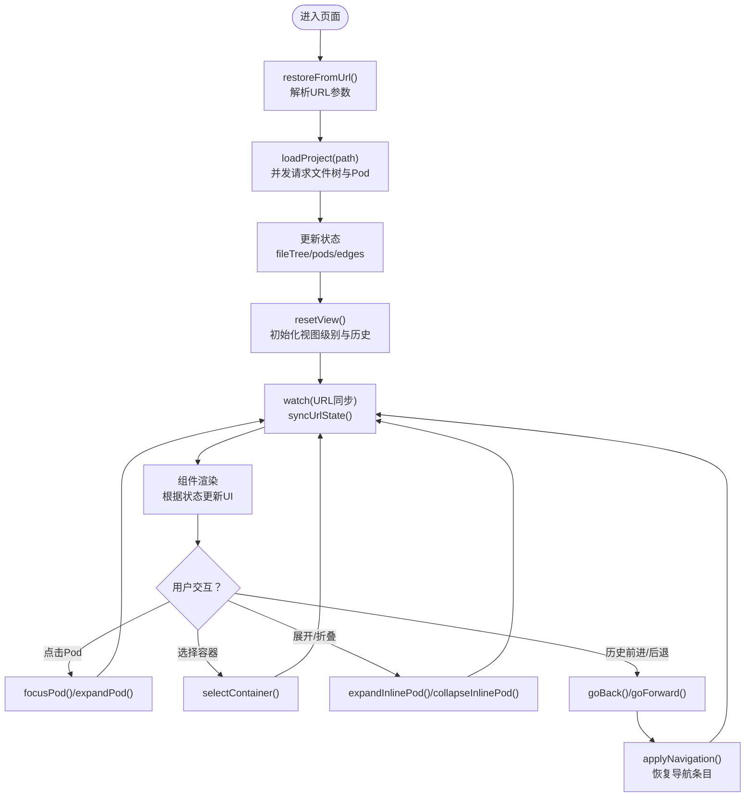
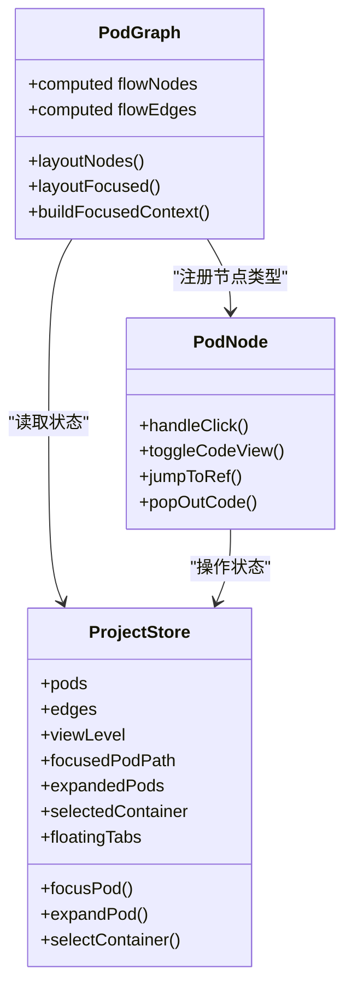
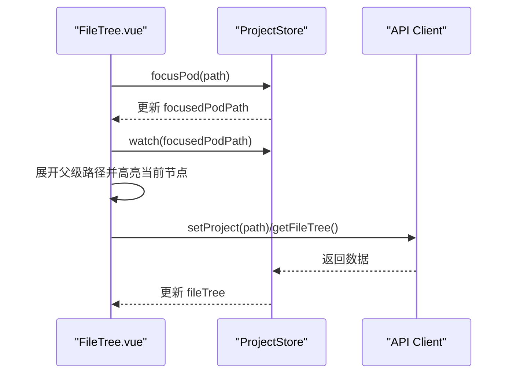
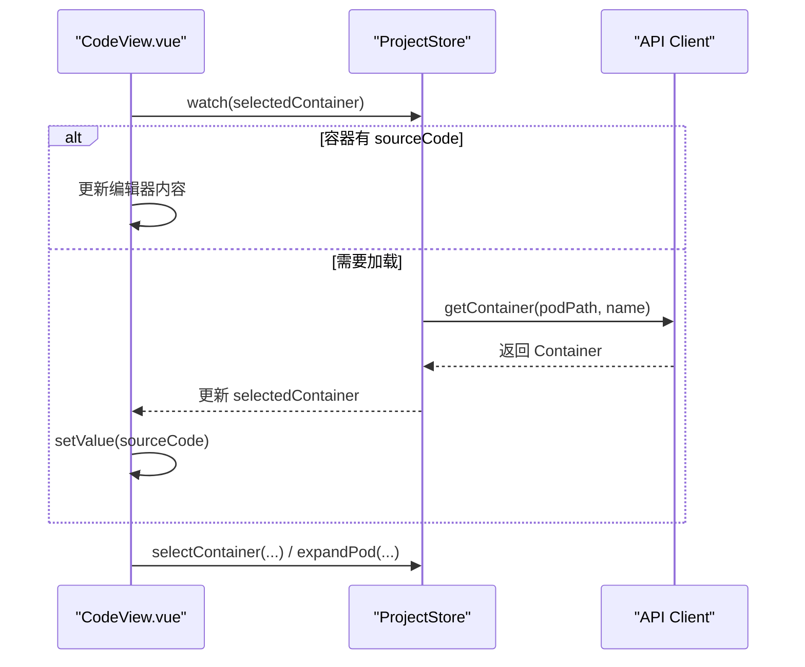
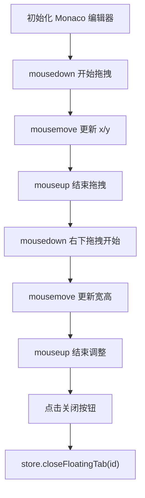
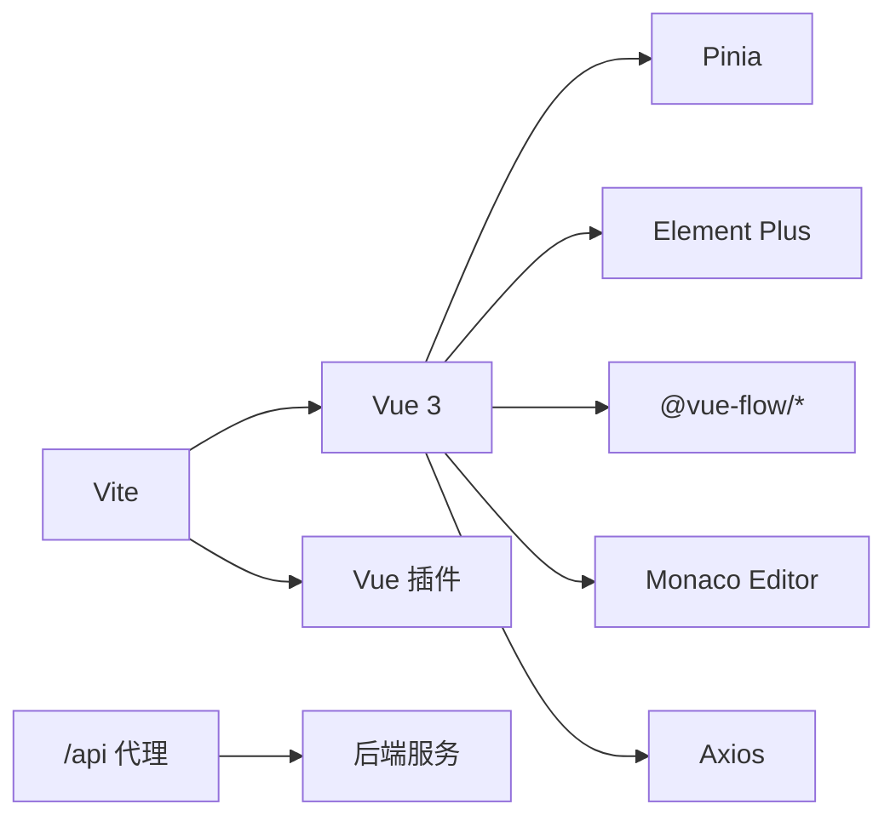

# 前端架构设计

<cite>
**本文档引用的文件**
- [main.ts](file://frontend/src/main.ts)
- [App.vue](file://frontend/src/App.vue)
- [project.ts](file://frontend/src/stores/project.ts)
- [client.ts](file://frontend/src/api/client.ts)
- [PodGraph.vue](file://frontend/src/components/PodGraph/PodGraph.vue)
- [PodNode.vue](file://frontend/src/components/PodGraph/PodNode.vue)
- [FloatingCodeTab.vue](file://frontend/src/components/PodGraph/FloatingCodeTab.vue)
- [FileTree.vue](file://frontend/src/components/FileTree/FileTree.vue)
- [CodeView.vue](file://frontend/src/components/CodeView/CodeView.vue)
- [AppBreadcrumb.vue](file://frontend/src/components/Breadcrumb/AppBreadcrumb.vue)
- [DepthControl.vue](file://frontend/src/components/Controls/DepthControl.vue)
- [index.ts](file://frontend/src/types/index.ts)
- [global.css](file://frontend/src/styles/global.css)
- [package.json](file://frontend/package.json)
- [vite.config.ts](file://frontend/vite.config.ts)
</cite>

## 目录
1. [引言](#引言)
2. [项目结构](#项目结构)
3. [核心组件](#核心组件)
4. [架构总览](#架构总览)
5. [详细组件分析](#详细组件分析)
6. [依赖关系分析](#依赖关系分析)
7. [性能考量](#性能考量)
8. [故障排查指南](#故障排查指南)
9. [结论](#结论)
10. [附录](#附录)

## 引言
本文件面向 GoPodView 前端，系统性阐述基于 Vue 3 + TypeScript 的单页应用架构设计。重点覆盖应用入口初始化流程、组件层次结构、Pinia 状态管理模式、图形化 Pod 依赖图与容器代码视图的实现思路、前后端 API 交互与错误处理策略，以及可扩展性与可维护性的设计考量。目标是帮助开发者快速理解并高效扩展该前端系统。

## 项目结构
前端采用按功能域分层的组织方式：
- 入口与框架：main.ts 负责应用初始化；App.vue 作为根组件承载布局与导航。
- 状态层：stores/project.ts 定义全局状态与业务逻辑。
- 视图层：components 下按功能拆分，包含 PodGraph（图形）、FileTree（文件树）、CodeView（代码查看）、Breadcrumb（面包屑）等。
- 类型定义：types/index.ts 统一声明数据模型。
- API 层：api/client.ts 封装后端接口调用。
- 样式与构建：styles/global.css 提供全局样式；vite.config.ts 配置开发服务器代理与插件。

图表来源
- [main.ts:1-12](file://frontend/src/main.ts#L1-L12)
- [App.vue:1-125](file://frontend/src/App.vue#L1-L125)
- [project.ts:1-476](file://frontend/src/stores/project.ts#L1-L476)
- [client.ts:1-53](file://frontend/src/api/client.ts#L1-L53)
- [PodGraph.vue:1-581](file://frontend/src/components/PodGraph/PodGraph.vue#L1-L581)
- [PodNode.vue:1-425](file://frontend/src/components/PodGraph/PodNode.vue#L1-L425)
- [FloatingCodeTab.vue:1-209](file://frontend/src/components/PodGraph/FloatingCodeTab.vue#L1-L209)
- [FileTree.vue:1-201](file://frontend/src/components/FileTree/FileTree.vue#L1-L201)
- [CodeView.vue:1-191](file://frontend/src/components/CodeView/CodeView.vue#L1-L191)
- [AppBreadcrumb.vue:1-78](file://frontend/src/components/Breadcrumb/AppBreadcrumb.vue#L1-L78)
- [DepthControl.vue:1-35](file://frontend/src/components/Controls/DepthControl.vue#L1-L35)
- [index.ts:1-74](file://frontend/src/types/index.ts#L1-L74)
- [global.css:1-38](file://frontend/src/styles/global.css#L1-L38)
- [vite.config.ts:1-15](file://frontend/vite.config.ts#L1-L15)
- [package.json:1-33](file://frontend/package.json#L1-L33)

章节来源
- [main.ts:1-12](file://frontend/src/main.ts#L1-L12)
- [App.vue:1-125](file://frontend/src/App.vue#L1-L125)
- [project.ts:1-476](file://frontend/src/stores/project.ts#L1-L476)
- [client.ts:1-53](file://frontend/src/api/client.ts#L1-L53)
- [index.ts:1-74](file://frontend/src/types/index.ts#L1-L74)
- [global.css:1-38](file://frontend/src/styles/global.css#L1-L38)
- [vite.config.ts:1-15](file://frontend/vite.config.ts#L1-L15)
- [package.json:1-33](file://frontend/package.json#L1-L33)

## 核心组件
- 应用入口与初始化：在 main.ts 中创建 Vue 应用实例，注册 Pinia 和 Element Plus 插件，并挂载到 DOM。
- 根组件与布局：App.vue 负责头部导航、侧边栏文件树、主区域 Pod 图形展示，并处理键盘快捷键与历史导航。
- 状态管理：ProjectStore 使用组合式 Store 模式，集中管理项目路径、文件树、Pod 列表与边、视图级别、聚焦 Pod、展开集合、选中容器、浮动标签页、导航历史与 URL 同步等。
- API 客户端：client.ts 基于 axios 创建带基础路径与超时的 HTTP 客户端，封装项目设置、文件树、Pod 与容器查询等接口。
- 类型系统：index.ts 定义容器、Pod、边、文件节点、响应体、视图级别、导航条目与浮动标签页等核心类型。

章节来源
- [main.ts:1-12](file://frontend/src/main.ts#L1-L12)
- [App.vue:1-125](file://frontend/src/App.vue#L1-L125)
- [project.ts:1-476](file://frontend/src/stores/project.ts#L1-L476)
- [client.ts:1-53](file://frontend/src/api/client.ts#L1-L53)
- [index.ts:1-74](file://frontend/src/types/index.ts#L1-L74)

## 架构总览
前端采用“根组件 + 组合式 Store + 组件化视图”的三层架构：
- 根组件负责布局与事件绑定，通过 Pinia Store 获取与更新状态。
- Store 聚合业务逻辑，协调 API 请求与本地计算（如邻接表、布局算法）。
- 视图组件以函数式与声明式结合的方式渲染数据，支持交互与局部状态。

图表来源
- [App.vue:1-125](file://frontend/src/App.vue#L1-L125)
- [project.ts:1-476](file://frontend/src/stores/project.ts#L1-L476)
- [client.ts:1-53](file://frontend/src/api/client.ts#L1-L53)
- [index.ts:1-74](file://frontend/src/types/index.ts#L1-L74)
- [FileTree.vue:1-201](file://frontend/src/components/FileTree/FileTree.vue#L1-L201)
- [PodGraph.vue:1-581](file://frontend/src/components/PodGraph/PodGraph.vue#L1-L581)
- [PodNode.vue:1-425](file://frontend/src/components/PodGraph/PodNode.vue#L1-L425)
- [FloatingCodeTab.vue:1-209](file://frontend/src/components/PodGraph/FloatingCodeTab.vue#L1-L209)
- [CodeView.vue:1-191](file://frontend/src/components/CodeView/CodeView.vue#L1-L191)
- [AppBreadcrumb.vue:1-78](file://frontend/src/components/Breadcrumb/AppBreadcrumb.vue#L1-L78)
- [DepthControl.vue:1-35](file://frontend/src/components/Controls/DepthControl.vue#L1-L35)

## 详细组件分析

### 应用入口与初始化流程
- 初始化步骤：创建应用实例 -> 注册 Pinia -> 注册 Element Plus -> 加载全局样式 -> 挂载。
- 关键点：Element Plus 样式与主题在入口统一引入；全局样式变量在 global.css 中集中配置。

图表来源
- [main.ts:1-12](file://frontend/src/main.ts#L1-L12)
- [global.css:1-38](file://frontend/src/styles/global.css#L1-L38)

章节来源
- [main.ts:1-12](file://frontend/src/main.ts#L1-L12)
- [global.css:1-38](file://frontend/src/styles/global.css#L1-L38)

### 根组件与导航交互
- 负责头部标题、面包屑、左右导航按钮、侧边文件树与主区域 Pod 图。
- 处理键盘快捷键 Cmd+[ 与 Cmd+] 实现历史前进/后退。
- 通过 store.restoreFromUrl() 支持从 URL 恢复视图状态。

图表来源
- [App.vue:1-125](file://frontend/src/App.vue#L1-L125)
- [project.ts:380-439](file://frontend/src/stores/project.ts#L380-L439)
- [FileTree.vue:1-201](file://frontend/src/components/FileTree/FileTree.vue#L1-L201)
- [PodGraph.vue:1-581](file://frontend/src/components/PodGraph/PodGraph.vue#L1-L581)

章节来源
- [App.vue:1-125](file://frontend/src/App.vue#L1-L125)
- [project.ts:380-439](file://frontend/src/stores/project.ts#L380-L439)

### Pinia 状态管理：ProjectStore 设计与数据流
- 状态设计：项目路径、文件树、Pod 列表与边、加载状态、视图级别、聚焦 Pod、展开集合、选中容器、依赖深度、导航历史、浮动标签页、布局版本等。
- 计算属性：podMap、focusedPod、isPodExpanded 等提升访问效率。
- 导航与 URL 同步：通过 watch 与 replaceState 同步 project、file、level、expanded 参数。
- 数据获取：loadProject 并发拉取文件树与 Pod 数据；refreshData 支持刷新。
- 视图切换：focusPod、expandPod、expandInlinePod、selectContainer 等方法驱动视图级别变化与状态更新。
- 浮动标签页：openFloatingTab/closeFloatingTab 管理多标签代码视图。

图表来源
- [project.ts:57-101](file://frontend/src/stores/project.ts#L57-L101)
- [project.ts:158-309](file://frontend/src/stores/project.ts#L158-L309)
- [project.ts:342-378](file://frontend/src/stores/project.ts#L342-L378)
- [project.ts:380-439](file://frontend/src/stores/project.ts#L380-L439)

章节来源
- [project.ts:1-476](file://frontend/src/stores/project.ts#L1-L476)

### 组件化架构：PodGraph 图形组件
- 图形引擎：基于 @vue-flow/core，自定义 PodNode 节点类型，使用 Background 与 Controls。
- 节点与边：根据 pods/edges 生成节点与边；边样式随聚焦与展开集合动态变化。
- 布局算法：
  - 全局布局：拓扑分层布局，按目录分组与列对齐，自动居中。
  - 聚焦布局：围绕中心 Pod 构建可达展开分支树，递归计算 span 与位置，剩余节点右下散落排列。
  - 节点尺寸：根据展开状态与容器数量动态计算宽高。
- 交互：点击节点聚焦或展开；鼠标悬停显示信息；动画边强调主路径。

图表来源
- [PodGraph.vue:1-581](file://frontend/src/components/PodGraph/PodGraph.vue#L1-L581)
- [PodNode.vue:1-425](file://frontend/src/components/PodGraph/PodNode.vue#L1-L425)
- [project.ts:1-476](file://frontend/src/stores/project.ts#L1-L476)

章节来源
- [PodGraph.vue:1-581](file://frontend/src/components/PodGraph/PodGraph.vue#L1-L581)
- [PodNode.vue:1-425](file://frontend/src/components/PodGraph/PodNode.vue#L1-L425)

### 组件化架构：FileTree 文件树组件
- 功能：展示 Go 项目文件树，支持搜索、加载状态、聚焦 Pod 高亮与自动展开。
- 交互：点击非目录节点聚焦对应 Pod；输入框支持回车加载；watch 同步聚焦状态到树控件。

图表来源
- [FileTree.vue:1-201](file://frontend/src/components/FileTree/FileTree.vue#L1-L201)
- [project.ts:57-101](file://frontend/src/stores/project.ts#L57-L101)
- [client.ts:15-23](file://frontend/src/api/client.ts#L15-L23)

章节来源
- [FileTree.vue:1-201](file://frontend/src/components/FileTree/FileTree.vue#L1-L201)
- [client.ts:15-23](file://frontend/src/api/client.ts#L15-L23)

### 组件化架构：CodeView 代码查看组件
- 功能：基于 Monaco Editor 展示选中容器的源码，显示签名、行号范围，支持返回展开视图与跳转引用。
- 交互：监听选中容器变化，动态更新编辑器内容；点击引用项跳转到对应容器。

图表来源
- [CodeView.vue:1-191](file://frontend/src/components/CodeView/CodeView.vue#L1-L191)
- [project.ts:260-284](file://frontend/src/stores/project.ts#L260-L284)
- [client.ts:40-45](file://frontend/src/api/client.ts#L40-L45)

章节来源
- [CodeView.vue:1-191](file://frontend/src/components/CodeView/CodeView.vue#L1-L191)
- [project.ts:260-284](file://frontend/src/stores/project.ts#L260-L284)
- [client.ts:40-45](file://frontend/src/api/client.ts#L40-L45)

### 组件化架构：FloatingCodeTab 浮动标签页
- 功能：弹出式代码标签页，支持拖拽移动与调整大小，独立展示容器源码。
- 交互：拖拽开始记录偏移，移动时更新绝对定位；调整大小限制最小尺寸；关闭时从 Store 移除。

图表来源
- [FloatingCodeTab.vue:1-209](file://frontend/src/components/PodGraph/FloatingCodeTab.vue#L1-L209)
- [project.ts:315-338](file://frontend/src/stores/project.ts#L315-L338)

章节来源
- [FloatingCodeTab.vue:1-209](file://frontend/src/components/PodGraph/FloatingCodeTab.vue#L1-L209)
- [project.ts:315-338](file://frontend/src/stores/project.ts#L315-L338)

### 组件化架构：面包屑与依赖深度控制
- 面包屑：根据当前视图级别与聚焦 Pod 动态生成“全部 Pod → 聚焦 Pod → 容器”等路径，支持点击跳转。
- 依赖深度控制：仅在非全局视图时显示，数值变更通过 store.setDependencyDepth 写入状态。

章节来源
- [AppBreadcrumb.vue:1-78](file://frontend/src/components/Breadcrumb/AppBreadcrumb.vue#L1-L78)
- [DepthControl.vue:1-35](file://frontend/src/components/Controls/DepthControl.vue#L1-L35)
- [project.ts:311-313](file://frontend/src/stores/project.ts#L311-L313)

## 依赖关系分析
- 运行时依赖：Vue 3、Pinia、Element Plus、@vue-flow/*、Monaco Editor、Axios。
- 构建工具：Vite + Vue 插件；开发服务器通过代理将 /api 转发至后端服务。
- 代理配置：vite.config.ts 将 /api 代理到 http://localhost:8080，便于前后端联调。

图表来源
- [package.json:11-22](file://frontend/package.json#L11-L22)
- [vite.config.ts:7-12](file://frontend/vite.config.ts#L7-L12)

章节来源
- [package.json:1-33](file://frontend/package.json#L1-L33)
- [vite.config.ts:1-15](file://frontend/vite.config.ts#L1-L15)

## 性能考量
- 并发数据加载：loadProject 与 refreshData 使用 Promise.all 并行请求文件树与 Pod 数据，减少等待时间。
- 局部渲染：组件基于响应式状态进行细粒度更新，避免整树重绘。
- 布局计算：布局算法在计算节点尺寸与位置时尽量缓存中间结果（如 nodeSizes），并在必要时通过 layoutVersion 触发重算。
- 资源释放：编辑器实例在组件卸载时 dispose，避免内存泄漏；FloatingCodeTab 在窗口事件监听结束后清理。
- 代理与缓存：开发环境通过代理直连后端，减少跨域与额外转发开销。

章节来源
- [project.ts:63-66](file://frontend/src/stores/project.ts#L63-L66)
- [project.ts:78-92](file://frontend/src/stores/project.ts#L78-L92)
- [PodGraph.vue:82-90](file://frontend/src/components/PodGraph/PodGraph.vue#L82-L90)
- [PodNode.vue:212-214](file://frontend/src/components/PodGraph/PodNode.vue#L212-L214)
- [FloatingCodeTab.vue:84-90](file://frontend/src/components/PodGraph/FloatingCodeTab.vue#L84-L90)
- [vite.config.ts:7-12](file://frontend/vite.config.ts#L7-L12)

## 故障排查指南
- 无法加载项目或无数据：
  - 检查 /api 代理是否正确指向后端服务。
  - 确认 setProject 与 getFileTree/getPods 是否返回有效数据。
- URL 恢复异常：
  - 确保 URL 包含 project 参数；当 file/level/expanded 存在时，需确保对应 Pod 路径有效。
- 图形渲染异常：
  - 检查 pods/edges 是否为空；确认 focusedPodPath 与 expandedPods 集合一致性。
- 代码编辑器空白：
  - 确认 selectedContainer 或浮动标签页的 sourceCode 已填充；Monaco 初始化时机与容器变化监听是否生效。
- 键盘快捷键无效：
  - 确认 App.vue 中键盘事件绑定与 preventDefault 是否正确执行。

章节来源
- [client.ts:15-28](file://frontend/src/api/client.ts#L15-L28)
- [project.ts:380-439](file://frontend/src/stores/project.ts#L380-L439)
- [PodGraph.vue:535-561](file://frontend/src/components/PodGraph/PodGraph.vue#L535-L561)
- [CodeView.vue:12-38](file://frontend/src/components/CodeView/CodeView.vue#L12-L38)
- [App.vue:19-28](file://frontend/src/App.vue#L19-L28)

## 结论
本前端架构以 Vue 3 + Pinia 为核心，通过清晰的状态管理与组件化设计，实现了从项目加载、文件树浏览、Pod 依赖图可视化到容器代码查看的完整工作流。配合 @vue-flow 的图形渲染与 Monaco 的代码编辑能力，提供了良好的交互体验。未来可在以下方面持续演进：增强错误边界与加载骨架、引入更细粒度的懒加载与虚拟化、完善国际化与主题系统、扩展路由与权限体系。

## 附录
- 开发与构建：使用 Vite 启动开发服务器，通过 /api 代理访问后端；生产构建由 vue-tsc 与 vite 完成。
- 全局样式：通过 CSS 变量统一管理尺寸、颜色与滚动条样式，便于主题扩展。

章节来源
- [vite.config.ts:1-15](file://frontend/vite.config.ts#L1-L15)
- [global.css:1-38](file://frontend/src/styles/global.css#L1-L38)
- [package.json:6-10](file://frontend/package.json#L6-L10)