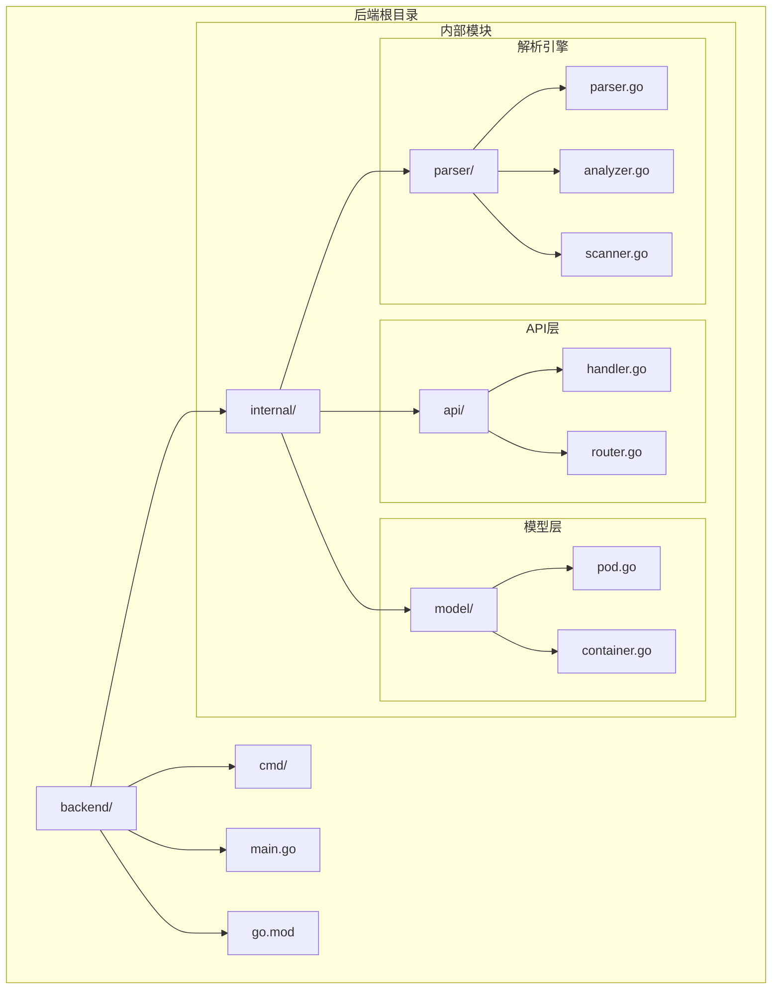
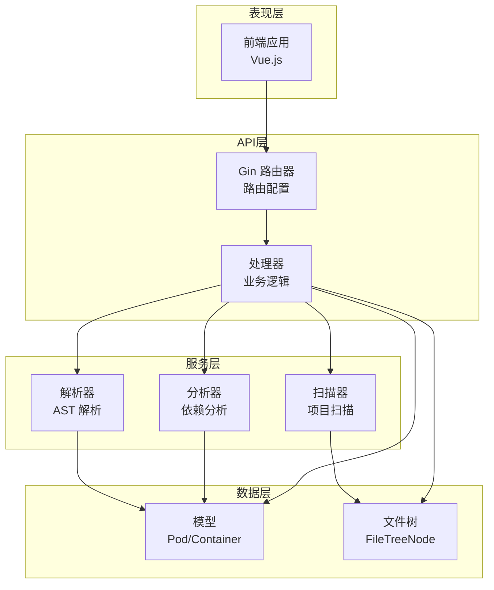
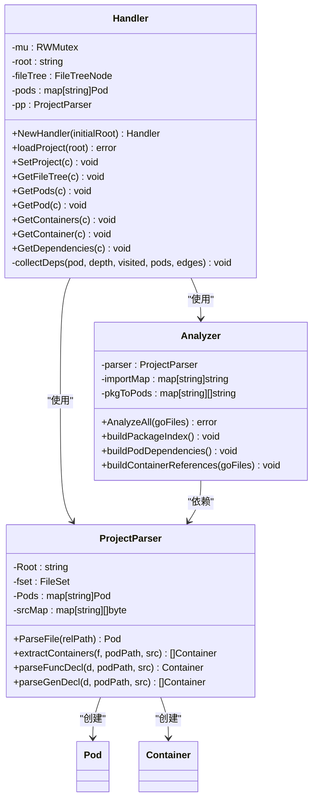
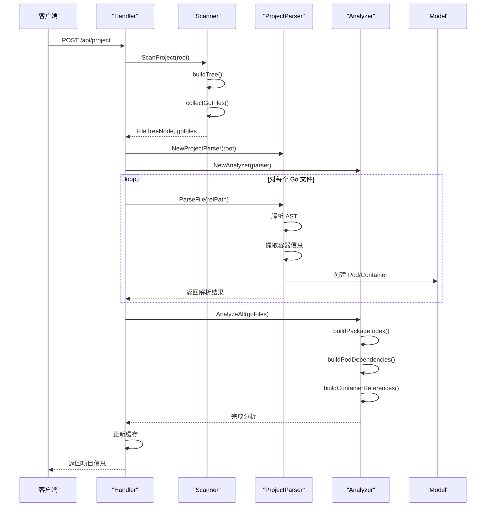
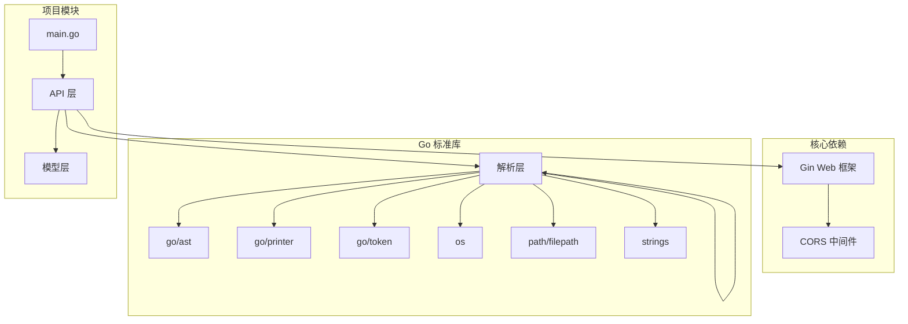

# 后端架构设计

<cite>
**本文档引用的文件**
- [main.go](file://backend/main.go)
- [router.go](file://backend/internal/api/router.go)
- [handler.go](file://backend/internal/api/handler.go)
- [pod.go](file://backend/internal/model/pod.go)
- [container.go](file://backend/internal/model/container.go)
- [parser.go](file://backend/internal/parser/parser.go)
- [analyzer.go](file://backend/internal/parser/analyzer.go)
- [scanner.go](file://backend/internal/parser/scanner.go)
- [go.mod](file://backend/go.mod)
</cite>

## 目录
1. [简介](#简介)
2. [项目结构](#项目结构)
3. [核心组件](#核心组件)
4. [架构概览](#架构概览)
5. [详细组件分析](#详细组件分析)
6. [依赖关系分析](#依赖关系分析)
7. [性能考虑](#性能考虑)
8. [故障排除指南](#故障排除指南)
9. [结论](#结论)

## 简介

GoPodView 是一个基于 Go 语言的 Kubernetes Pod 可视化分析工具。该项目采用清晰的分层架构设计，通过 Gin Web 框架提供 RESTful API 接口，结合 Go AST 解析引擎对 Go 项目进行深度分析，实现 Pod 和 Container 的可视化展示。

该后端架构的核心目标是：
- 提供高效的 Go 项目解析和分析能力
- 实现 Pod 与 Container 的关系映射
- 支持依赖关系的递归查询
- 提供直观的可视化数据结构

## 项目结构

项目采用模块化的目录结构，按照功能层次进行组织：



**图表来源**
- [main.go:1-31](file://backend/main.go#L1-L31)
- [router.go:1-32](file://backend/internal/api/router.go#L1-L32)
- [handler.go:1-225](file://backend/internal/api/handler.go#L1-L225)

**章节来源**
- [main.go:1-31](file://backend/main.go#L1-L31)
- [go.mod:1-39](file://backend/go.mod#L1-L39)

## 核心组件

### 入口点组件

**main.go** 作为应用程序的唯一入口点，负责：
- 命令行参数解析（项目路径和端口号）
- 初始化 API 处理器
- 配置并启动 HTTP 服务器
- 提供应用启动日志信息

### API 层组件

**router.go** 实现了 RESTful API 路由配置：
- 使用 Gin 框架设置路由组
- 配置 CORS 中间件支持前端跨域访问
- 定义完整的 API 端点集合

**handler.go** 实现了业务逻辑处理：
- 线程安全的数据访问控制
- 项目加载和缓存管理
- 多种数据查询接口实现

### 数据模型组件

**pod.go** 定义了核心数据结构：
- Pod 对象包含路径、包名、文件名、导入依赖等信息
- FileTreeNode 用于文件树结构表示

**container.go** 定义了容器类型和引用关系：
- 支持函数、结构体、接口、常量、变量五种容器类型
- Reference 类型支持调用和类型引用两种引用关系

### 解析引擎组件

**parser.go** 实现了 Go AST 解析：
- ProjectParser 负责单个文件的解析
- 提取函数声明、类型定义、常量变量等容器信息

**analyzer.go** 实现了高级分析功能：
- 构建包索引和依赖关系
- 分析容器间的引用关系
- 支持跨文件的引用追踪

**scanner.go** 实现了项目扫描功能：
- 递归遍历项目目录
- 过滤忽略的目录和文件
- 生成文件树结构和 Go 文件列表

**章节来源**
- [main.go:11-30](file://backend/main.go#L11-L30)
- [router.go:8-31](file://backend/internal/api/router.go#L8-L31)
- [handler.go:15-29](file://backend/internal/api/handler.go#L15-L29)
- [pod.go:3-18](file://backend/internal/model/pod.go#L3-L18)
- [container.go:13-36](file://backend/internal/model/container.go#L13-L36)

## 架构概览

GoPodView 采用了经典的三层架构模式：



**图表来源**
- [router.go:8-31](file://backend/internal/api/router.go#L8-L31)
- [handler.go:15-29](file://backend/internal/api/handler.go#L15-L29)
- [parser.go:16-30](file://backend/internal/parser/parser.go#L16-L30)
- [analyzer.go:13-25](file://backend/internal/parser/analyzer.go#L13-L25)
- [scanner.go:12-32](file://backend/internal/parser/scanner.go#L12-L32)

该架构的主要特点：
- **清晰的职责分离**：每层都有明确的功能边界
- **可扩展性**：新增功能只需在相应层级添加代码
- **可测试性**：各组件相对独立，便于单元测试
- **性能优化**：使用缓存机制避免重复解析

## 详细组件分析

### Handler 组件详细分析

Handler 是整个系统的核心协调者，负责管理项目状态和处理各种请求：



**图表来源**
- [handler.go:15-29](file://backend/internal/api/handler.go#L15-L29)
- [parser.go:16-30](file://backend/internal/parser/parser.go#L16-L30)
- [analyzer.go:13-25](file://backend/internal/parser/analyzer.go#L13-L25)

#### Handler 的关键职责

1. **项目生命周期管理**：通过 `loadProject` 方法统一管理项目的加载、解析和缓存
2. **线程安全访问**：使用读写锁确保多线程环境下的数据一致性
3. **API 请求处理**：为每个 API 端点提供专门的处理方法
4. **依赖关系查询**：实现递归依赖查询功能，支持深度限制

**章节来源**
- [handler.go:31-50](file://backend/internal/api/handler.go#L31-L50)
- [handler.go:56-75](file://backend/internal/api/handler.go#L56-L75)

### 解析引擎架构分析

解析引擎是系统的核心技术组件，采用分层设计实现复杂的功能：



**图表来源**
- [handler.go:31-50](file://backend/internal/api/handler.go#L31-L50)
- [scanner.go:12-32](file://backend/internal/parser/scanner.go#L12-L32)
- [parser.go:32-59](file://backend/internal/parser/parser.go#L32-L59)
- [analyzer.go:27-39](file://backend/internal/parser/analyzer.go#L27-L39)

#### ProjectParser 的解析策略

ProjectParser 采用 Go AST 解析技术，能够准确提取以下信息：

1. **函数声明解析**：支持普通函数和方法函数的识别
2. **类型定义解析**：区分结构体、接口和其他类型定义
3. **常量变量解析**：支持批量和单个声明的处理
4. **源码片段提取**：保留原始源码内容用于显示

#### Analyzer 的分析算法

Analyzer 实现了复杂的依赖分析算法：

1. **包索引构建**：建立导入路径到目录的映射关系
2. **依赖关系计算**：分析每个 Pod 的导入依赖
3. **容器引用追踪**：在 AST 中查找跨文件的引用关系
4. **引用类型分类**：区分调用引用和类型引用

**章节来源**
- [parser.go:32-59](file://backend/internal/parser/parser.go#L32-L59)
- [parser.go:61-206](file://backend/internal/parser/parser.go#L61-L206)
- [analyzer.go:27-39](file://backend/internal/parser/analyzer.go#L27-L39)
- [analyzer.go:100-134](file://backend/internal/parser/analyzer.go#L100-L134)

### 数据模型设计分析

数据模型层采用简洁而强大的设计原则：

```mermaid
erDiagram
POD {
string path PK
string package
string fileName
string[] imports
string[] dependsOn
string[] dependedBy
}
CONTAINER {
string name PK
enum type
string pod
int startLine
int endLine
string signature
string sourceCode
}
REFERENCE {
string containerName
string podPath
enum type
}
FILETREE_NODE {
string name
string path
bool isDir
}
POD ||--o{ CONTAINER : "包含"
CONTAINER ||--o{ REFERENCE : "被引用"
POD ||--o{ POD : "依赖" }
FILETREE_NODE ||--o{ FILETREE_NODE : "子节点"
```

**图表来源**
- [pod.go:3-18](file://backend/internal/model/pod.go#L3-L18)
- [container.go:13-36](file://backend/internal/model/container.go#L13-L36)

#### Pod 模型的关键特性

1. **路径标识**：使用相对路径作为唯一标识符
2. **导入依赖**：记录所有外部导入的包路径
3. **双向依赖**：同时维护 DependsOn 和 DependedBy 字段
4. **容器聚合**：包含该 Pod 中的所有容器对象

#### Container 模型的类型系统

Container 模型支持五种不同的容器类型：

1. **函数容器**：支持接收者信息的函数和方法
2. **结构体容器**：包含字段和方法的复合类型
3. **接口容器**：定义抽象契约的接口类型
4. **常量容器**：支持批量和单个常量声明
5. **变量容器**：支持批量和单个变量声明

**章节来源**
- [pod.go:3-18](file://backend/internal/model/pod.go#L3-L18)
- [container.go:13-36](file://backend/internal/model/container.go#L13-L36)

## 依赖关系分析

项目依赖关系清晰且精简：



**图表来源**
- [go.mod:5-8](file://backend/go.mod#L5-L8)
- [parser.go:3-14](file://backend/internal/parser/parser.go#L3-L14)

### 外部依赖分析

项目对外部依赖的使用非常谨慎：
- **Gin Web 框架**：提供高性能的 HTTP 服务
- **CORS 中间件**：支持前端跨域访问需求
- **Go AST 工具链**：提供强大的语法分析能力

### 内部模块依赖

内部模块之间遵循严格的依赖规则：
- API 层依赖模型层和解析层
- 解析层相互独立，无循环依赖
- 模型层保持纯数据结构，无业务逻辑

**章节来源**
- [go.mod:1-39](file://backend/go.mod#L1-L39)

## 性能考虑

### 缓存策略

系统实现了多层次的缓存机制：

1. **项目级缓存**：Handler 缓存已解析的项目数据
2. **源码缓存**：ProjectParser 缓存已读取的源码内容
3. **索引缓存**：Analyzer 缓存包索引和依赖关系

### 并发安全

- 使用读写锁确保数据访问的线程安全
- 所有 API 方法都实现了并发安全的访问模式
- 避免在请求处理过程中修改共享状态

### 内存优化

- 按需加载源码内容，避免不必要的内存占用
- 在返回数据时移除不必要的源码字段
- 使用切片预分配减少内存分配开销

## 故障排除指南

### 常见问题及解决方案

1. **项目加载失败**
   - 检查项目路径是否正确
   - 确认 Go 文件格式正确
   - 查看解析错误日志

2. **API 响应异常**
   - 检查 CORS 配置
   - 验证请求参数格式
   - 查看服务器日志

3. **内存使用过高**
   - 检查项目规模大小
   - 考虑增加内存限制
   - 优化前端数据展示

### 调试建议

- 启用 Gin 的调试模式进行开发
- 使用日志记录关键操作步骤
- 监控内存和 CPU 使用情况
- 实施适当的超时机制

**章节来源**
- [main.go:27-29](file://backend/main.go#L27-L29)
- [handler.go:56-75](file://backend/internal/api/handler.go#L56-L75)

## 结论

GoPodView 后端架构展现了优秀的软件工程实践：

### 设计优势

1. **清晰的分层架构**：每层职责明确，便于维护和扩展
2. **强大的解析能力**：基于 Go AST 的深度分析确保准确性
3. **良好的性能表现**：多层缓存和并发安全设计提升用户体验
4. **简洁的 API 设计**：RESTful 接口符合现代 Web 开发标准

### 技术亮点

- **模块化设计**：各组件相对独立，便于单元测试和重构
- **类型安全**：充分利用 Go 语言的类型系统保证数据完整性
- **可扩展性**：架构设计支持未来功能的平滑扩展
- **性能优化**：从多个维度考虑性能影响因素

### 发展建议

1. **监控和日志**：增强生产环境的监控和日志记录
2. **错误处理**：完善错误处理和恢复机制
3. **测试覆盖**：增加单元测试和集成测试覆盖率
4. **文档完善**：补充更详细的 API 文档和技术文档

该架构为 GoPodView 提供了坚实的技术基础，能够有效支持后续的功能扩展和性能优化需求。