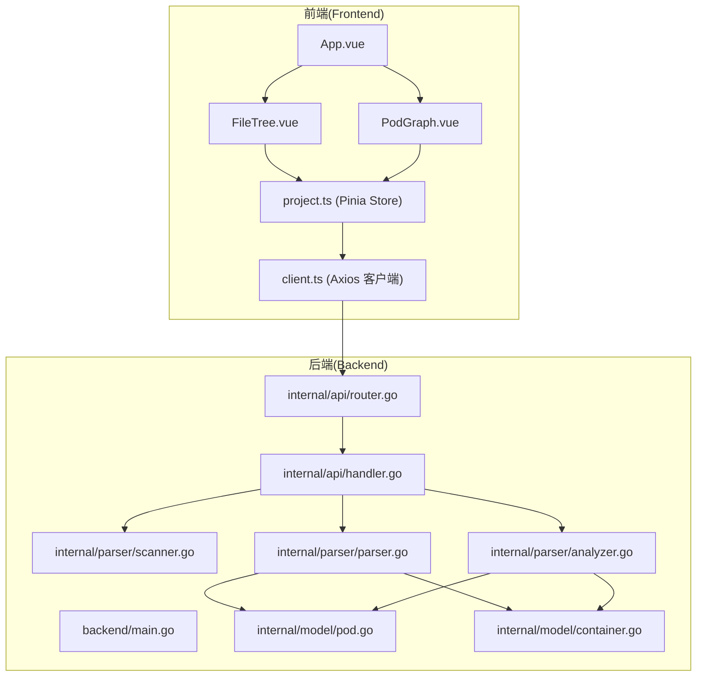
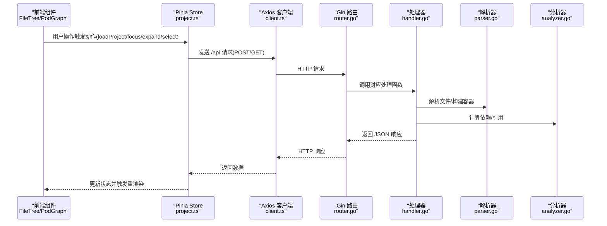
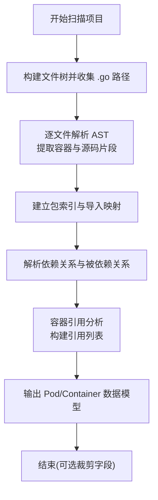
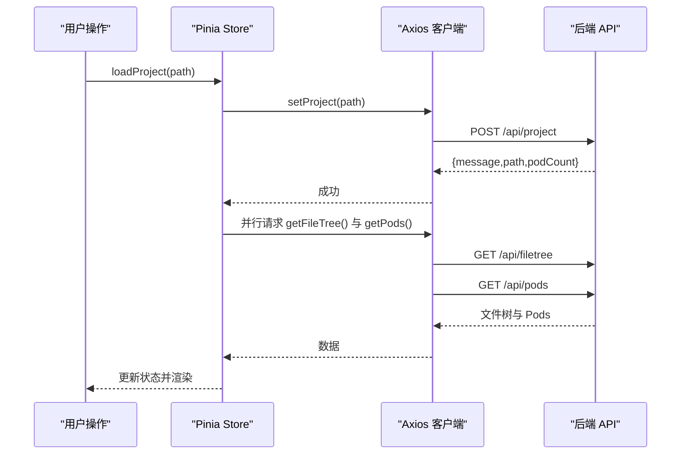
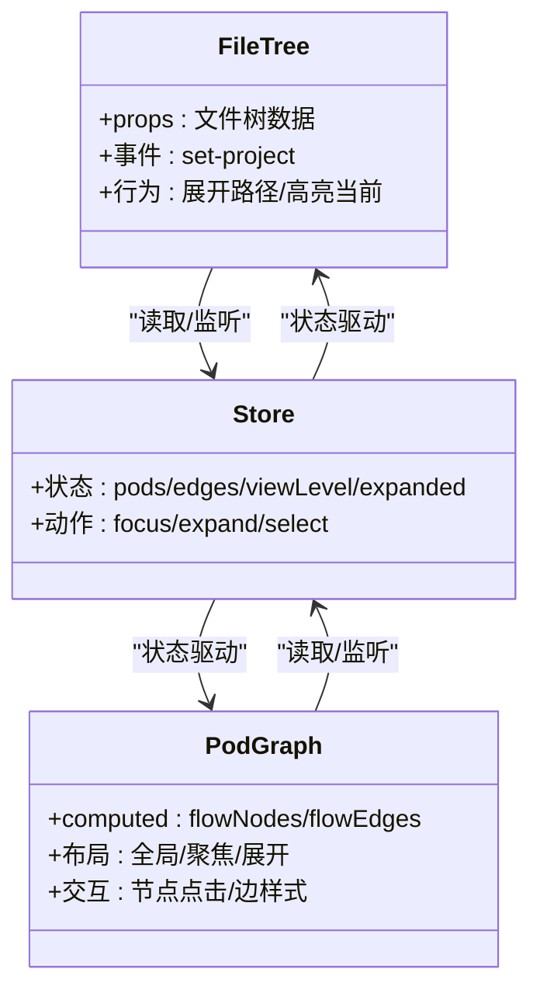
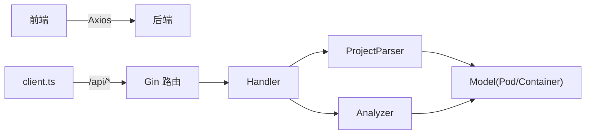

# 数据流设计

<cite>
**本文引用的文件**
- [backend/main.go](file://backend/main.go)
- [backend/internal/api/router.go](file://backend/internal/api/router.go)
- [backend/internal/api/handler.go](file://backend/internal/api/handler.go)
- [backend/internal/parser/scanner.go](file://backend/internal/parser/scanner.go)
- [backend/internal/parser/parser.go](file://backend/internal/parser/parser.go)
- [backend/internal/parser/analyzer.go](file://backend/internal/parser/analyzer.go)
- [backend/internal/model/pod.go](file://backend/internal/model/pod.go)
- [backend/internal/model/container.go](file://backend/internal/model/container.go)
- [frontend/src/api/client.ts](file://frontend/src/api/client.ts)
- [frontend/src/stores/project.ts](file://frontend/src/stores/project.ts)
- [frontend/src/types/index.ts](file://frontend/src/types/index.ts)
- [frontend/src/components/PodGraph/PodGraph.vue](file://frontend/src/components/PodGraph/PodGraph.vue)
- [frontend/src/components/FileTree/FileTree.vue](file://frontend/src/components/FileTree/FileTree.vue)
- [frontend/src/App.vue](file://frontend/src/App.vue)
- [frontend/src/main.ts](file://frontend/src/main.ts)
- [backend/go.mod](file://backend/go.mod)
- [frontend/package.json](file://frontend/package.json)
</cite>

## 目录
1. [简介](#简介)
2. [项目结构](#项目结构)
3. [核心组件](#核心组件)
4. [架构总览](#架构总览)
5. [详细组件分析](#详细组件分析)
6. [依赖分析](#依赖分析)
7. [性能考量](#性能考量)
8. [故障排查指南](#故障排查指南)
9. [结论](#结论)
10. [附录](#附录)

## 简介
本文件为 GoPodView 的数据流设计文档，系统性阐述从代码解析到可视化展示的完整数据流程，覆盖后端 AST 解析与数据建模、API 响应格式，以及前端 Pinia Store 的状态管理、组件间通信与状态同步策略。同时包含前后端数据交换协议、错误处理与数据验证、缓存与性能优化、内存管理建议，以及调试与故障排查方法。

## 项目结构
项目采用前后端分离架构：前端使用 Vue 3 + Pinia + Element Plus + VueFlow 进行交互与可视化；后端使用 Gin 提供 REST API，并通过 Go 标准库的 go/ast 对 Go 源码进行解析与建模。

图表来源
- [frontend/src/App.vue:1-125](file://frontend/src/App.vue#L1-L125)
- [frontend/src/components/FileTree/FileTree.vue:1-201](file://frontend/src/components/FileTree/FileTree.vue#L1-L201)
- [frontend/src/components/PodGraph/PodGraph.vue:1-581](file://frontend/src/components/PodGraph/PodGraph.vue#L1-L581)
- [frontend/src/stores/project.ts:1-476](file://frontend/src/stores/project.ts#L1-L476)
- [frontend/src/api/client.ts:1-53](file://frontend/src/api/client.ts#L1-L53)
- [backend/main.go:1-31](file://backend/main.go#L1-L31)
- [backend/internal/api/router.go:1-32](file://backend/internal/api/router.go#L1-L32)
- [backend/internal/api/handler.go:1-225](file://backend/internal/api/handler.go#L1-L225)
- [backend/internal/parser/scanner.go:1-113](file://backend/internal/parser/scanner.go#L1-L113)
- [backend/internal/parser/parser.go:1-253](file://backend/internal/parser/parser.go#L1-L253)
- [backend/internal/parser/analyzer.go:1-236](file://backend/internal/parser/analyzer.go#L1-L236)
- [backend/internal/model/pod.go:1-19](file://backend/internal/model/pod.go#L1-L19)
- [backend/internal/model/container.go:1-37](file://backend/internal/model/container.go#L1-L37)

章节来源
- [backend/main.go:11-30](file://backend/main.go#L11-L30)
- [backend/internal/api/router.go:8-31](file://backend/internal/api/router.go#L8-L31)
- [frontend/src/main.ts:8-11](file://frontend/src/main.ts#L8-L11)

## 核心组件
- 后端入口与路由
  - 入口负责解析命令行参数、初始化处理器与路由器，并启动 HTTP 服务。
  - 路由器注册 /api 下的项目设置、文件树、Pod、容器、依赖等接口。
- 处理器与并发安全
  - 处理器内部维护项目根目录、文件树、Pod 映射与 ProjectParser 实例。
  - 使用互斥锁保护共享状态，确保多请求下的读写一致性。
- 解析器与分析器
  - 扫描器遍历项目构建文件树并收集 .go 文件路径。
  - 解析器基于 go/ast 解析函数、类型、常量/变量等容器，提取起止行号与源码片段。
  - 分析器建立包索引、计算 Pod 依赖关系、构建容器引用图。
- 数据模型
  - Pod 包含路径、包名、文件名、导入列表、容器集合、依赖与被依赖列表。
  - Container 包含名称、类型、所在 Pod、起止行号、签名、源码与引用列表。
- 前端 Store 与组件
  - Pinia Store 统一管理项目路径、文件树、Pod 列表、边集、视图层级、展开集合、选中容器、依赖深度、导航历史、浮动标签页等。
  - Axios 客户端封装 /api 前缀的请求，返回类型化数据。
  - PodGraph 与 FileTree 组件消费 Store 并驱动渲染与交互。

章节来源
- [backend/internal/api/handler.go:15-29](file://backend/internal/api/handler.go#L15-L29)
- [backend/internal/parser/scanner.go:12-32](file://backend/internal/parser/scanner.go#L12-L32)
- [backend/internal/parser/parser.go:32-59](file://backend/internal/parser/parser.go#L32-L59)
- [backend/internal/parser/analyzer.go:27-39](file://backend/internal/parser/analyzer.go#L27-L39)
- [backend/internal/model/pod.go:3-11](file://backend/internal/model/pod.go#L3-L11)
- [backend/internal/model/container.go:13-22](file://backend/internal/model/container.go#L13-L22)
- [frontend/src/stores/project.ts:14-476](file://frontend/src/stores/project.ts#L14-L476)
- [frontend/src/api/client.ts:10-53](file://frontend/src/api/client.ts#L10-L53)

## 架构总览
后端解析流程（自上而下）：
- 项目扫描：递归遍历项目目录，过滤非 Go 文件与隐藏/忽略目录，生成文件树并收集 .go 路径。
- AST 解析：逐文件解析，提取函数、类型、常量/变量等容器，记录起止行号与源码片段。
- 依赖分析：建立包级映射与导入路径解析，计算 Pod 之间的依赖与被依赖关系。
- 引用分析：在容器范围内查找对其他 Pod 中容器的引用，区分调用与类型引用。

前端渲染流程（自下而上）：
- Store 初始化：加载项目、并行拉取文件树与 Pod 列表，构建边集。
- 视图层：FileTree 展示文件树并与 Store 同步聚焦；PodGraph 基于 Store 数据布局节点与边，支持聚焦/展开/折叠与浮动标签页。

图表来源
- [frontend/src/components/FileTree/FileTree.vue:37-41](file://frontend/src/components/FileTree/FileTree.vue#L37-L41)
- [frontend/src/components/PodGraph/PodGraph.vue:79-110](file://frontend/src/components/PodGraph/PodGraph.vue#L79-L110)
- [frontend/src/stores/project.ts:57-92](file://frontend/src/stores/project.ts#L57-L92)
- [frontend/src/api/client.ts:15-52](file://frontend/src/api/client.ts#L15-L52)
- [backend/internal/api/router.go:19-28](file://backend/internal/api/router.go#L19-L28)
- [backend/internal/api/handler.go:56-124](file://backend/internal/api/handler.go#L56-L124)
- [backend/internal/parser/parser.go:32-59](file://backend/internal/parser/parser.go#L32-L59)
- [backend/internal/parser/analyzer.go:27-39](file://backend/internal/parser/analyzer.go#L27-L39)

## 详细组件分析

### 后端：AST 解析与数据模型转换
- 项目扫描
  - 递归构建文件树，跳过 vendor、node_modules、.git 等目录，仅保留 .go 文件节点。
  - 收集所有 .go 文件相对路径，用于后续解析。
- AST 解析
  - 针对 FuncDecl、GenDecl（TYPE/CONST/VAR）分别提取容器元信息与源码片段。
  - 计算函数签名字符串，记录起止行号，便于前端定位与高亮。
- 依赖与引用分析
  - 建立包级导入映射与目录到导入路径的映射，解析跨文件引用。
  - 识别标准库与外部库，排除无关依赖。
  - 为每个容器构建引用列表，区分调用与类型引用。
- 数据模型转换
  - Pod/Container 结构体字段映射到 JSON，便于 API 响应传输。
  - 在部分查询中对敏感字段进行裁剪（如容器源码、Pod 内部容器列表），降低响应体积。

图表来源
- [backend/internal/parser/scanner.go:12-32](file://backend/internal/parser/scanner.go#L12-L32)
- [backend/internal/parser/parser.go:32-59](file://backend/internal/parser/parser.go#L32-L59)
- [backend/internal/parser/analyzer.go:41-98](file://backend/internal/parser/analyzer.go#L41-L98)
- [backend/internal/model/pod.go:3-11](file://backend/internal/model/pod.go#L3-L11)
- [backend/internal/model/container.go:13-22](file://backend/internal/model/container.go#L13-L22)

章节来源
- [backend/internal/parser/scanner.go:12-113](file://backend/internal/parser/scanner.go#L12-L113)
- [backend/internal/parser/parser.go:32-253](file://backend/internal/parser/parser.go#L32-L253)
- [backend/internal/parser/analyzer.go:27-236](file://backend/internal/parser/analyzer.go#L27-L236)
- [backend/internal/model/pod.go:3-11](file://backend/internal/model/pod.go#L3-L11)
- [backend/internal/model/container.go:13-22](file://backend/internal/model/container.go#L13-L22)

### 后端：API 响应格式与错误处理
- 接口定义
  - POST /api/project：设置项目路径并触发解析与分析。
  - GET /api/filetree：返回文件树根节点及其子树。
  - GET /api/pods：返回 Pod 列表与边集（依赖关系）。
  - GET /api/pod/:path：按路径返回单个 Pod。
  - GET /api/containers/:path：按路径返回 Pod 的容器列表。
  - GET /api/container/:path?name=...：按路径与容器名返回具体容器。
  - GET /api/dependencies/:path?depth=...：返回指定深度的依赖子图。
- 错误处理
  - 参数绑定失败返回 400。
  - 解析或分析失败返回 500。
  - 未加载项目时访问受保护接口返回 400。
  - 资源不存在返回 404。
- 数据裁剪
  - /api/pods 返回的 Pod 不包含内部容器源码，仅包含容器元信息。
  - /api/pod/:path 返回完整 Pod（含容器源码）。

章节来源
- [backend/internal/api/router.go:19-28](file://backend/internal/api/router.go#L19-L28)
- [backend/internal/api/handler.go:56-124](file://backend/internal/api/handler.go#L56-L124)
- [backend/internal/api/handler.go:126-175](file://backend/internal/api/handler.go#L126-L175)
- [backend/internal/api/handler.go:177-209](file://backend/internal/api/handler.go#L177-L209)

### 前端：Pinia Store 数据流与状态同步
- 状态结构
  - 项目路径、文件树、Pod 列表、边集、加载状态。
  - 视图层级（全局/聚焦/展开/代码）、聚焦 Pod 路径、展开集合、选中容器、依赖深度。
  - 导航历史与索引、浮动标签页集合。
- 关键动作
  - loadProject：并行拉取文件树与 Pods，设置项目路径，重置视图。
  - refreshData：刷新文件树与 Pods。
  - focusPod/expandPod/expandInlinePod/collapseInlinePod：切换视图层级与展开集合。
  - selectContainer：确保目标 Pod 源码已加载，聚焦并选中容器。
  - ensurePodSourceCode：按需懒加载容器源码。
  - restoreFromUrl/syncUrlState：基于 URL 参数恢复状态并同步 URL。
- 状态同步策略
  - 通过 computed 与 watch 监听关键状态变化，自动同步至 URL 查询参数。
  - 导航历史支持前进/后退，应用时回放导航条目。

图表来源
- [frontend/src/stores/project.ts:57-92](file://frontend/src/stores/project.ts#L57-L92)
- [frontend/src/api/client.ts:15-28](file://frontend/src/api/client.ts#L15-L28)
- [backend/internal/api/handler.go:56-75](file://backend/internal/api/handler.go#L56-L75)

章节来源
- [frontend/src/stores/project.ts:14-476](file://frontend/src/stores/project.ts#L14-L476)
- [frontend/src/api/client.ts:10-53](file://frontend/src/api/client.ts#L10-L53)

### 前端：组件间通信与可视化布局
- FileTree
  - 将 Store 中的文件树作为 Tree 数据源，支持搜索与点击聚焦。
  - 当聚焦 Pod 变化时，自动展开树路径并高亮当前节点。
- PodGraph
  - 基于 VueFlow 渲染节点与边，节点类型为 Pod，边表示依赖关系。
  - 支持全局布局与聚焦/展开模式下的局部布局，根据展开集合与可见集合动态计算位置。
  - 边样式根据是否处于聚焦/展开范围调整颜色与粗细，突出主路径。
  - 浮动标签页承载容器源码，支持拖拽与关闭。

图表来源
- [frontend/src/components/FileTree/FileTree.vue:17-82](file://frontend/src/components/FileTree/FileTree.vue#L17-L82)
- [frontend/src/components/PodGraph/PodGraph.vue:79-125](file://frontend/src/components/PodGraph/PodGraph.vue#L79-L125)
- [frontend/src/stores/project.ts:48-101](file://frontend/src/stores/project.ts#L48-L101)

章节来源
- [frontend/src/components/FileTree/FileTree.vue:1-201](file://frontend/src/components/FileTree/FileTree.vue#L1-L201)
- [frontend/src/components/PodGraph/PodGraph.vue:1-581](file://frontend/src/components/PodGraph/PodGraph.vue#L1-L581)

### 前后端数据交换协议
- 基础配置
  - 前端 Axios 实例基础路径为 /api，超时时间 30 秒。
- 请求/响应格式
  - /api/project：POST { path } → { message, path, podCount }
  - /api/filetree：GET → FileTreeNode
  - /api/pods：GET → { pods: Pod[], edges: PodEdge[] }
  - /api/pod/:path：GET → Pod
  - /api/containers/:path：GET → Container[]
  - /api/container/:path?name=...：GET → Container
  - /api/dependencies/:path?depth=...：GET → { root, depth, pods, edges }
- 类型定义
  - FileTreeNode、Pod、Container、Reference、PodEdge、PodsResponse、DependenciesResponse、ViewLevel、NavigationEntry、FloatingTab 等。

章节来源
- [frontend/src/api/client.ts:10-53](file://frontend/src/api/client.ts#L10-L53)
- [frontend/src/types/index.ts:1-74](file://frontend/src/types/index.ts#L1-L74)
- [backend/internal/model/pod.go:3-11](file://backend/internal/model/pod.go#L3-L11)
- [backend/internal/model/container.go:13-22](file://backend/internal/model/container.go#L13-L22)

## 依赖分析
- 后端依赖
  - Gin 提供 Web 框架与路由；gin-contrib/cors 提供跨域支持。
- 前端依赖
  - Vue 3、Pinia、Element Plus、@vue-flow/*、axios、monaco-editor 等。
- 组件耦合
  - 前端 Store 与组件松耦合，通过状态与动作解耦；组件仅依赖 Store 的只读状态与动作。
  - 后端处理器与解析器/分析器职责清晰，通过共享的 ProjectParser 与模型进行协作。

图表来源
- [backend/go.mod:5-8](file://backend/go.mod#L5-L8)
- [frontend/package.json:11-22](file://frontend/package.json#L11-L22)
- [frontend/src/api/client.ts:10-13](file://frontend/src/api/client.ts#L10-L13)
- [backend/internal/api/router.go:8-31](file://backend/internal/api/router.go#L8-L31)
- [backend/internal/api/handler.go:15-21](file://backend/internal/api/handler.go#L15-L21)
- [backend/internal/parser/parser.go:16-30](file://backend/internal/parser/parser.go#L16-L30)
- [backend/internal/parser/analyzer.go:13-25](file://backend/internal/parser/analyzer.go#L13-L25)
- [backend/internal/model/pod.go:3-11](file://backend/internal/model/pod.go#L3-L11)
- [backend/internal/model/container.go:13-22](file://backend/internal/model/container.go#L13-L22)

章节来源
- [backend/go.mod:5-8](file://backend/go.mod#L5-L8)
- [frontend/package.json:11-22](file://frontend/package.json#L11-L22)

## 性能考量
- 解析阶段
  - 并发安全：使用互斥锁保护共享状态，避免竞态；解析与分析在加载阶段一次性完成，后续读取走只读路径。
  - 数据裁剪：/api/pods 返回时移除容器源码与内部容器列表，显著降低响应体积。
  - 依赖深度限制：/api/dependencies 支持 depth 参数，默认 1，最大 10，防止深度过大导致数据爆炸。
- 前端渲染
  - 懒加载：ensurePodSourceCode 仅在需要时请求容器源码，减少初始负载。
  - 并行请求：loadProject/refreshData 使用 Promise.all 并行拉取文件树与 Pods。
  - 布局优化：PodGraph 的布局算法按展开集合与可见集合计算，避免渲染无关节点。
- 缓存与内存
  - 前端：Store 保存解析后的结构化数据，避免重复请求；URL 同步减少重复计算。
  - 后端：ProjectParser 缓存源码与解析结果，避免重复解析同一文件。
- 超时与重试
  - 前端 Axios 超时 30 秒；建议在复杂项目上增加重试与进度提示。

[本节为通用性能指导，不直接分析特定文件]

## 故障排查指南
- 后端
  - 无法启动：检查端口占用与 CORS 配置；确认命令行参数传入了有效项目路径。
  - 400 参数错误：检查 /api/project 的请求体是否包含合法的 path 字段。
  - 500 解析失败：检查项目路径是否存在、权限是否足够；查看日志输出。
  - 404 资源不存在：确认路径参数正确且资源存在。
- 前端
  - 无法加载：确认 /api 前缀代理或跨域配置正确；检查网络面板与控制台错误。
  - 状态不同步：检查 URL 同步逻辑与 watch 监听；确认 restoreFromUrl 是否成功。
  - 渲染异常：检查 Pods/Edges 数据结构是否符合类型定义；确认 PodGraph 的可见集合与展开集合逻辑。
- 调试建议
  - 后端：在关键路径打印日志（项目加载、解析完成、分析完成）。
  - 前端：在 Store 动作与 API 调用处添加日志；利用浏览器开发者工具观察网络与状态变化。

章节来源
- [backend/main.go:21-29](file://backend/main.go#L21-L29)
- [backend/internal/api/handler.go:56-75](file://backend/internal/api/handler.go#L56-L75)
- [frontend/src/stores/project.ts:380-439](file://frontend/src/stores/project.ts#L380-L439)

## 结论
本设计文档梳理了从 Go 项目解析到可视化展示的完整数据流：后端通过扫描、解析、分析形成结构化数据并通过 API 输出；前端通过 Pinia Store 统一管理状态，组件间通过 Store 解耦通信，并基于 URL 实现状态持久化与分享。整体采用懒加载、并行请求与数据裁剪等策略提升性能，结合错误处理与调试方法保障稳定性与可观测性。

[本节为总结性内容，不直接分析特定文件]

## 附录
- 关键实现路径参考
  - 后端入口与路由：[backend/main.go:11-30](file://backend/main.go#L11-L30)、[backend/internal/api/router.go:8-31](file://backend/internal/api/router.go#L8-L31)
  - 处理器与并发：[backend/internal/api/handler.go:15-50](file://backend/internal/api/handler.go#L15-L50)
  - 扫描与解析：[backend/internal/parser/scanner.go:12-32](file://backend/internal/parser/scanner.go#L12-L32)、[backend/internal/parser/parser.go:32-59](file://backend/internal/parser/parser.go#L32-L59)
  - 分析与建模：[backend/internal/parser/analyzer.go:27-39](file://backend/internal/parser/analyzer.go#L27-L39)、[backend/internal/model/pod.go:3-11](file://backend/internal/model/pod.go#L3-L11)、[backend/internal/model/container.go:13-22](file://backend/internal/model/container.go#L13-L22)
  - 前端 Store 与 API：[frontend/src/stores/project.ts:57-92](file://frontend/src/stores/project.ts#L57-L92)、[frontend/src/api/client.ts:15-52](file://frontend/src/api/client.ts#L15-L52)
  - 可视化组件：[frontend/src/components/PodGraph/PodGraph.vue:79-125](file://frontend/src/components/PodGraph/PodGraph.vue#L79-L125)、[frontend/src/components/FileTree/FileTree.vue:37-82](file://frontend/src/components/FileTree/FileTree.vue#L37-L82)