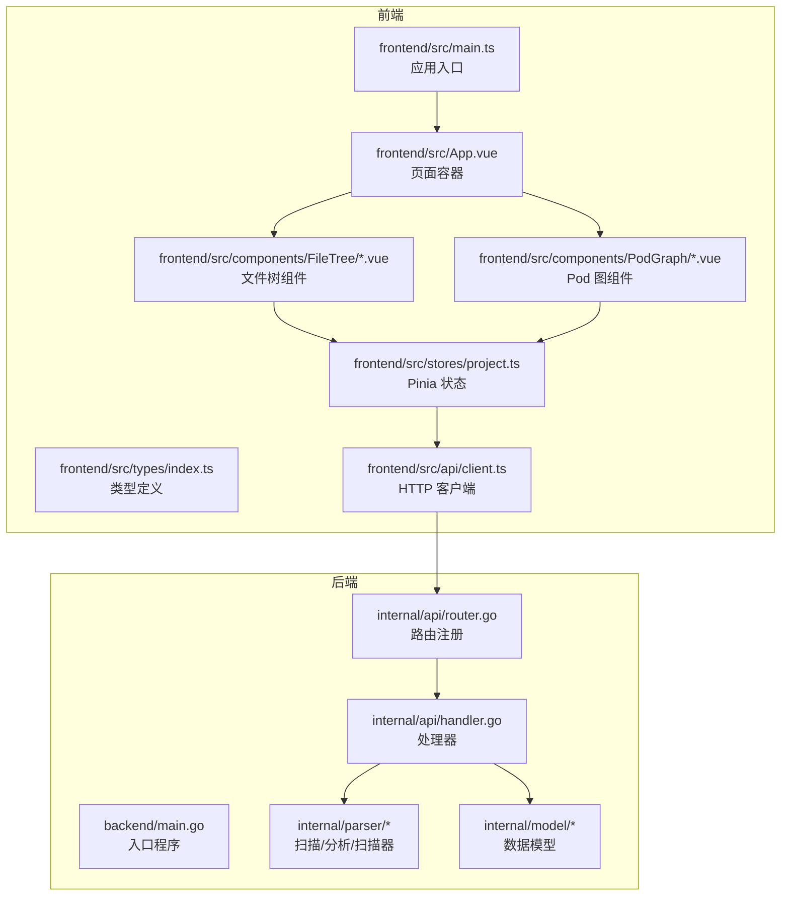
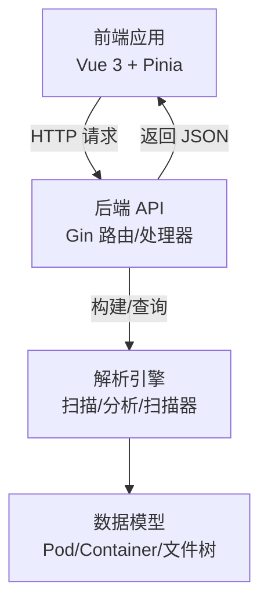
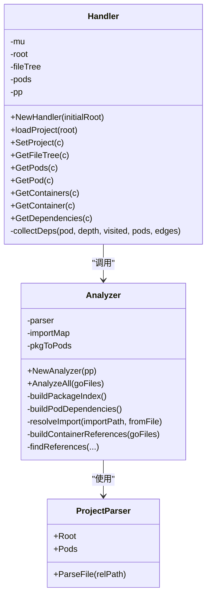
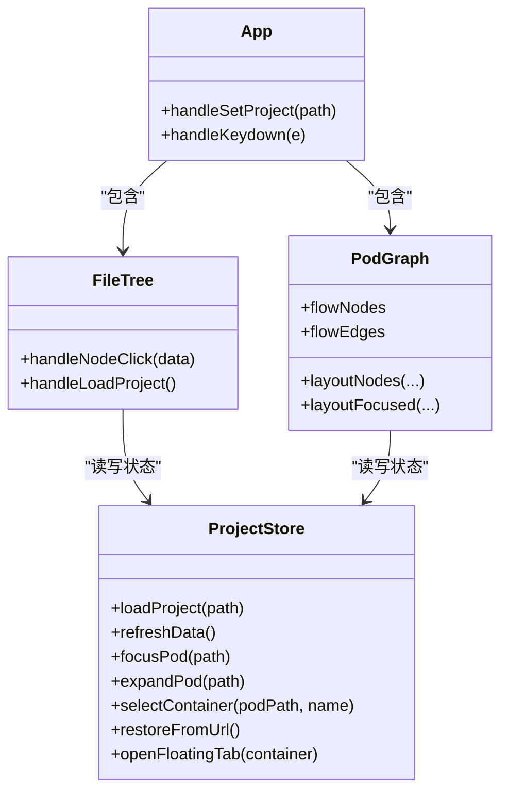
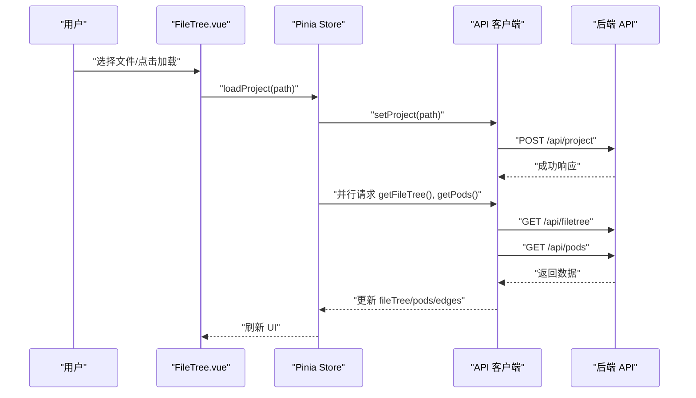
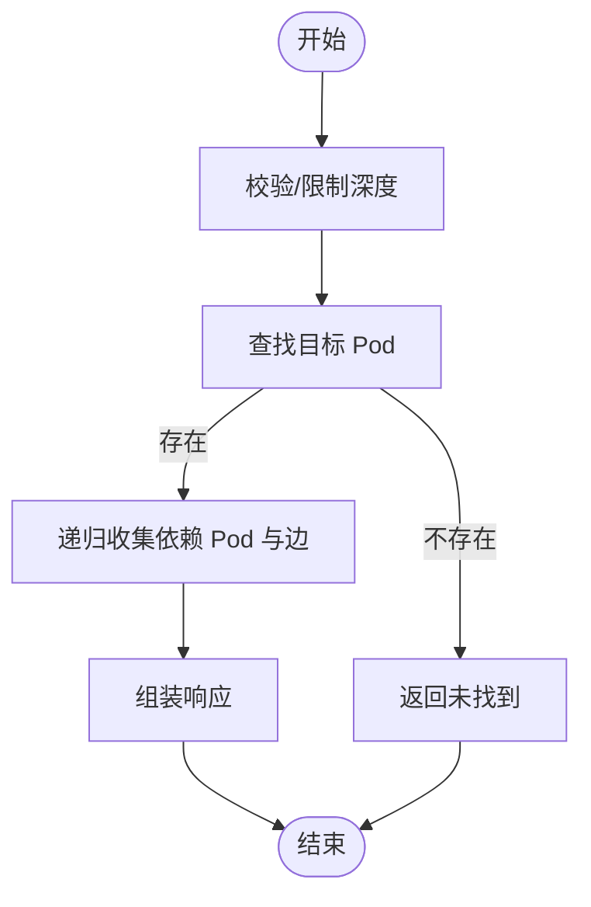
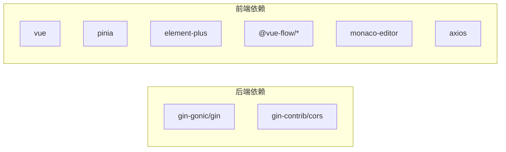

# 架构设计

<cite>
**本文引用的文件**
- [backend/main.go](file://backend/main.go)
- [backend/internal/api/router.go](file://backend/internal/api/router.go)
- [backend/internal/api/handler.go](file://backend/internal/api/handler.go)
- [backend/internal/model/pod.go](file://backend/internal/model/pod.go)
- [backend/internal/parser/analyzer.go](file://backend/internal/parser/analyzer.go)
- [backend/go.mod](file://backend/go.mod)
- [frontend/src/main.ts](file://frontend/src/main.ts)
- [frontend/src/api/client.ts](file://frontend/src/api/client.ts)
- [frontend/src/stores/project.ts](file://frontend/src/stores/project.ts)
- [frontend/src/types/index.ts](file://frontend/src/types/index.ts)
- [frontend/src/App.vue](file://frontend/src/App.vue)
- [frontend/src/components/FileTree/FileTree.vue](file://frontend/src/components/FileTree/FileTree.vue)
- [frontend/src/components/PodGraph/PodGraph.vue](file://frontend/src/components/PodGraph/PodGraph.vue)
- [frontend/package.json](file://frontend/package.json)
- [README.md](file://README.md)
</cite>

## 目录
1. [引言](#引言)
2. [项目结构](#项目结构)
3. [核心组件](#核心组件)
4. [架构总览](#架构总览)
5. [详细组件分析](#详细组件分析)
6. [依赖分析](#依赖分析)
7. [性能考量](#性能考量)
8. [故障排查指南](#故障排查指南)
9. [结论](#结论)
10. [附录](#附录)

## 引言
本项目“GoPodView”是一个前后端分离的可视化工具，用于探索 Go 项目的代码结构。后端基于 Go 的 AST 解析与 Gin 框架，负责扫描与分析 Go 项目、构建 Pod（文件级）与 Container（函数/类型等声明）模型，并通过 REST API 提供数据；前端基于 Vue 3 + TypeScript，使用 Pinia 进行状态管理，结合 Vue Flow 和 Monaco Editor 实现交互式依赖图与源码查看。

## 项目结构
- 后端采用模块化分层：入口程序、API 路由与处理器、模型定义、解析器（扫描/分析/扫描器）。
- 前端采用组件化架构：页面容器组件（App）、业务组件（FileTree、PodGraph 等）、UI 组件（Element Plus）、状态管理（Pinia Store）、类型定义与 API 客户端。

图表来源
- [backend/main.go:11-30](file://backend/main.go#L11-L30)
- [backend/internal/api/router.go:8-31](file://backend/internal/api/router.go#L8-L31)
- [backend/internal/api/handler.go:15-29](file://backend/internal/api/handler.go#L15-L29)
- [frontend/src/main.ts:1-12](file://frontend/src/main.ts#L1-L12)
- [frontend/src/App.vue:1-125](file://frontend/src/App.vue#L1-L125)
- [frontend/src/components/FileTree/FileTree.vue:1-201](file://frontend/src/components/FileTree/FileTree.vue#L1-L201)
- [frontend/src/components/PodGraph/PodGraph.vue:1-581](file://frontend/src/components/PodGraph/PodGraph.vue#L1-L581)
- [frontend/src/stores/project.ts:14-476](file://frontend/src/stores/project.ts#L14-L476)
- [frontend/src/api/client.ts:10-53](file://frontend/src/api/client.ts#L10-L53)

章节来源
- [README.md:79-104](file://README.md#L79-L104)
- [backend/main.go:11-30](file://backend/main.go#L11-L30)
- [frontend/src/main.ts:1-12](file://frontend/src/main.ts#L1-L12)

## 核心组件
- 后端入口与启动：负责解析命令行参数、初始化处理器与路由器，并在指定端口启动 HTTP 服务。
- API 路由与处理器：统一配置 CORS、注册 /api 前缀下的资源接口，处理项目加载、文件树、Pod 列表与详情、容器详情、依赖查询等。
- 数据模型：定义 Pod、Container、文件树节点等核心数据结构。
- 解析器：扫描项目文件、构建包索引、计算 Pod 依赖、建立容器引用关系。
- 前端应用入口：创建 Vue 应用、安装 Pinia 与 UI 框架，挂载根组件。
- 状态管理：集中管理项目路径、文件树、Pod 列表、边集合、视图层级、导航历史、展开集合、选中容器、浮动标签页等。
- API 客户端：封装 axios，提供 setProject、getFileTree、getPods、getPod、getContainers、getContainer、getDependencies 等方法。
- 页面与组件：App.vue 作为页面容器，FileTree.vue 作为侧边栏文件树，PodGraph.vue 作为主区域的交互式依赖图。

章节来源
- [backend/main.go:11-30](file://backend/main.go#L11-L30)
- [backend/internal/api/router.go:8-31](file://backend/internal/api/router.go#L8-L31)
- [backend/internal/api/handler.go:15-225](file://backend/internal/api/handler.go#L15-L225)
- [backend/internal/model/pod.go:3-18](file://backend/internal/model/pod.go#L3-L18)
- [backend/internal/parser/analyzer.go:13-236](file://backend/internal/parser/analyzer.go#L13-L236)
- [frontend/src/main.ts:1-12](file://frontend/src/main.ts#L1-L12)
- [frontend/src/stores/project.ts:14-476](file://frontend/src/stores/project.ts#L14-L476)
- [frontend/src/api/client.ts:10-53](file://frontend/src/api/client.ts#L10-L53)
- [frontend/src/App.vue:1-125](file://frontend/src/App.vue#L1-L125)
- [frontend/src/components/FileTree/FileTree.vue:1-201](file://frontend/src/components/FileTree/FileTree.vue#L1-L201)
- [frontend/src/components/PodGraph/PodGraph.vue:1-581](file://frontend/src/components/PodGraph/PodGraph.vue#L1-L581)

## 架构总览
系统采用典型的前后端分离架构：
- 后端：API 层（Gin 路由与处理器）+ 业务逻辑层（解析器）+ 数据访问层（内存态，无数据库）。
- 前端：页面组件（App.vue）+ 业务组件（FileTree、PodGraph）+ UI 组件（Element Plus）+ 状态管理（Pinia）+ 类型与 API 客户端。

图表来源
- [backend/internal/api/router.go:8-31](file://backend/internal/api/router.go#L8-L31)
- [backend/internal/api/handler.go:31-50](file://backend/internal/api/handler.go#L31-L50)
- [backend/internal/parser/analyzer.go:27-39](file://backend/internal/parser/analyzer.go#L27-L39)
- [backend/internal/model/pod.go:3-18](file://backend/internal/model/pod.go#L3-L18)
- [frontend/src/api/client.ts:10-53](file://frontend/src/api/client.ts#L10-L53)

## 详细组件分析

### 后端分层架构
- API 层
  - 负责注册 /api 前缀路由，启用 CORS，处理跨域请求。
  - 提供项目设置、文件树、Pod 列表、单个 Pod、容器列表、单个容器、依赖查询等接口。
- 业务逻辑层（解析器）
  - 扫描项目文件，构建包索引与导入映射，计算 Pod 间依赖关系，建立容器引用。
- 数据访问层（内存态）
  - 使用互斥锁保护共享状态，避免并发读写问题；所有数据驻留在内存中，不涉及持久化存储。

图表来源
- [backend/internal/api/handler.go:15-225](file://backend/internal/api/handler.go#L15-L225)
- [backend/internal/parser/analyzer.go:13-236](file://backend/internal/parser/analyzer.go#L13-L236)

章节来源
- [backend/internal/api/router.go:8-31](file://backend/internal/api/router.go#L8-L31)
- [backend/internal/api/handler.go:15-225](file://backend/internal/api/handler.go#L15-L225)
- [backend/internal/parser/analyzer.go:13-236](file://backend/internal/parser/analyzer.go#L13-L236)

### 前端组件化架构
- 页面组件（App.vue）
  - 作为根容器，负责键盘快捷键导航、项目加载回调、面包屑导航等。
- 业务组件
  - FileTree.vue：侧边栏文件树，支持搜索、聚焦到对应 Pod、高亮当前节点。
  - PodGraph.vue：主区域依赖图，支持全局/聚焦/展开/代码视图，内置布局算法与节点类型。
- UI 组件（Element Plus）
  - 使用按钮组、输入框、树形控件、骨架屏等 UI 元素提升交互体验。
- 状态管理（Pinia）
  - 集中管理项目路径、文件树、Pod 列表、边集合、视图层级、导航历史、展开集合、选中容器、浮动标签页等。
  - 支持从 URL 恢复状态、同步 URL 参数、历史前进/后退。
- 类型与 API 客户端
  - types/index.ts 定义了 Pod、Container、FileTreeNode、依赖响应等类型。
  - api/client.ts 封装 axios，提供统一的 HTTP 方法。

图表来源
- [frontend/src/App.vue:1-125](file://frontend/src/App.vue#L1-L125)
- [frontend/src/components/FileTree/FileTree.vue:1-201](file://frontend/src/components/FileTree/FileTree.vue#L1-L201)
- [frontend/src/components/PodGraph/PodGraph.vue:1-581](file://frontend/src/components/PodGraph/PodGraph.vue#L1-L581)
- [frontend/src/stores/project.ts:14-476](file://frontend/src/stores/project.ts#L14-L476)

章节来源
- [frontend/src/App.vue:1-125](file://frontend/src/App.vue#L1-L125)
- [frontend/src/components/FileTree/FileTree.vue:1-201](file://frontend/src/components/FileTree/FileTree.vue#L1-L201)
- [frontend/src/components/PodGraph/PodGraph.vue:1-581](file://frontend/src/components/PodGraph/PodGraph.vue#L1-L581)
- [frontend/src/stores/project.ts:14-476](file://frontend/src/stores/project.ts#L14-L476)
- [frontend/src/types/index.ts:1-74](file://frontend/src/types/index.ts#L1-L74)
- [frontend/src/api/client.ts:10-53](file://frontend/src/api/client.ts#L10-L53)

### 数据流与状态管理机制
- 数据流向
  - 用户在 FileTree 中选择文件或在 App 中输入项目路径，触发 ProjectStore.loadProject。
  - Store 并行请求文件树与 Pod 列表，随后根据视图层级更新 UI。
  - 在 PodGraph 中点击 Pod 或容器时，Store 通过 API 客户端获取容器详情或源码，并更新状态。
- 状态管理
  - Pinia Store 统一管理视图层级（global/focused/expanded/code）、聚焦 Pod、展开集合、选中容器、导航历史、浮动标签页等。
  - URL 同步：当状态变化时，自动将项目路径、聚焦文件、视图层级、展开集合写入 URL；应用启动时可从 URL 恢复状态。
- 复杂逻辑示例：展开 Pod 与收集展开分支
  - expandInlinePod/expandPod/collapseInlinePod 等方法维护展开集合与导航历史，并在需要时确保容器源码已加载。
  - collectExpandedBranch 基于邻接表遍历展开分支，保证折叠时正确移除子树。

图表来源
- [frontend/src/components/FileTree/FileTree.vue:37-48](file://frontend/src/components/FileTree/FileTree.vue#L37-L48)
- [frontend/src/stores/project.ts:57-92](file://frontend/src/stores/project.ts#L57-L92)
- [frontend/src/api/client.ts:15-28](file://frontend/src/api/client.ts#L15-L28)
- [backend/internal/api/handler.go:56-75](file://backend/internal/api/handler.go#L56-L75)

章节来源
- [frontend/src/stores/project.ts:57-92](file://frontend/src/stores/project.ts#L57-L92)
- [frontend/src/api/client.ts:15-28](file://frontend/src/api/client.ts#L15-L28)
- [backend/internal/api/handler.go:56-75](file://backend/internal/api/handler.go#L56-L75)

### 关键流程：依赖查询与展开逻辑
- 依赖查询
  - 前端调用 getDependencies(path, depth)，后端根据深度递归收集依赖 Pod 与边，限制最大深度。
- 展开逻辑
  - expandInlinePod/expandPod/collapseInlinePod 维护展开集合，必要时拉取容器源码，更新导航历史与 URL。

图表来源
- [backend/internal/api/handler.go:177-209](file://backend/internal/api/handler.go#L177-L209)
- [backend/internal/api/handler.go:211-224](file://backend/internal/api/handler.go#L211-L224)

章节来源
- [backend/internal/api/handler.go:177-209](file://backend/internal/api/handler.go#L177-L209)
- [backend/internal/api/handler.go:211-224](file://backend/internal/api/handler.go#L211-L224)

## 依赖分析
- 后端依赖
  - Gin 用于路由与 HTTP 处理，CORS 插件用于跨域配置。
- 前端依赖
  - Vue 3、Pinia、Element Plus、@vue-flow/*、Monaco Editor、Axios 等。

图表来源
- [backend/go.mod:5-8](file://backend/go.mod#L5-L8)
- [frontend/package.json:11-22](file://frontend/package.json#L11-L22)

章节来源
- [backend/go.mod:5-8](file://backend/go.mod#L5-L8)
- [frontend/package.json:11-22](file://frontend/package.json#L11-L22)

## 性能考量
- 并发与锁
  - 后端使用互斥锁保护共享状态，避免竞态条件；建议在高并发场景下评估锁粒度与读写分离策略。
- 数据传输优化
  - 后端在返回 Pods 时对容器源码进行裁剪，减少传输体积；前端按需请求容器源码。
- 前端渲染优化
  - PodGraph 使用 Vue Flow 的节点测量与布局算法，支持可见性过滤与层级布局；建议在大数据集下进一步优化布局与节点尺寸缓存。
- 网络超时与重试
  - 前端 axios 设置超时时间，建议在复杂依赖查询场景下增加重试与错误提示。

## 故障排查指南
- 后端启动失败
  - 检查端口占用与权限；确认传入的项目路径有效且可读。
- 前端无法加载项目
  - 确认 CORS 配置允许前端地址；检查 /api/project 是否返回成功；查看浏览器网络面板与后端日志。
- 依赖查询异常
  - 检查 depth 参数范围（1~10），确认目标 Pod 存在；查看后端日志中的错误信息。
- 状态不同步
  - 检查 URL 同步逻辑是否被抑制；确认 watch 依赖是否正确触发；尝试手动刷新页面恢复状态。

章节来源
- [backend/main.go:27-29](file://backend/main.go#L27-L29)
- [backend/internal/api/router.go:12-17](file://backend/internal/api/router.go#L12-L17)
- [backend/internal/api/handler.go:182-189](file://backend/internal/api/handler.go#L182-L189)
- [frontend/src/stores/project.ts:342-378](file://frontend/src/stores/project.ts#L342-L378)

## 结论
本项目通过清晰的前后端分层与组件化架构，实现了对 Go 项目结构的可视化探索。后端专注于 AST 解析与数据聚合，前端专注交互与展示，二者通过 REST API 协作。Pinia 状态管理与 URL 同步提升了用户体验与可维护性。未来可在并发控制、布局性能与错误处理方面持续优化。

## 附录
- 快速开始与 API 参考见项目自述文件。

章节来源
- [README.md:52-78](file://README.md#L52-L78)