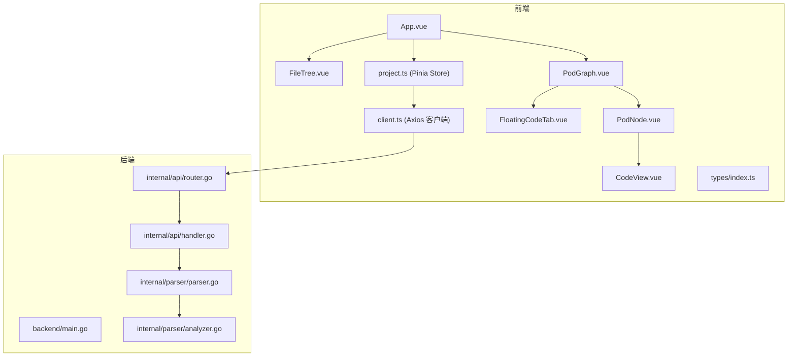
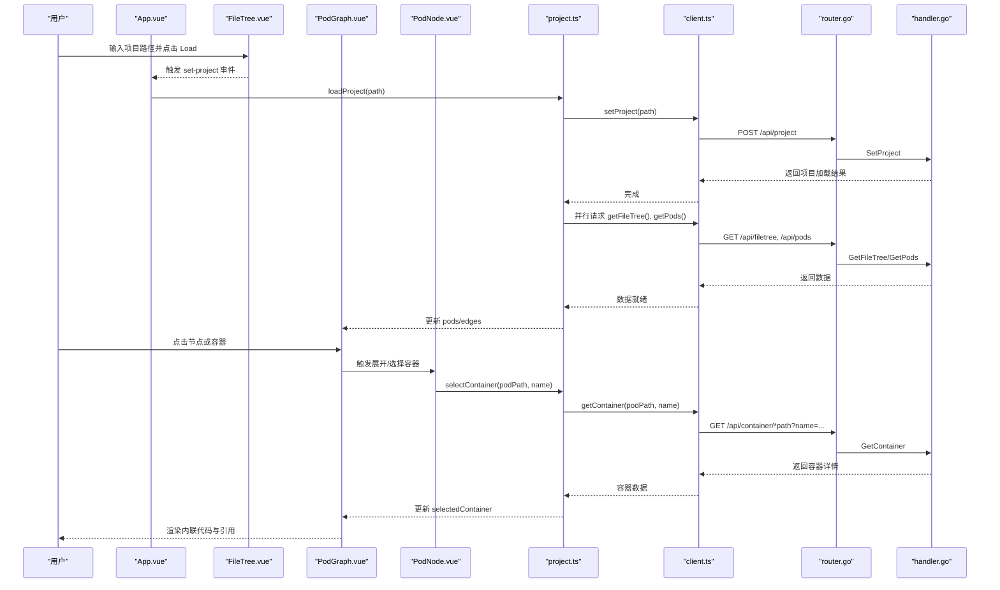
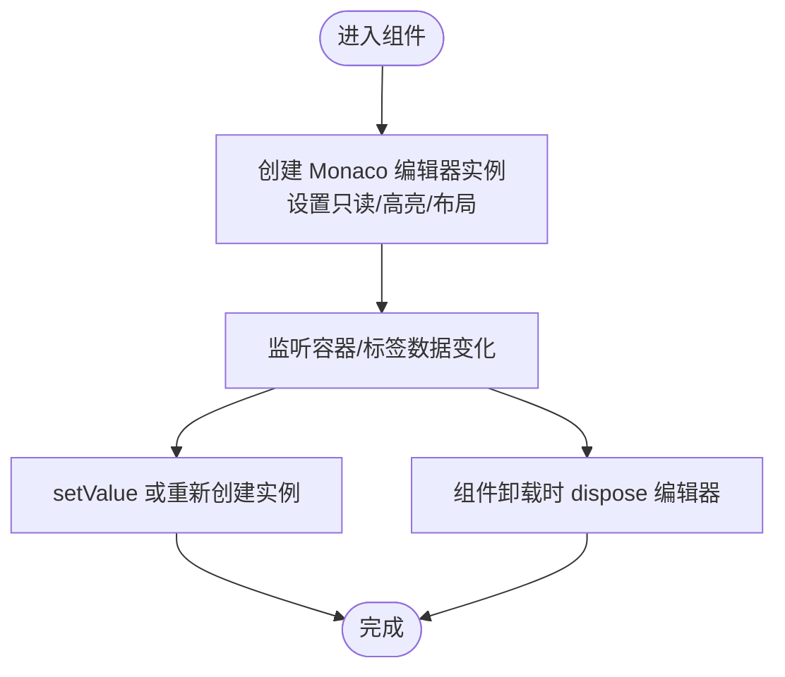
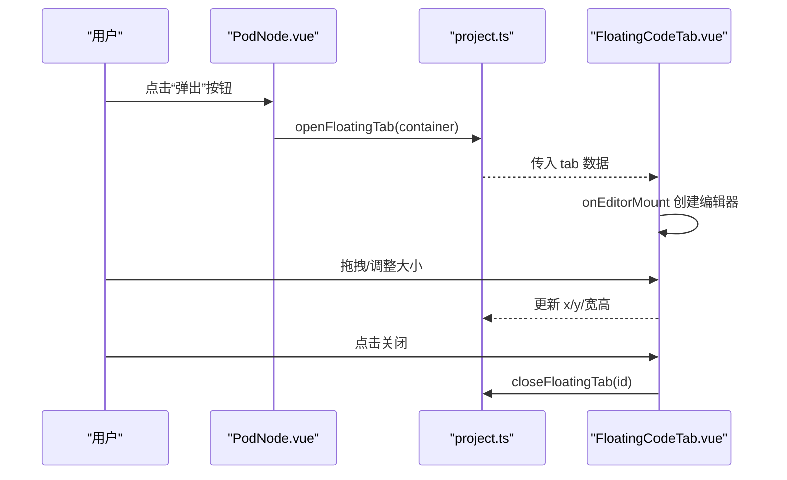
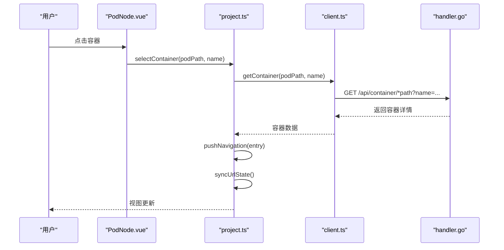
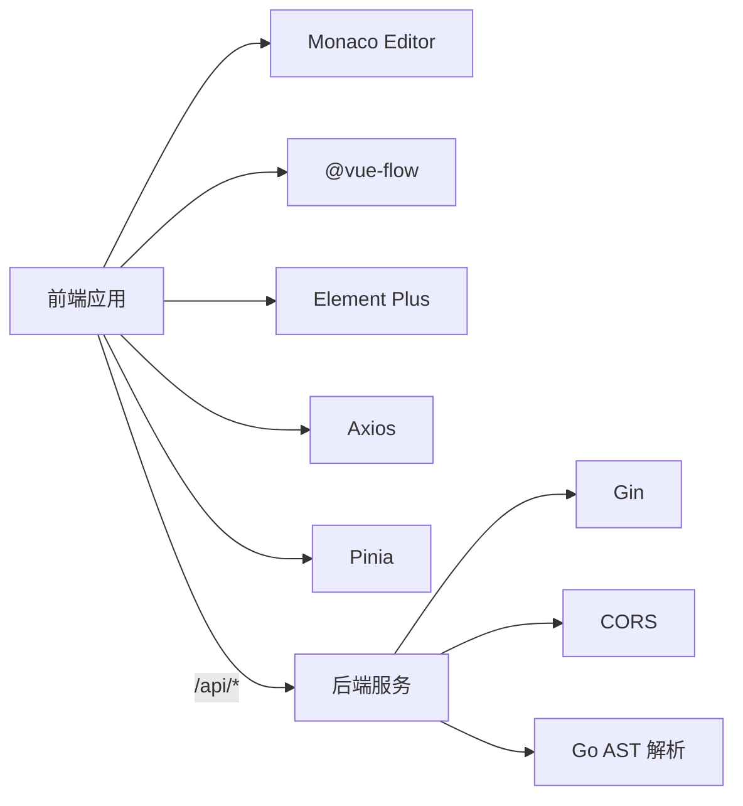

# 代码浏览与导航

<cite>
**本文档引用的文件**
- [frontend/src/components/CodeView/CodeView.vue](file://frontend/src/components/CodeView/CodeView.vue)
- [frontend/src/components/PodGraph/FloatingCodeTab.vue](file://frontend/src/components/PodGraph/FloatingCodeTab.vue)
- [frontend/src/components/PodGraph/PodNode.vue](file://frontend/src/components/PodGraph/PodNode.vue)
- [frontend/src/components/PodGraph/PodGraph.vue](file://frontend/src/components/PodGraph/PodGraph.vue)
- [frontend/src/stores/project.ts](file://frontend/src/stores/project.ts)
- [frontend/src/types/index.ts](file://frontend/src/types/index.ts)
- [frontend/src/api/client.ts](file://frontend/src/api/client.ts)
- [frontend/src/components/FileTree/FileTree.vue](file://frontend/src/components/FileTree/FileTree.vue)
- [frontend/src/App.vue](file://frontend/src/App.vue)
- [backend/internal/parser/parser.go](file://backend/internal/parser/parser.go)
- [backend/internal/parser/analyzer.go](file://backend/internal/parser/analyzer.go)
- [backend/internal/api/handler.go](file://backend/internal/api/handler.go)
- [backend/internal/api/router.go](file://backend/internal/api/router.go)
- [backend/main.go](file://backend/main.go)
- [frontend/package.json](file://frontend/package.json)
- [backend/go.mod](file://backend/go.mod)
</cite>

## 目录
1. [简介](#简介)
2. [项目结构](#项目结构)
3. [核心组件](#核心组件)
4. [架构总览](#架构总览)
5. [详细组件分析](#详细组件分析)
6. [依赖关系分析](#依赖关系分析)
7. [性能考量](#性能考量)
8. [故障排查指南](#故障排查指南)
9. [结论](#结论)
10. [附录](#附录)

## 简介
本文件围绕“代码浏览与导航”主题，系统化梳理前端基于 Monaco Editor 的代码查看与交互能力、浮动代码标签页系统、从依赖图到具体源码的导航机制、URL 同步与历史记录管理、以及实时更新与性能优化策略。目标是帮助用户高效地进行 Go 项目的代码分析与浏览。

## 项目结构
前端采用 Vue 3 + TypeScript + Pinia 架构，后端使用 Gin 提供 REST API。Monaco Editor 被广泛用于代码高亮、只读展示与内联弹出编辑器；@vue-flow 提供节点布局与交互；Element Plus 提供 UI 组件与树形结构展示。

图表来源
- [frontend/src/App.vue:1-125](file://frontend/src/App.vue#L1-L125)
- [frontend/src/components/FileTree/FileTree.vue:1-201](file://frontend/src/components/FileTree/FileTree.vue#L1-L201)
- [frontend/src/components/PodGraph/PodGraph.vue:1-581](file://frontend/src/components/PodGraph/PodGraph.vue#L1-L581)
- [frontend/src/components/PodGraph/PodNode.vue:1-425](file://frontend/src/components/PodGraph/PodNode.vue#L1-L425)
- [frontend/src/components/CodeView/CodeView.vue:1-191](file://frontend/src/components/CodeView/CodeView.vue#L1-L191)
- [frontend/src/components/PodGraph/FloatingCodeTab.vue:1-209](file://frontend/src/components/PodGraph/FloatingCodeTab.vue#L1-L209)
- [frontend/src/stores/project.ts:1-476](file://frontend/src/stores/project.ts#L1-L476)
- [frontend/src/api/client.ts:1-53](file://frontend/src/api/client.ts#L1-L53)
- [backend/main.go:1-31](file://backend/main.go#L1-L31)
- [backend/internal/api/router.go:1-32](file://backend/internal/api/router.go#L1-L32)
- [backend/internal/api/handler.go:1-225](file://backend/internal/api/handler.go#L1-L225)
- [backend/internal/parser/parser.go:1-253](file://backend/internal/parser/parser.go#L1-L253)
- [backend/internal/parser/analyzer.go:1-236](file://backend/internal/parser/analyzer.go#L1-L236)

章节来源
- [frontend/src/App.vue:1-125](file://frontend/src/App.vue#L1-L125)
- [frontend/src/components/FileTree/FileTree.vue:1-201](file://frontend/src/components/FileTree/FileTree.vue#L1-L201)
- [frontend/src/components/PodGraph/PodGraph.vue:1-581](file://frontend/src/components/PodGraph/PodGraph.vue#L1-L581)
- [frontend/src/components/PodGraph/PodNode.vue:1-425](file://frontend/src/components/PodGraph/PodNode.vue#L1-L425)
- [frontend/src/components/CodeView/CodeView.vue:1-191](file://frontend/src/components/CodeView/CodeView.vue#L1-L191)
- [frontend/src/components/PodGraph/FloatingCodeTab.vue:1-209](file://frontend/src/components/PodGraph/FloatingCodeTab.vue#L1-L209)
- [frontend/src/stores/project.ts:1-476](file://frontend/src/stores/project.ts#L1-L476)
- [frontend/src/api/client.ts:1-53](file://frontend/src/api/client.ts#L1-L53)
- [backend/main.go:1-31](file://backend/main.go#L1-L31)
- [backend/internal/api/router.go:1-32](file://backend/internal/api/router.go#L1-L32)
- [backend/internal/api/handler.go:1-225](file://backend/internal/api/handler.go#L1-L225)
- [backend/internal/parser/parser.go:1-253](file://backend/internal/parser/parser.go#L1-L253)
- [backend/internal/parser/analyzer.go:1-236](file://backend/internal/parser/analyzer.go#L1-L236)

## 核心组件
- Monaco Editor 集成：在多个组件中以只读模式创建编辑器实例，用于语法高亮与代码展示，并支持自动布局、换行与内边距等配置。
- 浮动代码标签页：可拖拽、可调整大小，支持关闭；每个标签页独立维护编辑器实例与位置信息。
- 依赖图与节点卡片：通过 @vue-flow 布局节点，PodNode 在展开模式下展示容器列表、分组方法、内联代码编辑器与引用面板。
- 状态与导航：Pinia Store 统一管理视图层级、聚焦 Pod、展开集合、选中的容器、历史记录与浮动标签页；同时负责 URL 同步与恢复。
- API 客户端：封装 /api 前缀的请求，提供项目加载、文件树、Pod 列表、容器详情与依赖查询等接口。

章节来源
- [frontend/src/components/CodeView/CodeView.vue:10-38](file://frontend/src/components/CodeView/CodeView.vue#L10-L38)
- [frontend/src/components/PodGraph/FloatingCodeTab.vue:18-34](file://frontend/src/components/PodGraph/FloatingCodeTab.vue#L18-L34)
- [frontend/src/components/PodGraph/PodNode.vue:161-178](file://frontend/src/components/PodGraph/PodNode.vue#L161-L178)
- [frontend/src/stores/project.ts:315-334](file://frontend/src/stores/project.ts#L315-L334)
- [frontend/src/stores/project.ts:342-378](file://frontend/src/stores/project.ts#L342-L378)
- [frontend/src/api/client.ts:15-52](file://frontend/src/api/client.ts#L15-L52)

## 架构总览
前端通过 App.vue 初始化并监听键盘事件，FileTree.vue 负责项目路径输入与文件树渲染，PodGraph.vue 作为主图区承载节点与边，PodNode.vue 展示容器与内联代码，FloatingCodeTab.vue 提供浮动标签页，CodeView.vue 支持返回上层视图与引用面板。Pinia Store 统一调度数据流与历史记录，Axios 客户端调用后端 API。

图表来源
- [frontend/src/App.vue:30-32](file://frontend/src/App.vue#L30-L32)
- [frontend/src/components/FileTree/FileTree.vue:43-48](file://frontend/src/components/FileTree/FileTree.vue#L43-L48)
- [frontend/src/stores/project.ts:57-92](file://frontend/src/stores/project.ts#L57-L92)
- [frontend/src/api/client.ts:15-52](file://frontend/src/api/client.ts#L15-L52)
- [backend/internal/api/router.go:19-28](file://backend/internal/api/router.go#L19-L28)
- [backend/internal/api/handler.go:56-75](file://backend/internal/api/handler.go#L56-L75)
- [backend/internal/api/handler.go:154-175](file://backend/internal/api/handler.go#L154-L175)

## 详细组件分析

### Monaco Editor 集成与功能
- 代码高亮：在 CodeView.vue、FloatingCodeTab.vue、PodNode.vue 中均以语言为 go 创建只读编辑器，确保语法高亮与只读体验一致。
- 自动布局与换行：启用 automaticLayout 与 wordWrap，适配窗口变化与长代码显示。
- 内联弹出：PodNode.vue 在展开模式下为结构体/方法生成内联编辑器，FloatingCodeTab.vue 支持独立浮动标签页。
- 实时更新：通过 watch 监听容器变更，及时更新编辑器内容；在卸载时释放编辑器实例，避免内存泄漏。

图表来源
- [frontend/src/components/CodeView/CodeView.vue:12-38](file://frontend/src/components/CodeView/CodeView.vue#L12-L38)
- [frontend/src/components/PodGraph/FloatingCodeTab.vue:18-34](file://frontend/src/components/PodGraph/FloatingCodeTab.vue#L18-L34)
- [frontend/src/components/PodGraph/PodNode.vue:161-178](file://frontend/src/components/PodGraph/PodNode.vue#L161-L178)

章节来源
- [frontend/src/components/CodeView/CodeView.vue:12-38](file://frontend/src/components/CodeView/CodeView.vue#L12-L38)
- [frontend/src/components/PodGraph/FloatingCodeTab.vue:18-34](file://frontend/src/components/PodGraph/FloatingCodeTab.vue#L18-L34)
- [frontend/src/components/PodGraph/PodNode.vue:161-178](file://frontend/src/components/PodGraph/PodNode.vue#L161-L178)

### 浮动代码标签页系统
- 创建：openFloatingTab 根据容器信息生成唯一 id、标题、签名与初始坐标，加入 floatingTabs。
- 拖拽：通过鼠标按下/移动/抬起事件计算偏移量，实时更新标签位置。
- 调整大小：记录初始宽高与鼠标位置，限制最小尺寸，动态更新标签尺寸。
- 关闭：closeFloatingTab 过滤掉对应 id 的标签。
- 状态管理：标签位置、尺寸与内容由 store 维护，组件内仅负责交互逻辑与编辑器生命周期。

图表来源
- [frontend/src/components/PodGraph/PodNode.vue:156-159](file://frontend/src/components/PodGraph/PodNode.vue#L156-L159)
- [frontend/src/stores/project.ts:315-334](file://frontend/src/stores/project.ts#L315-L334)
- [frontend/src/components/PodGraph/FloatingCodeTab.vue:36-78](file://frontend/src/components/PodGraph/FloatingCodeTab.vue#L36-L78)
- [frontend/src/components/PodGraph/FloatingCodeTab.vue:80-82](file://frontend/src/components/PodGraph/FloatingCodeTab.vue#L80-L82)

章节来源
- [frontend/src/stores/project.ts:315-334](file://frontend/src/stores/project.ts#L315-L334)
- [frontend/src/components/PodGraph/FloatingCodeTab.vue:18-90](file://frontend/src/components/PodGraph/FloatingCodeTab.vue#L18-L90)

### 从依赖图到具体源码的导航机制
- 点击跳转：PodNode.vue 在容器点击时根据是否按住修饰键决定直接跳转到引用或切换代码视图；selectContainer 更新 store 的 selectedContainer 并同步 URL。
- URL 同步：syncUrlState 将项目路径、聚焦 Pod、视图层级与展开集合编码到查询参数，使用 replaceState 更新地址栏。
- 历史记录：pushNavigation 记录每次导航动作；goBack/goForward 通过 historyIndex 控制前进后退；restoreFromUrl 支持从 URL 恢复视图状态。

图表来源
- [frontend/src/components/PodGraph/PodNode.vue:113-120](file://frontend/src/components/PodGraph/PodNode.vue#L113-L120)
- [frontend/src/stores/project.ts:260-284](file://frontend/src/stores/project.ts#L260-L284)
- [frontend/src/stores/project.ts:103-108](file://frontend/src/stores/project.ts#L103-L108)
- [frontend/src/stores/project.ts:342-373](file://frontend/src/stores/project.ts#L342-L373)
- [frontend/src/api/client.ts:40-44](file://frontend/src/api/client.ts#L40-L44)
- [backend/internal/api/handler.go:154-175](file://backend/internal/api/handler.go#L154-L175)

章节来源
- [frontend/src/components/PodGraph/PodNode.vue:113-120](file://frontend/src/components/PodGraph/PodNode.vue#L113-L120)
- [frontend/src/stores/project.ts:260-284](file://frontend/src/stores/project.ts#L260-L284)
- [frontend/src/stores/project.ts:103-108](file://frontend/src/stores/project.ts#L103-L108)
- [frontend/src/stores/project.ts:342-373](file://frontend/src/stores/project.ts#L342-L373)
- [frontend/src/api/client.ts:40-44](file://frontend/src/api/client.ts#L40-L44)
- [backend/internal/api/handler.go:154-175](file://backend/internal/api/handler.go#L154-L175)

### 代码查看的实时更新与性能优化
- 即时更新：watch 监听 selectedContainer 与容器数据变化，自动刷新内联编辑器内容；FloatingCodeTab.vue 也对 tab.sourceCode 做响应式更新。
- 资源释放：组件卸载时统一 dispose 编辑器实例，避免内存泄漏。
- 批量加载：store.refreshData 与 loadProject 使用 Promise.all 并行请求文件树与 Pods，减少等待时间。
- 展开策略：ensurePodSourceCode 仅在需要时拉取容器源码，避免一次性加载全部内容。
- 布局抖动控制：通过 bumpLayout 与 layoutVersion 触发布局重算，减少不必要的重绘。

章节来源
- [frontend/src/stores/project.ts:78-92](file://frontend/src/stores/project.ts#L78-L92)
- [frontend/src/stores/project.ts:249-258](file://frontend/src/stores/project.ts#L249-L258)
- [frontend/src/components/PodGraph/PodNode.vue:180-210](file://frontend/src/components/PodGraph/PodNode.vue#L180-L210)
- [frontend/src/components/PodGraph/FloatingCodeTab.vue:84-90](file://frontend/src/components/PodGraph/FloatingCodeTab.vue#L84-L90)

### 数据模型与类型定义
- Container/Reference/Pod/PodEdge/FileTreeNode/PodsResponse/DependenciesResponse：统一的数据契约，支撑前后端交互与组件渲染。
- ViewLevel/NavigationEntry/FloatingTab：视图状态与导航历史、浮动标签页结构。

章节来源
- [frontend/src/types/index.ts:1-74](file://frontend/src/types/index.ts#L1-L74)

## 依赖关系分析
- 前端依赖：Vue 3、Monaco Editor、@vue-flow、Element Plus、Axios、Pinia 等。
- 后端依赖：Gin、CORS、Go AST 解析库。
- 前后端接口：/api/project、/api/filetree、/api/pods、/api/pod/*path、/api/containers/*path、/api/container/*path、/api/dependencies/*path。

图表来源
- [frontend/package.json:11-22](file://frontend/package.json#L11-L22)
- [backend/go.mod:5-8](file://backend/go.mod#L5-L8)
- [backend/internal/api/router.go:19-28](file://backend/internal/api/router.go#L19-L28)

章节来源
- [frontend/package.json:11-22](file://frontend/package.json#L11-L22)
- [backend/go.mod:5-8](file://backend/go.mod#L5-L8)
- [backend/internal/api/router.go:19-28](file://backend/internal/api/router.go#L19-L28)

## 性能考量
- 并行请求：前端在加载项目时并行获取文件树与 Pods，缩短首屏时间。
- 懒加载：仅在展开 Pod 或选择容器时才请求容器源码，降低网络与内存压力。
- 编辑器生命周期：组件卸载时释放 Monaco 实例，避免内存累积。
- 布局优化：通过布局版本号与增量更新，减少不必要的重排与重绘。
- 参考查找：后端解析 AST 时限定在容器起止行范围内，缩小扫描范围。

## 故障排查指南
- 无法加载项目
  - 检查 /api/project 是否返回成功；确认后端已正确初始化解析器。
  - 确认 CORS 配置允许前端域名访问。
- 依赖图空白
  - 确认 /api/pods 返回包含 pods 与 edges；检查 store.pods/edges 是否更新。
- 代码不显示或高亮异常
  - 确认 Monaco 编辑器已正确挂载；检查语言设置为 go；确认 sourceCode 已填充。
- 历史记录无效
  - 检查 pushNavigation 与 syncUrlState 是否被调用；确认 URL 查询参数是否正确。
- 引用跳转失败
  - 确认容器 references 是否存在；检查 selectContainer 参数与后端 /api/container/*path 接口返回。

章节来源
- [frontend/src/stores/project.ts:57-92](file://frontend/src/stores/project.ts#L57-L92)
- [backend/internal/api/router.go:19-28](file://backend/internal/api/router.go#L19-L28)
- [backend/internal/api/handler.go:93-124](file://backend/internal/api/handler.go#L93-L124)
- [frontend/src/components/PodGraph/PodNode.vue:145-149](file://frontend/src/components/PodGraph/PodNode.vue#L145-L149)

## 结论
该系统通过 Monaco Editor 提供高质量的代码阅读体验，结合 @vue-flow 的可视化布局与 Pinia 的集中状态管理，实现了从依赖图到具体源码的流畅导航。浮动标签页进一步提升了多文件并行分析的能力。通过并行加载、懒加载与资源释放等策略，兼顾了性能与可用性。建议在实际使用中配合 URL 同步与历史记录，形成可追踪的分析流程。

## 附录
- 使用场景与最佳实践
  - 快速定位：在 FileTree 中定位文件，点击聚焦；在 PodGraph 中展开相关 Pod 查看容器。
  - 多文件对比：使用浮动标签页打开不同容器，便于并行对比。
  - 引用分析：在容器详情中点击引用项，快速跳转到目标容器。
  - 键盘导航：使用 Cmd+[ 与 Cmd+] 在历史记录间前进后退。
  - URL 分享：通过 URL 参数分享当前视图状态，便于协作与回溯。