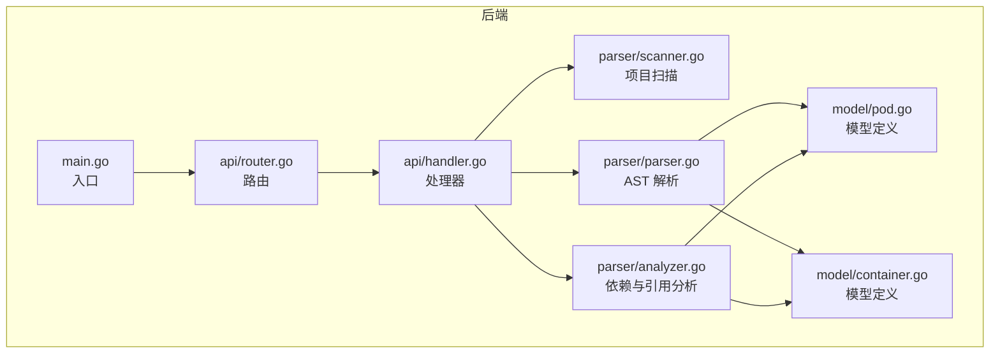
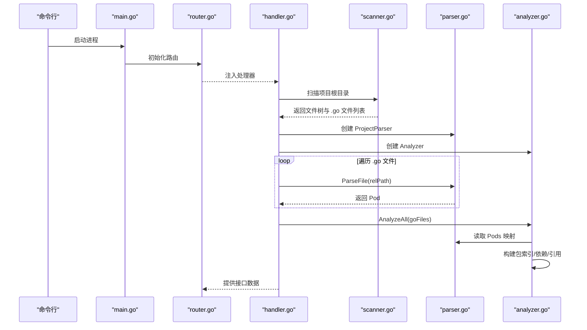
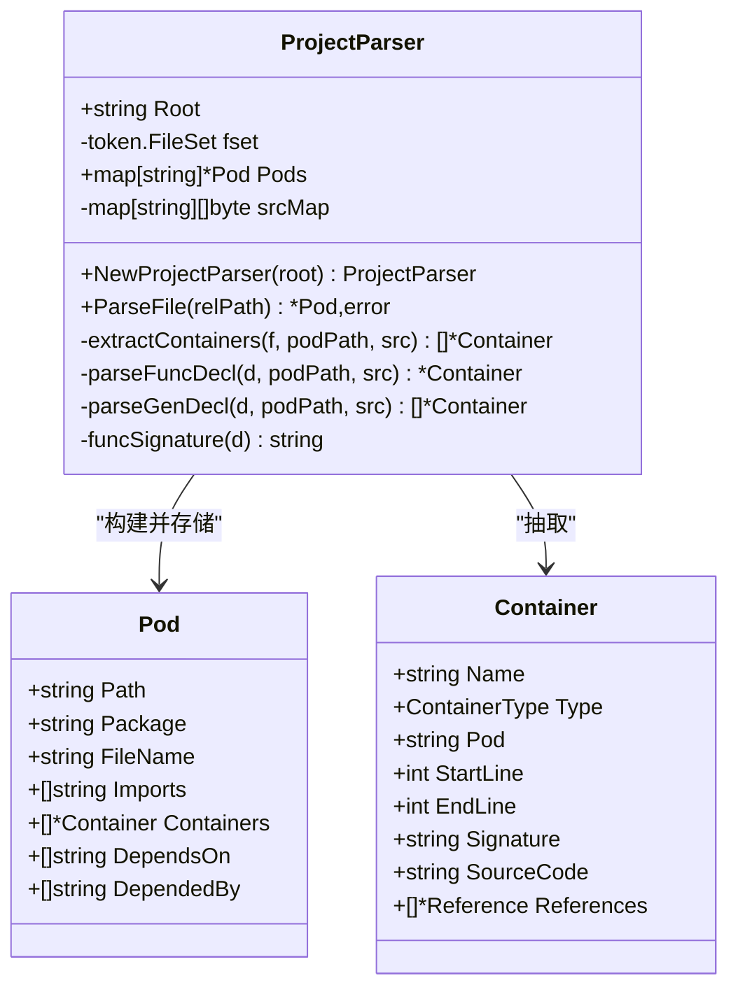
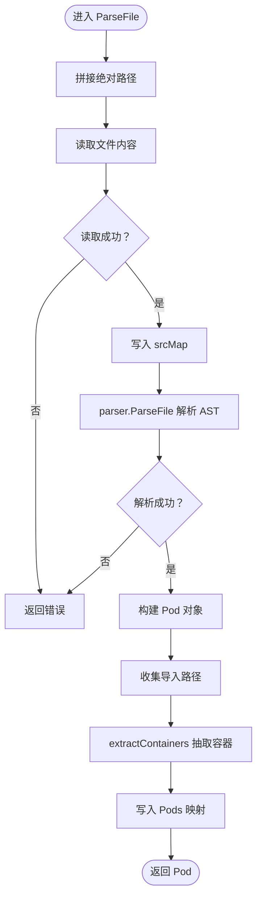
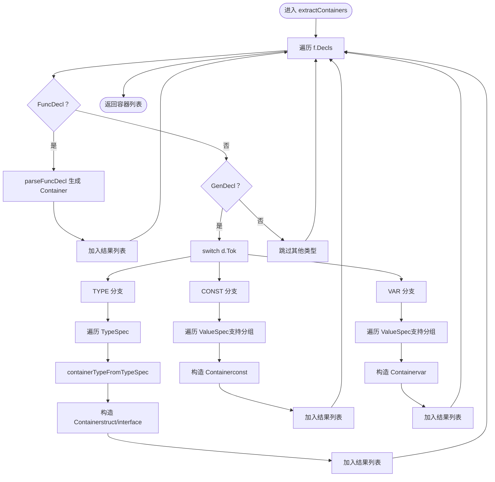
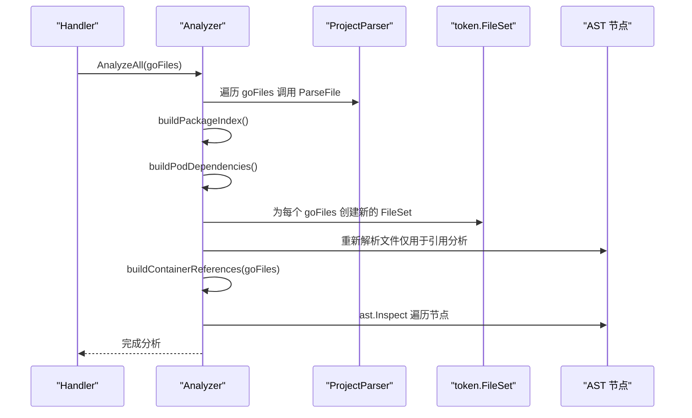
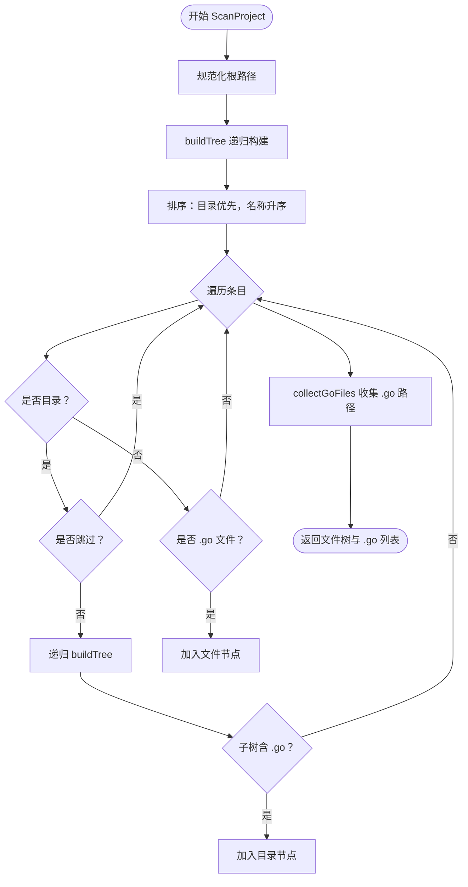
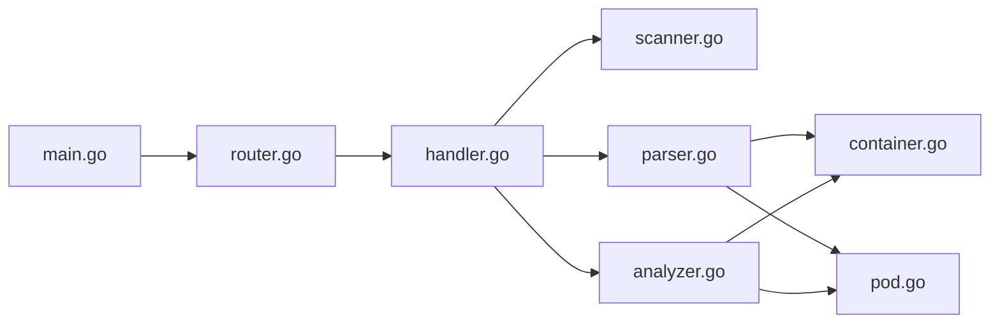

# AST 解析核心

<cite>
**本文引用的文件列表**
- [parser.go](file://backend/internal/parser/parser.go)
- [analyzer.go](file://backend/internal/parser/analyzer.go)
- [scanner.go](file://backend/internal/parser/scanner.go)
- [container.go](file://backend/internal/model/container.go)
- [pod.go](file://backend/internal/model/pod.go)
- [handler.go](file://backend/internal/api/handler.go)
- [router.go](file://backend/internal/api/router.go)
- [main.go](file://backend/main.go)
- [go.mod](file://backend/go.mod)
</cite>

## 目录
1. [简介](#简介)
2. [项目结构](#项目结构)
3. [核心组件](#核心组件)
4. [架构总览](#架构总览)
5. [详细组件分析](#详细组件分析)
6. [依赖分析](#依赖分析)
7. [性能考虑](#性能考虑)
8. [故障排查指南](#故障排查指南)
9. [结论](#结论)
10. [附录](#附录)

## 简介
本技术文档聚焦于 GoPodView 后端的 AST（抽象语法树）解析核心，系统阐述从词法分析、语法分析到语义分析的完整流程，详解 ProjectParser 的设计与实现，包括文件集管理、Pod 存储与源码映射机制；深入解析 ParseFile 方法的实现细节与错误处理策略；说明 extractContainers 如何遍历 AST 节点并提取容器信息；并给出针对函数声明、类型声明、变量声明等不同 Go 声明类型的处理逻辑与示例路径。

## 项目结构
后端采用分层与职责分离的组织方式：
- parser 层：负责扫描项目、构建文件树、解析单个 Go 文件为 AST 并抽取容器信息，以及基于 AST 的依赖与引用分析。
- model 层：定义数据模型（Pod、Container、Reference、FileTreeNode 等）。
- api 层：提供 HTTP 接口，加载项目、查询文件树、Pod 列表与详情、容器详情、依赖图等。
- main 入口：解析命令行参数，启动 HTTP 服务。

图表来源
- [main.go:1-31](file://backend/main.go#L1-L31)
- [router.go:1-32](file://backend/internal/api/router.go#L1-L32)
- [handler.go:1-225](file://backend/internal/api/handler.go#L1-L225)
- [scanner.go:1-113](file://backend/internal/parser/scanner.go#L1-L113)
- [parser.go:1-253](file://backend/internal/parser/parser.go#L1-L253)
- [analyzer.go:1-236](file://backend/internal/parser/analyzer.go#L1-L236)
- [pod.go:1-19](file://backend/internal/model/pod.go#L1-L19)
- [container.go:1-37](file://backend/internal/model/container.go#L1-L37)

章节来源
- [main.go:1-31](file://backend/main.go#L1-L31)
- [router.go:1-32](file://backend/internal/api/router.go#L1-L32)
- [handler.go:1-225](file://backend/internal/api/handler.go#L1-L225)
- [scanner.go:1-113](file://backend/internal/parser/scanner.go#L1-L113)
- [parser.go:1-253](file://backend/internal/parser/parser.go#L1-L253)
- [analyzer.go:1-236](file://backend/internal/parser/analyzer.go#L1-L236)
- [pod.go:1-19](file://backend/internal/model/pod.go#L1-L19)
- [container.go:1-37](file://backend/internal/model/container.go#L1-L37)

## 核心组件
- ProjectParser：负责单文件 AST 解析、容器抽取、Pod 构建与存储、源码映射。
- Analyzer：在 ProjectParser 的基础上，构建包索引、计算 Pod 间依赖、建立容器引用关系。
- Scanner：递归扫描项目目录，生成文件树并收集 .go 文件列表。
- Model：定义 Pod、Container、Reference、FileTreeNode 等数据结构。

章节来源
- [parser.go:16-30](file://backend/internal/parser/parser.go#L16-L30)
- [analyzer.go:13-25](file://backend/internal/parser/analyzer.go#L13-L25)
- [scanner.go:12-32](file://backend/internal/parser/scanner.go#L12-L32)
- [container.go:13-36](file://backend/internal/model/container.go#L13-L36)
- [pod.go:3-11](file://backend/internal/model/pod.go#L3-L11)

## 架构总览
下图展示了从命令行启动到 HTTP 接口响应的全链路调用序列，重点体现 AST 解析与依赖分析的协作关系。

图表来源
- [main.go:11-30](file://backend/main.go#L11-L30)
- [router.go:8-31](file://backend/internal/api/router.go#L8-L31)
- [handler.go:31-50](file://backend/internal/api/handler.go#L31-L50)
- [scanner.go:12-32](file://backend/internal/parser/scanner.go#L12-L32)
- [parser.go:32-59](file://backend/internal/parser/parser.go#L32-L59)
- [analyzer.go:27-39](file://backend/internal/parser/analyzer.go#L27-L39)

## 详细组件分析

### ProjectParser 设计与实现
ProjectParser 是 AST 解析的核心结构体，承担以下职责：
- 文件集管理：使用 token.FileSet 维护位置信息。
- Pod 存储：以相对路径为键，保存解析后的 Pod。
- 源码映射：缓存每个文件的原始字节切片，便于后续按偏移提取源码片段。
- 单文件解析：ParseFile 完成文件读取、AST 解析、导入解析、容器抽取与 Pod 写入。

图表来源
- [parser.go:16-30](file://backend/internal/parser/parser.go#L16-L30)
- [parser.go:32-59](file://backend/internal/parser/parser.go#L32-L59)
- [parser.go:61-73](file://backend/internal/parser/parser.go#L61-L73)
- [parser.go:75-97](file://backend/internal/parser/parser.go#L75-L97)
- [parser.go:112-206](file://backend/internal/parser/parser.go#L112-L206)
- [pod.go:3-11](file://backend/internal/model/pod.go#L3-L11)
- [container.go:13-22](file://backend/internal/model/container.go#L13-L22)

章节来源
- [parser.go:16-30](file://backend/internal/parser/parser.go#L16-L30)
- [parser.go:32-59](file://backend/internal/parser/parser.go#L32-L59)
- [parser.go:61-73](file://backend/internal/parser/parser.go#L61-L73)
- [parser.go:75-97](file://backend/internal/parser/parser.go#L75-L97)
- [parser.go:112-206](file://backend/internal/parser/parser.go#L112-L206)
- [pod.go:3-11](file://backend/internal/model/pod.go#L3-L11)
- [container.go:13-22](file://backend/internal/model/container.go#L13-L22)

### ParseFile 方法实现细节
- 路径拼接与读取：将 Root 与相对路径拼接得到绝对路径，读取文件内容并写入 srcMap。
- AST 解析：使用 parser.ParseFile 在开启注释解析的情况下解析文件，失败则返回错误。
- Pod 构建：填充 Path、Package、FileName，并收集所有导入路径。
- 容器抽取：调用 extractContainers 遍历 f.Decls，分别处理 FuncDecl 与 GenDecl。
- 错误处理：若读取或解析失败，直接返回错误；否则将 Pod 写入 Pods 并返回。

图表来源
- [parser.go:32-59](file://backend/internal/parser/parser.go#L32-L59)

章节来源
- [parser.go:32-59](file://backend/internal/parser/parser.go#L32-L59)

### extractContainers 与不同类型声明的处理
- 遍历 f.Decls：对每个声明根据类型进行分支处理。
- 函数声明（FuncDecl）：通过 parseFuncDecl 生成 Container，包含名称（含接收者）、签名、起止行号与源码片段。
- 通用声明（GenDecl）：进一步区分 TYPE、CONST、VAR 三类：
  - TYPE：根据类型表达式判断是接口还是结构体，支持单 spec 与多 spec 的起止位置计算。
  - CONST/VAR：支持括号分组与非分组两种形式，聚合名称并生成对应 Container。
- 源码片段：通过 token.FileSet 计算起止偏移，从 srcMap 中截取原始源码。

图表来源
- [parser.go:61-73](file://backend/internal/parser/parser.go#L61-L73)
- [parser.go:75-97](file://backend/internal/parser/parser.go#L75-L97)
- [parser.go:112-206](file://backend/internal/parser/parser.go#L112-L206)
- [parser.go:208-217](file://backend/internal/parser/parser.go#L208-L217)

章节来源
- [parser.go:61-73](file://backend/internal/parser/parser.go#L61-L73)
- [parser.go:75-97](file://backend/internal/parser/parser.go#L75-L97)
- [parser.go:112-206](file://backend/internal/parser/parser.go#L112-L206)
- [parser.go:208-217](file://backend/internal/parser/parser.go#L208-L217)

### 不同类型声明的处理逻辑与示例路径
- 函数声明（FuncDecl）
  - 名称规则：若存在接收者，则组合为 “接收者类型.函数名”。
  - 签名生成：使用 printer 输出函数签名字符串。
  - 示例路径：[函数签名生成:99-110](file://backend/internal/parser/parser.go#L99-L110)，[函数容器构造:75-97](file://backend/internal/parser/parser.go#L75-L97)。
- 类型声明（GenDecl + TYPE）
  - 类型识别：接口或结构体，其他类型统一视为结构体。
  - 多 spec 支持：通过 token 位置计算整体范围，必要时补全关键字。
  - 示例路径：[类型容器构造:112-148](file://backend/internal/parser/parser.go#L112-L148)，[类型关键字映射:219-234](file://backend/internal/parser/parser.go#L219-L234)。
- 变量/常量声明（GenDecl + CONST/VAR）
  - 分组与非分组：支持括号分组聚合名称，非分组逐个生成。
  - 名称长度限制：超过阈值进行截断显示。
  - 示例路径：[常量/变量容器构造:150-204](file://backend/internal/parser/parser.go#L150-L204)。

章节来源
- [parser.go:99-110](file://backend/internal/parser/parser.go#L99-L110)
- [parser.go:75-97](file://backend/internal/parser/parser.go#L75-L97)
- [parser.go:112-148](file://backend/internal/parser/parser.go#L112-L148)
- [parser.go:150-204](file://backend/internal/parser/parser.go#L150-L204)
- [parser.go:219-234](file://backend/internal/parser/parser.go#L219-L234)

### Analyzer 的依赖与引用分析
Analyzer 在 ProjectParser 的基础上完成：
- 包索引构建：按目录分组 Pod，记录模块导入路径映射。
- Pod 依赖计算：解析导入路径，排除标准库与外部库，建立 DependsOn/DependedBy 关系。
- 容器引用查找：对每个容器在其所在 Pod 的 AST 中查找引用，生成引用列表（调用或类型引用）。

图表来源
- [analyzer.go:27-39](file://backend/internal/parser/analyzer.go#L27-L39)
- [analyzer.go:41-53](file://backend/internal/parser/analyzer.go#L41-L53)
- [analyzer.go:59-81](file://backend/internal/parser/analyzer.go#L59-L81)
- [analyzer.go:100-134](file://backend/internal/parser/analyzer.go#L100-L134)
- [analyzer.go:152-217](file://backend/internal/parser/analyzer.go#L152-L217)

章节来源
- [analyzer.go:27-39](file://backend/internal/parser/analyzer.go#L27-L39)
- [analyzer.go:41-53](file://backend/internal/parser/analyzer.go#L41-L53)
- [analyzer.go:59-81](file://backend/internal/parser/analyzer.go#L59-L81)
- [analyzer.go:100-134](file://backend/internal/parser/analyzer.go#L100-L134)
- [analyzer.go:152-217](file://backend/internal/parser/analyzer.go#L152-L217)

### Scanner 项目扫描与文件树构建
- 绝对路径与根节点：规范化根路径，创建根节点。
- 目录遍历：递归读取目录条目，排序（目录优先），跳过特定隐藏目录与测试数据。
- 文件树：为 .go 文件创建叶子节点，保留相对路径。
- 文件收集：深度优先遍历，收集所有 .go 文件的相对路径列表。

图表来源
- [scanner.go:12-32](file://backend/internal/parser/scanner.go#L12-L32)
- [scanner.go:34-78](file://backend/internal/parser/scanner.go#L34-L78)
- [scanner.go:80-88](file://backend/internal/parser/scanner.go#L80-L88)
- [scanner.go:90-100](file://backend/internal/parser/scanner.go#L90-L100)
- [scanner.go:102-112](file://backend/internal/parser/scanner.go#L102-L112)

章节来源
- [scanner.go:12-32](file://backend/internal/parser/scanner.go#L12-L32)
- [scanner.go:34-78](file://backend/internal/parser/scanner.go#L34-L78)
- [scanner.go:80-88](file://backend/internal/parser/scanner.go#L80-L88)
- [scanner.go:90-100](file://backend/internal/parser/scanner.go#L90-L100)
- [scanner.go:102-112](file://backend/internal/parser/scanner.go#L102-L112)

### 数据模型与 API 集成
- Pod：包含路径、包名、文件名、导入列表、容器集合、依赖关系。
- Container：包含名称、类型、所属 Pod、起止行号、签名、源码片段、引用列表。
- Handler：对外提供设置项目、获取文件树、Pod 列表、Pod 详情、容器详情、依赖图等接口。
- Router：配置 CORS 与路由前缀，暴露 /api 下各端点。

章节来源
- [pod.go:3-11](file://backend/internal/model/pod.go#L3-L11)
- [container.go:13-36](file://backend/internal/model/container.go#L13-L36)
- [handler.go:15-29](file://backend/internal/api/handler.go#L15-L29)
- [router.go:8-31](file://backend/internal/api/router.go#L8-L31)

## 依赖分析
- 内部依赖：parser 依赖 model；api 依赖 parser 与 model；main 依赖 api。
- 外部依赖：Go 标准库（go/ast、go/parser、go/printer、go/token、os、path/filepath、strings）；Gin Web 框架。

图表来源
- [main.go:1-31](file://backend/main.go#L1-L31)
- [router.go:1-32](file://backend/internal/api/router.go#L1-L32)
- [handler.go:1-225](file://backend/internal/api/handler.go#L1-L225)
- [scanner.go:1-113](file://backend/internal/parser/scanner.go#L1-L113)
- [parser.go:1-253](file://backend/internal/parser/parser.go#L1-L253)
- [analyzer.go:1-236](file://backend/internal/parser/analyzer.go#L1-L236)
- [container.go:1-37](file://backend/internal/model/container.go#L1-L37)
- [pod.go:1-19](file://backend/internal/model/pod.go#L1-L19)

章节来源
- [go.mod:1-39](file://backend/go.mod#L1-L39)

## 性能考虑
- 文件读取与 AST 解析：ParseFile 对每个 .go 文件执行一次读取与解析，复杂度近似 O(N)（N 为字符数）。建议在大规模项目中启用增量解析与缓存。
- 源码映射：srcMap 缓存原始字节，避免重复读取；但会占用内存，建议在内存受限场景控制并发与缓存大小。
- 依赖分析：Analyzer 为每个 goFiles 重新解析 AST 以查找引用，时间复杂度与 AST 节点数线性相关；可考虑复用 token.FileSet 或延迟解析。
- 引用查找：ast.Inspect 遍历节点，按容器起止行过滤，减少无效匹配；可进一步优化为按作用域或符号表加速。

## 故障排查指南
- 无法读取文件：检查路径拼接与权限，确认相对路径在 Root 下有效。
- AST 解析失败：查看 parser.ParseFile 返回的错误信息，定位语法错误或编码问题。
- 导入路径解析：Analyzer 的 resolveImport 依赖 importMap 与目录层级，确保项目结构与导入路径一致。
- 引用未命中：确认 SelectorExpr 的别名映射与目标容器名称匹配，注意嵌套选择符与类型引用的区别。

章节来源
- [parser.go:32-59](file://backend/internal/parser/parser.go#L32-L59)
- [analyzer.go:83-98](file://backend/internal/parser/analyzer.go#L83-L98)
- [analyzer.go:152-217](file://backend/internal/parser/analyzer.go#L152-L217)

## 结论
本项目以 ProjectParser 为核心，结合 Analyzer 实现了从项目扫描、AST 解析到依赖与引用分析的完整链路。通过清晰的数据模型与模块化设计，能够稳定地抽取函数、类型、常量与变量等容器信息，并构建 Pod 间的依赖关系。未来可在性能与扩展性方面继续优化，例如引入增量解析、缓存与符号表等机制。

## 附录
- 关键实现路径参考
  - [ProjectParser 结构体与工厂方法:16-30](file://backend/internal/parser/parser.go#L16-L30)
  - [ParseFile 主流程:32-59](file://backend/internal/parser/parser.go#L32-L59)
  - [extractContainers 与容器抽取:61-73](file://backend/internal/parser/parser.go#L61-L73)
  - [函数声明处理:75-97](file://backend/internal/parser/parser.go#L75-L97)
  - [类型声明处理:112-148](file://backend/internal/parser/parser.go#L112-L148)
  - [常量/变量声明处理:150-204](file://backend/internal/parser/parser.go#L150-L204)
  - [Analyzer 分析流程:27-39](file://backend/internal/parser/analyzer.go#L27-L39)
  - [引用查找实现:152-217](file://backend/internal/parser/analyzer.go#L152-L217)
  - [项目扫描与文件树:12-32](file://backend/internal/parser/scanner.go#L12-L32)