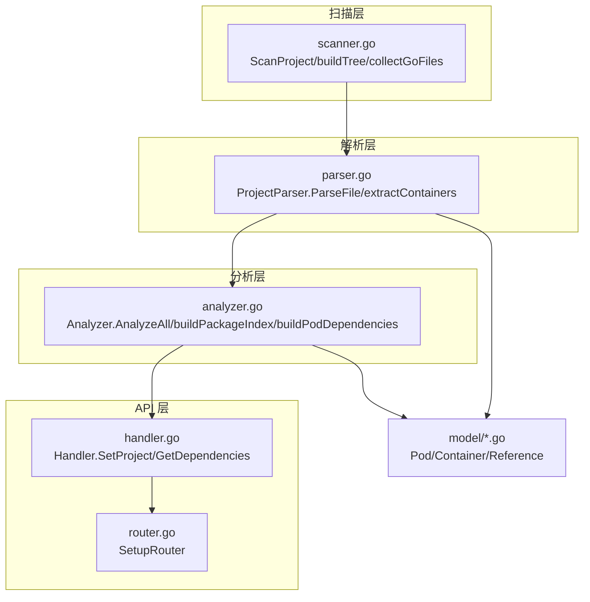
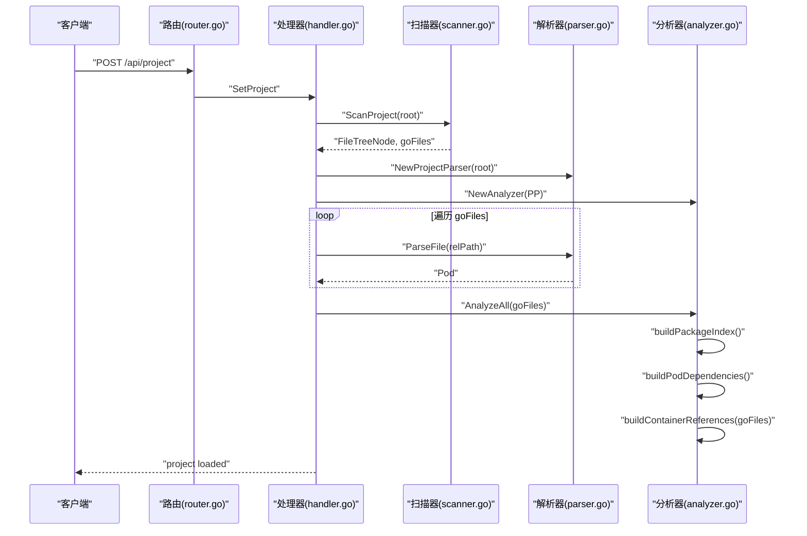
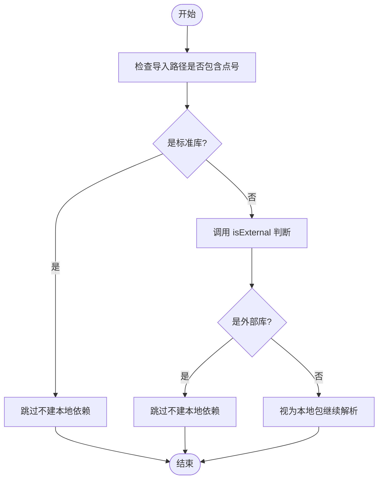
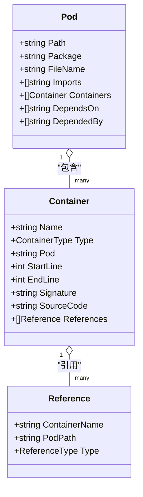
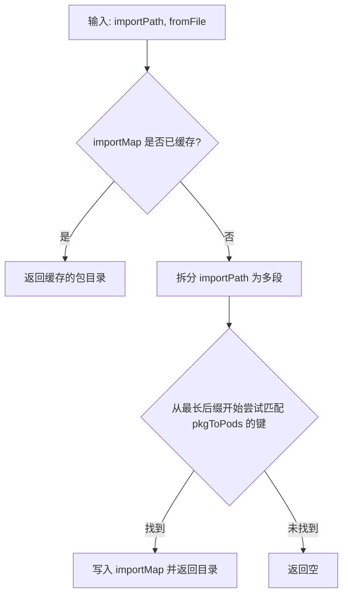
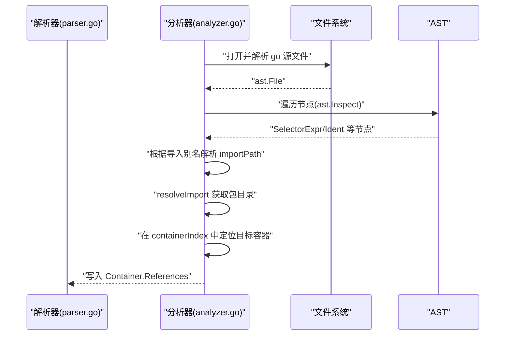
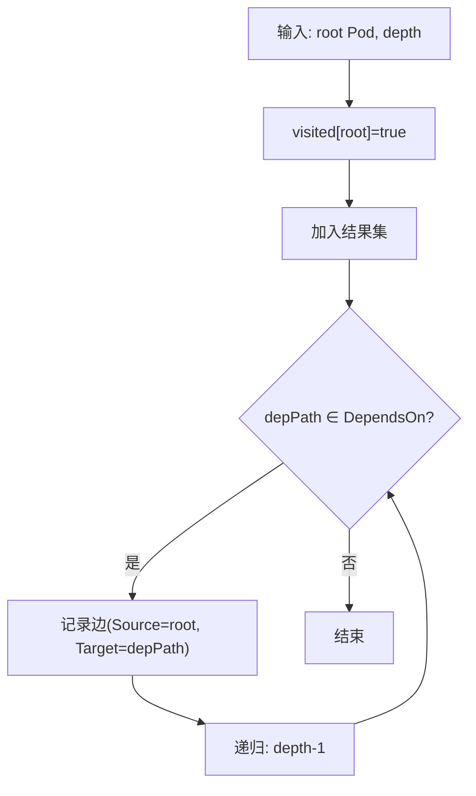
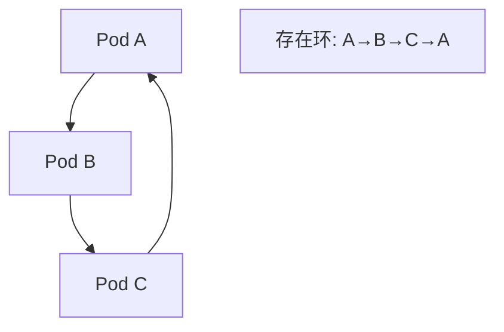

# 依赖关系分析

<cite>
**本文引用的文件**
- [backend/internal/parser/analyzer.go](file://backend/internal/parser/analyzer.go)
- [backend/internal/parser/parser.go](file://backend/internal/parser/parser.go)
- [backend/internal/parser/scanner.go](file://backend/internal/parser/scanner.go)
- [backend/internal/api/handler.go](file://backend/internal/api/handler.go)
- [backend/internal/api/router.go](file://backend/internal/api/router.go)
- [backend/internal/model/pod.go](file://backend/internal/model/pod.go)
- [backend/internal/model/container.go](file://backend/internal/model/container.go)
- [backend/go.mod](file://backend/go.mod)
- [backend/main.go](file://backend/main.go)
- [Makefile](file://Makefile)
- [README.md](file://README.md)
</cite>

## 目录
1. [简介](#简介)
2. [项目结构](#项目结构)
3. [核心组件](#核心组件)
4. [架构总览](#架构总览)
5. [详细组件分析](#详细组件分析)
6. [依赖分析](#依赖分析)
7. [性能考虑](#性能考虑)
8. [故障排查指南](#故障排查指南)
9. [结论](#结论)
10. [附录](#附录)

## 简介
本技术文档聚焦于 GoPodView 后端的“依赖关系分析”能力，系统性阐述如何基于 go/ast 抽象语法树提取导入关系，并完成依赖图构建与查询。文档覆盖以下要点：
- 导入关系提取：区分标准库、第三方库与本地包
- 依赖图构建：节点创建、边连接与去重
- 深度优先搜索：依赖层级计算与路径查找
- 条件导入、测试文件与构建标签的处理策略
- 复杂依赖场景（循环依赖、跨模块引用）的应对
- 性能优化与大数据量处理最佳实践

## 项目结构
后端采用分层设计：
- 扫描层：递归扫描项目目录，收集 .go 文件并构建文件树
- 解析层：使用 go/parser/ast 提取包信息、容器（函数/类型/常量等）与导入列表
- 分析层：构建包索引、解析导入路径、建立 Pod 间依赖关系
- API 层：提供 HTTP 接口，支持加载项目、查询文件树、Pod 列表、依赖图与容器详情

图表来源
- [backend/internal/parser/scanner.go:12-32](file://backend/internal/parser/scanner.go#L12-L32)
- [backend/internal/parser/parser.go:32-59](file://backend/internal/parser/parser.go#L32-L59)
- [backend/internal/parser/analyzer.go:27-39](file://backend/internal/parser/analyzer.go#L27-L39)
- [backend/internal/api/handler.go:31-50](file://backend/internal/api/handler.go#L31-L50)
- [backend/internal/api/router.go:8-31](file://backend/internal/api/router.go#L8-L31)
- [backend/internal/model/pod.go:3-11](file://backend/internal/model/pod.go#L3-L11)
- [backend/internal/model/container.go:13-22](file://backend/internal/model/container.go#L13-L22)

章节来源
- [README.md:79-104](file://README.md#L79-L104)
- [backend/internal/parser/scanner.go:12-32](file://backend/internal/parser/scanner.go#L12-L32)
- [backend/internal/parser/parser.go:32-59](file://backend/internal/parser/parser.go#L32-L59)
- [backend/internal/parser/analyzer.go:27-39](file://backend/internal/parser/analyzer.go#L27-L39)
- [backend/internal/api/handler.go:31-50](file://backend/internal/api/handler.go#L31-L50)
- [backend/internal/api/router.go:8-31](file://backend/internal/api/router.go#L8-L31)

## 核心组件
- 扫描器（Scanner）
  - 功能：遍历项目根目录，过滤 vendor/node_modules/.git 等目录，收集 .go 文件并生成文件树
  - 关键点：跳过以点开头的隐藏目录；跳过 testdata；按目录优先排序
- 项目解析器（ProjectParser）
  - 功能：读取 .go 源码，使用 go/parser/ast 解析包名、导入列表与容器（函数、类型、常量/变量）
  - 关键点：记录每个 Pod 的起止行号，便于后续容器引用定位
- 分析器（Analyzer）
  - 功能：构建包索引、解析导入路径、建立 Pod 依赖关系、构建容器级引用
  - 关键点：区分标准库与外部库；通过 importMap 与 pkgToPods 建立导入路径到包目录的映射
- API 处理器（Handler）
  - 功能：对外暴露 HTTP 接口，加载项目、返回文件树、Pod 列表与依赖图、容器详情
  - 关键点：依赖查询使用 DFS（深度优先搜索）按层级收集

章节来源
- [backend/internal/parser/scanner.go:12-32](file://backend/internal/parser/scanner.go#L12-L32)
- [backend/internal/parser/parser.go:32-59](file://backend/internal/parser/parser.go#L32-L59)
- [backend/internal/parser/analyzer.go:27-39](file://backend/internal/parser/analyzer.go#L27-L39)
- [backend/internal/api/handler.go:31-50](file://backend/internal/api/handler.go#L31-L50)

## 架构总览
下图展示了从扫描到分析再到 API 查询的整体流程。

图表来源
- [backend/internal/api/router.go:21](file://backend/internal/api/router.go#L21)
- [backend/internal/api/handler.go:56-75](file://backend/internal/api/handler.go#L56-L75)
- [backend/internal/parser/scanner.go:12-32](file://backend/internal/parser/scanner.go#L12-L32)
- [backend/internal/parser/parser.go:32-59](file://backend/internal/parser/parser.go#L32-L59)
- [backend/internal/parser/analyzer.go:27-39](file://backend/internal/parser/analyzer.go#L27-L39)

## 详细组件分析

### 组件一：导入关系提取与库类型区分
- 标准库识别
  - 规则：若导入路径不包含点号，则视为标准库
  - 实现位置：[isStdLib:219-221](file://backend/internal/parser/analyzer.go#L219-L221)
- 第三方库识别
  - 规则：当前实现中 isExternal 返回固定值，未做实际判断
  - 实现位置：[isExternal:223-226](file://backend/internal/parser/analyzer.go#L223-L226)
  - 建议：可结合 go.mod 或 GOPATH/GOROOT 判断是否为本地包或标准库
- 本地包识别
  - 规则：既非标准库也非外部库的导入即视为本地包
  - 实现位置：[buildPodDependencies:59-81](file://backend/internal/parser/analyzer.go#L59-L81)

图表来源
- [backend/internal/parser/analyzer.go:219-226](file://backend/internal/parser/analyzer.go#L219-L226)
- [backend/internal/parser/analyzer.go:59-81](file://backend/internal/parser/analyzer.go#L59-L81)

章节来源
- [backend/internal/parser/analyzer.go:219-226](file://backend/internal/parser/analyzer.go#L219-L226)
- [backend/internal/parser/analyzer.go:59-81](file://backend/internal/parser/analyzer.go#L59-L81)

### 组件二：依赖图构建（节点与边）
- 节点（Pod）
  - 数据结构：包含路径、包名、文件名、导入列表、容器集合、依赖与被依赖列表
  - 生成：解析器在 ParseFile 中填充 Pod 字段
  - 参考：[Pod 结构体:3-11](file://backend/internal/model/pod.go#L3-L11)
- 边（依赖关系）
  - 来源：Analyzer 在 buildPodDependencies 中为每个本地包导入建立依赖边
  - 去重：使用 appendUnique 确保同一依赖只添加一次
  - 双向关系：同时维护 DependsOn 与 DependedBy
  - 参考：[buildPodDependencies:59-81](file://backend/internal/parser/analyzer.go#L59-L81)，[appendUnique:228-235](file://backend/internal/parser/analyzer.go#L228-L235)

图表来源
- [backend/internal/model/pod.go:3-11](file://backend/internal/model/pod.go#L3-L11)
- [backend/internal/model/container.go:13-22](file://backend/internal/model/container.go#L13-L22)
- [backend/internal/model/container.go:32-36](file://backend/internal/model/container.go#L32-L36)

章节来源
- [backend/internal/model/pod.go:3-11](file://backend/internal/model/pod.go#L3-L11)
- [backend/internal/model/container.go:13-22](file://backend/internal/model/container.go#L13-L22)
- [backend/internal/model/container.go:32-36](file://backend/internal/model/container.go#L32-L36)
- [backend/internal/parser/analyzer.go:59-81](file://backend/internal/parser/analyzer.go#L59-L81)
- [backend/internal/parser/analyzer.go:228-235](file://backend/internal/parser/analyzer.go#L228-L235)

### 组件三：导入路径解析与包目录映射
- 包索引
  - 将每个 Pod 的相对路径目录加入 pkgToPods，形成“目录 → Pod 列表”的映射
  - 参考：[buildPackageIndex:41-53](file://backend/internal/parser/analyzer.go#L41-L53)
- 导入路径映射
  - 使用 importMap 缓存“导入路径 → 包目录”的映射，避免重复解析
  - 参考：[resolveImport:83-98](file://backend/internal/parser/analyzer.go#L83-L98)
- 目录到导入路径
  - 当前实现直接返回目录作为导入路径，可扩展为基于模块的导入路径推导
  - 参考：[dirToImportPath:55-57](file://backend/internal/parser/analyzer.go#L55-L57)

图表来源
- [backend/internal/parser/analyzer.go:83-98](file://backend/internal/parser/analyzer.go#L83-L98)
- [backend/internal/parser/analyzer.go:41-53](file://backend/internal/parser/analyzer.go#L41-L53)

章节来源
- [backend/internal/parser/analyzer.go:41-57](file://backend/internal/parser/analyzer.go#L41-L57)
- [backend/internal/parser/analyzer.go:83-98](file://backend/internal/parser/analyzer.go#L83-L98)

### 组件四：容器级引用与选择器解析
- 引用构建流程
  - 读取源文件，构建导入别名映射（含匿名别名推断）
  - 遍历 AST，仅在容器行区间内匹配 SelectorExpr
  - 通过 importAliases 定位导入路径，再解析到包目录，最终定位目标容器
  - 参考：[buildContainerReferences:100-134](file://backend/internal/parser/analyzer.go#L100-L134)，[findReferences:152-217](file://backend/internal/parser/analyzer.go#L152-L217)，[buildImportAliases:136-150](file://backend/internal/parser/analyzer.go#L136-L150)
- 引用类型判定
  - 若目标容器为结构体或接口，标记为类型引用；否则为调用引用
  - 参考：[findReferences 类型判定逻辑:196-204](file://backend/internal/parser/analyzer.go#L196-L204)

图表来源
- [backend/internal/parser/analyzer.go:100-134](file://backend/internal/parser/analyzer.go#L100-L134)
- [backend/internal/parser/analyzer.go:152-217](file://backend/internal/parser/analyzer.go#L152-L217)
- [backend/internal/parser/analyzer.go:136-150](file://backend/internal/parser/analyzer.go#L136-L150)

章节来源
- [backend/internal/parser/analyzer.go:100-134](file://backend/internal/parser/analyzer.go#L100-L134)
- [backend/internal/parser/analyzer.go:152-217](file://backend/internal/parser/analyzer.go#L152-L217)
- [backend/internal/parser/analyzer.go:136-150](file://backend/internal/parser/analyzer.go#L136-L150)

### 组件五：深度优先搜索与依赖层级查询
- 查询入口
  - 通过 GET /api/dependencies/:path?depth= 按层级展开依赖
  - 参考：[GetDependencies:177-209](file://backend/internal/api/handler.go#L177-L209)
- DFS 收集
  - 使用 visited 防止重复访问，按 depth 递减终止
  - 参考：[collectDeps:211-224](file://backend/internal/api/handler.go#L211-L224)
- 依赖边输出
  - 将每条依赖边以 Source-Target 形式返回
  - 参考：[GetDependencies 边构建:115-118](file://backend/internal/api/handler.go#L115-L118)

图表来源
- [backend/internal/api/handler.go:177-209](file://backend/internal/api/handler.go#L177-L209)
- [backend/internal/api/handler.go:211-224](file://backend/internal/api/handler.go#L211-L224)

章节来源
- [backend/internal/api/handler.go:177-209](file://backend/internal/api/handler.go#L177-L209)
- [backend/internal/api/handler.go:211-224](file://backend/internal/api/handler.go#L211-L224)

### 组件六：条件导入、测试文件与构建标签
- 条件导入与构建标签
  - 当前实现未对构建标签进行过滤或特殊处理
  - 建议：在扫描阶段或解析阶段增加 tag 过滤逻辑，仅保留满足当前环境的导入
- 测试文件
  - 当前扫描器会跳过 testdata 目录；可扩展为跳过 *_test.go 文件或仅在特定模式下解析
  - 参考：[shouldSkip:80-88](file://backend/internal/parser/scanner.go#L80-L88)
- 处理策略建议
  - 在 Analyzer.analyzeAll 前增加过滤步骤，剔除不参与分析的文件
  - 对构建标签进行白名单/黑名单控制，避免误判依赖

章节来源
- [backend/internal/parser/scanner.go:80-88](file://backend/internal/parser/scanner.go#L80-L88)

## 依赖分析
- 依赖图数据结构
  - 节点：Pod（文件级）
  - 边：DependsOn/DependedBy（双向）
  - 参考：[Pod 字段:3-11](file://backend/internal/model/pod.go#L3-L11)
- 循环依赖检测
  - 当前未实现显式的环检测
  - 建议：在 DFS 收集时引入“递归栈”或“着色法”，发现回边即标记环
- 复杂依赖场景
  - 跨模块引用：通过 importMap 与 pkgToPods 的组合，可将远端包映射到本地 Pod
  - 多级依赖：DFS 按 depth 控制层级，避免无限展开
  - 参考：[buildPodDependencies:59-81](file://backend/internal/parser/analyzer.go#L59-L81)，[collectDeps:211-224](file://backend/internal/api/handler.go#L211-L224)

图表来源
- [backend/internal/parser/analyzer.go:59-81](file://backend/internal/parser/analyzer.go#L59-L81)
- [backend/internal/api/handler.go:211-224](file://backend/internal/api/handler.go#L211-L224)

章节来源
- [backend/internal/model/pod.go:3-11](file://backend/internal/model/pod.go#L3-L11)
- [backend/internal/parser/analyzer.go:59-81](file://backend/internal/parser/analyzer.go#L59-L81)
- [backend/internal/api/handler.go:211-224](file://backend/internal/api/handler.go#L211-L224)

## 性能考虑
- 扫描阶段
  - 使用 sort.Slice 对目录项排序，减少后续遍历开销
  - 跳过隐藏目录与 testdata，降低 IO 压力
  - 参考：[buildTree 排序与过滤:40-46](file://backend/internal/parser/scanner.go#L40-L46)，[shouldSkip:80-88](file://backend/internal/parser/scanner.go#L80-L88)
- 解析阶段
  - 仅解析需要的 .go 文件，避免重复解析
  - 使用 token.FileSet 共享文件集，减少内存分配
  - 参考：[ParseFile:32-59](file://backend/internal/parser/parser.go#L32-L59)
- 分析阶段
  - importMap 缓存导入路径到目录的映射，避免重复解析
  - appendUnique 去重，减少边数量
  - 参考：[resolveImport:83-98](file://backend/internal/parser/analyzer.go#L83-L98)，[appendUnique:228-235](file://backend/internal/parser/analyzer.go#L228-L235)
- 查询阶段
  - DFS 使用 visited 防止重复访问
  - 限制最大 depth，避免深层遍历导致的性能问题
  - 参考：[GetDependencies:177-209](file://backend/internal/api/handler.go#L177-L209)，[collectDeps:211-224](file://backend/internal/api/handler.go#L211-L224)
- 大数据量优化建议
  - 并行解析：在 AnalyzeAll 中并发调用 ParseFile（注意共享状态保护）
  - 分页输出：对 Pod 列表与依赖边进行分页
  - 缓存：持久化 importMap 与 pkgToPods，支持增量更新

章节来源
- [backend/internal/parser/scanner.go:40-46](file://backend/internal/parser/scanner.go#L40-L46)
- [backend/internal/parser/scanner.go#L80-L88:80-88](file://backend/internal/parser/scanner.go#L80-L88)
- [backend/internal/parser/parser.go:32-59](file://backend/internal/parser/parser.go#L32-L59)
- [backend/internal/parser/analyzer.go:83-98](file://backend/internal/parser/analyzer.go#L83-L98)
- [backend/internal/parser/analyzer.go:228-235](file://backend/internal/parser/analyzer.go#L228-L235)
- [backend/internal/api/handler.go:177-209](file://backend/internal/api/handler.go#L177-L209)
- [backend/internal/api/handler.go:211-224](file://backend/internal/api/handler.go#L211-L224)

## 故障排查指南
- 无法加载项目
  - 检查项目路径是否正确，是否存在权限问题
  - 参考：[main.go 参数解析与日志:11-30](file://backend/main.go#L11-L30)
- 依赖为空或不完整
  - 确认 go.mod 是否正确，第三方库是否已下载
  - 检查 isExternal 的实现是否符合预期
  - 参考：[go.mod:1-39](file://backend/go.mod#L1-L39)，[isExternal:223-226](file://backend/internal/parser/analyzer.go#L223-L226)
- 查询依赖报错
  - 检查 Pod 路径是否正确，确保已加载项目
  - 参考：[GetDependencies 错误处理:191-195](file://backend/internal/api/handler.go#L191-L195)
- 性能问题
  - 大型项目建议限制 depth，启用缓存，必要时并行解析
  - 参考：[GetDependencies depth 限制:182-189](file://backend/internal/api/handler.go#L182-L189)

章节来源
- [backend/main.go:11-30](file://backend/main.go#L11-L30)
- [backend/go.mod:1-39](file://backend/go.mod#L1-L39)
- [backend/internal/parser/analyzer.go:223-226](file://backend/internal/parser/analyzer.go#L223-L226)
- [backend/internal/api/handler.go:191-195](file://backend/internal/api/handler.go#L191-L195)
- [backend/internal/api/handler.go:182-189](file://backend/internal/api/handler.go#L182-L189)

## 结论
本项目以 go/ast 为基础，实现了从扫描、解析到分析的完整依赖关系链路。通过包索引与导入路径映射，成功将导入关系映射到本地 Pod 图；通过 DFS 实现了依赖层级查询。当前实现对标准库与外部库的区分较为简化，建议结合 go.mod 与 GOPATH 进一步完善；同时可在分析阶段引入环检测与构建标签过滤，以提升准确性与稳定性。

## 附录
- 快速启动
  - 使用 Makefile 一键启动后端与前端
  - 参考：[Makefile run:6-18](file://Makefile#L6-L18)
- API 列表
  - 参考：[README API 表格:67-78](file://README.md#L67-L78)

章节来源
- [Makefile:6-18](file://Makefile#L6-L18)
- [README.md:67-78](file://README.md#L67-L78)