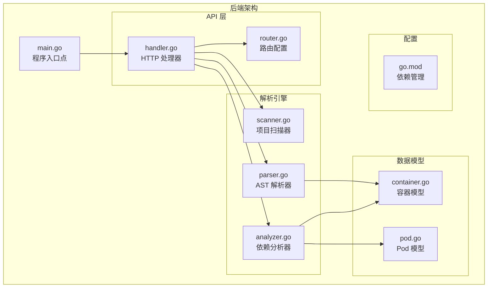
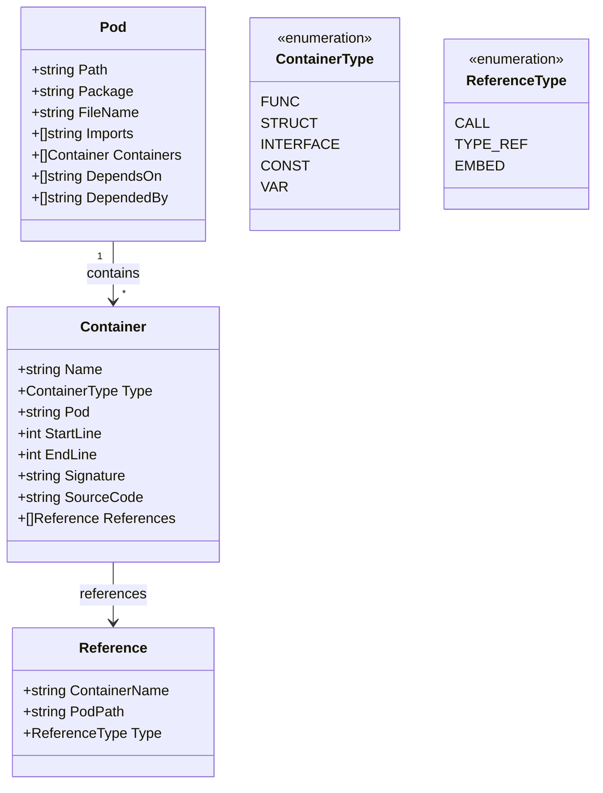
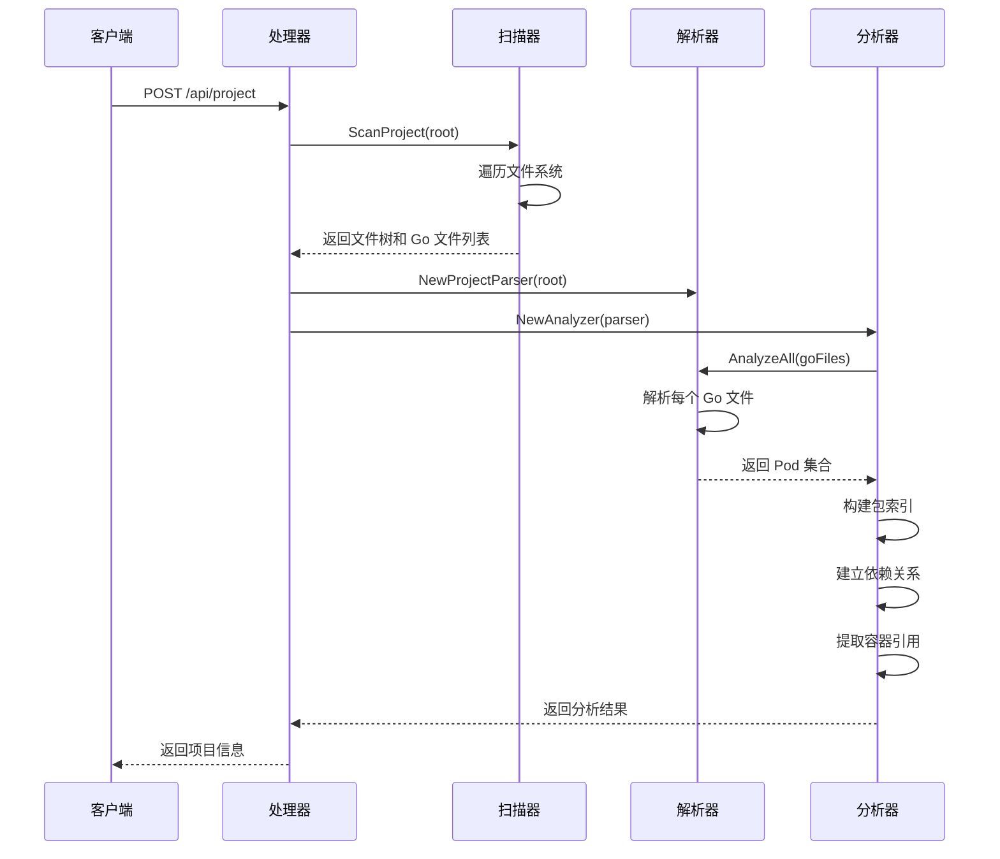
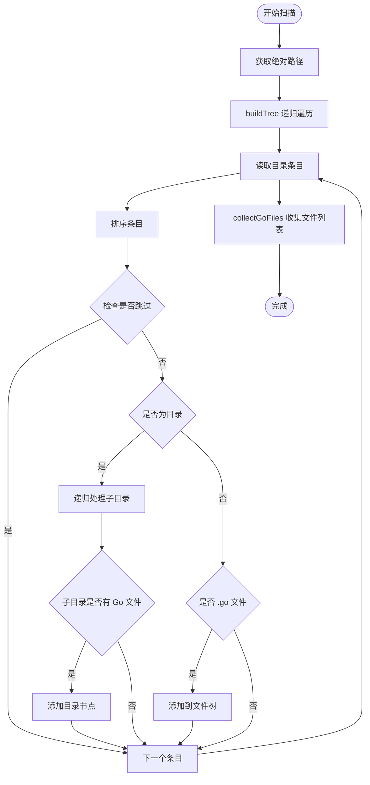
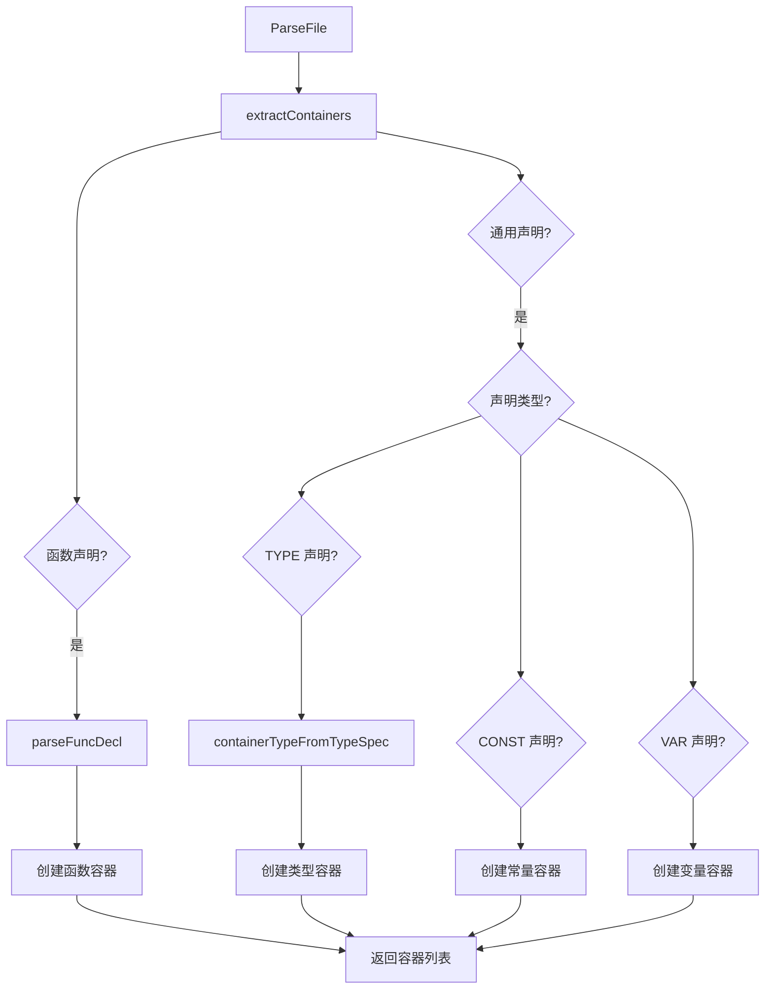
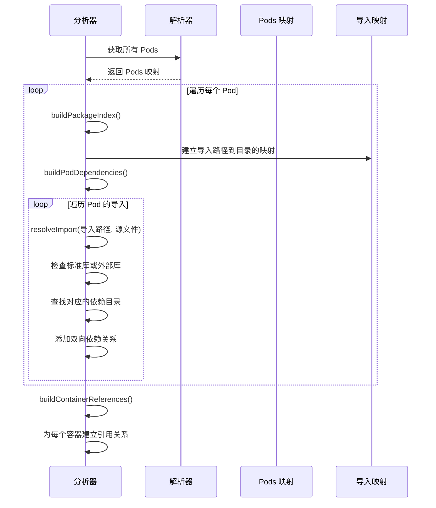
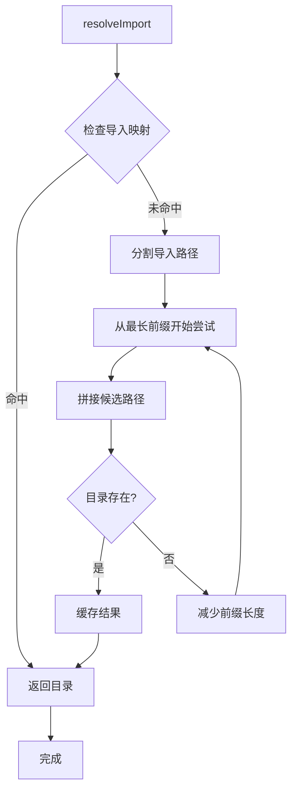
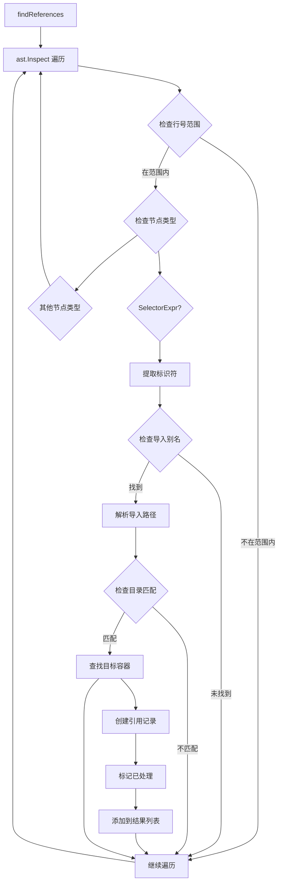

# 依赖分析引擎

<cite>
**本文档引用的文件**
- [main.go](file://backend/main.go)
- [scanner.go](file://backend/internal/parser/scanner.go)
- [parser.go](file://backend/internal/parser/parser.go)
- [analyzer.go](file://backend/internal/parser/analyzer.go)
- [container.go](file://backend/internal/model/container.go)
- [pod.go](file://backend/internal/model/pod.go)
- [handler.go](file://backend/internal/api/handler.go)
- [router.go](file://backend/internal/api/router.go)
- [go.mod](file://backend/go.mod)
- [README.md](file://README.md)
</cite>

## 目录
1. [简介](#简介)
2. [项目结构](#项目结构)
3. [核心组件](#核心组件)
4. [架构概览](#架构概览)
5. [详细组件分析](#详细组件分析)
6. [依赖分析算法](#依赖分析算法)
7. [性能考虑](#性能考虑)
8. [调试指南](#调试指南)
9. [结论](#结论)

## 简介

GoPodView 是一个基于 Kubernetes 概念设计的 Go 项目可视化探索工具。该工具的核心是依赖分析引擎，它能够解析 Go 源代码文件，提取模块化结构（称为 "Pods"），并将内部声明（函数、结构体、接口、常量、变量）识别为 "Containers"。通过 Go 标准库的 go/ast 包，分析引擎实现了完整的词法分析、语法分析和语义分析流程，构建出精确的依赖关系图。

该系统采用分层架构设计，后端使用 Go 语言开发，前端使用 Vue 3 和 TypeScript 构建，通过 RESTful API 进行通信。分析引擎支持实时项目加载、文件树浏览、交互式依赖图展示和代码高亮显示等功能。

## 项目结构

后端项目采用清晰的分层架构，主要包含以下模块：



**图表来源**
- [main.go:1-31](file://backend/main.go#L1-L31)
- [handler.go:1-225](file://backend/internal/api/handler.go#L1-L225)
- [scanner.go:1-113](file://backend/internal/parser/scanner.go#L1-L113)
- [parser.go:1-253](file://backend/internal/parser/parser.go#L1-L253)
- [analyzer.go:1-236](file://backend/internal/parser/analyzer.go#L1-L236)

**章节来源**
- [main.go:1-31](file://backend/main.go#L1-L31)
- [README.md:79-104](file://README.md#L79-L104)

## 核心组件

### 数据模型

系统定义了两个核心数据模型来表示代码结构：

**Pod 模型**：代表单个 Go 源文件，包含文件路径、包名、导入列表和内部容器集合。

**Container 模型**：代表源文件中的具体声明，包括函数、结构体、接口、常量和变量等。



**图表来源**
- [container.go:13-37](file://backend/internal/model/container.go#L13-L37)
- [pod.go:3-11](file://backend/internal/model/pod.go#L3-L11)

**章节来源**
- [container.go:1-37](file://backend/internal/model/container.go#L1-L37)
- [pod.go:1-19](file://backend/internal/model/pod.go#L1-L19)

## 架构概览

依赖分析引擎采用流水线架构，包含三个主要阶段：项目扫描、AST 解析和依赖分析。



**图表来源**
- [handler.go:31-50](file://backend/internal/api/handler.go#L31-L50)
- [scanner.go:12-32](file://backend/internal/parser/scanner.go#L12-L32)
- [analyzer.go:27-39](file://backend/internal/parser/analyzer.go#L27-L39)

## 详细组件分析

### 项目扫描器 (Scanner)

项目扫描器负责遍历指定目录，收集所有 Go 源文件并构建文件树结构。

#### 核心功能

1. **文件系统遍历**：递归扫描目录，跳过特定目录（如 vendor、node_modules、.git 等）
2. **Go 文件过滤**：仅收集 .go 结尾的文件
3. **文件树构建**：创建层次化的文件树结构，便于前端展示



**图表来源**
- [scanner.go:34-78](file://backend/internal/parser/scanner.go#L34-L78)
- [scanner.go:102-113](file://backend/internal/parser/scanner.go#L102-L113)

**章节来源**
- [scanner.go:1-113](file://backend/internal/parser/scanner.go#L1-L113)

### AST 解析器 (ProjectParser)

AST 解析器使用 Go 标准库的 go/ast 包来解析源代码文件，提取结构化信息。

#### 解析流程

1. **文件读取**：读取源文件内容到内存
2. **AST 构建**：使用 go/parser.ParseFile 创建抽象语法树
3. **容器提取**：遍历 AST 节点，识别不同类型的声明

#### 容器识别规则

系统支持五种容器类型，每种都有特定的识别逻辑：



**图表来源**
- [parser.go:61-73](file://backend/internal/parser/parser.go#L61-L73)
- [parser.go:75-97](file://backend/internal/parser/parser.go#L75-L97)
- [parser.go:112-206](file://backend/internal/parser/parser.go#L112-L206)

**章节来源**
- [parser.go:1-253](file://backend/internal/parser/parser.go#L1-L253)

### 依赖分析器 (Analyzer)

依赖分析器负责建立模块间的依赖关系，这是整个系统的核心功能。

#### 依赖关系建立流程



**图表来源**
- [analyzer.go:41-81](file://backend/internal/parser/analyzer.go#L41-L81)
- [analyzer.go:100-134](file://backend/internal/parser/analyzer.go#L100-L134)

**章节来源**
- [analyzer.go:1-236](file://backend/internal/parser/analyzer.go#L1-L236)

## 依赖分析算法

### 导入路径解析算法

导入路径解析是依赖分析的关键步骤，需要将抽象的导入路径转换为实际的文件路径。



**图表来源**
- [analyzer.go:83-98](file://backend/internal/parser/analyzer.go#L83-L98)

### 容器引用检测算法

容器引用检测通过 AST 遍历来识别代码中的引用关系。

#### 引用检测流程



**图表来源**
- [analyzer.go:152-217](file://backend/internal/parser/analyzer.go#L152-L217)

**章节来源**
- [analyzer.go:136-150](file://backend/internal/parser/analyzer.go#L136-L150)
- [analyzer.go:152-217](file://backend/internal/parser/analyzer.go#L152-L217)

## 性能考虑

### 内存优化策略

1. **延迟加载**：源代码只在需要时读取和解析
2. **对象复用**：使用 sync.Pool 复用临时对象
3. **增量更新**：支持部分重新分析以减少计算开销

### 并行处理

系统支持并发解析多个文件，但需要注意：
- AST 解析器是线程安全的
- 共享状态访问需要适当的锁机制
- 内存使用需要监控，避免峰值过高

### 缓存机制

1. **导入路径缓存**：避免重复解析相同的导入路径
2. **容器索引缓存**：快速定位容器定义
3. **AST 缓存**：重用已解析的 AST 节点

## 调试指南

### 常见问题诊断

#### 1. 项目加载失败

**症状**：POST /api/project 返回错误

**可能原因**：
- 路径不存在或权限不足
- Go 模块配置问题
- 语法错误导致解析失败

**解决方案**：
- 使用 `go mod tidy` 检查模块依赖
- 验证路径可访问性
- 检查 Go 版本兼容性

#### 2. 依赖关系缺失

**症状**：某些导入没有被正确识别

**可能原因**：
- 相对导入路径解析失败
- vendor 目录中的包未被正确处理
- 符号链接导致路径不一致

**解决方案**：
- 检查导入路径格式
- 验证 vendor 目录结构
- 确保使用绝对路径进行比较

#### 3. 性能问题

**症状**：大型项目分析时间过长

**优化建议**：
- 实现增量分析
- 添加进度报告
- 考虑分批处理策略

### 调试技巧

#### 启用详细日志

在 main.go 中可以调整日志级别：

```go
// 在 main.go 中设置日志级别
log.SetFlags(log.LstdFlags | log.Lshortfile)
```

#### 使用断点调试

推荐的调试位置：
1. `parser.ParseFile` - 检查 AST 构建过程
2. `analyzer.buildPodDependencies` - 验证依赖关系建立
3. `analyzer.findReferences` - 确认引用检测准确性

#### 性能分析

使用 Go 自带的性能分析工具：

```bash
go test -bench=. -cpuprofile=cpu.prof
go tool pprof cpu.prof
```

**章节来源**
- [main.go:11-30](file://backend/main.go#L11-L30)
- [handler.go:31-50](file://backend/internal/api/handler.go#L31-L50)

## 结论

GoPodView 的依赖分析引擎通过精心设计的三层架构实现了高效的 Go 代码分析。系统利用 Go 标准库的强大功能，结合自定义的数据结构和算法，提供了准确的依赖关系识别和可视化展示。

### 主要优势

1. **准确性**：基于标准 AST 解析，确保分析结果的正确性
2. **可扩展性**：模块化设计便于功能扩展和维护
3. **性能**：合理的缓存和优化策略保证了良好的响应速度
4. **易用性**：清晰的 API 设计和丰富的前端界面

### 技术亮点

- **智能导入解析**：支持多种导入路径格式和相对路径解析
- **容器识别**：准确识别函数、结构体、接口、常量和变量
- **双向依赖**：同时建立依赖关系和被依赖关系
- **引用检测**：通过 AST 遍历实现精确的引用关系识别

### 未来改进方向

1. **增量分析**：实现文件变更的增量重新分析
2. **并发优化**：进一步提升大规模项目的处理能力
3. **可视化增强**：提供更丰富的图形化展示选项
4. **插件系统**：支持自定义分析规则和扩展功能

该系统为 Go 项目的理解和导航提供了强大的工具，特别适合大型项目的架构分析和代码审查工作。