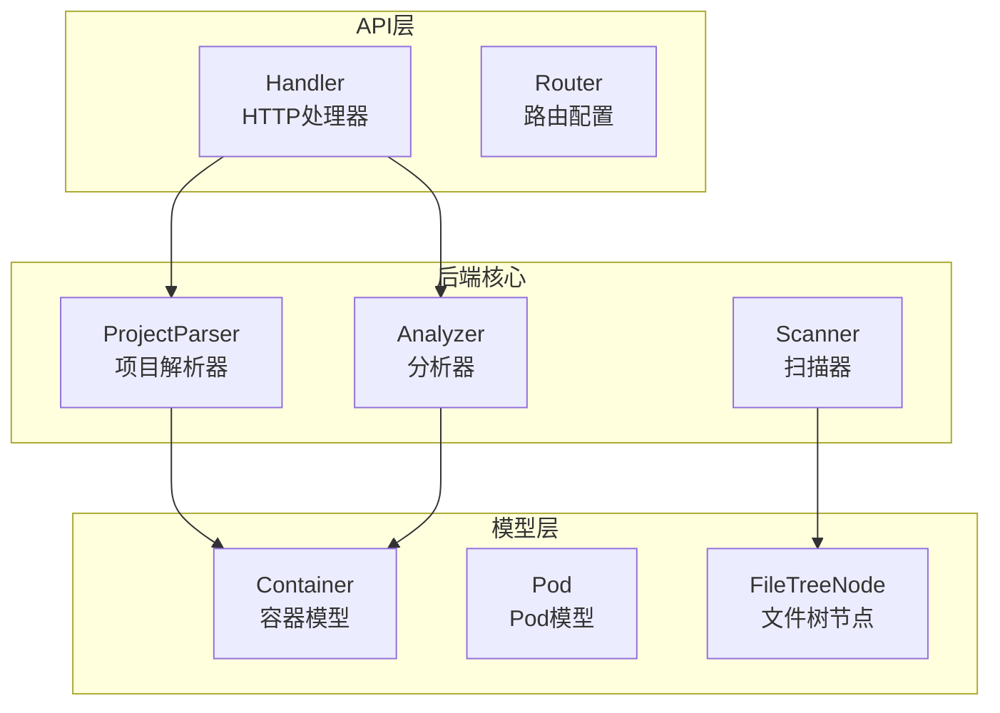
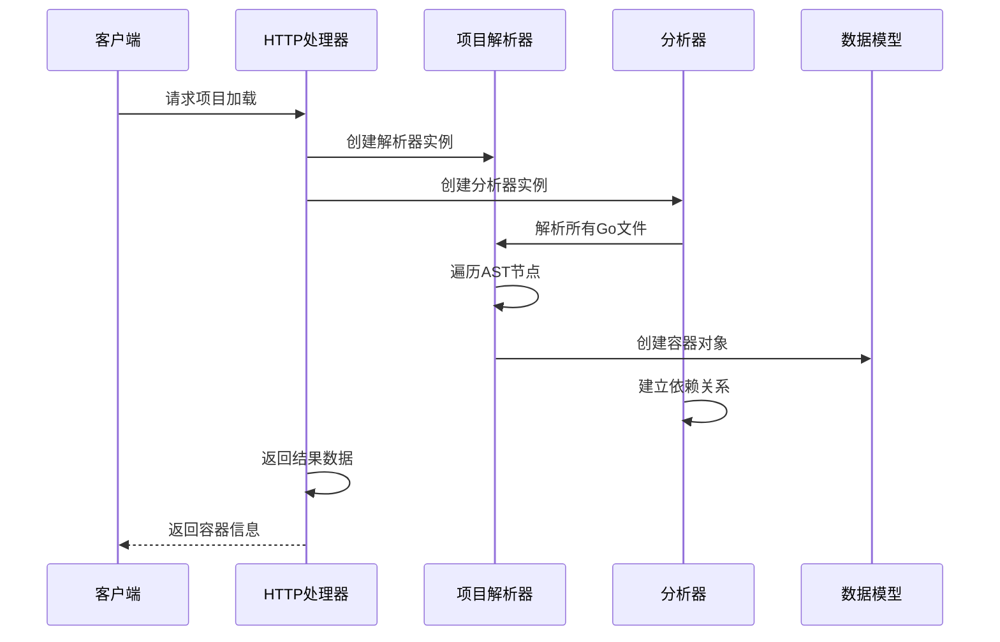
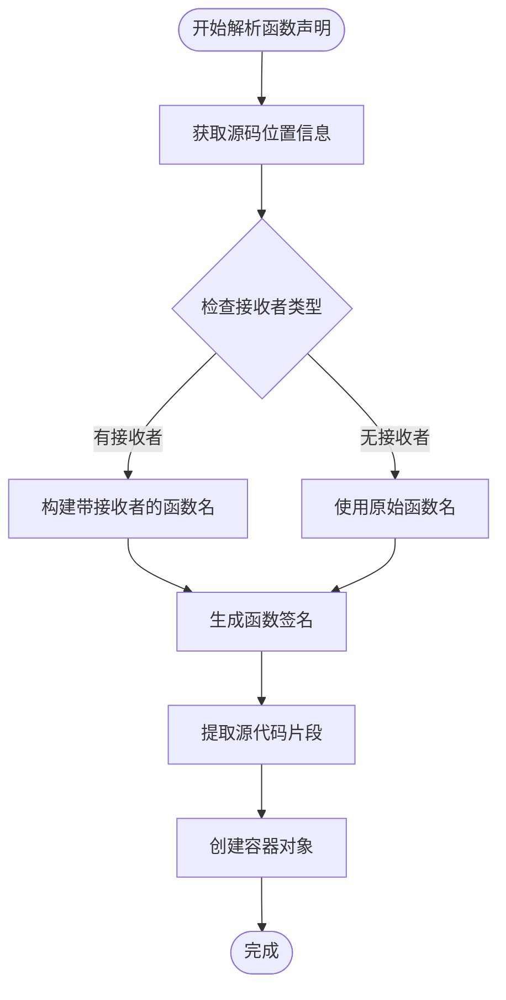
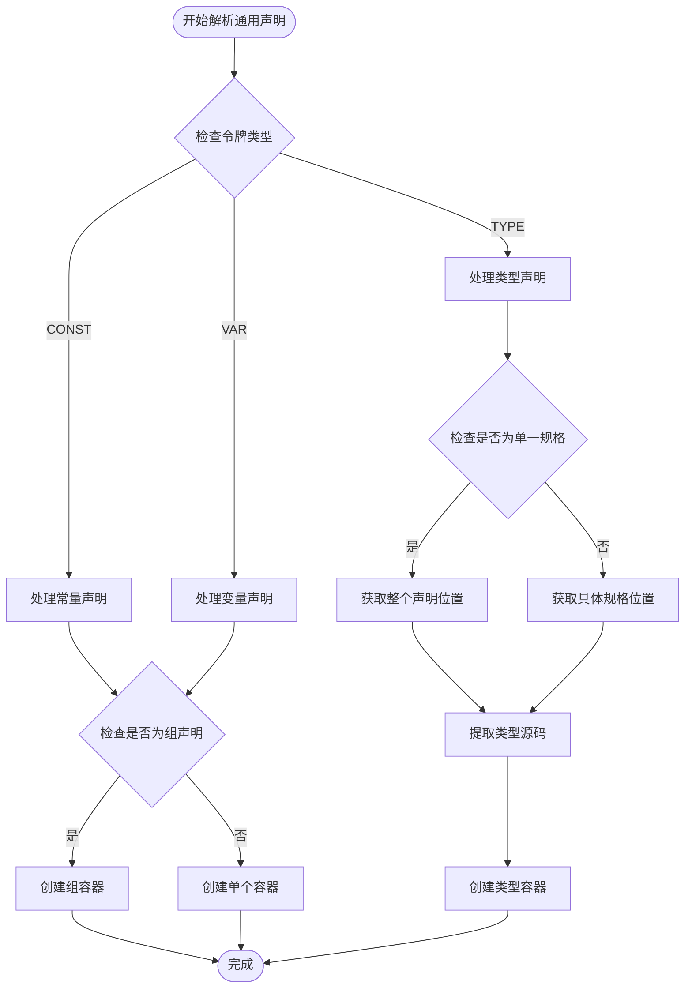
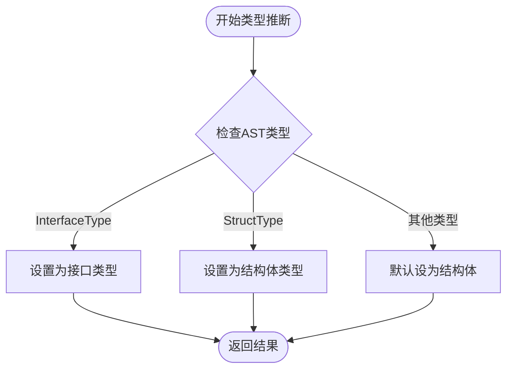
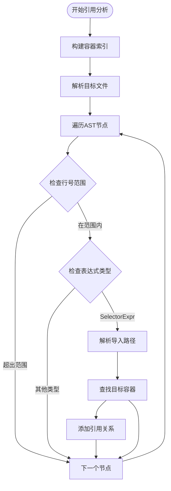
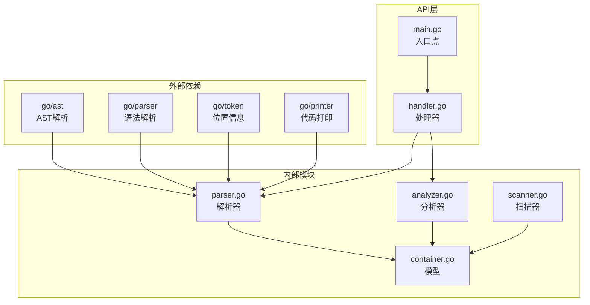

# 容器提取算法

<cite>
**本文档引用的文件**
- [parser.go](file://backend/internal/parser/parser.go)
- [analyzer.go](file://backend/internal/parser/analyzer.go)
- [container.go](file://backend/internal/model/container.go)
- [pod.go](file://backend/internal/model/pod.go)
- [scanner.go](file://backend/internal/parser/scanner.go)
- [handler.go](file://backend/internal/api/handler.go)
- [main.go](file://backend/main.go)
</cite>

## 目录
1. [简介](#简介)
2. [项目结构](#项目结构)
3. [核心组件](#核心组件)
4. [架构概览](#架构概览)
5. [详细组件分析](#详细组件分析)
6. [依赖分析](#依赖分析)
7. [性能考虑](#性能考虑)
8. [故障排除指南](#故障排除指南)
9. [结论](#结论)

## 简介

容器提取算法是 GoPodView 项目中的核心功能模块，负责从 Go 源代码中识别和提取各种编程元素（容器）。该算法能够准确识别函数声明、类型声明和变量声明，并将其转换为结构化的数据模型，同时保持源代码的完整性。

本算法基于 Go 标准库的 AST 解析器，通过深度遍历源代码的抽象语法树，提取出具有语义意义的容器实体。这些容器包括函数、结构体、接口、常量和变量等不同类型的编程元素。

## 项目结构

GoPodView 项目采用分层架构设计，主要包含以下核心目录：

**图表来源**
- [parser.go:16-21](file://backend/internal/parser/parser.go#L16-L21)
- [analyzer.go:13-17](file://backend/internal/parser/analyzer.go#L13-L17)
- [container.go:13-22](file://backend/internal/model/container.go#L13-L22)
- [pod.go:3-11](file://backend/internal/model/pod.go#L3-L11)

**章节来源**
- [main.go:1-31](file://backend/main.go#L1-L31)
- [handler.go:15-21](file://backend/internal/api/handler.go#L15-L21)

## 核心组件

### ProjectParser 组件

ProjectParser 是容器提取算法的核心组件，负责解析单个 Go 文件并提取其中的所有容器。

**关键特性：**
- 使用 Go 标准库的 `go/parser` 进行语法解析
- 支持多种声明类型的识别和处理
- 维护源代码位置信息以保持完整性
- 提供精确的容器边界定位

**章节来源**
- [parser.go:16-30](file://backend/internal/parser/parser.go#L16-L30)
- [parser.go:32-59](file://backend/internal/parser/parser.go#L32-L59)

### Analyzer 组件

Analyzer 负责跨多个文件的容器分析和依赖关系建立。

**核心功能：**
- 构建包索引映射
- 解析导入路径并建立依赖关系
- 识别容器间的引用关系
- 维护容器引用图谱

**章节来源**
- [analyzer.go:13-25](file://backend/internal/parser/analyzer.go#L13-L25)
- [analyzer.go:100-134](file://backend/internal/parser/analyzer.go#L100-L134)

### Model 容器模型

容器模型定义了统一的数据结构来表示各种编程元素。

**数据结构：**
- `Container`: 表示单个容器实体
- `ContainerType`: 定义容器类型枚举
- `Reference`: 表示容器间引用关系

**章节来源**
- [container.go:3-11](file://backend/internal/model/container.go#L3-L11)
- [container.go:13-22](file://backend/internal/model/container.go#L13-L22)

## 架构概览

容器提取算法的整体架构采用分层设计，从底层的 AST 解析到高层的容器建模：

**图表来源**
- [handler.go:31-50](file://backend/internal/api/handler.go#L31-L50)
- [parser.go:61-73](file://backend/internal/parser/parser.go#L61-L73)
- [analyzer.go:27-39](file://backend/internal/parser/analyzer.go#L27-L39)

## 详细组件分析

### 函数声明提取算法

函数声明提取是容器识别的核心算法之一，通过 `parseFuncDecl` 方法实现。

#### 算法流程

**图表来源**
- [parser.go:75-97](file://backend/internal/parser/parser.go#L75-L97)

#### 关键实现细节

1. **接收者类型处理**: 当函数具有接收者时，名称格式为 `接收者类型.函数名`
2. **函数签名生成**: 使用 `funcSignature` 方法构建完整的函数签名
3. **源代码保持**: 通过位置信息精确提取源代码片段

**章节来源**
- [parser.go:75-97](file://backend/internal/parser/parser.go#L75-L97)
- [parser.go:99-110](file://backend/internal/parser/parser.go#L99-L110)

### 类型声明提取算法

类型声明提取通过 `parseGenDecl` 方法处理，支持多种类型声明的识别。

#### 处理逻辑

**图表来源**
- [parser.go:112-206](file://backend/internal/parser/parser.go#L112-L206)

#### 类型声明特殊处理

1. **单一规格 vs 多规格**: 区分 `(type A struct {...})` 和 `type (A struct {...}; B interface {...})`
2. **容器类型推断**: 通过 `containerTypeFromTypeSpec` 函数自动识别结构体或接口
3. **源码完整性**: 正确处理多规格声明的源码提取

**章节来源**
- [parser.go:112-206](file://backend/internal/parser/parser.go#L112-L206)
- [parser.go:208-217](file://backend/internal/parser/parser.go#L208-L217)

### 变量声明提取算法

变量声明提取支持常量和变量的统一处理，包括组声明和单个声明两种模式。

#### 组声明处理

当遇到 `const` 或 `var` 的组声明时：
- 合并所有标识符名称形成组名
- 限制组名长度以保持可读性
- 生成相应的容器对象

#### 单个声明处理

对于单个声明：
- 逐个处理每个标识符
- 为每个标识符创建独立的容器对象
- 保持精确的位置信息

**章节来源**
- [parser.go:150-203](file://backend/internal/parser/parser.go#L150-L203)

### 容器类型推断算法

`containerTypeFromTypeSpec` 函数实现了基于 AST 类型的容器类型自动推断。

#### 推断规则

**图表来源**
- [parser.go:208-217](file://backend/internal/parser/parser.go#L208-L217)

#### 实现特点

1. **精确匹配**: 使用 Go AST 类型系统进行精确判断
2. **扩展性**: 对于未知类型默认返回结构体类型
3. **一致性**: 与 `keywordFor` 函数配合提供一致的类型标识

**章节来源**
- [parser.go:208-217](file://backend/internal/parser/parser.go#L208-L217)

### 容器引用分析算法

Analyzer 组件实现了跨文件的容器引用分析功能。

#### 引用查找流程

**图表来源**
- [analyzer.go:152-217](file://backend/internal/parser/analyzer.go#L152-L217)

#### 关键优化策略

1. **范围过滤**: 仅检查容器所在行号范围内的节点
2. **导入别名解析**: 支持包别名和完整导入路径
3. **重复引用去重**: 使用哈希表避免重复计算

**章节来源**
- [analyzer.go:152-217](file://backend/internal/parser/analyzer.go#L152-L217)

## 依赖分析

容器提取算法的依赖关系呈现清晰的层次结构：

**图表来源**
- [parser.go:3-14](file://backend/internal/parser/parser.go#L3-L14)
- [container.go:1-11](file://backend/internal/model/container.go#L1-L11)

### 模块间耦合度分析

- **低耦合设计**: 各模块职责明确，接口清晰
- **向上依赖**: 下层模块依赖上层模块，符合分层原则
- **向内依赖**: 模型层被上层模块广泛使用

**章节来源**
- [parser.go:1-14](file://backend/internal/parser/parser.go#L1-L14)
- [analyzer.go:1-11](file://backend/internal/parser/analyzer.go#L1-L11)

## 性能考虑

### 时间复杂度分析

1. **单文件解析**: O(n)，n 为源代码字符数
2. **多文件分析**: O(m×n)，m 为文件数，n 为平均文件大小
3. **引用分析**: O(k×m)，k 为平均引用数量，m 为容器总数

### 空间复杂度优化

- **增量解析**: 使用 `srcMap` 缓存源代码内容
- **索引优化**: 构建容器索引减少重复查找
- **内存管理**: 及时释放不需要的中间结果

### 性能优化策略

1. **早期退出**: 在不相关节点上快速跳过
2. **批量处理**: 同时处理多个文件
3. **缓存机制**: 复用解析结果和索引信息

## 故障排除指南

### 常见问题及解决方案

#### 解析错误处理

当遇到语法错误时：
1. 记录错误位置和原因
2. 跳过有问题的文件继续处理
3. 提供详细的错误信息给用户

#### 内存溢出问题

解决方案：
1. 实施文件大小限制
2. 使用流式解析减少内存占用
3. 及时清理临时数据结构

#### 性能问题诊断

- 监控解析时间分布
- 分析热点代码区域
- 优化频繁调用的方法

**章节来源**
- [analyzer.go:27-39](file://backend/internal/parser/analyzer.go#L27-L39)
- [parser.go:32-43](file://backend/internal/parser/parser.go#L32-L43)

## 结论

容器提取算法通过精心设计的分层架构和高效的算法实现，成功地解决了 Go 源代码中容器识别的技术挑战。该算法的主要优势包括：

1. **准确性**: 基于标准 AST 解析，确保识别结果的正确性
2. **完整性**: 保持源代码的完整性和位置信息
3. **可扩展性**: 模块化设计便于功能扩展和维护
4. **性能**: 优化的算法实现保证了良好的运行效率

该算法为 GoPodView 提供了强大的代码分析能力，能够准确识别和提取各种编程元素，为后续的可视化和依赖分析奠定了坚实的基础。