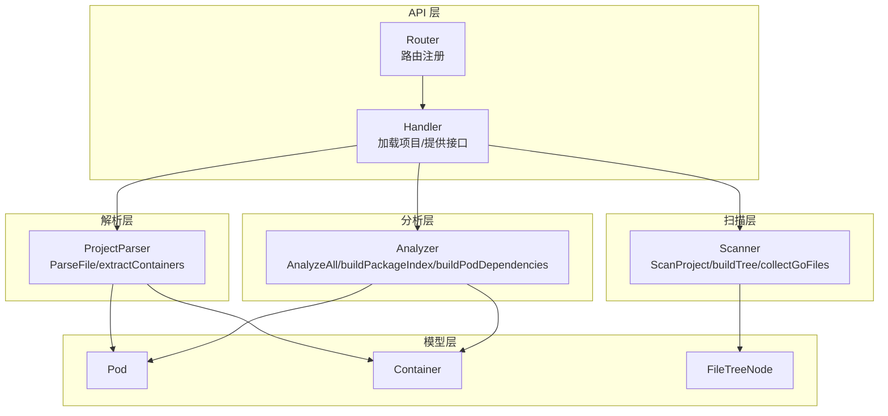
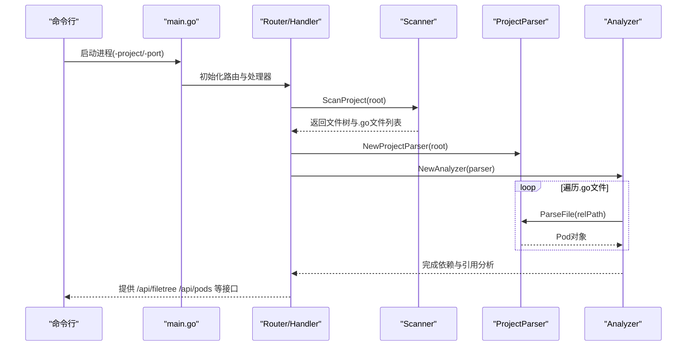
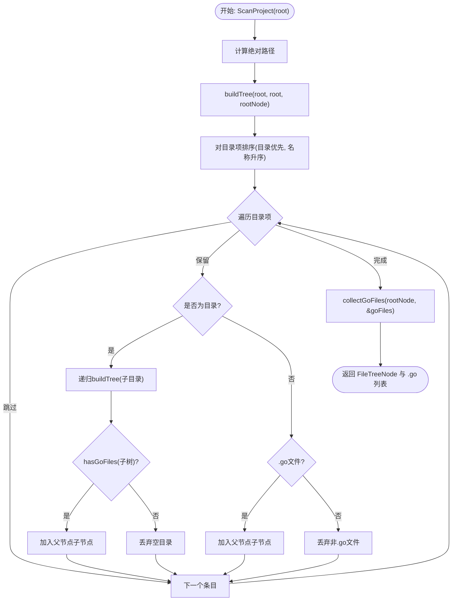
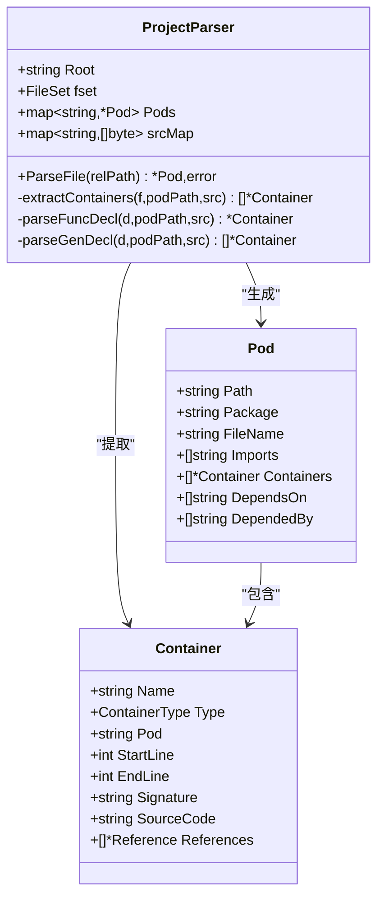
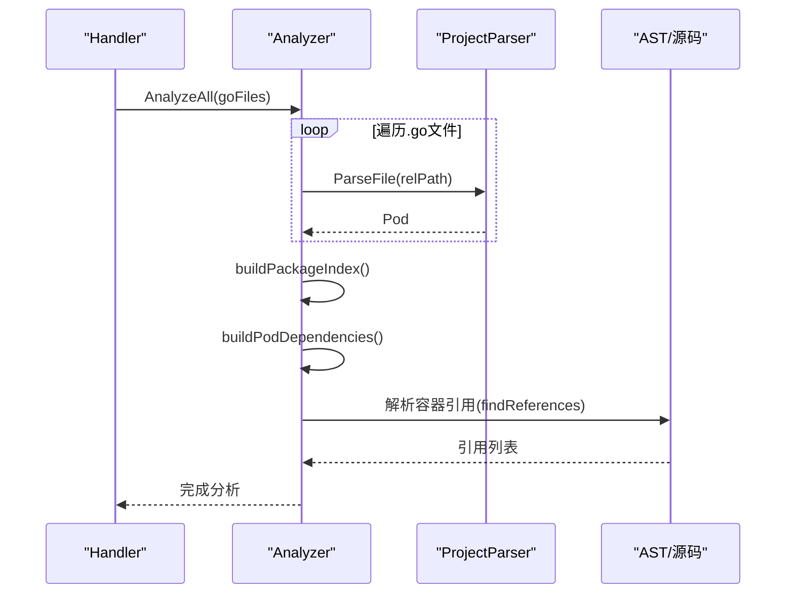
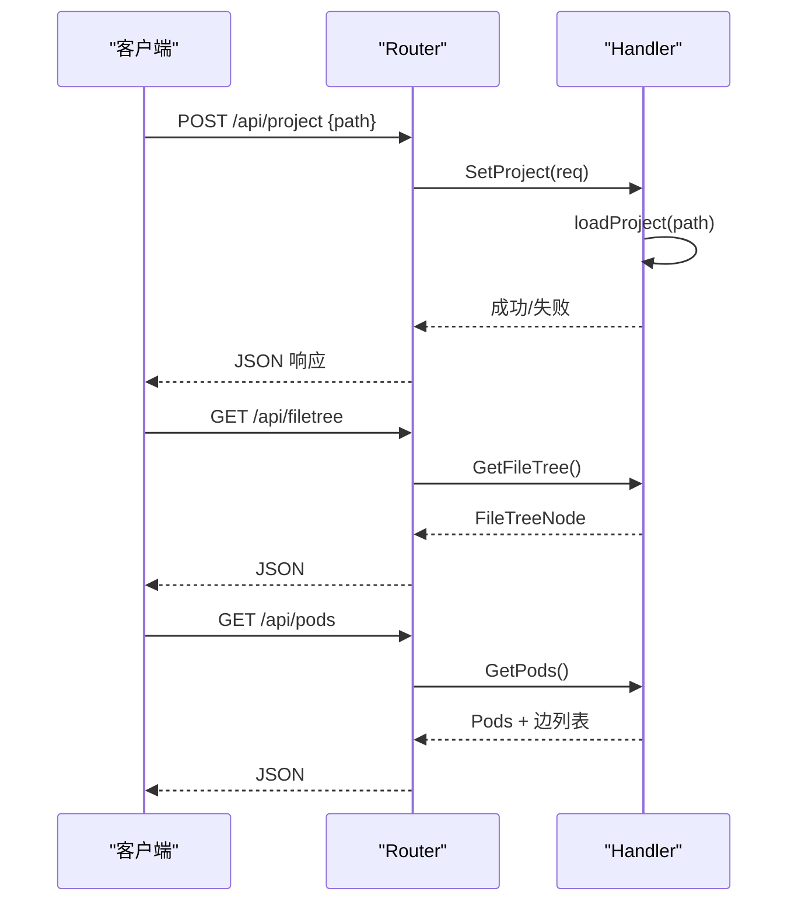
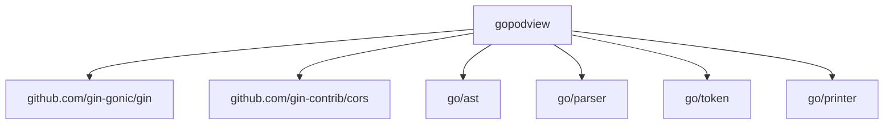

# 项目扫描机制

<cite>
**本文档引用的文件**
- [backend/internal/parser/scanner.go](file://backend/internal/parser/scanner.go)
- [backend/internal/parser/parser.go](file://backend/internal/parser/parser.go)
- [backend/internal/parser/analyzer.go](file://backend/internal/parser/analyzer.go)
- [backend/internal/model/pod.go](file://backend/internal/model/pod.go)
- [backend/internal/model/container.go](file://backend/internal/model/container.go)
- [backend/internal/api/handler.go](file://backend/internal/api/handler.go)
- [backend/internal/api/router.go](file://backend/internal/api/router.go)
- [backend/main.go](file://backend/main.go)
- [backend/go.mod](file://backend/go.mod)
</cite>

## 目录
1. [简介](#简介)
2. [项目结构](#项目结构)
3. [核心组件](#核心组件)
4. [架构总览](#架构总览)
5. [详细组件分析](#详细组件分析)
6. [依赖分析](#依赖分析)
7. [性能考虑](#性能考虑)
8. [故障排除指南](#故障排除指南)
9. [结论](#结论)
10. [附录](#附录)

## 简介
本文件面向“项目扫描机制”的技术文档，聚焦于 Go 源码项目的文件系统扫描实现。内容涵盖：
- 递归遍历策略与路径解析
- Go 源文件识别（扩展名与包声明）
- 过滤规则（符号链接、隐藏文件、忽略目录）
- 性能优化（排序、剪枝、延迟收集）
- 错误处理与异常场景
- 完整扫描流程示例（从根目录到文件列表）

## 项目结构
后端采用分层设计：
- API 层：提供 HTTP 接口，负责接收项目路径并返回文件树与分析结果
- 扫描层：递归遍历文件系统，构建文件树并收集 .go 文件
- 解析层：基于 go/ast 对每个 .go 文件进行语法解析，提取容器信息
- 分析层：建立包间依赖关系与容器引用关系
- 模型层：定义 Pod、Container、FileTreeNode 等数据结构

图表来源
- [backend/internal/api/handler.go:31-50](file://backend/internal/api/handler.go#L31-L50)
- [backend/internal/parser/scanner.go:12-32](file://backend/internal/parser/scanner.go#L12-L32)
- [backend/internal/parser/parser.go:32-59](file://backend/internal/parser/parser.go#L32-L59)
- [backend/internal/parser/analyzer.go:27-39](file://backend/internal/parser/analyzer.go#L27-L39)
- [backend/internal/model/pod.go:3-18](file://backend/internal/model/pod.go#L3-L18)
- [backend/internal/model/container.go:13-36](file://backend/internal/model/container.go#L13-L36)

章节来源
- [backend/internal/api/router.go:8-31](file://backend/internal/api/router.go#L8-L31)
- [backend/internal/api/handler.go:15-29](file://backend/internal/api/handler.go#L15-L29)
- [backend/internal/parser/scanner.go:12-32](file://backend/internal/parser/scanner.go#L12-L32)
- [backend/internal/parser/parser.go:16-30](file://backend/internal/parser/parser.go#L16-L30)
- [backend/internal/parser/analyzer.go:13-25](file://backend/internal/parser/analyzer.go#L13-L25)
- [backend/internal/model/pod.go:3-18](file://backend/internal/model/pod.go#L3-L18)
- [backend/internal/model/container.go:13-36](file://backend/internal/model/container.go#L13-L36)

## 核心组件
- 扫描器（Scanner）：负责递归遍历、路径解析、过滤与 .go 文件收集
- 项目解析器（ProjectParser）：读取 .go 文件，解析 AST，提取包名、导入与容器
- 分析器（Analyzer）：建立包索引、计算依赖、解析容器引用
- API 处理器（Handler）：协调扫描与解析，提供 HTTP 接口
- 数据模型（Pod、Container、FileTreeNode）：承载扫描与分析结果

章节来源
- [backend/internal/parser/scanner.go:12-32](file://backend/internal/parser/scanner.go#L12-L32)
- [backend/internal/parser/parser.go:32-59](file://backend/internal/parser/parser.go#L32-L59)
- [backend/internal/parser/analyzer.go:27-39](file://backend/internal/parser/analyzer.go#L27-L39)
- [backend/internal/api/handler.go:31-50](file://backend/internal/api/handler.go#L31-L50)
- [backend/internal/model/pod.go:3-18](file://backend/internal/model/pod.go#L3-L18)
- [backend/internal/model/container.go:13-36](file://backend/internal/model/container.go#L13-L36)

## 架构总览
下图展示了从命令行启动到 HTTP 接口响应的完整链路。

图表来源
- [backend/main.go:11-30](file://backend/main.go#L11-L30)
- [backend/internal/api/router.go:8-31](file://backend/internal/api/router.go#L8-L31)
- [backend/internal/api/handler.go:31-50](file://backend/internal/api/handler.go#L31-L50)
- [backend/internal/parser/scanner.go:12-32](file://backend/internal/parser/scanner.go#L12-L32)
- [backend/internal/parser/parser.go:32-59](file://backend/internal/parser/parser.go#L32-L59)
- [backend/internal/parser/analyzer.go:27-39](file://backend/internal/parser/analyzer.go#L27-L39)

## 详细组件分析

### 扫描器（Scanner）：文件系统递归与过滤
- 绝对路径规范化：使用绝对路径确保一致性
- 递归遍历：按目录优先、名称排序的顺序读取目录项
- 过滤策略：
  - 忽略特定目录：vendor、node_modules、.git、.idea、.vscode、testdata
  - 忽略以点开头的隐藏文件/目录
- 剪枝优化：仅在子树包含 .go 文件时才加入父节点的子节点
- 收集 .go 文件：深度优先遍历，收集相对路径

图表来源
- [backend/internal/parser/scanner.go:12-32](file://backend/internal/parser/scanner.go#L12-L32)
- [backend/internal/parser/scanner.go:34-78](file://backend/internal/parser/scanner.go#L34-L78)
- [backend/internal/parser/scanner.go:80-88](file://backend/internal/parser/scanner.go#L80-L88)
- [backend/internal/parser/scanner.go:90-100](file://backend/internal/parser/scanner.go#L90-L100)
- [backend/internal/parser/scanner.go:102-112](file://backend/internal/parser/scanner.go#L102-L112)

章节来源
- [backend/internal/parser/scanner.go:12-32](file://backend/internal/parser/scanner.go#L12-L32)
- [backend/internal/parser/scanner.go:34-78](file://backend/internal/parser/scanner.go#L34-L78)
- [backend/internal/parser/scanner.go:80-88](file://backend/internal/parser/scanner.go#L80-L88)
- [backend/internal/parser/scanner.go:90-100](file://backend/internal/parser/scanner.go#L90-L100)
- [backend/internal/parser/scanner.go:102-112](file://backend/internal/parser/scanner.go#L102-L112)

### 项目解析器（ProjectParser）：AST 解析与容器提取
- 读取源码并解析为 AST
- 提取包名（Package）、导入列表（Imports）
- 从函数与类型声明中提取容器（函数、结构体、接口、常量、变量）
- 记录容器起止行号与源码片段，便于后续引用定位

图表来源
- [backend/internal/parser/parser.go:16-30](file://backend/internal/parser/parser.go#L16-L30)
- [backend/internal/parser/parser.go:32-59](file://backend/internal/parser/parser.go#L32-L59)
- [backend/internal/parser/parser.go:61-73](file://backend/internal/parser/parser.go#L61-L73)
- [backend/internal/parser/parser.go:75-97](file://backend/internal/parser/parser.go#L75-L97)
- [backend/internal/parser/parser.go:112-206](file://backend/internal/parser/parser.go#L112-L206)
- [backend/internal/model/pod.go:3-11](file://backend/internal/model/pod.go#L3-L11)
- [backend/internal/model/container.go:13-22](file://backend/internal/model/container.go#L13-L22)

章节来源
- [backend/internal/parser/parser.go:32-59](file://backend/internal/parser/parser.go#L32-L59)
- [backend/internal/parser/parser.go:61-73](file://backend/internal/parser/parser.go#L61-L73)
- [backend/internal/parser/parser.go:75-97](file://backend/internal/parser/parser.go#L75-L97)
- [backend/internal/parser/parser.go:112-206](file://backend/internal/parser/parser.go#L112-L206)
- [backend/internal/model/pod.go:3-11](file://backend/internal/model/pod.go#L3-L11)
- [backend/internal/model/container.go:13-22](file://backend/internal/model/container.go#L13-L22)

### 分析器（Analyzer）：依赖与引用分析
- 建立包索引：按相对路径分组，记录导入路径到目录的映射
- 计算包间依赖：排除标准库与外部库，解析导入路径到目标目录
- 构建容器引用：在容器所在行范围内查找选择器表达式，匹配目标容器并生成引用

图表来源
- [backend/internal/api/handler.go:31-50](file://backend/internal/api/handler.go#L31-L50)
- [backend/internal/parser/analyzer.go:27-39](file://backend/internal/parser/analyzer.go#L27-L39)
- [backend/internal/parser/analyzer.go:41-53](file://backend/internal/parser/analyzer.go#L41-L53)
- [backend/internal/parser/analyzer.go:59-81](file://backend/internal/parser/analyzer.go#L59-L81)
- [backend/internal/parser/analyzer.go:100-134](file://backend/internal/parser/analyzer.go#L100-L134)
- [backend/internal/parser/analyzer.go:152-217](file://backend/internal/parser/analyzer.go#L152-L217)

章节来源
- [backend/internal/parser/analyzer.go:27-39](file://backend/internal/parser/analyzer.go#L27-L39)
- [backend/internal/parser/analyzer.go:41-53](file://backend/internal/parser/analyzer.go#L41-L53)
- [backend/internal/parser/analyzer.go:59-81](file://backend/internal/parser/analyzer.go#L59-L81)
- [backend/internal/parser/analyzer.go:100-134](file://backend/internal/parser/analyzer.go#L100-L134)
- [backend/internal/parser/analyzer.go:152-217](file://backend/internal/parser/analyzer.go#L152-L217)

### API 处理器（Handler）：加载项目与提供接口
- 加载项目：调用扫描器获取文件树与 .go 列表，初始化解析器与分析器
- 并发安全：使用读写锁保护共享状态
- 接口：设置项目、获取文件树、获取所有 Pod、获取单个 Pod/容器、获取依赖图

图表来源
- [backend/internal/api/router.go:19-28](file://backend/internal/api/router.go#L19-L28)
- [backend/internal/api/handler.go:56-75](file://backend/internal/api/handler.go#L56-L75)
- [backend/internal/api/handler.go:77-86](file://backend/internal/api/handler.go#L77-L86)
- [backend/internal/api/handler.go:93-124](file://backend/internal/api/handler.go#L93-L124)

章节来源
- [backend/internal/api/handler.go:15-29](file://backend/internal/api/handler.go#L15-L29)
- [backend/internal/api/handler.go:31-50](file://backend/internal/api/handler.go#L31-L50)
- [backend/internal/api/handler.go:56-75](file://backend/internal/api/handler.go#L56-L75)
- [backend/internal/api/handler.go:77-86](file://backend/internal/api/handler.go#L77-L86)
- [backend/internal/api/handler.go:93-124](file://backend/internal/api/handler.go#L93-L124)
- [backend/internal/api/router.go:8-31](file://backend/internal/api/router.go#L8-L31)

## 依赖分析
- 内部模块依赖：gopodview 内部各包之间通过接口解耦
- 外部依赖：gin、cors、go/ast、go/parser、go/token、go/printer 等
- 版本约束：Go 1.21；第三方库版本见 go.mod

图表来源
- [backend/go.mod:1-39](file://backend/go.mod#L1-L39)

章节来源
- [backend/go.mod:1-39](file://backend/go.mod#L1-L39)

## 性能考虑
- 排序与剪枝
  - 目录项排序：先目录后文件，同级按名称排序，减少后续分支展开次数
  - 剪枝：仅当子树包含 .go 文件时才加入父节点，避免构建空目录树
- 延迟收集
  - 先构建树，再统一收集 .go 文件，避免边构建边处理带来的重复开销
- 并发与锁
  - API 层使用读写锁，读多写少场景下提升并发吞吐
- I/O 优化
  - 一次性读取源码并缓存，避免重复 IO
- AST 解析
  - 使用 token.FileSet 复用位置信息，降低内存分配

章节来源
- [backend/internal/parser/scanner.go:40-46](file://backend/internal/parser/scanner.go#L40-L46)
- [backend/internal/parser/scanner.go:66-68](file://backend/internal/parser/scanner.go#L66-L68)
- [backend/internal/parser/scanner.go:102-112](file://backend/internal/parser/scanner.go#L102-L112)
- [backend/internal/api/handler.go:16-21](file://backend/internal/api/handler.go#L16-L21)
- [backend/internal/parser/parser.go:34-43](file://backend/internal/parser/parser.go#L34-L43)

## 故障排除指南
- 路径无效或不可访问
  - 现象：扫描阶段返回错误
  - 处理：检查路径是否存在、权限是否足够
  - 参考：[backend/internal/parser/scanner.go:13-16](file://backend/internal/parser/scanner.go#L13-L16)
- 文件读取失败
  - 现象：解析阶段返回错误
  - 处理：确认文件可读、编码正确、未被占用
  - 参考：[backend/internal/parser/parser.go:34-37](file://backend/internal/parser/parser.go#L34-L37)
- AST 解析错误
  - 现象：语法错误导致解析失败
  - 处理：修复语法问题或跳过该文件继续分析
  - 参考：[backend/internal/parser/parser.go:40-43](file://backend/internal/parser/parser.go#L40-L43)
- 导入路径解析失败
  - 现象：无法定位依赖目录
  - 处理：检查导入路径是否规范、是否在当前模块内
  - 参考：[backend/internal/parser/analyzer.go:83-98](file://backend/internal/parser/analyzer.go#L83-L98)
- 并发访问冲突
  - 现象：读写竞争导致数据不一致
  - 处理：使用读写锁保护共享状态
  - 参考：[backend/internal/api/handler.go:43-49](file://backend/internal/api/handler.go#L43-L49)

章节来源
- [backend/internal/parser/scanner.go:13-16](file://backend/internal/parser/scanner.go#L13-L16)
- [backend/internal/parser/parser.go:34-43](file://backend/internal/parser/parser.go#L34-L43)
- [backend/internal/parser/analyzer.go:83-98](file://backend/internal/parser/analyzer.go#L83-L98)
- [backend/internal/api/handler.go:43-49](file://backend/internal/api/handler.go#L43-L49)

## 结论
该项目扫描机制通过“扫描-解析-分析”三层协作，实现了对 Go 项目的高效文件树构建与依赖分析。其关键特性包括：
- 明确的过滤策略与剪枝优化，显著减少不必要的遍历
- 基于 AST 的容器与引用提取，保证语义层面的准确性
- 并发安全与资源复用，兼顾性能与稳定性
- 清晰的接口设计，便于前端可视化与交互

## 附录

### 从根目录到文件列表的完整流程示例（步骤化）
- 步骤 1：命令行启动，传入项目路径与端口
  - 参考：[backend/main.go:11-30](file://backend/main.go#L11-L30)
- 步骤 2：初始化路由与处理器
  - 参考：[backend/internal/api/router.go:8-31](file://backend/internal/api/router.go#L8-L31)
- 步骤 3：设置项目路径（POST /api/project）
  - 参考：[backend/internal/api/handler.go:56-75](file://backend/internal/api/handler.go#L56-L75)
- 步骤 4：扫描项目，生成文件树与 .go 列表
  - 参考：[backend/internal/parser/scanner.go:12-32](file://backend/internal/parser/scanner.go#L12-L32)
- 步骤 5：初始化解析器与分析器，逐文件解析并建立依赖
  - 参考：[backend/internal/parser/parser.go:32-59](file://backend/internal/parser/parser.go#L32-L59), [backend/internal/parser/analyzer.go:27-39](file://backend/internal/parser/analyzer.go#L27-L39)
- 步骤 6：提供接口查询文件树、Pod、容器与依赖
  - 参考：[backend/internal/api/handler.go:77-124](file://backend/internal/api/handler.go#L77-L124)

章节来源
- [backend/main.go:11-30](file://backend/main.go#L11-L30)
- [backend/internal/api/router.go:8-31](file://backend/internal/api/router.go#L8-L31)
- [backend/internal/api/handler.go:56-75](file://backend/internal/api/handler.go#L56-L75)
- [backend/internal/parser/scanner.go:12-32](file://backend/internal/parser/scanner.go#L12-L32)
- [backend/internal/parser/parser.go:32-59](file://backend/internal/parser/parser.go#L32-L59)
- [backend/internal/parser/analyzer.go:27-39](file://backend/internal/parser/analyzer.go#L27-L39)
- [backend/internal/api/handler.go:77-124](file://backend/internal/api/handler.go#L77-L124)