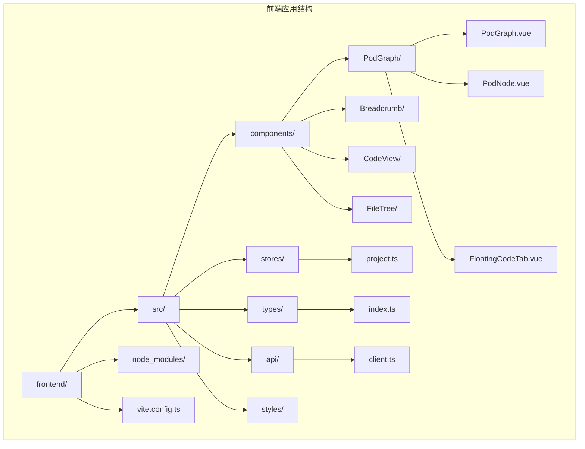
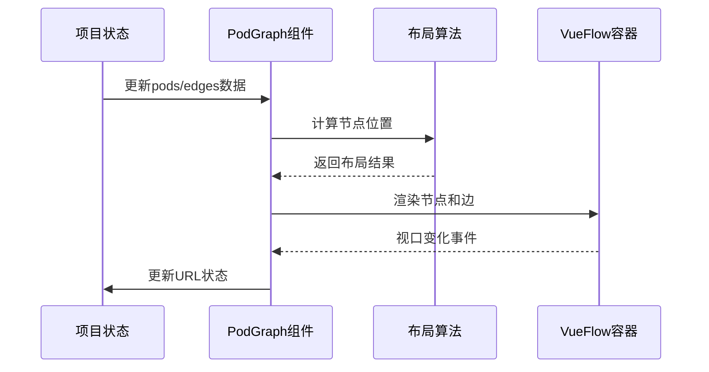
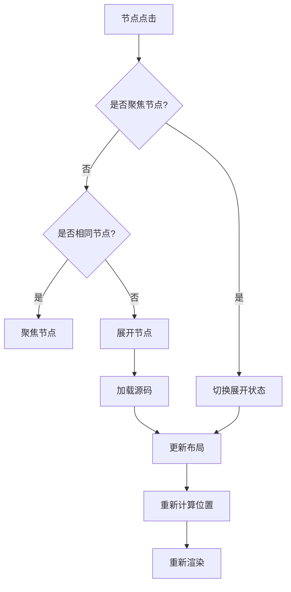
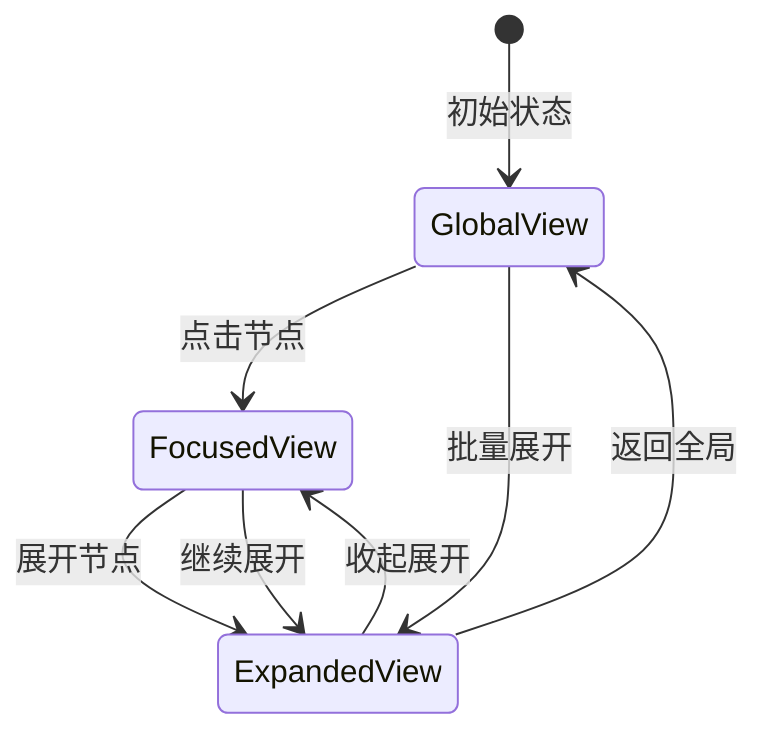
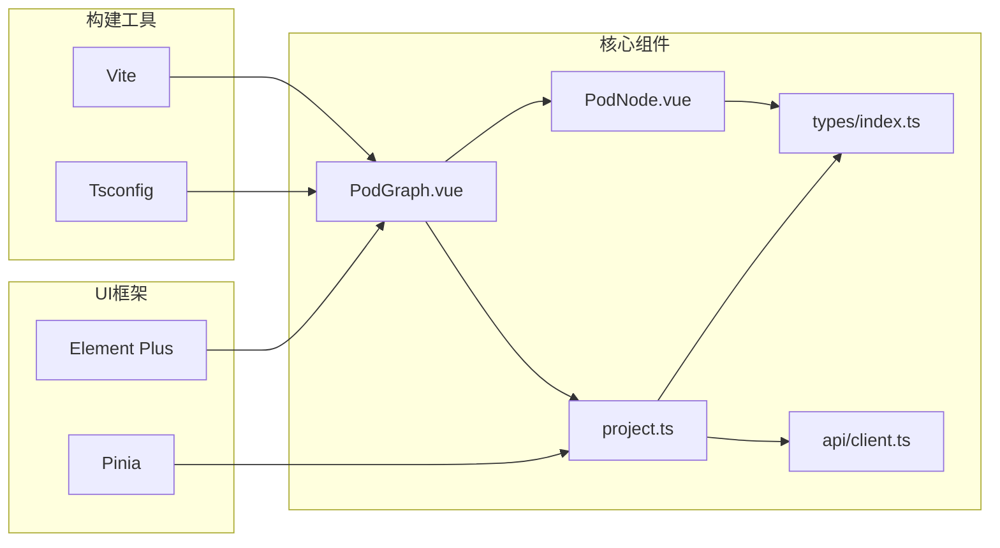

# Vue Flow 图形引擎集成

<cite>
**本文档引用的文件**
- [PodGraph.vue](file://frontend/src/components/PodGraph/PodGraph.vue)
- [PodNode.vue](file://frontend/src/components/PodGraph/PodNode.vue)
- [FloatingCodeTab.vue](file://frontend/src/components/PodGraph/FloatingCodeTab.vue)
- [project.ts](file://frontend/src/stores/project.ts)
- [index.ts](file://frontend/src/types/index.ts)
- [client.ts](file://frontend/src/api/client.ts)
- [main.ts](file://frontend/src/main.ts)
- [App.vue](file://frontend/src/App.vue)
- [package.json](file://frontend/package.json)
- [vite.config.ts](file://frontend/vite.config.ts)
</cite>

## 目录
1. [简介](#简介)
2. [项目结构](#项目结构)
3. [核心组件](#核心组件)
4. [架构概览](#架构概览)
5. [详细组件分析](#详细组件分析)
6. [依赖关系分析](#依赖关系分析)
7. [性能考虑](#性能考虑)
8. [故障排除指南](#故障排除指南)
9. [结论](#结论)
10. [附录](#附录)

## 简介

GoPodView 是一个基于 Vue Flow 图形引擎的 Go 语言包依赖关系可视化工具。该项目通过 Vue Flow 实现了复杂的图形渲染、交互控制和数据可视化功能，为开发者提供了直观的包依赖关系分析界面。

本项目深度集成了 Vue Flow 核心组件，包括 VueFlow 容器、Background 背景网格、Controls 控制面板等，并实现了自定义的 PodNode 节点类型。系统支持多种视图模式（全局、聚焦、展开），具备完整的节点交互功能，包括点击、拖拽、缩放等操作。

## 项目结构

项目采用前后端分离架构，前端使用 Vue 3 + TypeScript + Vite 构建，后端提供 Go 语言分析服务。前端主要包含以下关键目录：



**图表来源**
- [main.ts:1-12](file://frontend/src/main.ts#L1-L12)
- [App.vue:1-125](file://frontend/src/App.vue#L1-L125)

**章节来源**
- [main.ts:1-12](file://frontend/src/main.ts#L1-L12)
- [App.vue:1-125](file://frontend/src/App.vue#L1-L125)

## 核心组件

### VueFlow 容器配置

项目中的 VueFlow 容器是整个图形系统的基础设施，负责管理节点、边和视口状态。核心配置包括：

- **节点类型注册**：通过 `nodeTypes` 属性注册自定义节点类型
- **默认视口设置**：初始缩放级别和位置
- **缩放限制**：最小和最大缩放比例
- **数据绑定**：动态绑定节点和边的数据源

### Background 背景网格

背景网格提供了视觉参考框架，帮助用户更好地理解节点间的相对位置关系。系统使用默认的网格样式，无需额外配置。

### Controls 控制面板

控制面板提供了标准的图形操作功能：
- 缩放控制（放大/缩小/重置）
- 视口导航（平移）
- 布局适配（适合视窗）

**章节来源**
- [PodGraph.vue:31-33](file://frontend/src/components/PodGraph/PodGraph.vue#L31-L33)
- [PodGraph.vue:541-553](file://frontend/src/components/PodGraph/PodGraph.vue#L541-L553)

## 架构概览

系统采用分层架构设计，各组件职责明确：

```mermaid
graph TB
subgraph "应用层"
App[App.vue] --> Graph[PodGraph.vue]
Graph --> Store[project.ts]
end
subgraph "图形层"
Graph --> VueFlow[VuFlow容器]
VueFlow --> Background[Background网格]
VueFlow --> Controls[Controls面板]
VueFlow --> Nodes[PodNode节点]
end
subgraph "数据层"
Store --> Types[types/index.ts]
Store --> API[api/client.ts]
end
subgraph "外部依赖"
VueFlow --> Core[@vue-flow/core]
Nodes --> Monaco[Monaco编辑器]
Store --> Pinia[Pinia状态管理]
end
```

**图表来源**
- [App.vue:1-125](file://frontend/src/App.vue#L1-L125)
- [PodGraph.vue:1-581](file://frontend/src/components/PodGraph/PodGraph.vue#L1-L581)
- [project.ts:1-476](file://frontend/src/stores/project.ts#L1-L476)

## 详细组件分析

### PodGraph 组件分析

PodGraph 是整个图形系统的主控制器，负责协调所有子组件的工作。

#### 核心功能特性

1. **节点类型注册机制**
   - 使用 `markRaw` 包装自定义节点组件
   - 通过 `nodeTypes` 对象统一管理节点类型
   - 支持 PodNode 类型的完整生命周期管理

2. **动态布局算法**
   - 全局布局：基于拓扑排序的层次化布局
   - 聚焦布局：围绕中心节点的分支树布局
   - 自适应尺寸：根据节点内容动态调整大小

3. **视图状态管理**
   - 支持三种视图模式：global、focused、expanded
   - 动态切换视图时保持用户交互状态
   - URL 同步机制确保页面刷新后的状态恢复

#### 数据流架构



**图表来源**
- [PodGraph.vue:79-125](file://frontend/src/components/PodGraph/PodGraph.vue#L79-L125)
- [project.ts:375-378](file://frontend/src/stores/project.ts#L375-L378)

**章节来源**
- [PodGraph.vue:1-581](file://frontend/src/components/PodGraph/PodGraph.vue#L1-L581)

### PodNode 节点类型分析

PodNode 是自定义的节点组件，实现了丰富的交互功能和视觉效果。

#### 节点渲染模式

系统支持两种渲染模式：

1. **点状模式（默认）**
   - 圆形节点显示包的基本信息
   - 颜色编码表示包所属的模块
   - 数字标签显示容器数量

2. **卡片模式（展开）**
   - 详细的包信息展示
   - 容器列表（函数、结构体、接口等）
   - 内联代码编辑器
   - 参考链接导航

#### 交互功能实现



**图表来源**
- [PodNode.vue:97-111](file://frontend/src/components/PodGraph/PodNode.vue#L97-L111)
- [project.ts:158-198](file://frontend/src/stores/project.ts#L158-L198)

**章节来源**
- [PodNode.vue:1-425](file://frontend/src/components/PodGraph/PodNode.vue#L1-L425)

### FloatingCodeTab 浮动代码标签分析

FloatingCodeTab 实现了浮动代码查看功能，提供独立的代码编辑环境。

#### 核心特性

1. **拖拽移动**
   - 支持鼠标拖拽移动标签位置
   - 拖拽过程中禁用其他交互
   - 释放鼠标时停止拖拽状态

2. **尺寸调整**
   - 右下角拖拽手柄调整大小
   - 最小尺寸限制防止界面混乱
   - 实时预览调整效果

3. **Monaco 编辑器集成**
   - Go 语言语法高亮
   - 只读模式防止误修改
   - 自动布局适配

**章节来源**
- [FloatingCodeTab.vue:1-209](file://frontend/src/components/PodGraph/FloatingCodeTab.vue#L1-L209)

### 状态管理与数据流

项目使用 Pinia 进行状态管理，实现了完整的数据流控制：



**图表来源**
- [project.ts:158-247](file://frontend/src/stores/project.ts#L158-L247)

**章节来源**
- [project.ts:1-476](file://frontend/src/stores/project.ts#L1-L476)

## 依赖关系分析

### 外部依赖管理

项目使用 npm 管理依赖，核心 Vue Flow 相关依赖如下：

| 依赖包 | 版本 | 用途 |
|--------|------|------|
| @vue-flow/core | ^1.48.2 | 核心图形引擎 |
| @vue-flow/background | ^1.3.2 | 背景网格组件 |
| @vue-flow/controls | ^1.1.3 | 控制面板组件 |
| @vue-flow/minimap | ^1.5.4 | 小地图组件 |
| monaco-editor | ^0.55.1 | 代码编辑器 |

### 内部依赖关系



**图表来源**
- [package.json:11-22](file://frontend/package.json#L11-L22)
- [main.ts:1-12](file://frontend/src/main.ts#L1-L12)

**章节来源**
- [package.json:1-33](file://frontend/package.json#L1-L33)
- [main.ts:1-12](file://frontend/src/main.ts#L1-L12)

## 性能考虑

### 渲染优化策略

1. **虚拟化渲染**
   - 仅渲染可见节点和边
   - 动态计算可视区域内的元素
   - 避免不必要的重渲染

2. **布局缓存**
   - 缓存节点测量结果
   - 布局版本号控制更新时机
   - 智能增量更新机制

3. **内存管理**
   - 及时清理 Monaco 编辑器实例
   - 监听组件销毁事件释放资源
   - 防止内存泄漏

### 性能监控

系统实现了性能监控机制：
- 布局计算时间统计
- 节点渲染性能指标
- 内存使用情况监控

## 故障排除指南

### 常见问题及解决方案

#### VueFlow 组件未正确渲染

**问题症状**：VueFlow 容器显示空白或报错

**可能原因**：
1. 依赖包版本不兼容
2. 样式文件未正确导入
3. 节点数据格式错误

**解决方案**：
1. 检查 `package.json` 中的 Vue Flow 版本
2. 确认样式文件导入顺序
3. 验证节点数据结构符合要求

#### 节点点击无响应

**问题症状**：点击节点无法触发任何操作

**可能原因**：
1. 事件处理器未正确绑定
2. 节点类型未正确注册
3. z-index 层级冲突

**解决方案**：
1. 检查 `nodeTypes` 注册逻辑
2. 验证事件处理器绑定
3. 调整 CSS 层级设置

#### 布局计算异常

**问题症状**：节点位置计算错误或布局卡死

**可能原因**：
1. 循环依赖导致的无限递归
2. 数据结构不一致
3. 内存不足

**解决方案**：
1. 检查依赖关系数据完整性
2. 添加循环检测机制
3. 实施内存使用监控

**章节来源**
- [PodGraph.vue:1-581](file://frontend/src/components/PodGraph/PodGraph.vue#L1-L581)
- [project.ts:1-476](file://frontend/src/stores/project.ts#L1-L476)

## 结论

GoPodView 成功地集成了 Vue Flow 图形引擎，实现了复杂而高效的包依赖关系可视化系统。通过精心设计的组件架构、完善的交互机制和优化的性能策略，系统为开发者提供了优秀的用户体验。

项目的主要优势包括：
- 完整的 Vue Flow 集成方案
- 自定义节点类型的灵活扩展
- 多层次的视图管理模式
- 丰富的交互功能实现
- 良好的性能表现和可维护性

该实现为类似图形可视化项目的开发提供了宝贵的参考和最佳实践。

## 附录

### 配置选项参考

#### VueFlow 核心配置

| 配置项 | 默认值 | 说明 |
|--------|--------|------|
| defaultViewport.zoom | 1 | 默认缩放级别 |
| defaultViewport.x | 0 | 默认水平偏移 |
| defaultViewport.y | 0 | 默认垂直偏移 |
| minZoom | 0.1 | 最小缩放比例 |
| maxZoom | 2 | 最大缩放比例 |

#### 节点类型注册

```typescript
const nodeTypes = {
  pod: markRaw(PodNode),
}
```

#### 主题样式定制

系统使用默认主题样式，可通过覆盖 CSS 变量进行定制：
- `--vf-node-bg`: 节点背景色
- `--vf-node-border`: 节点边框色
- `--vf-edge-color`: 边颜色
- `--vf-control-bg`: 控制面板背景色