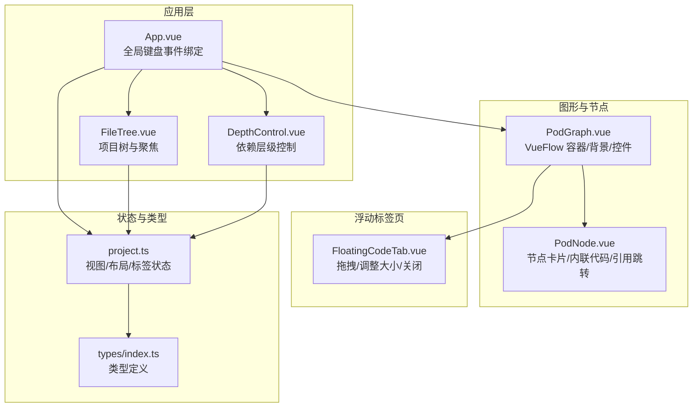
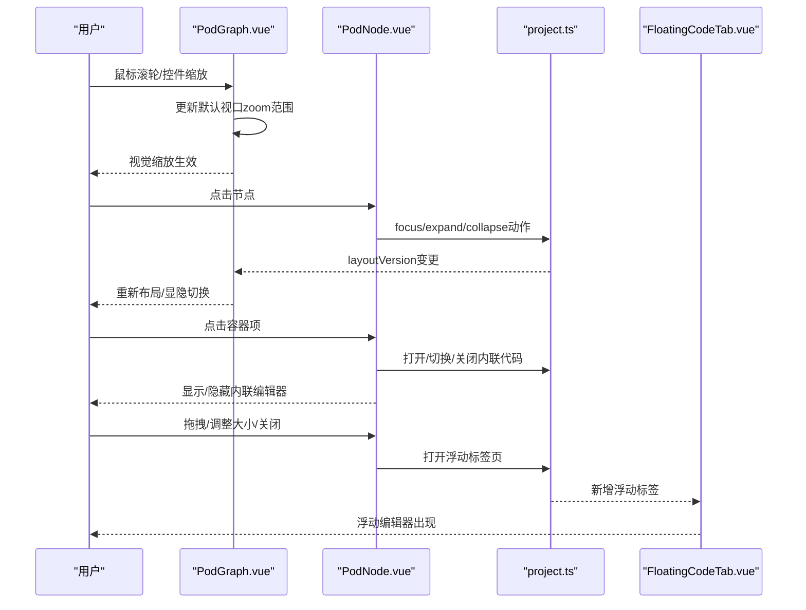
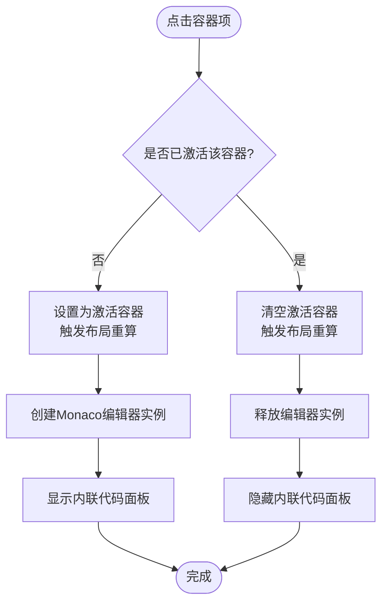
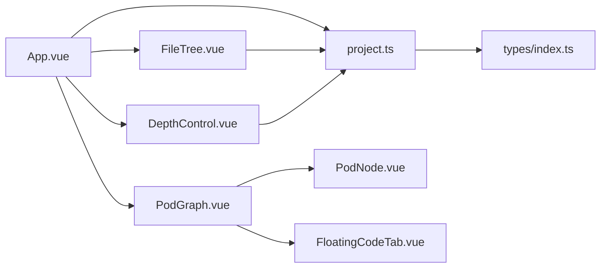

# 交互式操作功能

<cite>
**本文引用的文件**
- [frontend/src/components/PodGraph/PodGraph.vue](file://frontend/src/components/PodGraph/PodGraph.vue)
- [frontend/src/components/PodGraph/PodNode.vue](file://frontend/src/components/PodGraph/PodNode.vue)
- [frontend/src/components/PodGraph/FloatingCodeTab.vue](file://frontend/src/components/PodGraph/FloatingCodeTab.vue)
- [frontend/src/components/CodeView/CodeView.vue](file://frontend/src/components/CodeView/CodeView.vue)
- [frontend/src/stores/project.ts](file://frontend/src/stores/project.ts)
- [frontend/src/App.vue](file://frontend/src/App.vue)
- [frontend/src/types/index.ts](file://frontend/src/types/index.ts)
- [frontend/src/components/FileTree/FileTree.vue](file://frontend/src/components/FileTree/FileTree.vue)
- [frontend/src/components/Controls/DepthControl.vue](file://frontend/src/components/Controls/DepthControl.vue)
- [frontend/src/styles/global.css](file://frontend/src/styles/global.css)
</cite>

## 目录
1. [简介](#简介)
2. [项目结构](#项目结构)
3. [核心组件](#核心组件)
4. [架构总览](#架构总览)
5. [详细组件分析](#详细组件分析)
6. [依赖关系分析](#依赖关系分析)
7. [性能考虑](#性能考虑)
8. [故障排查指南](#故障排查指南)
9. [结论](#结论)
10. [附录](#附录)

## 简介
本文件围绕交互式操作功能进行系统化说明，涵盖图形交互（节点拖拽、缩放控制、鼠标悬停）、键盘快捷键、事件处理机制（捕获/冒泡/委托）、浮动代码标签页系统（创建/切换/关闭/位置管理）、交互反馈机制（视觉反馈/状态指示/错误提示）以及性能优化（事件节流/防抖/GPU 加速）。文档以实际源码为依据，提供可追溯的“章节来源”与“图表来源”，并通过图示帮助非专业读者理解。

## 项目结构
前端采用 Vue 3 + Pinia 架构，交互相关的关键模块集中在 Pod 图形视图、节点渲染、浮动标签页与全局状态管理中；全局键盘事件在应用入口集中处理；文件树与深度控制提供导航与视图层级调整能力。

**图表来源**
- [frontend/src/App.vue:10-28](file://frontend/src/App.vue#L10-L28)
- [frontend/src/components/FileTree/FileTree.vue:37-48](file://frontend/src/components/FileTree/FileTree.vue#L37-L48)
- [frontend/src/components/Controls/DepthControl.vue:8-19](file://frontend/src/components/Controls/DepthControl.vue#L8-L19)
- [frontend/src/components/PodGraph/PodGraph.vue:541-553](file://frontend/src/components/PodGraph/PodGraph.vue#L541-L553)
- [frontend/src/components/PodGraph/PodNode.vue:97-160](file://frontend/src/components/PodGraph/PodNode.vue#L97-L160)
- [frontend/src/components/PodGraph/FloatingCodeTab.vue:36-82](file://frontend/src/components/PodGraph/FloatingCodeTab.vue#L36-L82)
- [frontend/src/stores/project.ts:14-476](file://frontend/src/stores/project.ts#L14-L476)
- [frontend/src/types/index.ts:1-74](file://frontend/src/types/index.ts#L1-L74)

**章节来源**
- [frontend/src/App.vue:10-28](file://frontend/src/App.vue#L10-L28)
- [frontend/src/components/PodGraph/PodGraph.vue:541-553](file://frontend/src/components/PodGraph/PodGraph.vue#L541-L553)
- [frontend/src/stores/project.ts:14-476](file://frontend/src/stores/project.ts#L14-L476)

## 核心组件
- PodGraph：承载 VueFlow 图形容器，配置默认视口、最小/最大缩放，挂载背景与控件；动态生成节点与边，支持聚焦/展开视图下的位置计算与动画边。
- PodNode：节点渲染组件，支持“点模式”与“卡片模式”。点击行为区分聚焦/展开；内联代码编辑器按需创建；支持弹出到浮动标签页；容器项点击支持 Ctrl/Cmd + 点击跳转引用。
- FloatingCodeTab：浮动代码标签页，支持拖拽移动、右下角拖拽调整尺寸、关闭按钮；内部嵌入 Monaco 编辑器只读显示源码。
- project.ts：Pinia Store，统一管理视图级别、聚焦路径、展开集合、选中容器、导航历史、浮动标签列表与布局版本；提供打开/关闭浮动标签、URL 同步等方法。
- App.vue：全局键盘事件监听（Cmd+[ / Cmd+]），触发 Store 的前进/后退；初始化时恢复 URL 状态。
- 类型系统：定义容器/节点/边/导航条目/浮动标签等数据结构，确保交互状态与 UI 行为一致。

**章节来源**
- [frontend/src/components/PodGraph/PodGraph.vue:541-553](file://frontend/src/components/PodGraph/PodGraph.vue#L541-L553)
- [frontend/src/components/PodGraph/PodNode.vue:97-160](file://frontend/src/components/PodGraph/PodNode.vue#L97-L160)
- [frontend/src/components/PodGraph/FloatingCodeTab.vue:36-82](file://frontend/src/components/PodGraph/FloatingCodeTab.vue#L36-L82)
- [frontend/src/stores/project.ts:14-476](file://frontend/src/stores/project.ts#L14-L476)
- [frontend/src/App.vue:19-28](file://frontend/src/App.vue#L19-L28)
- [frontend/src/types/index.ts:10-73](file://frontend/src/types/index.ts#L10-L73)

## 架构总览
交互架构围绕“状态驱动 UI + 组件事件编排”的模式组织：Store 负责状态与动作，组件通过事件回调更新状态，UI 响应状态变化；全局键盘事件与局部鼠标事件协同，形成统一的交互入口。

**图表来源**
- [frontend/src/components/PodGraph/PodGraph.vue:541-553](file://frontend/src/components/PodGraph/PodGraph.vue#L541-L553)
- [frontend/src/components/PodGraph/PodNode.vue:97-160](file://frontend/src/components/PodGraph/PodNode.vue#L97-L160)
- [frontend/src/stores/project.ts:315-338](file://frontend/src/stores/project.ts#L315-L338)
- [frontend/src/components/PodGraph/FloatingCodeTab.vue:36-82](file://frontend/src/components/PodGraph/FloatingCodeTab.vue#L36-L82)

## 详细组件分析

### 图形交互：节点拖拽、缩放控制、鼠标悬停
- 缩放控制
  - 在 PodGraph 中设置默认视口与最小/最大缩放值，保证缩放范围可控；背景与控件组件由 VueFlow 提供，便于统一交互体验。
  - 参考路径：[frontend/src/components/PodGraph/PodGraph.vue:541-549](file://frontend/src/components/PodGraph/PodGraph.vue#L541-L549)
- 节点拖拽
  - PodNode 使用 Handle 作为连接锚点，隐藏但存在，用于边连接；节点本身不直接实现拖拽逻辑，拖拽由底层 VueFlow 控制器负责。
  - 参考路径：[frontend/src/components/PodGraph/PodNode.vue:228-229](file://frontend/src/components/PodGraph/PodNode.vue#L228-L229)
- 鼠标悬停
  - 点击行为区分：点击已聚焦节点执行聚焦/展开切换；点击其他节点在非聚焦状态下仅展开当前节点。
  - 参考路径：[frontend/src/components/PodGraph/PodNode.vue:97-111](file://frontend/src/components/PodGraph/PodNode.vue#L97-L111)
- 边样式与动画
  - 根据聚焦/展开状态动态设置边的颜色、粗细与透明度；聚焦时与主路径相关的边带流动画。
  - 参考路径：[frontend/src/components/PodGraph/PodGraph.vue:127-136](file://frontend/src/components/PodGraph/PodGraph.vue#L127-L136)

**章节来源**
- [frontend/src/components/PodGraph/PodGraph.vue:541-549](file://frontend/src/components/PodGraph/PodGraph.vue#L541-L549)
- [frontend/src/components/PodGraph/PodNode.vue:97-111](file://frontend/src/components/PodGraph/PodNode.vue#L97-L111)
- [frontend/src/components/PodGraph/PodGraph.vue:127-136](file://frontend/src/components/PodGraph/PodGraph.vue#L127-L136)

### 事件处理机制：捕获、冒泡、委托
- 冒泡与阻止传播
  - 在 PodNode 中，容器项点击与分组点击均调用事件阻止传播，避免事件向上冒泡至父级节点导致误触。
  - 参考路径：[frontend/src/components/PodGraph/PodNode.vue:113-133](file://frontend/src/components/PodGraph/PodNode.vue#L113-L133)
- 委托与局部监听
  - FloatingCodeTab 对窗口级 mousemove/mouseup 进行监听与清理，避免跨组件共享状态引发的内存泄漏。
  - 参考路径：[frontend/src/components/PodGraph/FloatingCodeTab.vue:36-54](file://frontend/src/components/PodGraph/FloatingCodeTab.vue#L36-L54)，[frontend/src/components/PodGraph/FloatingCodeTab.vue:68-78](file://frontend/src/components/PodGraph/FloatingCodeTab.vue#L68-L78)，[frontend/src/components/PodGraph/FloatingCodeTab.vue:84-90](file://frontend/src/components/PodGraph/FloatingCodeTab.vue#L84-L90)
- 全局键盘事件
  - App.vue 在挂载时绑定全局 keydown，处理 Cmd+[ 与 Cmd+] 快捷键，调用 Store 的导航方法。
  - 参考路径：[frontend/src/App.vue:19-28](file://frontend/src/App.vue#L19-L28)

**章节来源**
- [frontend/src/components/PodGraph/PodNode.vue:113-133](file://frontend/src/components/PodGraph/PodNode.vue#L113-L133)
- [frontend/src/components/PodGraph/FloatingCodeTab.vue:36-54](file://frontend/src/components/PodGraph/FloatingCodeTab.vue#L36-L54)
- [frontend/src/components/PodGraph/FloatingCodeTab.vue:68-78](file://frontend/src/components/PodGraph/FloatingCodeTab.vue#L68-L78)
- [frontend/src/components/PodGraph/FloatingCodeTab.vue:84-90](file://frontend/src/components/PodGraph/FloatingCodeTab.vue#L84-L90)
- [frontend/src/App.vue:19-28](file://frontend/src/App.vue#L19-L28)

### 浮动代码标签页系统：创建/切换/关闭/位置管理
- 创建
  - 从容器点击或双击弹出，Store 生成唯一 ID、标题、签名、源码与初始坐标，插入浮动标签数组。
  - 参考路径：[frontend/src/stores/project.ts:315-338](file://frontend/src/stores/project.ts#L315-L338)
- 切换
  - 通过点击容器项或分组头切换激活容器，触发内联编辑器内容更新；关闭后清空实例。
  - 参考路径：[frontend/src/components/PodGraph/PodNode.vue:135-143](file://frontend/src/components/PodGraph/PodNode.vue#L135-L143)，[frontend/src/components/PodGraph/PodNode.vue:180-185](file://frontend/src/components/PodGraph/PodNode.vue#L180-L185)
- 关闭
  - 点击标签页关闭按钮，Store 过滤掉对应标签；组件卸载时释放编辑器实例。
  - 参考路径：[frontend/src/components/PodGraph/FloatingCodeTab.vue:80-82](file://frontend/src/components/PodGraph/FloatingCodeTab.vue#L80-L82)，[frontend/src/components/PodGraph/FloatingCodeTab.vue:21-34](file://frontend/src/components/PodGraph/FloatingCodeTab.vue#L21-L34)
- 位置管理
  - 支持拖拽移动与右下角拖拽调整宽高；限制最小尺寸；窗口级事件绑定与解绑确保稳定性。
  - 参考路径：[frontend/src/components/PodGraph/FloatingCodeTab.vue:36-78](file://frontend/src/components/PodGraph/FloatingCodeTab.vue#L36-L78)，[frontend/src/components/PodGraph/FloatingCodeTab.vue:84-90](file://frontend/src/components/PodGraph/FloatingCodeTab.vue#L84-L90)

**图表来源**
- [frontend/src/components/PodGraph/PodNode.vue:135-143](file://frontend/src/components/PodGraph/PodNode.vue#L135-L143)
- [frontend/src/components/PodGraph/PodNode.vue:161-178](file://frontend/src/components/PodGraph/PodNode.vue#L161-L178)
- [frontend/src/components/PodGraph/PodNode.vue:180-185](file://frontend/src/components/PodGraph/PodNode.vue#L180-L185)

**章节来源**
- [frontend/src/stores/project.ts:315-338](file://frontend/src/stores/project.ts#L315-L338)
- [frontend/src/components/PodGraph/PodNode.vue:135-143](file://frontend/src/components/PodGraph/PodNode.vue#L135-L143)
- [frontend/src/components/PodGraph/PodNode.vue:161-178](file://frontend/src/components/PodGraph/PodNode.vue#L161-L178)
- [frontend/src/components/PodGraph/FloatingCodeTab.vue:36-78](file://frontend/src/components/PodGraph/FloatingCodeTab.vue#L36-L78)

### 交互反馈机制：视觉反馈、状态指示、错误提示
- 视觉反馈
  - 节点悬浮放大、阴影增强、聚焦态边框高亮；容器项悬停变色、激活态左侧强调；标签页拖拽/调整大小时的光标与边框变化。
  - 参考路径：[frontend/src/components/PodGraph/PodNode.vue:379-385](file://frontend/src/components/PodGraph/PodNode.vue#L379-L385)，[frontend/src/components/PodGraph/PodNode.vue:398-400](file://frontend/src/components/PodGraph/PodNode.vue#L398-L400)，[frontend/src/components/PodGraph/PodNode.vue:400-406](file://frontend/src/components/PodGraph/PodNode.vue#L400-L406)，[frontend/src/components/PodGraph/FloatingCodeTab.vue:130-141](file://frontend/src/components/PodGraph/FloatingCodeTab.vue#L130-L141)，[frontend/src/components/PodGraph/FloatingCodeTab.vue:184-203](file://frontend/src/components/PodGraph/FloatingCodeTab.vue#L184-L203)
- 状态指示
  - 导航按钮禁用状态根据历史索引动态更新；加载状态通过骨架屏呈现；文件树当前聚焦节点高亮。
  - 参考路径：[frontend/src/App.vue:44-58](file://frontend/src/App.vue#L44-L58)，[frontend/src/components/FileTree/FileTree.vue:111-113](file://frontend/src/components/FileTree/FileTree.vue#L111-L113)，[frontend/src/components/FileTree/FileTree.vue:54-59](file://frontend/src/components/FileTree/FileTree.vue#L54-L59)
- 错误提示
  - 当前未见显式的错误弹窗逻辑；建议在 Store 异常分支增加错误状态与提示组件，以提升可用性。

**章节来源**
- [frontend/src/components/PodGraph/PodNode.vue:379-385](file://frontend/src/components/PodGraph/PodNode.vue#L379-L385)
- [frontend/src/components/PodGraph/PodNode.vue:398-400](file://frontend/src/components/PodGraph/PodNode.vue#L398-L400)
- [frontend/src/components/PodGraph/PodNode.vue:400-406](file://frontend/src/components/PodGraph/PodNode.vue#L400-L406)
- [frontend/src/components/PodGraph/FloatingCodeTab.vue:130-141](file://frontend/src/components/PodGraph/FloatingCodeTab.vue#L130-L141)
- [frontend/src/components/PodGraph/FloatingCodeTab.vue:184-203](file://frontend/src/components/PodGraph/FloatingCodeTab.vue#L184-L203)
- [frontend/src/App.vue:44-58](file://frontend/src/App.vue#L44-L58)
- [frontend/src/components/FileTree/FileTree.vue:111-113](file://frontend/src/components/FileTree/FileTree.vue#L111-L113)
- [frontend/src/components/FileTree/FileTree.vue:54-59](file://frontend/src/components/FileTree/FileTree.vue#L54-L59)

### 交互性能优化：事件节流/防抖/GPU 加速
- 事件节流/防抖
  - 当前未发现显式的节流/防抖实现；对于高频滚动/拖拽/窗口尺寸变化，可在窗口级事件中引入防抖以减少重绘压力。
- GPU 加速
  - 使用 CSS 过渡与变换（如 scale/box-shadow）可借助 GPU 加速；建议在大图布局时保持 transform 属性优先于改变布局属性。
- 布局重算
  - Store 的布局版本字段用于强制触发重算；建议在批量状态更新时合并多次变更，减少重复渲染。
- 编辑器实例管理
  - 组件卸载时释放 Monaco 实例，避免内存泄漏；仅在需要时创建实例，降低初始化成本。
  - 参考路径：[frontend/src/components/PodGraph/PodNode.vue:161-178](file://frontend/src/components/PodGraph/PodNode.vue#L161-L178)，[frontend/src/components/PodGraph/PodNode.vue:180-185](file://frontend/src/components/PodGraph/PodNode.vue#L180-L185)，[frontend/src/components/PodGraph/FloatingCodeTab.vue:21-34](file://frontend/src/components/PodGraph/FloatingCodeTab.vue#L21-L34)，[frontend/src/components/PodGraph/FloatingCodeTab.vue:84-90](file://frontend/src/components/PodGraph/FloatingCodeTab.vue#L84-L90)

**章节来源**
- [frontend/src/stores/project.ts:35-38](file://frontend/src/stores/project.ts#L35-L38)
- [frontend/src/components/PodGraph/PodNode.vue:161-178](file://frontend/src/components/PodGraph/PodNode.vue#L161-L178)
- [frontend/src/components/PodGraph/PodNode.vue:180-185](file://frontend/src/components/PodGraph/PodNode.vue#L180-L185)
- [frontend/src/components/PodGraph/FloatingCodeTab.vue:21-34](file://frontend/src/components/PodGraph/FloatingCodeTab.vue#L21-L34)
- [frontend/src/components/PodGraph/FloatingCodeTab.vue:84-90](file://frontend/src/components/PodGraph/FloatingCodeTab.vue#L84-L90)

### 键盘快捷键与导航
- 全局快捷键
  - Cmd+[ 后退，Cmd+] 前进；与顶部按钮功能一致，便于无鼠标的高效操作。
  - 参考路径：[frontend/src/App.vue:19-28](file://frontend/src/App.vue#L19-L28)
- 导航历史
  - Store 维护导航历史与索引，支持回退/前进；URL 同步保证刷新后状态可恢复。
  - 参考路径：[frontend/src/stores/project.ts:103-108](file://frontend/src/stores/project.ts#L103-L108)，[frontend/src/stores/project.ts:286-296](file://frontend/src/stores/project.ts#L286-L296)，[frontend/src/stores/project.ts:342-378](file://frontend/src/stores/project.ts#L342-L378)，[frontend/src/stores/project.ts:380-439](file://frontend/src/stores/project.ts#L380-L439)

**章节来源**
- [frontend/src/App.vue:19-28](file://frontend/src/App.vue#L19-L28)
- [frontend/src/stores/project.ts:103-108](file://frontend/src/stores/project.ts#L103-L108)
- [frontend/src/stores/project.ts:286-296](file://frontend/src/stores/project.ts#L286-L296)
- [frontend/src/stores/project.ts:342-378](file://frontend/src/stores/project.ts#L342-L378)
- [frontend/src/stores/project.ts:380-439](file://frontend/src/stores/project.ts#L380-L439)

### 代码视图与引用跳转
- 代码视图
  - CodeView 组件使用 Monaco 编辑器只读展示容器源码；返回按钮可回到展开视图；引用面板列出调用/类型引用。
  - 参考路径：[frontend/src/components/CodeView/CodeView.vue:12-38](file://frontend/src/components/CodeView/CodeView.vue#L12-L38)，[frontend/src/components/CodeView/CodeView.vue:40-48](file://frontend/src/components/CodeView/CodeView.vue#L40-L48)，[frontend/src/components/CodeView/CodeView.vue:73-87](file://frontend/src/components/CodeView/CodeView.vue#L73-L87)
- 引用跳转
  - PodNode 与 CodeView 中的引用项点击可直接跳转到目标容器，实现跨节点/跨文件的快速定位。
  - 参考路径：[frontend/src/components/PodGraph/PodNode.vue:151-154](file://frontend/src/components/PodGraph/PodNode.vue#L151-L154)，[frontend/src/components/CodeView/CodeView.vue:46-48](file://frontend/src/components/CodeView/CodeView.vue#L46-L48)

**章节来源**
- [frontend/src/components/CodeView/CodeView.vue:12-38](file://frontend/src/components/CodeView/CodeView.vue#L12-L38)
- [frontend/src/components/CodeView/CodeView.vue:40-48](file://frontend/src/components/CodeView/CodeView.vue#L40-L48)
- [frontend/src/components/CodeView/CodeView.vue:73-87](file://frontend/src/components/CodeView/CodeView.vue#L73-L87)
- [frontend/src/components/PodGraph/PodNode.vue:151-154](file://frontend/src/components/PodGraph/PodNode.vue#L151-L154)

## 依赖关系分析
- 组件耦合
  - PodGraph 依赖 VueFlow 与自定义节点/控件；PodNode 依赖 Store 状态与 Monaco；FloatingCodeTab 依赖 Store 与 Monaco；App.vue 依赖 Store 并绑定全局事件。
- 外部依赖
  - @vue-flow/* 提供图形容器与控件；Element Plus 提供 UI 组件库；Monaco Editor 提供代码编辑能力。
- URL 同步
  - Store 将视图状态写入 URL 查询参数，支持刷新后恢复；抑制同步防止循环更新。
  - 参考路径：[frontend/src/stores/project.ts:342-378](file://frontend/src/stores/project.ts#L342-L378)，[frontend/src/stores/project.ts:380-439](file://frontend/src/stores/project.ts#L380-L439)

**图表来源**
- [frontend/src/App.vue:10-28](file://frontend/src/App.vue#L10-L28)
- [frontend/src/components/FileTree/FileTree.vue:37-48](file://frontend/src/components/FileTree/FileTree.vue#L37-L48)
- [frontend/src/components/Controls/DepthControl.vue:8-19](file://frontend/src/components/Controls/DepthControl.vue#L8-L19)
- [frontend/src/components/PodGraph/PodGraph.vue:541-553](file://frontend/src/components/PodGraph/PodGraph.vue#L541-L553)
- [frontend/src/components/PodGraph/PodNode.vue:97-160](file://frontend/src/components/PodGraph/PodNode.vue#L97-L160)
- [frontend/src/components/PodGraph/FloatingCodeTab.vue:36-82](file://frontend/src/components/PodGraph/FloatingCodeTab.vue#L36-L82)
- [frontend/src/stores/project.ts:14-476](file://frontend/src/stores/project.ts#L14-L476)
- [frontend/src/types/index.ts:10-73](file://frontend/src/types/index.ts#L10-L73)

**章节来源**
- [frontend/src/stores/project.ts:342-378](file://frontend/src/stores/project.ts#L342-L378)
- [frontend/src/stores/project.ts:380-439](file://frontend/src/stores/project.ts#L380-L439)

## 性能考虑
- 渲染优化
  - 使用 computed 与响应式数据驱动节点/边生成，避免不必要的全量重算；在大图场景下可考虑分批渲染或虚拟化。
- 事件处理
  - 窗口级事件监听需及时解绑；对高频事件（如鼠标移动/窗口大小）建议加入防抖。
- 布局与动画
  - 通过 Store 的布局版本字段触发重算，避免频繁强制布局；合理使用 transform 与过渡提升流畅度。
- 编辑器生命周期
  - 仅在需要时创建/销毁 Monaco 实例，减少内存占用与初始化开销。

[本节为通用指导，无需特定文件来源]

## 故障排查指南
- 浮动标签无法拖拽/调整大小
  - 检查窗口级事件监听是否正确绑定与解绑；确认组件卸载钩子中释放实例。
  - 参考路径：[frontend/src/components/PodGraph/FloatingCodeTab.vue:36-54](file://frontend/src/components/PodGraph/FloatingCodeTab.vue#L36-L54)，[frontend/src/components/PodGraph/FloatingCodeTab.vue:68-78](file://frontend/src/components/PodGraph/FloatingCodeTab.vue#L68-L78)，[frontend/src/components/PodGraph/FloatingCodeTab.vue:84-90](file://frontend/src/components/PodGraph/FloatingCodeTab.vue#L84-L90)
- 点击节点无效或误触
  - 确认事件阻止传播是否正确；检查节点点击逻辑与 Store 动作是否匹配。
  - 参考路径：[frontend/src/components/PodGraph/PodNode.vue:97-111](file://frontend/src/components/PodGraph/PodNode.vue#L97-L111)，[frontend/src/components/PodGraph/PodNode.vue:113-133](file://frontend/src/components/PodGraph/PodNode.vue#L113-L133)
- 快捷键无效
  - 确认全局 keydown 监听是否在挂载时绑定，且未被覆盖；检查 Store 导航方法可用性。
  - 参考路径：[frontend/src/App.vue:19-28](file://frontend/src/App.vue#L19-L28)，[frontend/src/stores/project.ts:286-296](file://frontend/src/stores/project.ts#L286-L296)
- URL 状态不同步
  - 检查 URL 同步函数是否被抑制；确认监听的响应式依赖是否完整。
  - 参考路径：[frontend/src/stores/project.ts:342-378](file://frontend/src/stores/project.ts#L342-L378)，[frontend/src/stores/project.ts:380-439](file://frontend/src/stores/project.ts#L380-L439)

**章节来源**
- [frontend/src/components/PodGraph/FloatingCodeTab.vue:36-54](file://frontend/src/components/PodGraph/FloatingCodeTab.vue#L36-L54)
- [frontend/src/components/PodGraph/FloatingCodeTab.vue:68-78](file://frontend/src/components/PodGraph/FloatingCodeTab.vue#L68-L78)
- [frontend/src/components/PodGraph/FloatingCodeTab.vue:84-90](file://frontend/src/components/PodGraph/FloatingCodeTab.vue#L84-L90)
- [frontend/src/components/PodGraph/PodNode.vue:97-111](file://frontend/src/components/PodGraph/PodNode.vue#L97-L111)
- [frontend/src/components/PodGraph/PodNode.vue:113-133](file://frontend/src/components/PodGraph/PodNode.vue#L113-L133)
- [frontend/src/App.vue:19-28](file://frontend/src/App.vue#L19-L28)
- [frontend/src/stores/project.ts:286-296](file://frontend/src/stores/project.ts#L286-L296)
- [frontend/src/stores/project.ts:342-378](file://frontend/src/stores/project.ts#L342-L378)
- [frontend/src/stores/project.ts:380-439](file://frontend/src/stores/project.ts#L380-L439)

## 结论
本项目在交互层面实现了从全局键盘快捷键到节点/标签页的多维操作体系：通过 Store 驱动的状态机与组件事件编排，结合 VueFlow 与 Monaco 的成熟生态，提供了稳定、直观且可扩展的交互体验。建议后续在高频事件处理中引入防抖/节流，在错误提示与无障碍方面进一步完善，以持续提升性能与可用性。

[本节为总结性内容，无需特定文件来源]

## 附录
- 术语
  - 视图级别：global/focused/expanded/code
  - 导航历史：记录用户浏览轨迹，支持前进/后退
  - 浮动标签：独立窗口化的代码查看器
- 最佳实践
  - 事件监听务必成对绑定/解绑
  - 仅在必要时创建昂贵资源（如编辑器实例）
  - 使用响应式依赖精确控制重渲染范围

[本节为补充说明，无需特定文件来源]