# 可视化图形系统

<cite>
**本文档引用的文件**
- [PodGraph.vue](file://frontend/src/components/PodGraph/PodGraph.vue)
- [PodNode.vue](file://frontend/src/components/PodGraph/PodNode.vue)
- [FloatingCodeTab.vue](file://frontend/src/components/PodGraph/FloatingCodeTab.vue)
- [project.ts](file://frontend/src/stores/project.ts)
- [client.ts](file://frontend/src/api/client.ts)
- [index.ts](file://frontend/src/types/index.ts)
- [App.vue](file://frontend/src/App.vue)
- [parser.go](file://backend/internal/parser/parser.go)
- [analyzer.go](file://backend/internal/parser/analyzer.go)
- [pod.go](file://backend/internal/model/pod.go)
- [main.go](file://backend/main.go)
- [package.json](file://frontend/package.json)
</cite>

## 目录
1. [简介](#简介)
2. [项目结构](#项目结构)
3. [核心组件](#核心组件)
4. [架构概览](#架构概览)
5. [详细组件分析](#详细组件分析)
6. [依赖关系分析](#依赖关系分析)
7. [性能考虑](#性能考虑)
8. [故障排除指南](#故障排除指南)
9. [结论](#结论)

## 简介

GoPodView 是一个基于 Vue Flow 的可视化图形系统，专门用于展示 Go 项目的 Pod（包）依赖关系图。该系统通过解析 Go 源代码，构建 Pod 之间的依赖关系，并使用图形化界面直观地展示这些关系。

系统的核心特性包括：
- 基于 Vue Flow 的交互式图形渲染引擎
- 三种视图模式：全局视图、聚焦视图、展开视图
- 智能布局算法，支持层级布局和分支树布局
- 丰富的交互功能：拖拽、缩放、节点选择、悬浮提示
- 内置代码编辑器，支持源码查看和浮动标签页

## 项目结构

项目采用前后端分离的架构设计，前端使用 Vue 3 + TypeScript，后端使用 Go 语言开发。

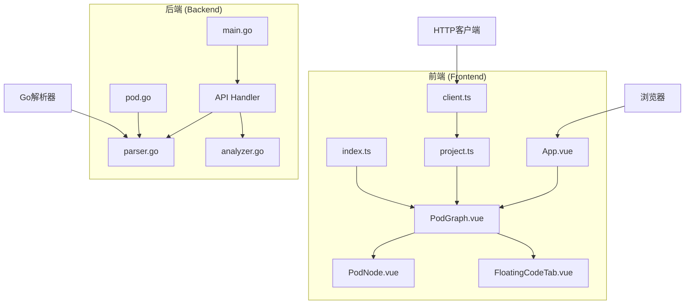

**图表来源**
- [App.vue:1-125](file://frontend/src/App.vue#L1-L125)
- [PodGraph.vue:1-581](file://frontend/src/components/PodGraph/PodGraph.vue#L1-L581)
- [main.go:1-31](file://backend/main.go#L1-L31)

**章节来源**
- [App.vue:1-125](file://frontend/src/App.vue#L1-L125)
- [package.json:1-33](file://frontend/package.json#L1-L33)

## 核心组件

### Vue Flow 集成

系统使用 Vue Flow 作为核心图形渲染引擎，提供了强大的节点和边渲染能力。

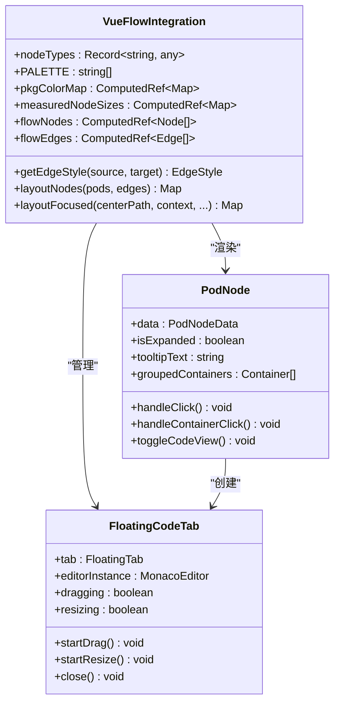

**图表来源**
- [PodGraph.vue:31-136](file://frontend/src/components/PodGraph/PodGraph.vue#L31-L136)
- [PodNode.vue:13-19](file://frontend/src/components/PodGraph/PodNode.vue#L13-L19)
- [FloatingCodeTab.vue:1-209](file://frontend/src/components/PodGraph/FloatingCodeTab.vue#L1-L209)

### 数据模型定义

系统使用 TypeScript 定义了完整的数据模型，确保类型安全和良好的开发体验。

**章节来源**
- [index.ts:1-74](file://frontend/src/types/index.ts#L1-L74)
- [pod.go:1-19](file://backend/internal/model/pod.go#L1-L19)

## 架构概览

系统采用分层架构设计，从前端用户界面到后端数据处理形成清晰的层次结构。

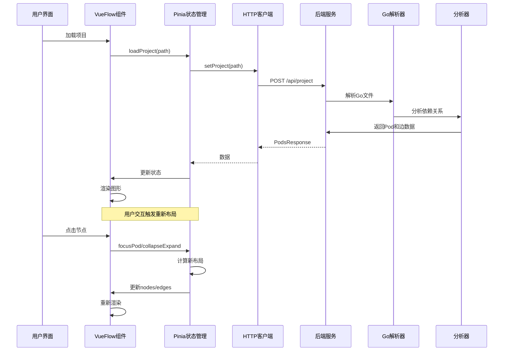

**图表来源**
- [App.vue:10-32](file://frontend/src/App.vue#L10-L32)
- [project.ts:57-92](file://frontend/src/stores/project.ts#L57-L92)
- [client.ts:15-28](file://frontend/src/api/client.ts#L15-L28)
- [parser.go:32-59](file://backend/internal/parser/parser.go#L32-L59)
- [analyzer.go:27-39](file://backend/internal/parser/analyzer.go#L27-L39)

## 详细组件分析

### Pod 图形渲染引擎

PodGraph.vue 是整个图形系统的核心组件，负责将 Pod 数据转换为可视化的图形。

#### 视图模式实现

系统实现了三种主要的视图模式：

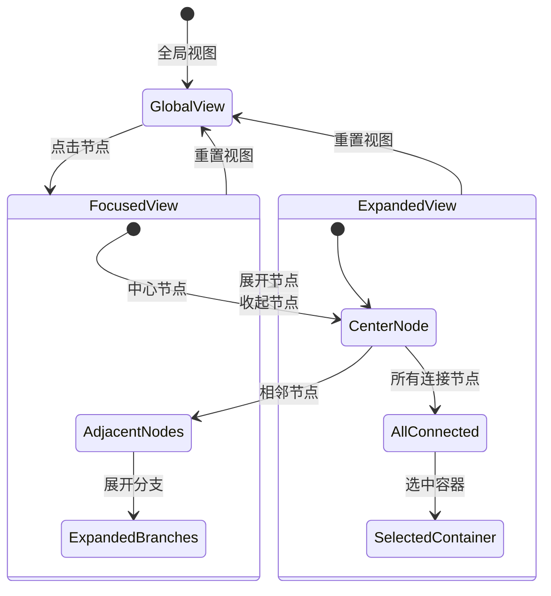

**图表来源**
- [project.ts:158-247](file://frontend/src/stores/project.ts#L158-L247)
- [PodGraph.vue:65-77](file://frontend/src/components/PodGraph/PodGraph.vue#L65-L77)

#### 布局算法设计

系统实现了多种布局算法来优化节点排列：

**层级布局算法 (Topological Layout)**

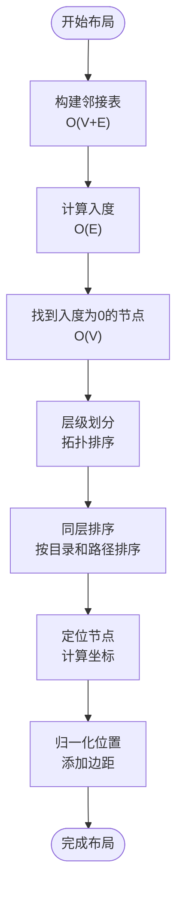

**图表来源**
- [PodGraph.vue:401-498](file://frontend/src/components/PodGraph/PodGraph.vue#L401-L498)

**分支树布局算法 (Branch Tree Layout)**

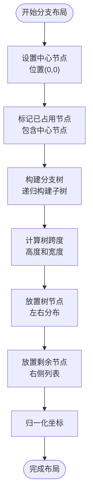

**图表来源**
- [PodGraph.vue:181-333](file://frontend/src/components/PodGraph/PodGraph.vue#L181-L333)

#### 边连接样式和动画效果

系统实现了智能的边样式选择和动画效果：

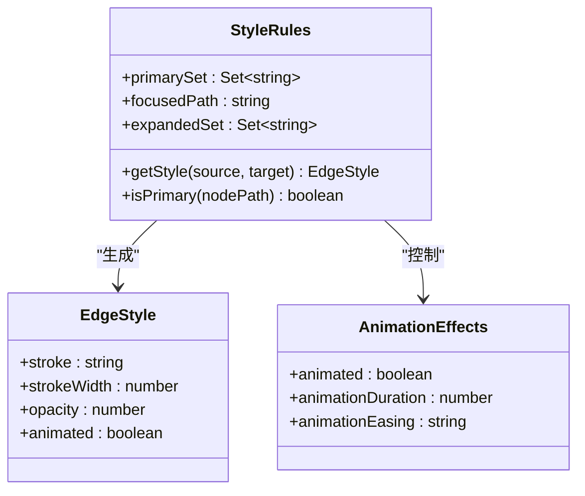

**图表来源**
- [PodGraph.vue:127-136](file://frontend/src/components/PodGraph/PodGraph.vue#L127-L136)

**章节来源**
- [PodGraph.vue:79-125](file://frontend/src/components/PodGraph/PodGraph.vue#L79-L125)

### Pod 节点渲染机制

PodNode.vue 实现了 Pod 节点的两种显示模式：点状模式和卡片模式。

#### 点状模式 (Dot Mode)

点状模式是最简洁的显示方式，适合全局视图：

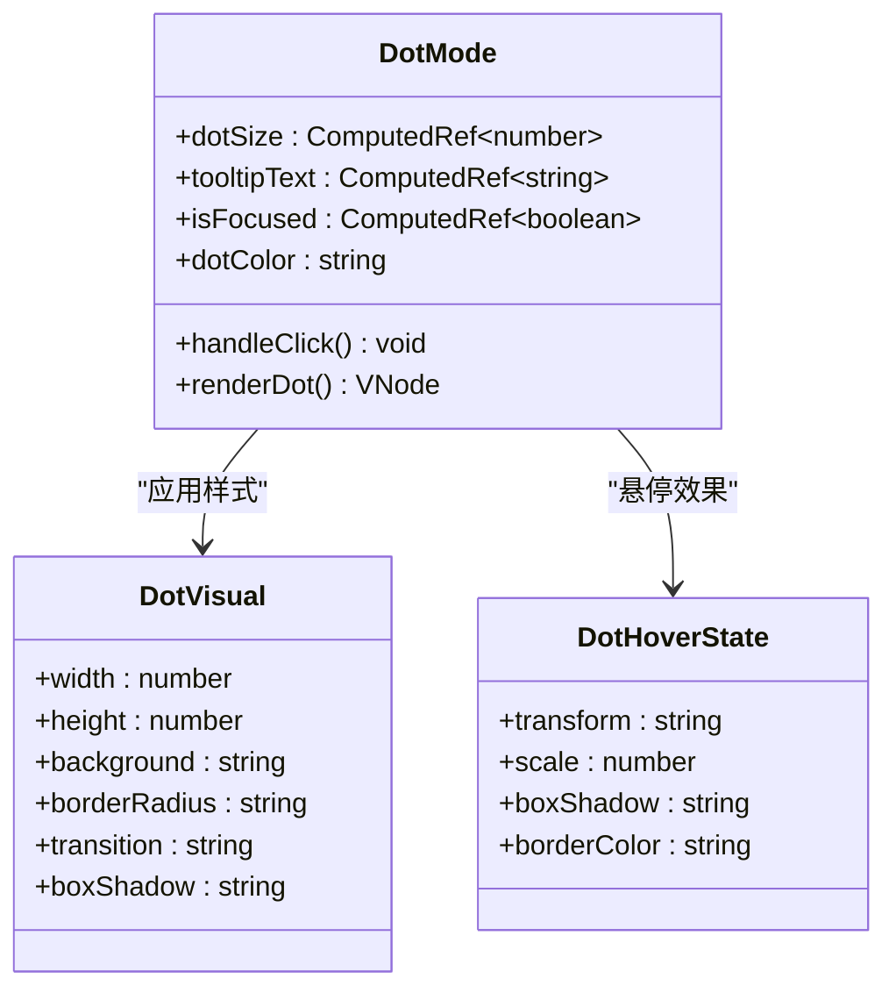

**图表来源**
- [PodNode.vue:27-35](file://frontend/src/components/PodGraph/PodNode.vue#L27-L35)
- [PodNode.vue:350-373](file://frontend/src/components/PodGraph/PodNode.vue#L350-L373)

#### 卡片模式 (Card Mode)

卡片模式提供了丰富的容器信息展示：

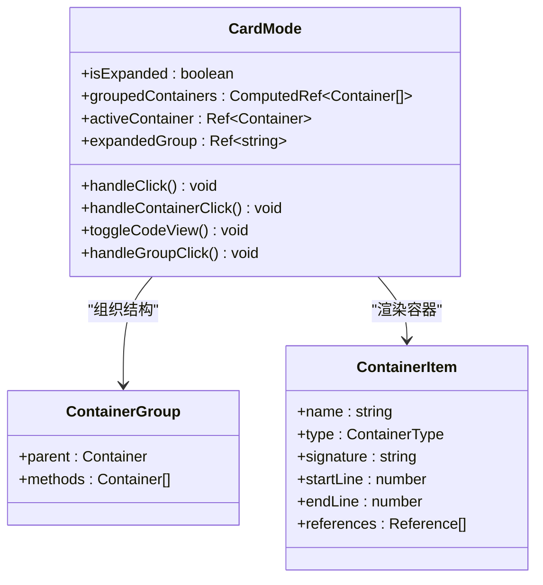

**图表来源**
- [PodNode.vue:8-87](file://frontend/src/components/PodGraph/PodNode.vue#L8-L87)
- [PodNode.vue:222-347](file://frontend/src/components/PodGraph/PodNode.vue#L222-L347)

**章节来源**
- [PodNode.vue:1-425](file://frontend/src/components/PodGraph/PodNode.vue#L1-L425)

### 交互式图形操作

系统提供了丰富的交互功能，包括拖拽、缩放、节点选择等。

#### 浮动代码标签页

FloatingCodeTab.vue 实现了可拖拽、可调整大小的浮动代码编辑器：

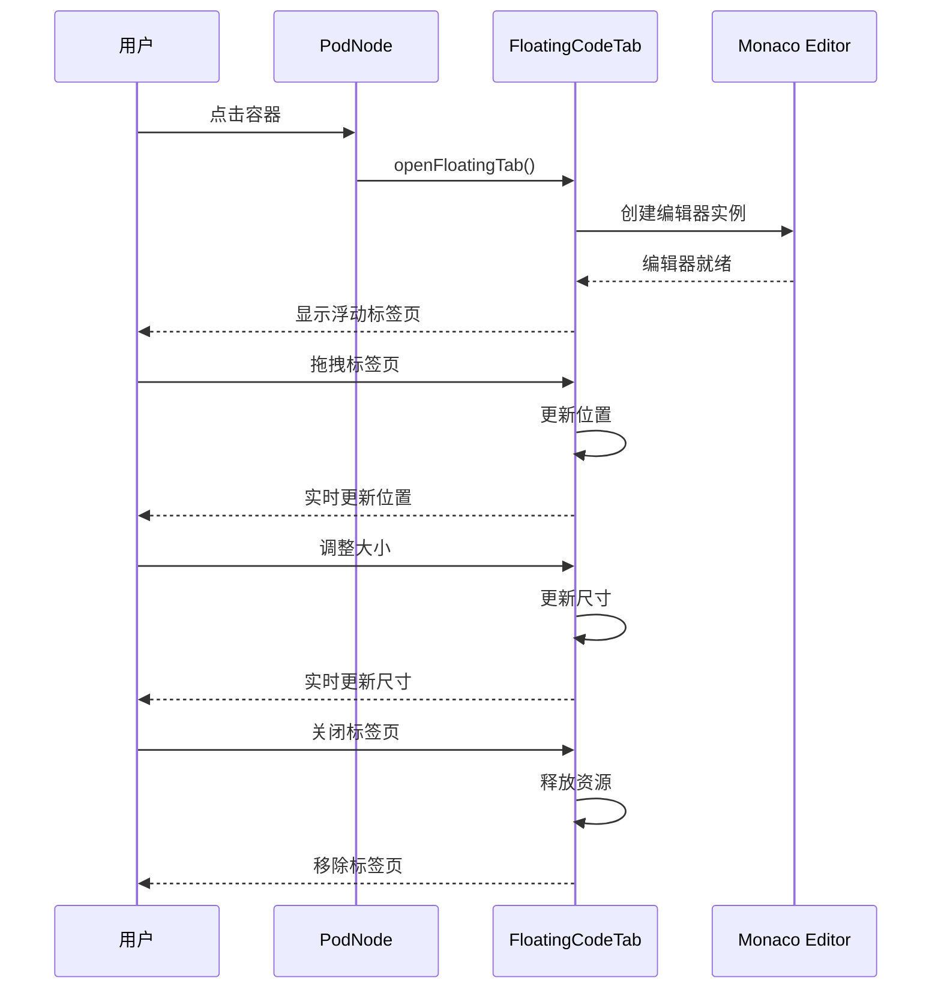

**图表来源**
- [FloatingCodeTab.vue:18-90](file://frontend/src/components/PodGraph/FloatingCodeTab.vue#L18-L90)
- [project.ts:316-334](file://frontend/src/stores/project.ts#L316-L334)

#### 键盘快捷键支持

系统支持键盘快捷键操作：

| 快捷键 | 功能 | 说明 |
|--------|------|------|
| Cmd/Ctrl + [ | 后退 | 导航历史后退 |
| Cmd/Ctrl + ] | 前进 | 导航历史前进 |
| 点击节点 | 聚焦 | 将节点设为中心节点 |
| Ctrl/Cmd + 点击 | 展开 | 在当前视图中展开节点 |

**章节来源**
- [App.vue:19-28](file://frontend/src/App.vue#L19-L28)
- [project.ts:286-296](file://frontend/src/stores/project.ts#L286-L296)

## 依赖关系分析

### 前端依赖关系

系统使用现代化的前端技术栈，各依赖项之间存在明确的职责分工。

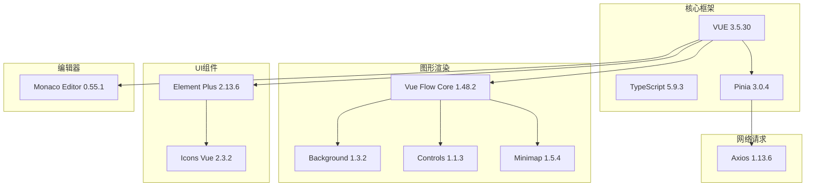

**图表来源**
- [package.json:11-22](file://frontend/package.json#L11-L22)

### 后端依赖关系

后端使用 Go 语言的标准库和第三方库进行项目分析。

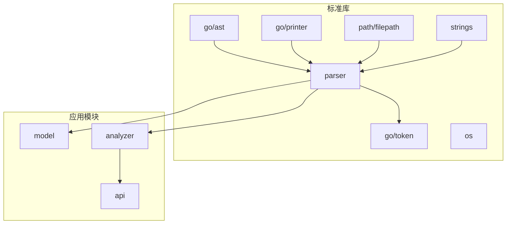

**图表来源**
- [parser.go:3-14](file://backend/internal/parser/parser.go#L3-L14)
- [analyzer.go:3-11](file://backend/internal/parser/analyzer.go#L3-L11)

**章节来源**
- [package.json:1-33](file://frontend/package.json#L1-L33)

## 性能考虑

### 布局算法优化

系统在布局算法中采用了多项优化策略：

1. **懒加载节点尺寸**：使用 `measuredNodeSizes` 计算器只在节点尺寸测量完成后才进行布局计算
2. **增量更新**：通过 `layoutVersion` 状态控制布局更新频率
3. **智能缓存**：使用 `computed` 计算器缓存中间结果
4. **批量操作**：使用 `nextTick` 确保 DOM 更新完成后再进行布局计算

### 内存管理

系统在内存管理方面采取了以下措施：

1. **编辑器实例管理**：及时释放 Monaco Editor 实例，避免内存泄漏
2. **事件监听器清理**：在组件卸载时移除所有事件监听器
3. **状态管理优化**：使用 `markRaw` 包装 Vue Flow 组件以避免不必要的响应式开销

### 渲染性能

为了提升渲染性能，系统实现了：

1. **虚拟滚动**：对于大量容器的 Pod 使用虚拟滚动技术
2. **条件渲染**：只渲染可见节点和边
3. **CSS 动画**：使用硬件加速的 CSS 过渡效果
4. **防抖处理**：对频繁触发的操作进行防抖处理

## 故障排除指南

### 常见问题及解决方案

**问题1：图形无法显示或显示为空白**

可能原因：
- 项目未正确加载
- API 请求失败
- 数据格式不正确

解决步骤：
1. 检查浏览器控制台是否有错误信息
2. 验证 API 服务是否正常运行
3. 确认项目路径是否正确
4. 检查网络连接状态

**问题2：节点布局异常**

可能原因：
- 布局算法计算错误
- 节点尺寸测量失败
- 数据不完整

解决步骤：
1. 刷新页面重新加载数据
2. 检查 Pod 数据的完整性
3. 确认依赖关系图的正确性
4. 调整视口参数

**问题3：代码编辑器无法打开**

可能原因：
- Monaco Editor 未正确初始化
- 源码数据缺失
- 浏览器兼容性问题

解决步骤：
1. 检查浏览器控制台是否有 JavaScript 错误
2. 确认容器源码数据是否可用
3. 尝试刷新页面
4. 检查浏览器插件是否阻止了脚本执行

**章节来源**
- [project.ts:57-92](file://frontend/src/stores/project.ts#L57-L92)
- [client.ts:15-52](file://frontend/src/api/client.ts#L15-L52)

### 调试工具

系统提供了多种调试工具：

1. **URL 状态同步**：通过 URL 参数记录当前视图状态
2. **导航历史**：支持前进后退功能
3. **实时日志**：在控制台输出关键操作信息
4. **性能监控**：监控布局计算时间和渲染性能

## 结论

GoPodView 可视化图形系统是一个功能完整、性能优秀的图形化代码分析工具。通过精心设计的架构和算法，系统成功地将复杂的 Go 项目依赖关系以直观的方式呈现给用户。

### 主要优势

1. **用户体验优秀**：直观的图形界面和流畅的交互体验
2. **功能丰富**：支持多种视图模式和交互操作
3. **性能优异**：优化的布局算法和渲染机制
4. **扩展性强**：模块化的架构设计便于功能扩展

### 技术亮点

1. **智能布局算法**：结合层级布局和分支树布局的优势
2. **响应式设计**：适配不同屏幕尺寸和设备
3. **类型安全**：完整的 TypeScript 类型定义
4. **状态管理**：基于 Pinia 的集中式状态管理

### 发展方向

未来可以考虑的功能增强：
1. 添加更多视图模式（如时间轴视图）
2. 实现更高级的搜索和过滤功能
3. 支持导出图形为图片或 PDF
4. 集成更多代码分析功能

该系统为 Go 项目的代码分析和可视化提供了强有力的技术支撑，是现代软件工程中不可或缺的开发工具。