# 布局算法实现

<cite>
**本文档引用的文件**
- [PodGraph.vue](file://frontend/src/components/PodGraph/PodGraph.vue)
- [PodNode.vue](file://frontend/src/components/PodGraph/PodNode.vue)
- [project.ts](file://frontend/src/stores/project.ts)
- [index.ts](file://frontend/src/types/index.ts)
- [parser.go](file://backend/internal/parser/parser.go)
- [analyzer.go](file://backend/internal/parser/analyzer.go)
- [pod.go](file://backend/internal/model/pod.go)
- [container.go](file://backend/internal/model/container.go)
- [client.ts](file://frontend/src/api/client.ts)
- [README.md](file://README.md)
</cite>

## 目录
1. [简介](#简介)
2. [项目结构](#项目结构)
3. [核心组件](#核心组件)
4. [架构概览](#架构概览)
5. [详细组件分析](#详细组件分析)
6. [依赖分析](#依赖分析)
7. [性能考虑](#性能考虑)
8. [故障排除指南](#故障排除指南)
9. [结论](#结论)

## 简介

GoPodView 是一个基于 Vue 3 和 TypeScript 的 Go 项目代码结构可视化工具。该项目实现了两种主要的布局算法：全局布局算法和聚焦视图布局算法。这些算法负责将 Go 项目的 Pod（文件）和 Container（函数、结构体、接口等）以图形化的方式进行排列和展示。

全局布局算法采用层级布局和拓扑排序相结合的方式，将项目中的 Pod 按照依赖关系组织成多层结构。聚焦视图布局算法则实现了复杂的分支树构建和空间分配机制，为用户提供清晰的思维导图式视图。

## 项目结构

GoPodView 采用前后端分离的架构设计，前端使用 Vue 3 + TypeScript 构建，后端使用 Go 实现。项目的核心布局算法主要集中在前端的 PodGraph 组件中。

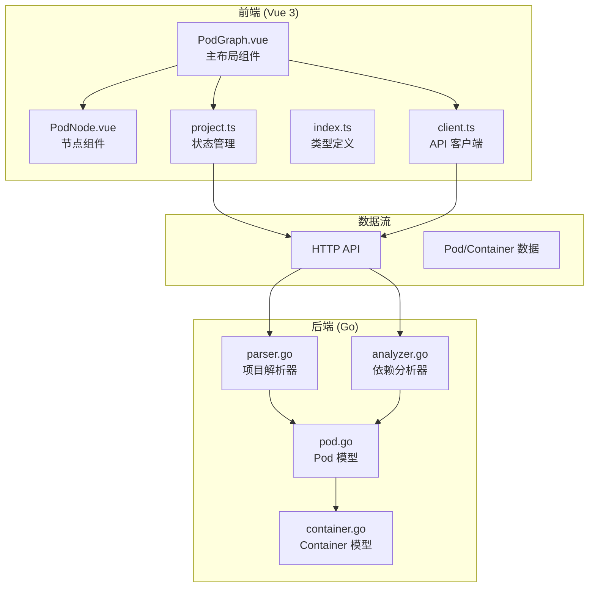

**图表来源**
- [PodGraph.vue:1-581](file://frontend/src/components/PodGraph/PodGraph.vue#L1-L581)
- [project.ts:1-476](file://frontend/src/stores/project.ts#L1-L476)
- [parser.go:1-253](file://backend/internal/parser/parser.go#L1-L253)
- [analyzer.go:1-236](file://backend/internal/parser/analyzer.go#L1-L236)

**章节来源**
- [README.md:79-104](file://README.md#L79-L104)

## 核心组件

### 布局算法数据结构

项目布局算法使用了多种关键数据结构来表示和处理图数据：

#### Adjacency 邻接表
邻接表用于表示 Pod 之间的依赖关系，是所有布局算法的基础数据结构。

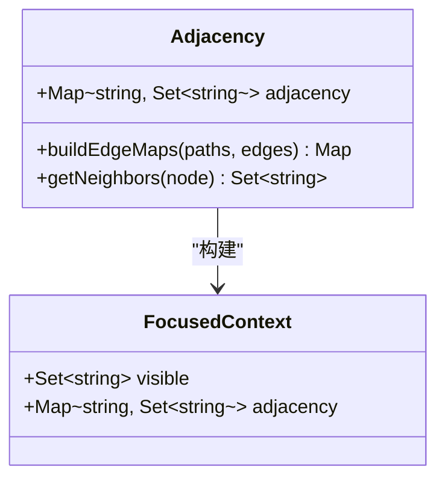

**图表来源**
- [PodGraph.vue:369-384](file://frontend/src/components/PodGraph/PodGraph.vue#L369-L384)
- [PodGraph.vue:20-23](file://frontend/src/components/PodGraph/PodGraph.vue#L20-L23)

#### BranchTree 树形结构
BranchTree 是聚焦视图布局的核心数据结构，用于构建分支树并计算树的跨度。

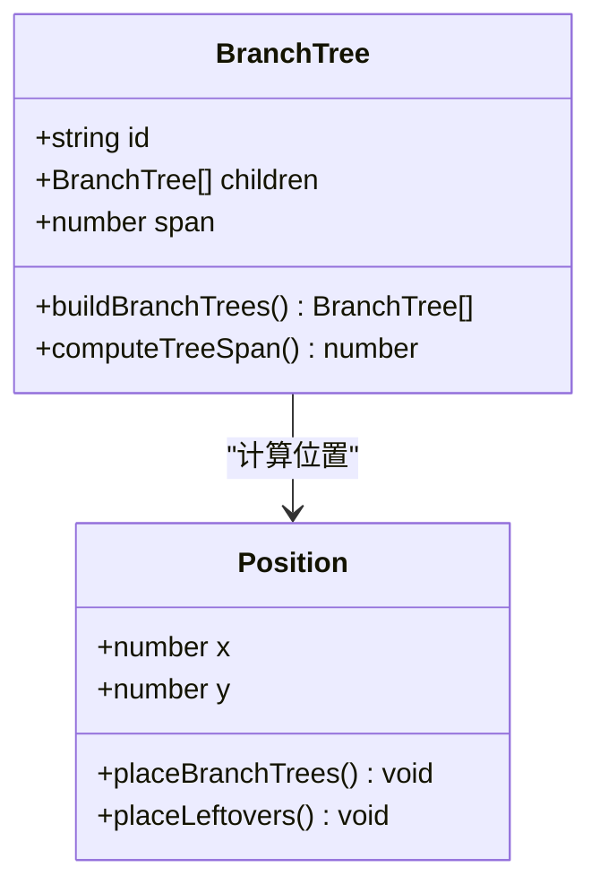

**图表来源**
- [PodGraph.vue:25-29](file://frontend/src/components/PodGraph/PodGraph.vue#L25-L29)
- [PodGraph.vue:201-231](file://frontend/src/components/PodGraph/PodGraph.vue#L201-L231)

#### Position 映射
Position 映射用于存储每个 Pod 的最终位置坐标，支持全局和聚焦两种视图模式。

**章节来源**
- [PodGraph.vue:17-18](file://frontend/src/components/PodGraph/PodGraph.vue#L17-L18)
- [PodGraph.vue:181-199](file://frontend/src/components/PodGraph/PodGraph.vue#L181-L199)

## 架构概览

布局算法的整体架构分为三个层次：数据准备层、算法执行层和结果应用层。

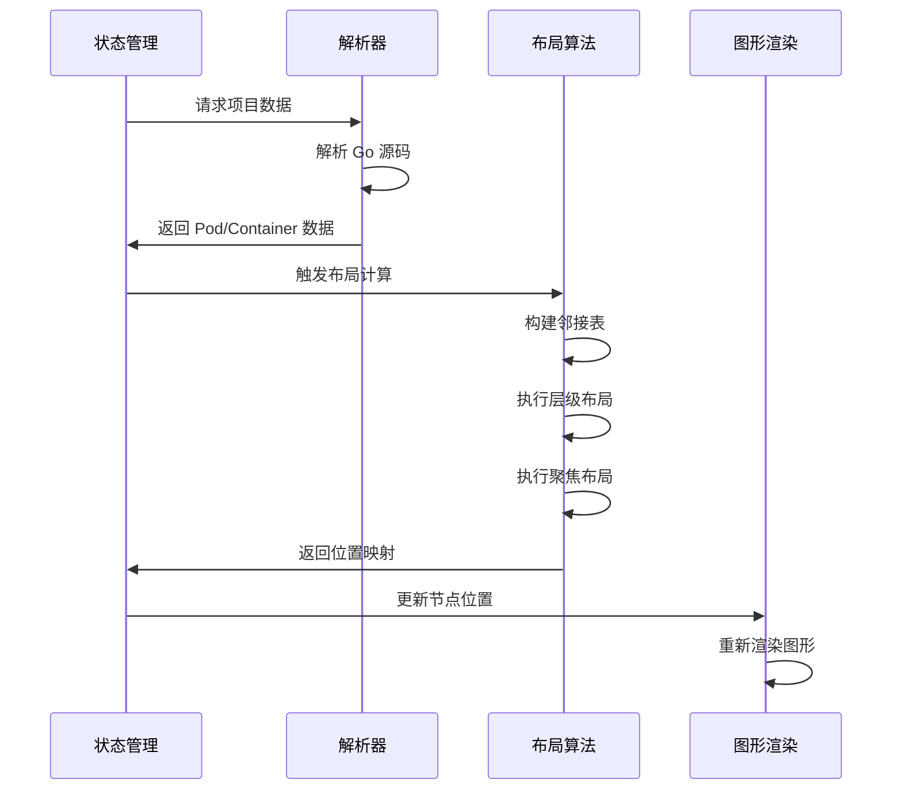

**图表来源**
- [project.ts:57-92](file://frontend/src/stores/project.ts#L57-L92)
- [client.ts:25-28](file://frontend/src/api/client.ts#L25-L28)
- [PodGraph.vue:79-110](file://frontend/src/components/PodGraph/PodGraph.vue#L79-L110)

## 详细组件分析

### 全局布局算法

全局布局算法采用层级布局和拓扑排序相结合的方式，将项目中的 Pod 按照依赖关系组织成多层结构。

#### 拓扑排序实现

全局布局算法使用经典的 Kahn 算法进行拓扑排序：

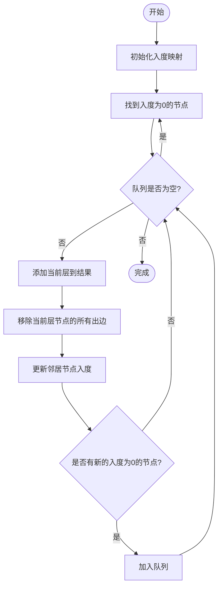

**图表来源**
- [PodGraph.vue:420-442](file://frontend/src/components/PodGraph/PodGraph.vue#L420-L442)

#### 层级布局算法

全局布局算法将计算出的层级转换为二维坐标：

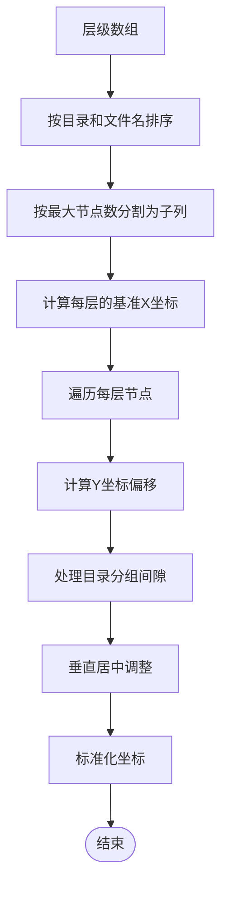

**图表来源**
- [PodGraph.vue:460-498](file://frontend/src/components/PodGraph/PodGraph.vue#L460-L498)

**章节来源**
- [PodGraph.vue:401-498](file://frontend/src/components/PodGraph/PodGraph.vue#L401-L498)

### 聚焦视图布局算法

聚焦视图布局算法是最复杂的部分，实现了分支树构建、位置计算和空间分配的完整流程。

#### 分支树构建过程

聚焦视图布局算法首先构建分支树结构：

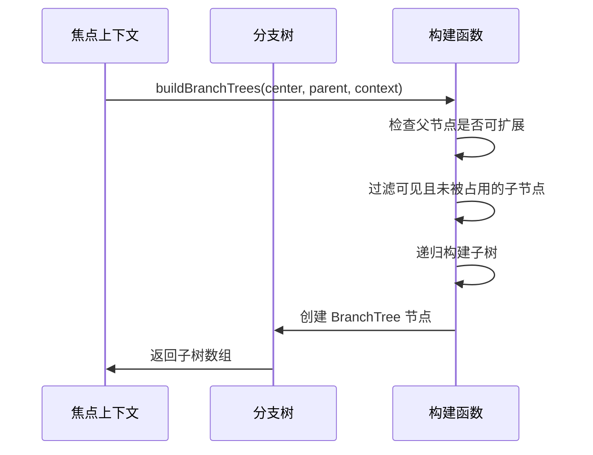

**图表来源**
- [PodGraph.vue:201-231](file://frontend/src/components/PodGraph/PodGraph.vue#L201-L231)

#### 树跨度计算

树跨度计算是布局算法的核心，用于确定每个分支树的高度：

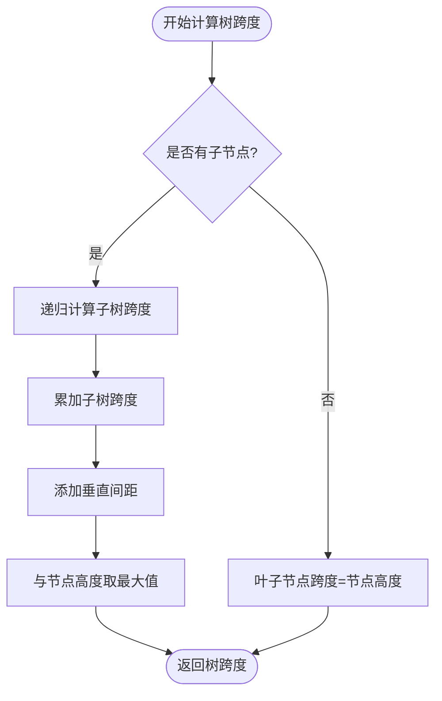

**图表来源**
- [PodGraph.vue:233-254](file://frontend/src/components/PodGraph/PodGraph.vue#L233-L254)

#### 位置分配算法

位置分配算法负责将分支树放置到最终的坐标位置：

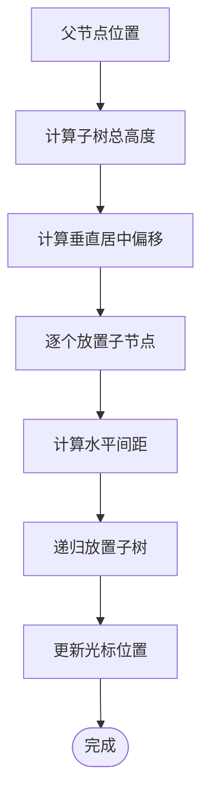

**图表来源**
- [PodGraph.vue:256-303](file://frontend/src/components/PodGraph/PodGraph.vue#L256-L303)

**章节来源**
- [PodGraph.vue:181-333](file://frontend/src/components/PodGraph/PodGraph.vue#L181-L333)

### 节点尺寸测量

节点尺寸测量是布局算法的重要组成部分，支持动态尺寸计算和缓存机制：

#### 动态尺寸计算

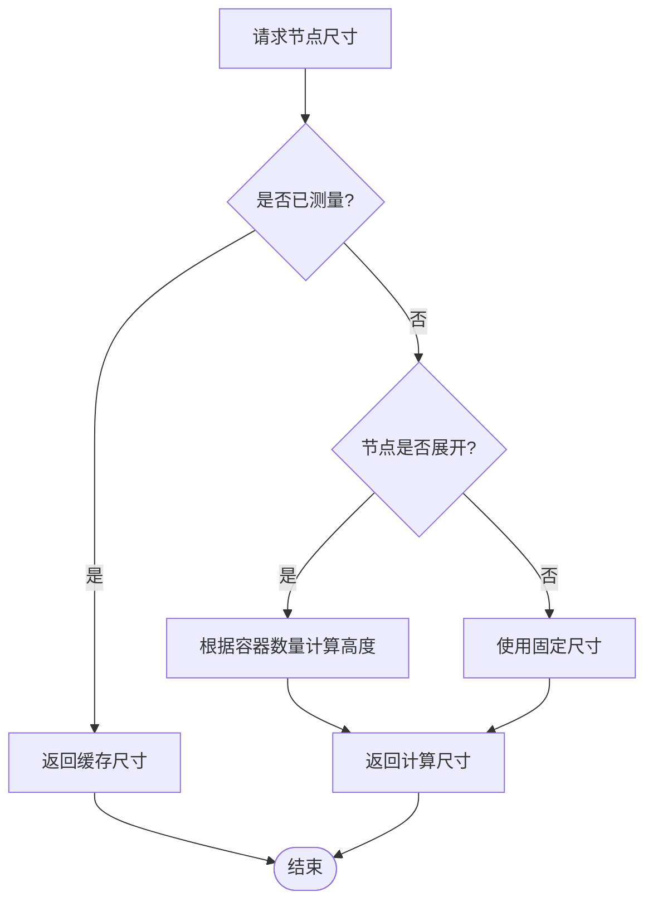

**图表来源**
- [PodGraph.vue:344-367](file://frontend/src/components/PodGraph/PodGraph.vue#L344-L367)

**章节来源**
- [PodGraph.vue:53-63](file://frontend/src/components/PodGraph/PodGraph.vue#L53-L63)
- [PodGraph.vue:344-367](file://frontend/src/components/PodGraph/PodGraph.vue#L344-L367)

## 依赖分析

### 数据模型关系

项目的数据模型之间存在清晰的依赖关系：

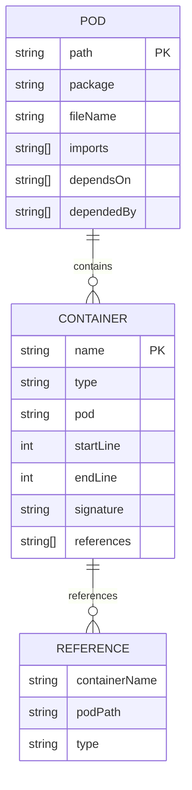

**图表来源**
- [pod.go:3-11](file://backend/internal/model/pod.go#L3-L11)
- [container.go:13-22](file://backend/internal/model/container.go#L13-L22)
- [index.ts:4-29](file://frontend/src/types/index.ts#L4-L29)

### 前端布局组件依赖

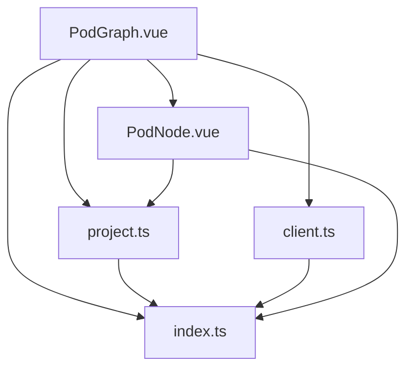

**图表来源**
- [PodGraph.vue:1-15](file://frontend/src/components/PodGraph/PodGraph.vue#L1-L15)
- [project.ts:1-14](file://frontend/src/stores/project.ts#L1-L14)
- [client.ts:1-13](file://frontend/src/api/client.ts#L1-L13)

**章节来源**
- [index.ts:1-74](file://frontend/src/types/index.ts#L1-L74)

## 性能考虑

### 时间复杂度分析

#### 全局布局算法
- **拓扑排序**: O(V + E)，其中 V 是 Pod 数量，E 是依赖边数量
- **层级分配**: O(V log V)，主要是排序操作
- **整体复杂度**: O(V + E + V log V)

#### 聚焦视图算法
- **分支树构建**: O(V + E)，每个节点最多访问一次
- **树跨度计算**: O(V)，深度优先遍历
- **位置分配**: O(V)，线性遍历
- **整体复杂度**: O(V + E)

### 空间复杂度分析
- **邻接表**: O(V + E)
- **层级数组**: O(V)
- **位置映射**: O(V)
- **分支树**: O(V)
- **整体复杂度**: O(V + E)

### 优化策略

#### 缓存机制
- **节点尺寸缓存**: 避免重复的 DOM 查询
- **布局版本控制**: 通过 `layoutVersion` 触发布局更新
- **状态同步**: 使用 Pinia 状态管理减少不必要的重新计算

#### 实时更新优化
- **增量更新**: 仅更新受影响的节点
- **虚拟滚动**: 对大量节点使用虚拟化技术
- **防抖处理**: 对频繁的用户交互进行防抖

#### 内存使用优化
- **对象池**: 复用临时对象减少垃圾回收
- **弱引用**: 对大型数据结构使用弱引用
- **懒加载**: 按需加载节点内容

**章节来源**
- [project.ts:35-38](file://frontend/src/stores/project.ts#L35-L38)
- [PodGraph.vue:82-89](file://frontend/src/components/PodGraph/PodGraph.vue#L82-L89)

## 故障排除指南

### 常见问题及解决方案

#### 布局异常问题
1. **节点重叠**: 检查 `VERTICAL_GAP` 和 `COL_GAP` 参数设置
2. **布局不完整**: 验证 `inDegree` 映射的正确性
3. **焦点节点偏移**: 检查 `normalizePositions` 函数的偏移计算

#### 性能问题
1. **布局卡顿**: 检查是否有过多的 DOM 查询
2. **内存泄漏**: 确认事件监听器的正确清理
3. **渲染延迟**: 优化 `computed` 属性的依赖关系

#### 数据一致性问题
1. **节点尺寸错误**: 验证 `measuredNodeSizes` 的缓存机制
2. **依赖关系异常**: 检查 `buildEdgeMaps` 的邻接表构建
3. **焦点视图错乱**: 验证 `buildFocusedContext` 的可达性计算

**章节来源**
- [PodGraph.vue:500-532](file://frontend/src/components/PodGraph/PodGraph.vue#L500-L532)
- [project.ts:35-38](file://frontend/src/stores/project.ts#L35-L38)

## 结论

GoPodView 的布局算法实现展现了现代前端应用中复杂图形布局的最佳实践。通过精心设计的数据结构和算法，项目成功实现了从简单的全局视图到复杂的聚焦视图的完整布局解决方案。

### 主要成就

1. **算法完整性**: 实现了完整的层级布局和分支树布局算法
2. **性能优化**: 通过缓存和增量更新确保了良好的用户体验
3. **可扩展性**: 清晰的架构设计支持未来功能的扩展
4. **用户体验**: 提供了直观的交互式图形界面

### 技术亮点

- **混合布局策略**: 结合了层级布局和树形布局的优势
- **智能缓存机制**: 有效减少了重复计算
- **响应式设计**: 支持不同屏幕尺寸和设备
- **实时更新**: 提供流畅的用户交互体验

### 未来改进方向

1. **算法优化**: 可以考虑更高级的力导向布局算法
2. **性能提升**: 实现 Web Workers 进行后台计算
3. **功能扩展**: 添加更多的视图模式和交互方式
4. **移动端适配**: 优化移动端的布局和交互体验

通过这些精心设计的布局算法，GoPodView 为开发者提供了一个强大而直观的 Go 项目代码结构可视化工具，大大提升了代码理解和导航的效率。