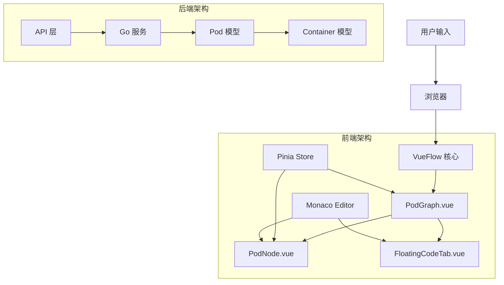
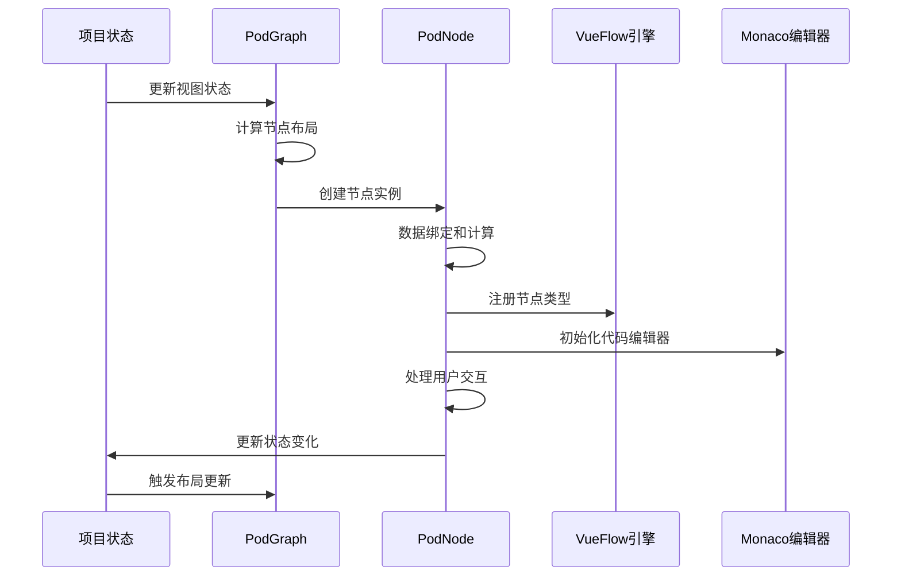
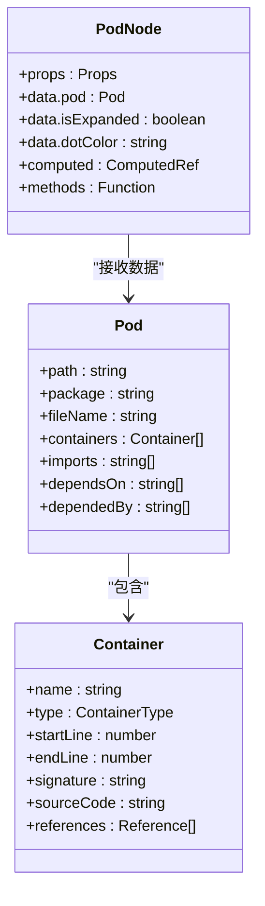
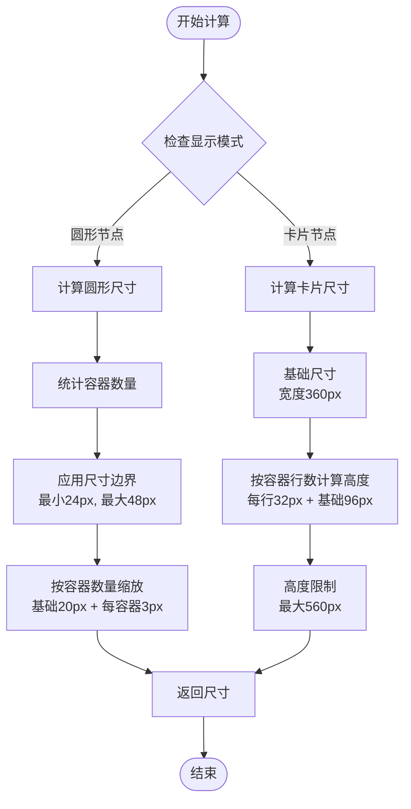
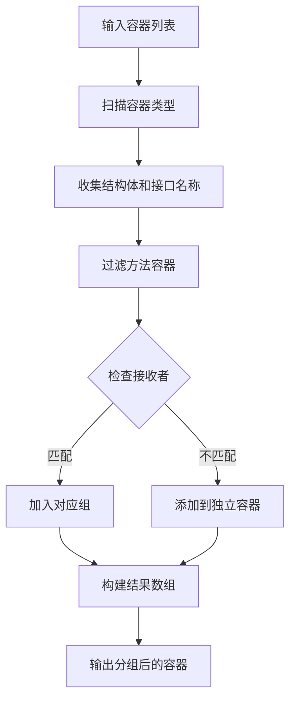
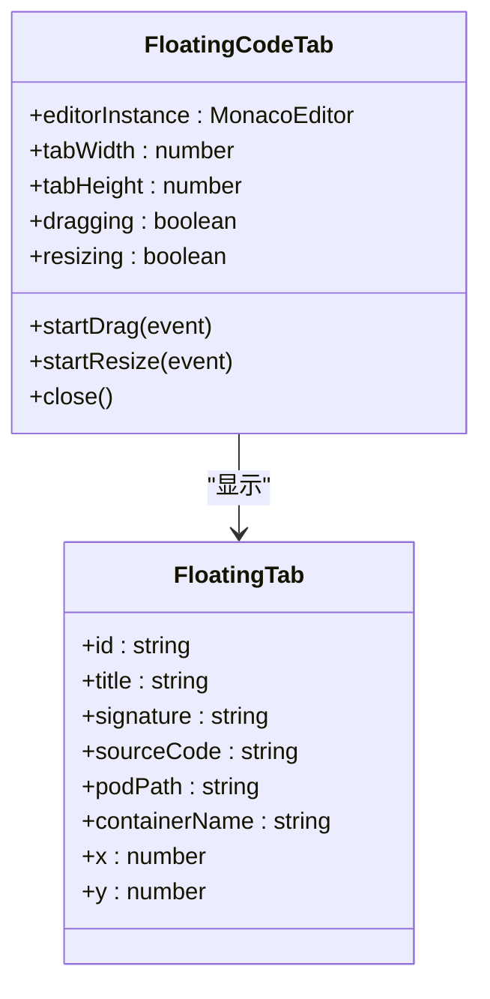
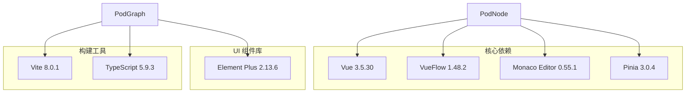

# 节点渲染系统

<cite>
**本文档引用的文件**
- [PodNode.vue](file://frontend/src/components/PodGraph/PodNode.vue)
- [PodGraph.vue](file://frontend/src/components/PodGraph/PodGraph.vue)
- [project.ts](file://frontend/src/stores/project.ts)
- [FloatingCodeTab.vue](file://frontend/src/components/PodGraph/FloatingCodeTab.vue)
- [pod.go](file://backend/internal/model/pod.go)
- [container.go](file://backend/internal/model/container.go)
- [index.ts](file://frontend/src/types/index.ts)
- [global.css](file://frontend/src/styles/global.css)
- [package.json](file://frontend/package.json)
</cite>

## 目录
1. [简介](#简介)
2. [项目结构](#项目结构)
3. [核心组件](#核心组件)
4. [架构概览](#架构概览)
5. [详细组件分析](#详细组件分析)
6. [依赖关系分析](#依赖关系分析)
7. [性能考量](#性能考量)
8. [故障排除指南](#故障排除指南)
9. [结论](#结论)

## 简介

GoPodView 是一个基于 Vue 3 和 VueFlow 的 Go 语言包依赖图可视化工具。本文档专注于节点渲染系统，特别是 PodNode 组件的实现原理。该系统提供了两种节点显示模式：精简的圆形节点（dot mode）和详细的卡片节点（card mode），支持容器分组、代码内联显示、浮动标签页等多种交互功能。

## 项目结构

项目采用前后端分离架构，前端使用 Vue 3 + TypeScript + Vite 构建，后端使用 Go 语言开发。

**图表来源**
- [PodGraph.vue:1-581](file://frontend/src/components/PodGraph/PodGraph.vue#L1-L581)
- [PodNode.vue:1-425](file://frontend/src/components/PodGraph/PodNode.vue#L1-L425)

**章节来源**
- [package.json:1-33](file://frontend/package.json#L1-L33)
- [global.css:1-38](file://frontend/src/styles/global.css#L1-L38)

## 核心组件

### PodNode 组件

PodNode 是节点渲染系统的核心组件，负责将 Pod 数据模型转换为可视化的节点元素。该组件支持两种显示模式：

1. **圆形节点模式（默认）**：显示为圆形徽章，包含容器数量信息
2. **卡片节点模式（展开）**：显示完整的容器详情和代码片段

### PodGraph 组件

PodGraph 作为节点容器，负责：
- 节点类型注册和管理
- 颜色主题分配
- 节点布局计算
- 可见性控制
- 边线样式管理

### 项目状态管理

项目状态通过 Pinia Store 管理，包括：
- 视图级别控制（全局、聚焦、展开、代码）
- 聚焦的 Pod 路径
- 展开的 Pod 集合
- 选中的容器
- 布局版本控制

**章节来源**
- [PodNode.vue:13-19](file://frontend/src/components/PodGraph/PodNode.vue#L13-L19)
- [PodGraph.vue:31-33](file://frontend/src/components/PodGraph/PodGraph.vue#L31-L33)
- [project.ts:14-476](file://frontend/src/stores/project.ts#L14-L476)

## 架构概览

节点渲染系统采用分层架构设计，确保了良好的可维护性和扩展性。

**图表来源**
- [PodGraph.vue:78-110](file://frontend/src/components/PodGraph/PodGraph.vue#L78-L110)
- [PodNode.vue:161-178](file://frontend/src/components/PodGraph/PodNode.vue#L161-L178)
- [project.ts:35-38](file://frontend/src/stores/project.ts#L35-L38)

## 详细组件分析

### PodNode 组件实现

#### 数据绑定机制

PodNode 通过 props 接收数据，实现了从 Pod 数据模型到节点属性的完整映射：

**图表来源**
- [PodNode.vue:13-19](file://frontend/src/components/PodGraph/PodNode.vue#L13-L19)
- [index.ts:21-29](file://frontend/src/types/index.ts#L21-L29)
- [index.ts:10-19](file://frontend/src/types/index.ts#L10-L19)

#### 视觉外观系统

节点外观由多种视觉元素组成：

**圆形节点外观**
- 圆形徽章：半径根据容器数量动态调整
- 颜色主题：基于包名的颜色映射
- 数量指示器：显示容器数量
- 焦点状态：边框高亮和阴影效果

**卡片节点外观**
- 边框样式：蓝色边框和圆角设计
- 阴影效果：多层阴影增强立体感
- 容器分组：结构体/接口与其方法的逻辑分组
- 代码区域：Monaco 编辑器集成

#### 尺寸计算机制

节点尺寸计算采用动态算法：

**图表来源**
- [PodNode.vue:27-30](file://frontend/src/components/PodGraph/PodNode.vue#L27-L30)
- [PodGraph.vue:344-367](file://frontend/src/components/PodGraph/PodGraph.vue#L344-L367)

#### 颜色分配机制

颜色系统采用两级映射策略：

**包级颜色映射**
- 基于包名的固定颜色表
- 使用预定义调色板确保一致性
- 颜色循环使用避免重复

**容器类型颜色**
- 函数：蓝色 (#409eff)
- 结构体：绿色 (#67c23a)
- 接口：橙色 (#e6a23c)
- 常量：紫色 (#9b59b6)
- 变量：黄褐色 (#8b6914)

#### 状态管理系统

节点状态包括多个维度：

**展开状态**
- `isExpanded`: 控制节点显示模式
- 支持点击切换展开/折叠
- 与布局系统协同工作

**选中状态**
- `activeContainer`: 当前激活的容器
- `expandedGroup`: 当前展开的容器组
- 用于代码片段的高亮显示

**可见性控制**
- 基于视图级别的可见性过滤
- 聚焦视图下的邻域可见性
- 动态显示/隐藏逻辑

**章节来源**
- [PodNode.vue:23-35](file://frontend/src/components/PodGraph/PodNode.vue#L23-L35)
- [PodNode.vue:89-91](file://frontend/src/components/PodGraph/PodNode.vue#L89-L91)
- [PodGraph.vue:41-51](file://frontend/src/components/PodGraph/PodGraph.vue#L41-L51)

### 容器分组算法

PodNode 实现了智能的容器分组逻辑，将相关的容器组织成有意义的结构：

**图表来源**
- [PodNode.vue:45-87](file://frontend/src/components/PodGraph/PodNode.vue#L45-L87)

#### 分组规则

1. **方法识别**：函数类型且名称包含点号（如 `Struct.Method`）
2. **接收者匹配**：提取接收者名称（去除指针符号）
3. **结构体关联**：将方法与对应的结构体/接口关联
4. **独立处理**：无法匹配的方法或非方法容器独立显示

**章节来源**
- [PodNode.vue:56-87](file://frontend/src/components/PodGraph/PodNode.vue#L56-L87)

### 交互处理机制

#### 用户交互事件

PodNode 支持多种用户交互：

**节点点击**
- 已聚焦节点：切换展开状态
- 其他节点：仅展开不改变聚焦

**容器点击**
- Ctrl/Cmd+点击：跳转到引用位置
- 普通点击：切换代码视图

**分组点击**
- 切换方法组的展开/折叠状态

**代码操作**
- 弹出浮动标签页
- 内联代码编辑器

#### 代码编辑器集成

使用 Monaco Editor 提供代码高亮和编辑功能：

**初始化流程**
1. 监听 `activeContainer` 变化
2. 创建编辑器实例
3. 设置 Go 语言语法高亮
4. 配置只读模式和布局

**内存管理**
- 组件卸载时自动释放资源
- 空容器时销毁编辑器实例

**章节来源**
- [PodNode.vue:97-159](file://frontend/src/components/PodGraph/PodNode.vue#L97-L159)
- [PodNode.vue:161-185](file://frontend/src/components/PodGraph/PodNode.vue#L161-L185)

### 浮动代码标签页

浮动标签页提供独立的代码查看环境：

**图表来源**
- [FloatingCodeTab.vue:1-209](file://frontend/src/components/PodGraph/FloatingCodeTab.vue#L1-L209)
- [index.ts:64-73](file://frontend/src/types/index.ts#L64-L73)

**章节来源**
- [FloatingCodeTab.vue:18-34](file://frontend/src/components/PodGraph/FloatingCodeTab.vue#L18-L34)
- [project.ts:315-334](file://frontend/src/stores/project.ts#L315-L334)

## 依赖关系分析

### 前端依赖架构

**图表来源**
- [package.json:11-22](file://frontend/package.json#L11-L22)

### 后端数据模型

后端提供标准化的数据模型支持：

**Pod 模型**
- 路径标识符
- 包名信息
- 文件名和导入信息
- 容器依赖关系

**Container 模型**
- 类型枚举（函数、结构体、接口、常量、变量）
- 行号范围和签名
- 源代码内容
- 引用关系

**章节来源**
- [pod.go:3-11](file://backend/internal/model/pod.go#L3-L11)
- [container.go:13-22](file://backend/internal/model/container.go#L13-L22)

## 性能考量

### 渲染优化策略

**虚拟滚动**
- 卡片节点中的容器列表使用虚拟滚动
- 限制最大显示高度（600px）
- 滚动条优化用户体验

**懒加载机制**
- 仅在需要时加载源代码
- 展开节点时才请求容器详情
- 避免一次性加载所有数据

**布局缓存**
- 使用 `measuredNodeSizes` 缓存测量结果
- 基于 `layoutVersion` 触发布局更新
- 减少重复计算开销

**内存管理**
- 编辑器实例的生命周期管理
- 组件卸载时的资源清理
- 避免内存泄漏

### 性能监控指标

**渲染时间**
- 节点创建：毫秒级响应
- 展开/折叠：动画过渡
- 代码切换：即时反馈

**内存使用**
- 编辑器实例：按需创建销毁
- 字符串缓存：有限大小
- DOM 元素：虚拟滚动减少

**章节来源**
- [PodGraph.vue:53-63](file://frontend/src/components/PodGraph/PodGraph.vue#L53-L63)
- [project.ts:35-38](file://frontend/src/stores/project.ts#L35-L38)

## 故障排除指南

### 常见问题诊断

**节点不显示**
1. 检查 `visiblePodPaths` 计算结果
2. 验证 `hidden` 属性设置
3. 确认 `layoutVersion` 是否更新

**颜色显示异常**
1. 检查 `pkgColorMap` 映射是否正确
2. 验证包名格式
3. 确认颜色表索引范围

**代码编辑器问题**
1. 检查 Monaco Editor 初始化
2. 验证容器源代码存在性
3. 确认编辑器实例状态

**布局计算错误**
1. 检查节点尺寸缓存
2. 验证展开状态一致性
3. 确认布局算法参数

### 调试技巧

**状态追踪**
- 使用 Vue DevTools 观察响应式数据
- 监控 `layoutVersion` 变化
- 检查 `selectedContainer` 更新

**性能分析**
- 使用浏览器性能面板
- 监控渲染帧率
- 分析内存使用情况

**网络请求**
- 检查 API 请求状态
- 验证数据格式
- 监控请求超时

**章节来源**
- [PodGraph.vue:65-77](file://frontend/src/components/PodGraph/PodGraph.vue#L65-L77)
- [project.ts:375-378](file://frontend/src/stores/project.ts#L375-L378)

## 结论

GoPodView 的节点渲染系统展现了现代前端架构的最佳实践。通过合理的组件分离、响应式数据绑定和高效的渲染策略，系统实现了复杂数据的直观可视化。

**主要优势**
- **模块化设计**：清晰的组件职责分离
- **响应式架构**：基于 Vue 3 的响应式系统
- **性能优化**：多层缓存和懒加载机制
- **用户体验**：流畅的交互和视觉反馈

**扩展建议**
- 支持自定义节点样式
- 添加节点动画效果
- 实现节点选择和多选功能
- 增强键盘导航支持

该系统为 Go 语言项目的依赖关系可视化提供了坚实的技术基础，为后续的功能扩展和性能优化奠定了良好基础。