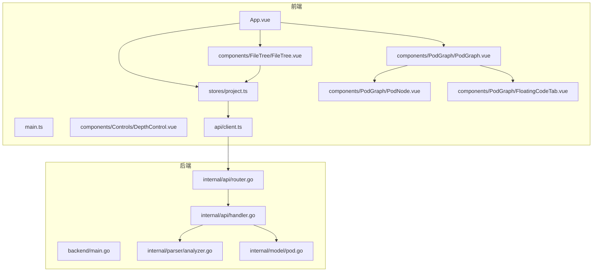
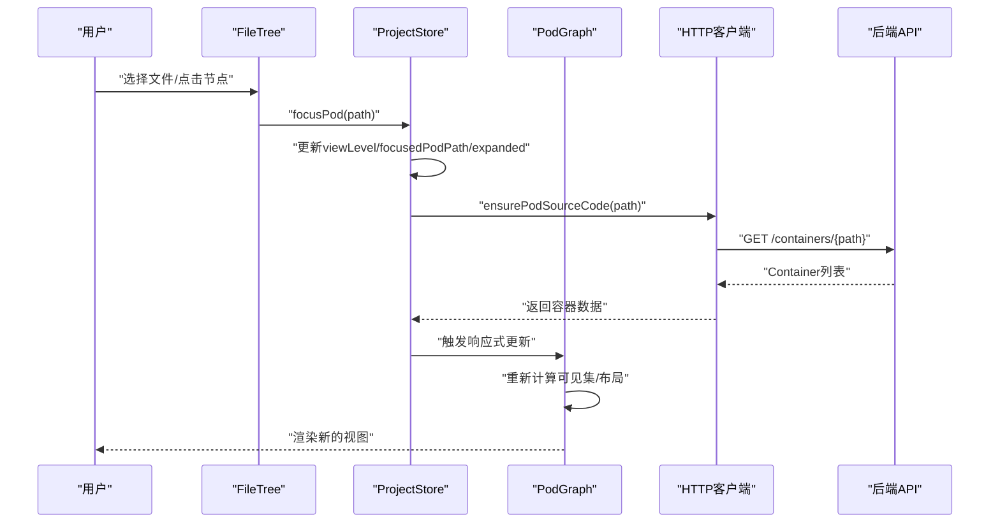
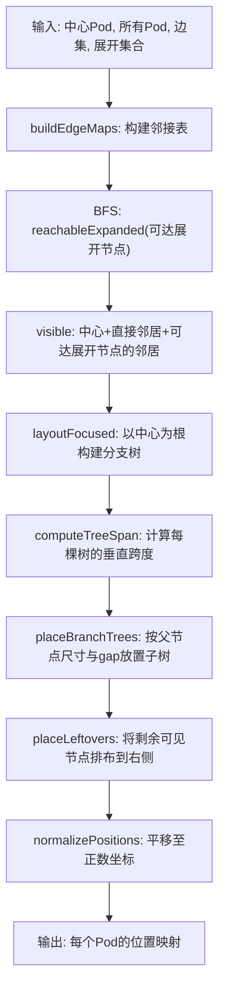
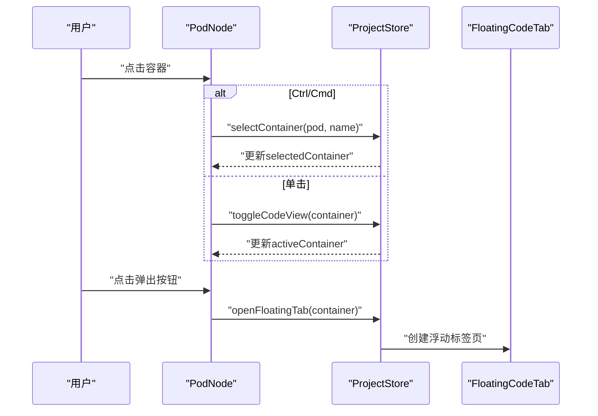
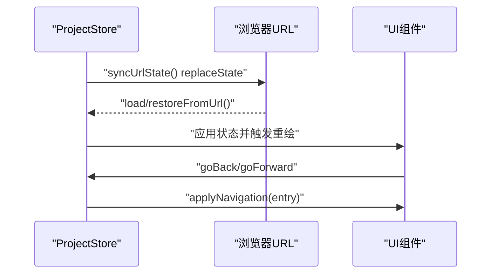
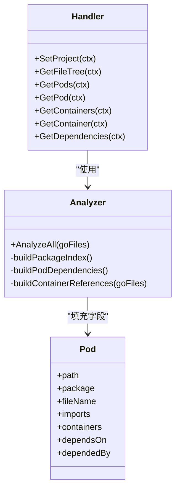
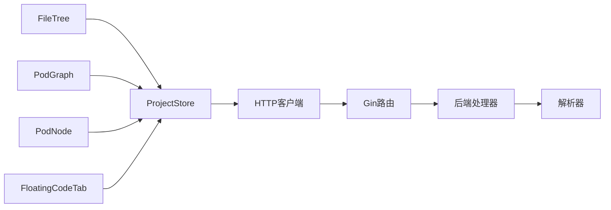

# 视图模式管理

<cite>
**本文引用的文件**
- [frontend/src/App.vue](file://frontend/src/App.vue)
- [frontend/src/main.ts](file://frontend/src/main.ts)
- [frontend/src/stores/project.ts](file://frontend/src/stores/project.ts)
- [frontend/src/types/index.ts](file://frontend/src/types/index.ts)
- [frontend/src/components/PodGraph/PodGraph.vue](file://frontend/src/components/PodGraph/PodGraph.vue)
- [frontend/src/components/PodGraph/PodNode.vue](file://frontend/src/components/PodGraph/PodNode.vue)
- [frontend/src/components/PodGraph/FloatingCodeTab.vue](file://frontend/src/components/PodGraph/FloatingCodeTab.vue)
- [frontend/src/components/FileTree/FileTree.vue](file://frontend/src/components/FileTree/FileTree.vue)
- [frontend/src/components/Controls/DepthControl.vue](file://frontend/src/components/Controls/DepthControl.vue)
- [frontend/src/api/client.ts](file://frontend/src/api/client.ts)
- [backend/main.go](file://backend/main.go)
- [backend/internal/api/router.go](file://backend/internal/api/router.go)
- [backend/internal/api/handler.go](file://backend/internal/api/handler.go)
- [backend/internal/parser/analyzer.go](file://backend/internal/parser/analyzer.go)
- [backend/internal/model/pod.go](file://backend/internal/model/pod.go)
- [README.md](file://README.md)
</cite>

## 目录
1. [简介](#简介)
2. [项目结构](#项目结构)
3. [核心组件](#核心组件)
4. [架构总览](#架构总览)
5. [详细组件分析](#详细组件分析)
6. [依赖分析](#依赖分析)
7. [性能考量](#性能考量)
8. [故障排查指南](#故障排查指南)
9. [结论](#结论)
10. [附录](#附录)

## 简介
本文件系统性阐述 GoPodView 的“视图模式管理”机制，覆盖三种核心视图模式（全局视图、聚焦视图、展开视图）的设计理念与实现细节；详述视图切换逻辑（状态转换、数据过滤、布局重算）；深入解析聚焦视图的核心算法（可达性分析、邻接关系构建、可见性计算）；讨论视图模式对性能的影响（渲染优化、内存管理、响应式更新）；说明视图状态的持久化机制（URL 同步、浏览器历史、用户偏好存储）；并提供可复用的扩展方法与最佳实践。

## 项目结构
前端采用 Vue 3 + TypeScript + Vite 构建，使用 Pinia 进行状态管理，后端基于 Go + Gin 提供 REST API。视图模式主要由 Pinia Store 驱动，PodGraph 组件负责渲染与布局，FileTree 负责导航与焦点设置，API 客户端封装后端接口。



图表来源
- [frontend/src/App.vue:1-125](file://frontend/src/App.vue#L1-L125)
- [frontend/src/main.ts:1-12](file://frontend/src/main.ts#L1-L12)
- [frontend/src/stores/project.ts:1-476](file://frontend/src/stores/project.ts#L1-L476)
- [frontend/src/components/FileTree/FileTree.vue:1-201](file://frontend/src/components/FileTree/FileTree.vue#L1-L201)
- [frontend/src/components/PodGraph/PodGraph.vue:1-581](file://frontend/src/components/PodGraph/PodGraph.vue#L1-L581)
- [frontend/src/components/PodGraph/PodNode.vue:1-425](file://frontend/src/components/PodGraph/PodNode.vue#L1-L425)
- [frontend/src/components/PodGraph/FloatingCodeTab.vue:1-209](file://frontend/src/components/PodGraph/FloatingCodeTab.vue#L1-L209)
- [frontend/src/components/Controls/DepthControl.vue:1-35](file://frontend/src/components/Controls/DepthControl.vue#L1-L35)
- [frontend/src/api/client.ts:1-53](file://frontend/src/api/client.ts#L1-L53)
- [backend/main.go:1-31](file://backend/main.go#L1-L31)
- [backend/internal/api/router.go:1-32](file://backend/internal/api/router.go#L1-L32)
- [backend/internal/api/handler.go:1-225](file://backend/internal/api/handler.go#L1-L225)
- [backend/internal/parser/analyzer.go:1-236](file://backend/internal/parser/analyzer.go#L1-L236)
- [backend/internal/model/pod.go:1-19](file://backend/internal/model/pod.go#L1-L19)

章节来源
- [README.md:79-104](file://README.md#L79-L104)

## 核心组件
- 视图状态与导航
  - 视图级别：全局(global)、聚焦(focused)、展开(expanded)、代码(code)
  - 关键状态：当前视图级别、聚焦 Pod 路径、展开集合、选中容器、依赖深度、历史栈、浮动标签页
  - 导航历史：记录每次视图变更，支持回退/前进
- 布局与渲染
  - 全局布局：按拓扑分层与目录分组进行自动布局
  - 聚焦布局：以中心节点为中心，构建可达分支树，自适应排列
  - 展开渲染：PodNode 支持折叠/展开容器，内联代码预览与浮动标签页
- 数据与算法
  - 邻接关系：从边集构建邻接表
  - 可达性：广度优先遍历，结合展开集合确定可见节点
  - 排序：按目录与路径排序，保证布局稳定

章节来源
- [frontend/src/types/index.ts:55-62](file://frontend/src/types/index.ts#L55-L62)
- [frontend/src/stores/project.ts:14-101](file://frontend/src/stores/project.ts#L14-L101)
- [frontend/src/stores/project.ts:123-156](file://frontend/src/stores/project.ts#L123-L156)
- [frontend/src/components/PodGraph/PodGraph.vue:138-179](file://frontend/src/components/PodGraph/PodGraph.vue#L138-L179)
- [frontend/src/components/PodGraph/PodGraph.vue:401-498](file://frontend/src/components/PodGraph/PodGraph.vue#L401-L498)

## 架构总览
视图模式管理贯穿前端状态层与渲染层，通过 Store 驱动组件渲染，同时与后端 API 协作完成数据加载与增量更新。



图表来源
- [frontend/src/components/FileTree/FileTree.vue:37-41](file://frontend/src/components/FileTree/FileTree.vue#L37-L41)
- [frontend/src/stores/project.ts:158-170](file://frontend/src/stores/project.ts#L158-L170)
- [frontend/src/stores/project.ts:249-258](file://frontend/src/stores/project.ts#L249-L258)
- [frontend/src/components/PodGraph/PodGraph.vue:79-110](file://frontend/src/components/PodGraph/PodGraph.vue#L79-L110)
- [frontend/src/api/client.ts:35-45](file://frontend/src/api/client.ts#L35-L45)
- [backend/internal/api/handler.go:140-152](file://backend/internal/api/handler.go#L140-L152)

## 详细组件分析

### 视图模式与切换逻辑
- 模式定义
  - global：全量 Pod 与边，按层次布局
  - focused：仅显示中心 Pod 及其直接邻居，形成树状布局
  - expanded：展开中心 Pod，显示内部容器；可内联展开邻居
  - code：用于代码视图（在类型定义中存在，但未在前端广泛使用）
- 切换流程
  - 聚焦：focusPod 设置 viewLevel=focused，清空展开集合，记录导航历史
  - 展开：expandPod/expandInlinePod 更新 expanded 集合，确保源码加载，记录导航历史
  - 回退/前进：基于 navigationHistory 与 historyIndex 应用状态
  - URL 同步：watch 状态变化，生成查询参数并 replaceState

```mermaid
flowchart TD
Start(["开始"]) --> Choose{"用户操作"}
Choose --> |点击文件树| Focus["focusPod"]
Choose --> |点击已聚焦Pod| Expand["expandPod"]
Choose --> |点击邻居Pod| InlineExpand["expandInlinePod"]
Choose --> |键盘 Cmd+[| Back["goBack"]
Choose --> |键盘 Cmd+]| Forward["goForward"]
Focus --> UpdateFocus["更新viewLevel/focusedPodPath/expanded"]
Expand --> UpdateExpand["更新viewLevel/expanded"]
InlineExpand --> UpdateInline["更新expanded并确保源码"]
UpdateFocus --> NavPush["pushNavigation"]
UpdateExpand --> NavPush
UpdateInline --> NavPush
NavPush --> SyncURL["syncUrlState"]
Back --> ApplyNav["applyNavigation(history[--])"]
Forward --> ApplyNav["applyNavigation(history[++])"]
SyncURL --> Render["PodGraph重新计算布局"]
ApplyNav --> Render
Render --> End(["结束"])
```

图表来源
- [frontend/src/stores/project.ts:158-170](file://frontend/src/stores/project.ts#L158-L170)
- [frontend/src/stores/project.ts:231-247](file://frontend/src/stores/project.ts#L231-L247)
- [frontend/src/stores/project.ts:172-198](file://frontend/src/stores/project.ts#L172-L198)
- [frontend/src/stores/project.ts:286-296](file://frontend/src/stores/project.ts#L286-L296)
- [frontend/src/stores/project.ts:298-309](file://frontend/src/stores/project.ts#L298-L309)
- [frontend/src/stores/project.ts:342-373](file://frontend/src/stores/project.ts#L342-L373)
- [frontend/src/components/PodGraph/PodGraph.vue:79-110](file://frontend/src/components/PodGraph/PodGraph.vue#L79-L110)

章节来源
- [frontend/src/stores/project.ts:14-101](file://frontend/src/stores/project.ts#L14-L101)
- [frontend/src/stores/project.ts:342-373](file://frontend/src/stores/project.ts#L342-L373)
- [frontend/src/stores/project.ts:298-309](file://frontend/src/stores/project.ts#L298-L309)
- [frontend/src/components/PodGraph/PodGraph.vue:79-110](file://frontend/src/components/PodGraph/PodGraph.vue#L79-L110)

### 聚焦视图核心算法
聚焦视图的关键在于“可达性分析 + 邻接关系构建 + 可见性计算”，随后进行“分支树构建 + 树跨度计算 + 树放置 + 剩余节点放置”。



图表来源
- [frontend/src/components/PodGraph/PodGraph.vue:138-179](file://frontend/src/components/PodGraph/PodGraph.vue#L138-L179)
- [frontend/src/components/PodGraph/PodGraph.vue:181-199](file://frontend/src/components/PodGraph/PodGraph.vue#L181-L199)
- [frontend/src/components/PodGraph/PodGraph.vue:201-333](file://frontend/src/components/PodGraph/PodGraph.vue#L201-L333)
- [frontend/src/components/PodGraph/PodGraph.vue:335-367](file://frontend/src/components/PodGraph/PodGraph.vue#L335-L367)
- [frontend/src/components/PodGraph/PodGraph.vue:369-384](file://frontend/src/components/PodGraph/PodGraph.vue#L369-L384)
- [frontend/src/components/PodGraph/PodGraph.vue:401-498](file://frontend/src/components/PodGraph/PodGraph.vue#L401-L498)

章节来源
- [frontend/src/components/PodGraph/PodGraph.vue:138-179](file://frontend/src/components/PodGraph/PodGraph.vue#L138-L179)
- [frontend/src/components/PodGraph/PodGraph.vue:201-333](file://frontend/src/components/PodGraph/PodGraph.vue#L201-L333)
- [frontend/src/components/PodGraph/PodGraph.vue:401-498](file://frontend/src/components/PodGraph/PodGraph.vue#L401-L498)

### 展开视图与容器交互
- PodNode 在展开模式下支持：
  - 容器分组（结构体/接口与其方法）
  - 内联代码预览（Monaco Editor）
  - 引用跳转（Ctrl/Cmd+点击）
  - 浮动标签页（独立窗口拖拽缩放）
- 交互行为
  - 点击 Pod：若已聚焦则切换为展开；否则仅展开邻居
  - 点击容器：默认内联预览；Ctrl/Cmd+点击跳转到引用目标
  - 结构体/接口组：点击头部展开/收起方法列表



图表来源
- [frontend/src/components/PodGraph/PodNode.vue:97-120](file://frontend/src/components/PodGraph/PodNode.vue#L97-L120)
- [frontend/src/components/PodGraph/PodNode.vue:145-154](file://frontend/src/components/PodGraph/PodNode.vue#L145-L154)
- [frontend/src/components/PodGraph/PodNode.vue:156-159](file://frontend/src/components/PodGraph/PodNode.vue#L156-L159)
- [frontend/src/stores/project.ts:260-284](file://frontend/src/stores/project.ts#L260-L284)
- [frontend/src/stores/project.ts:316-334](file://frontend/src/stores/project.ts#L316-L334)
- [frontend/src/components/PodGraph/FloatingCodeTab.vue:18-34](file://frontend/src/components/PodGraph/FloatingCodeTab.vue#L18-L34)

章节来源
- [frontend/src/components/PodGraph/PodNode.vue:97-159](file://frontend/src/components/PodGraph/PodNode.vue#L97-L159)
- [frontend/src/stores/project.ts:260-284](file://frontend/src/stores/project.ts#L260-L284)
- [frontend/src/stores/project.ts:316-334](file://frontend/src/stores/project.ts#L316-L334)
- [frontend/src/components/PodGraph/FloatingCodeTab.vue:18-34](file://frontend/src/components/PodGraph/FloatingCodeTab.vue#L18-L34)

### URL 同步与历史导航
- URL 参数
  - project：当前项目路径
  - file：聚焦的 Pod 路径
  - level：视图级别（global/focused/expanded）
  - expanded：展开集合（逗号分隔）
- 同步策略
  - watch 多个状态，生成查询字符串并 replaceState
  - 页面加载时 restoreFromUrl 解析参数并恢复状态
  - 历史栈 pushNavigation/applyNavigation 控制 goBack/goForward



图表来源
- [frontend/src/stores/project.ts:342-373](file://frontend/src/stores/project.ts#L342-L373)
- [frontend/src/stores/project.ts:380-439](file://frontend/src/stores/project.ts#L380-L439)
- [frontend/src/stores/project.ts:286-296](file://frontend/src/stores/project.ts#L286-L296)
- [frontend/src/stores/project.ts:298-309](file://frontend/src/stores/project.ts#L298-L309)

章节来源
- [frontend/src/stores/project.ts:342-373](file://frontend/src/stores/project.ts#L342-L373)
- [frontend/src/stores/project.ts:380-439](file://frontend/src/stores/project.ts#L380-L439)
- [frontend/src/stores/project.ts:286-309](file://frontend/src/stores/project.ts#L286-L309)

### 后端数据与依赖分析
- 后端提供以下接口：
  - /api/project：设置分析项目
  - /api/filetree：获取文件树
  - /api/pods：获取所有 Pod 与依赖边
  - /api/containers/{path}：获取 Pod 内部容器（含源码）
  - /api/container/{path}：获取指定容器
  - /api/dependencies/{path}：按深度获取依赖子图
- 分析器职责：
  - 构建包索引与导入映射
  - 建立 Pod 间依赖关系
  - 为容器建立引用关系（调用/类型引用）



图表来源
- [backend/internal/api/handler.go:56-75](file://backend/internal/api/handler.go#L56-L75)
- [backend/internal/api/handler.go:93-124](file://backend/internal/api/handler.go#L93-L124)
- [backend/internal/api/handler.go:140-175](file://backend/internal/api/handler.go#L140-L175)
- [backend/internal/api/handler.go:177-209](file://backend/internal/api/handler.go#L177-L209)
- [backend/internal/parser/analyzer.go:27-39](file://backend/internal/parser/analyzer.go#L27-L39)
- [backend/internal/parser/analyzer.go:41-81](file://backend/internal/parser/analyzer.go#L41-L81)
- [backend/internal/parser/analyzer.go:100-134](file://backend/internal/parser/analyzer.go#L100-L134)
- [backend/internal/model/pod.go:3-11](file://backend/internal/model/pod.go#L3-L11)

章节来源
- [frontend/src/api/client.ts:15-52](file://frontend/src/api/client.ts#L15-L52)
- [backend/internal/api/router.go:21-27](file://backend/internal/api/router.go#L21-L27)
- [backend/internal/api/handler.go:56-124](file://backend/internal/api/handler.go#L56-L124)
- [backend/internal/parser/analyzer.go:27-134](file://backend/internal/parser/analyzer.go#L27-L134)
- [backend/internal/model/pod.go:3-11](file://backend/internal/model/pod.go#L3-L11)

## 依赖分析
- 组件耦合
  - PodGraph 依赖 Store 的响应式状态与布局函数，耦合度高但职责清晰
  - FileTree 仅负责导航与焦点设置，低耦合
  - Store 是视图状态与导航的核心枢纽
- 外部依赖
  - Vue Flow：提供画布与节点渲染
  - Monaco Editor：代码高亮与编辑
  - Element Plus：UI 组件库
  - Axios：HTTP 客户端
  - Gin：后端路由与中间件



图表来源
- [frontend/src/components/FileTree/FileTree.vue:1-201](file://frontend/src/components/FileTree/FileTree.vue#L1-L201)
- [frontend/src/components/PodGraph/PodGraph.vue:1-581](file://frontend/src/components/PodGraph/PodGraph.vue#L1-L581)
- [frontend/src/stores/project.ts:1-476](file://frontend/src/stores/project.ts#L1-L476)
- [frontend/src/api/client.ts:1-53](file://frontend/src/api/client.ts#L1-L53)
- [backend/internal/api/router.go:1-32](file://backend/internal/api/router.go#L1-L32)
- [backend/internal/api/handler.go:1-225](file://backend/internal/api/handler.go#L1-L225)

章节来源
- [frontend/src/components/FileTree/FileTree.vue:1-201](file://frontend/src/components/FileTree/FileTree.vue#L1-L201)
- [frontend/src/components/PodGraph/PodGraph.vue:1-581](file://frontend/src/components/PodGraph/PodGraph.vue#L1-L581)
- [frontend/src/stores/project.ts:1-476](file://frontend/src/stores/project.ts#L1-L476)
- [frontend/src/api/client.ts:1-53](file://frontend/src/api/client.ts#L1-L53)
- [backend/internal/api/router.go:1-32](file://backend/internal/api/router.go#L1-L32)
- [backend/internal/api/handler.go:1-225](file://backend/internal/api/handler.go#L1-L225)

## 性能考量
- 渲染优化
  - 可见性过滤：聚焦视图仅渲染 visible 集合内的节点与边，减少 DOM 数量
  - 布局缓存：测量节点尺寸后缓存，避免重复计算
  - 响应式更新：通过 layoutVersion 触发局部重算，避免全量重绘
- 内存管理
  - 源码按需加载：ensurePodSourceCode 仅在需要时请求容器源码
  - 浮动标签页：统一管理编辑器实例，卸载时 dispose 释放资源
- 响应式更新
  - watch 多状态组合，避免冗余同步
  - BFS/邻接表构建仅在必要时执行，如切换视图或展开集合变化

章节来源
- [frontend/src/components/PodGraph/PodGraph.vue:72-125](file://frontend/src/components/PodGraph/PodGraph.vue#L72-L125)
- [frontend/src/components/PodGraph/PodGraph.vue:53-63](file://frontend/src/components/PodGraph/PodGraph.vue#L53-L63)
- [frontend/src/stores/project.ts:249-258](file://frontend/src/stores/project.ts#L249-L258)
- [frontend/src/components/PodGraph/FloatingCodeTab.vue:84-90](file://frontend/src/components/PodGraph/FloatingCodeTab.vue#L84-L90)

## 故障排查指南
- 无法加载项目
  - 检查后端是否成功解析项目（日志与 /api/project 返回值）
  - 确认前端 API baseURL 与 CORS 配置一致
- 聚焦/展开无效
  - 确认 focusedPodPath 是否存在且在 podMap 中
  - 检查 expanded 集合是否包含目标 Pod
- URL 不同步
  - 检查 syncUrlState 是否被抑制（suppressUrlSync）
  - 确认 watch 条件是否触发
- 性能问题
  - 大型项目建议使用全局视图或提升依赖深度上限
  - 避免频繁切换视图导致重复请求源码

章节来源
- [backend/internal/api/handler.go:56-75](file://backend/internal/api/handler.go#L56-L75)
- [frontend/src/stores/project.ts:380-439](file://frontend/src/stores/project.ts#L380-L439)
- [frontend/src/stores/project.ts:342-373](file://frontend/src/stores/project.ts#L342-L373)

## 结论
该视图模式管理体系以 Store 为核心，结合 PodGraph 的高效布局算法与按需加载策略，在保持良好交互体验的同时兼顾性能与可维护性。通过清晰的状态机与 URL 同步机制，用户可在不同视图间无缝切换，并获得稳定的渲染表现。

## 附录

### 扩展新视图模式的最佳实践
- 新增视图级别
  - 在类型定义中添加新级别
  - 在 Store 中新增对应状态与派生计算
  - 在 PodGraph 中根据新级别调整可见性与布局
- 新增导航入口
  - 在 FileTree 或其他组件中添加触发逻辑
  - 在 Store 中实现对应的 action，并 pushNavigation
- 新增布局算法
  - 在 PodGraph 中新增布局函数，遵循现有命名与参数约定
  - 使用现有的邻接表与可见性计算作为输入
- 性能与兼容性
  - 保持按需加载与缓存策略
  - 通过 watch 与布局版本控制最小化重绘范围

章节来源
- [frontend/src/types/index.ts:55-62](file://frontend/src/types/index.ts#L55-L62)
- [frontend/src/stores/project.ts:14-101](file://frontend/src/stores/project.ts#L14-L101)
- [frontend/src/components/PodGraph/PodGraph.vue:79-110](file://frontend/src/components/PodGraph/PodGraph.vue#L79-L110)