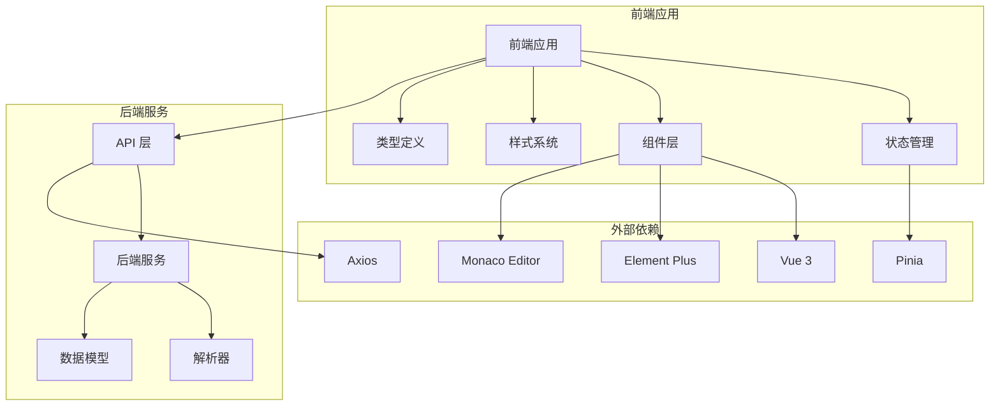
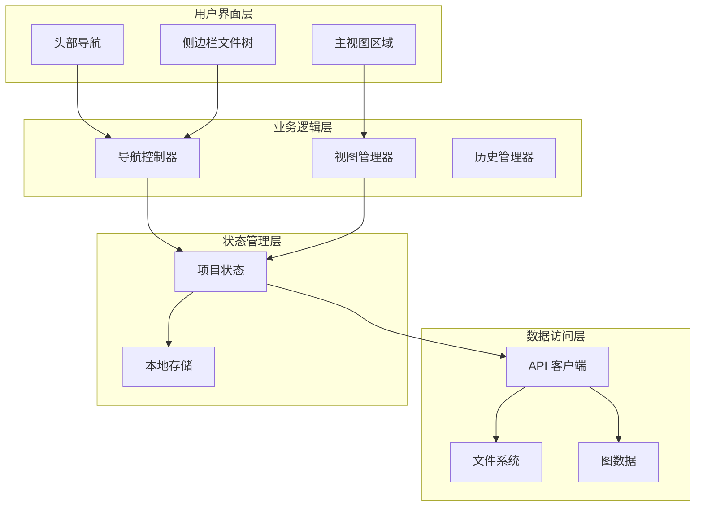
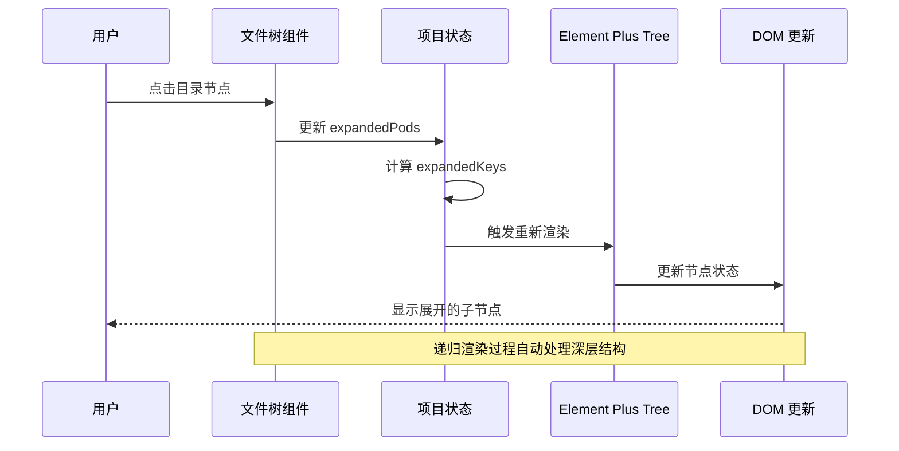
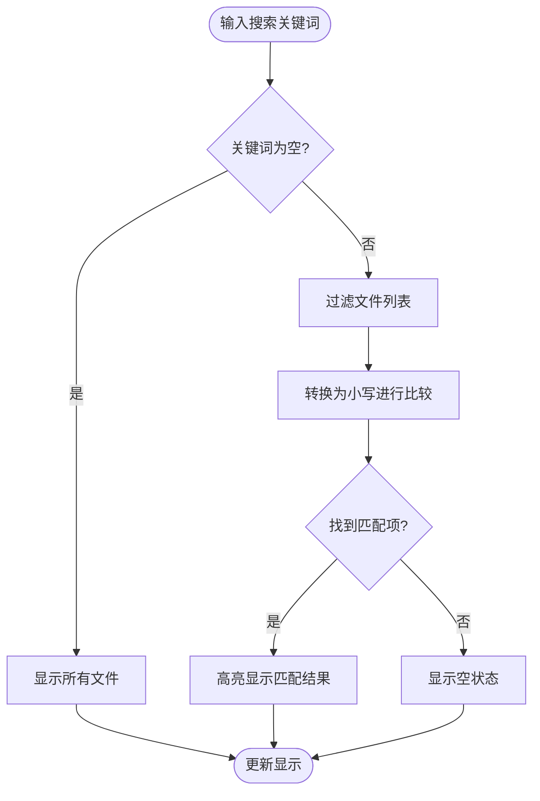
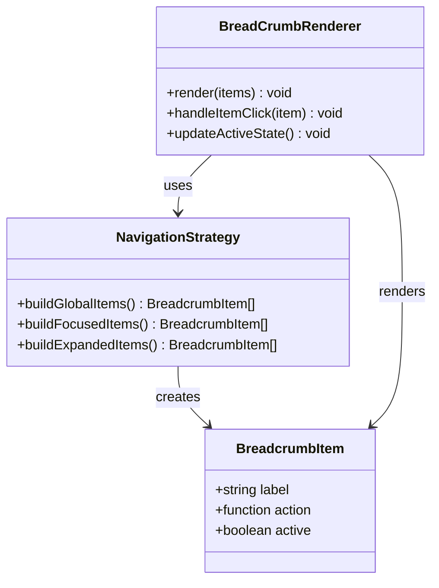
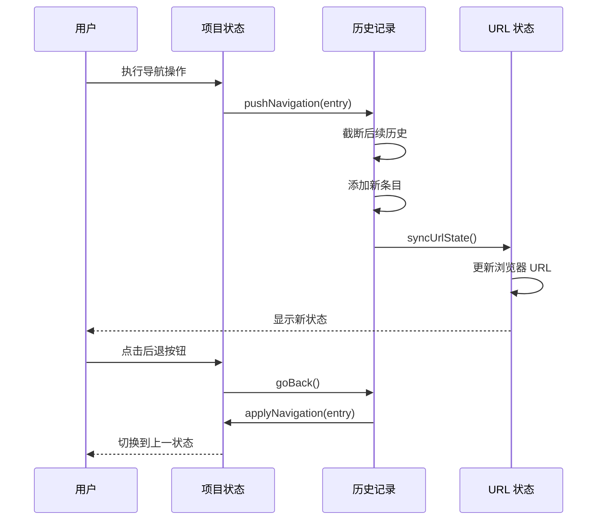
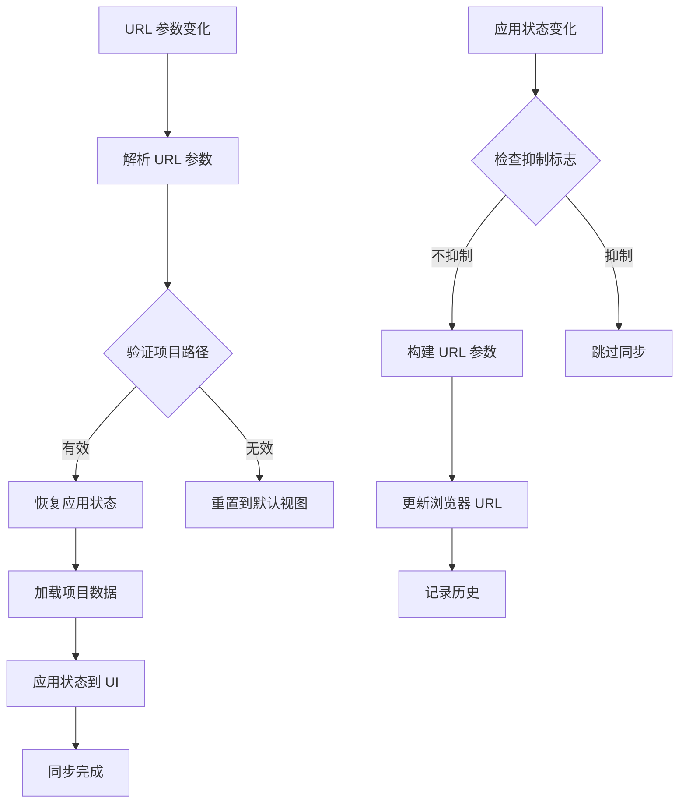
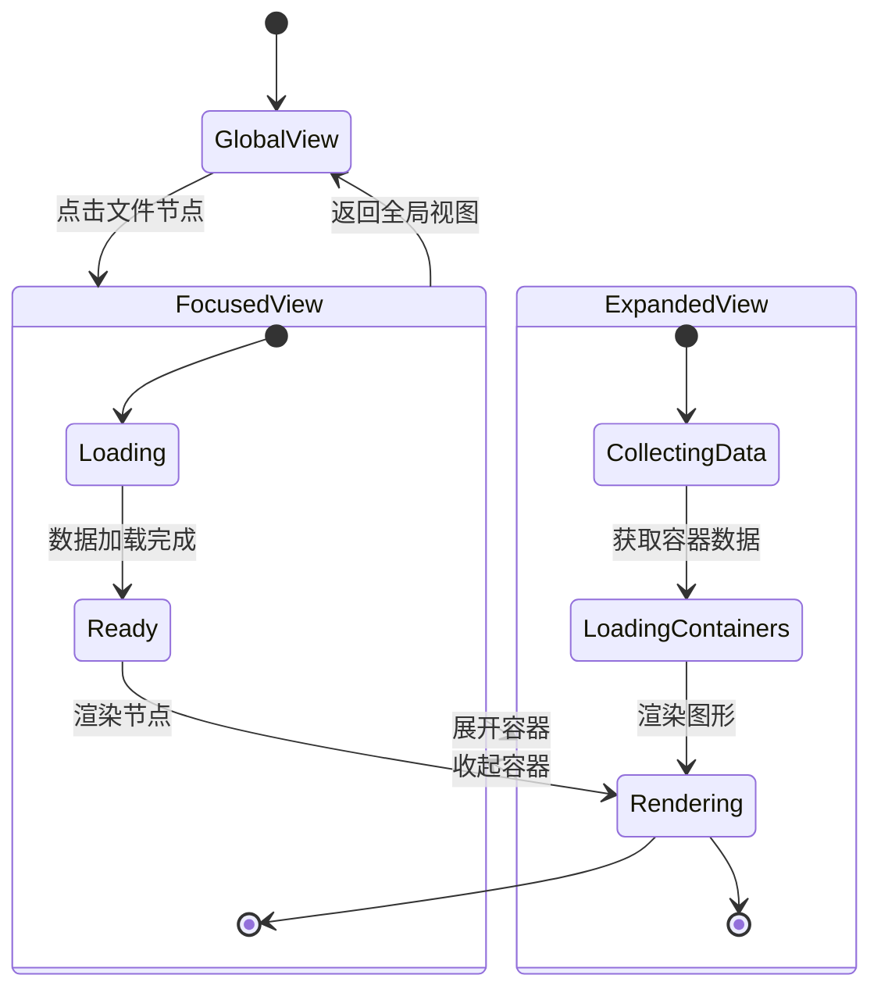

# 文件树与导航系统

<cite>
**本文档引用的文件**
- [FileTree.vue](file://frontend/src/components/FileTree/FileTree.vue)
- [AppBreadcrumb.vue](file://frontend/src/components/Breadcrumb/AppBreadcrumb.vue)
- [project.ts](file://frontend/src/stores/project.ts)
- [index.ts](file://frontend/src/types/index.ts)
- [App.vue](file://frontend/src/App.vue)
- [client.ts](file://frontend/src/api/client.ts)
- [main.ts](file://frontend/src/main.ts)
- [global.css](file://frontend/src/styles/global.css)
- [PodGraph.vue](file://frontend/src/components/PodGraph/PodGraph.vue)
- [FloatingCodeTab.vue](file://frontend/src/components/PodGraph/FloatingCodeTab.vue)
- [router.go](file://backend/internal/api/router.go)
- [main.go](file://backend/main.go)
</cite>

## 目录
1. [简介](#简介)
2. [项目结构](#项目结构)
3. [核心组件](#核心组件)
4. [架构概览](#架构概览)
5. [详细组件分析](#详细组件分析)
6. [依赖关系分析](#依赖关系分析)
7. [性能考虑](#性能考虑)
8. [故障排除指南](#故障排除指南)
9. [结论](#结论)
10. [附录](#附录)

## 简介

GoPodView 是一个基于 Vue 3 和 TypeScript 的 Go 项目可视化工具，专注于展示 Go 模块的依赖关系和代码结构。该系统的核心是文件树与导航系统，它提供了直观的文件浏览、路径导航和视图切换功能。

本系统采用现代化的前端技术栈，包括 Vue 3 Composition API、Element Plus UI 组件库、Pinia 状态管理、Vue Flow 图形渲染引擎和 Monaco 编辑器。后端使用 Go 语言构建，提供 RESTful API 接口。

## 项目结构

项目采用前后端分离的架构设计，主要分为以下层次：



**图表来源**
- [main.ts:1-12](file://frontend/src/main.ts#L1-L12)
- [App.vue:1-125](file://frontend/src/App.vue#L1-L125)

**章节来源**
- [main.ts:1-12](file://frontend/src/main.ts#L1-L12)
- [App.vue:1-125](file://frontend/src/App.vue#L1-L125)

## 核心组件

### 文件树组件 (FileTree)

文件树组件是导航系统的核心，负责展示项目的文件结构和提供交互功能。

**主要特性：**
- 递归渲染目录结构
- 动态节点展开/收起
- 实时文件过滤
- 选中状态同步
- 加载状态指示

**关键实现模式：**
- 使用 Element Plus 的 Tree 组件作为基础
- 通过计算属性动态生成树数据
- 实现智能展开逻辑以保持焦点路径可见
- 支持搜索过滤功能

**章节来源**
- [FileTree.vue:1-201](file://frontend/src/components/FileTree/FileTree.vue#L1-L201)

### 面包屑导航 (Breadcrumb)

面包屑导航提供多层级的路径导航能力，支持快速跳转到不同视图级别。

**导航层级：**
1. **全局视图** - 显示所有 Pod 的整体依赖关系
2. **聚焦视图** - 聚焦到特定 Pod 的详细信息
3. **展开视图** - 展示 Pod 的依赖关系网络
4. **代码视图** - 显示容器的源代码内容

**交互功能：**
- 快速层级切换
- 当前状态高亮显示
- 自动状态同步

**章节来源**
- [AppBreadcrumb.vue:1-78](file://frontend/src/components/Breadcrumb/AppBreadcrumb.vue#L1-L78)

### 状态管理 (Project Store)

项目状态管理是整个导航系统的大脑，协调所有组件的状态同步。

**核心状态：**
- `viewLevel`: 当前视图级别
- `focusedPodPath`: 当前聚焦的 Pod 路径
- `expandedPods`: 展开的 Pod 集合
- `navigationHistory`: 导航历史记录
- `floatingTabs`: 浮动代码标签页

**导航策略：**
- 历史记录管理
- URL 状态同步
- 视图级别转换
- 焦点管理

**章节来源**
- [project.ts:1-476](file://frontend/src/stores/project.ts#L1-L476)

## 架构概览

系统采用分层架构设计，确保各组件职责清晰且松耦合：



**图表来源**
- [App.vue:35-71](file://frontend/src/App.vue#L35-L71)
- [project.ts:14-476](file://frontend/src/stores/project.ts#L14-L476)

## 详细组件分析

### 文件树递归渲染机制

文件树组件实现了高效的递归渲染机制，支持大型项目的文件浏览：



**图表来源**
- [FileTree.vue:22-81](file://frontend/src/components/FileTree/FileTree.vue#L22-L81)
- [project.ts:231-247](file://frontend/src/stores/project.ts#L231-L247)

**实现细节：**
- 使用 `expandedKeys` 计算属性动态生成展开键值
- 通过 `nextTick` 确保 DOM 更新完成后再执行展开操作
- 实现智能展开逻辑，确保焦点路径始终可见

**章节来源**
- [FileTree.vue:22-81](file://frontend/src/components/FileTree/FileTree.vue#L22-L81)

### 文件过滤功能

文件树提供了强大的实时过滤功能：



**图表来源**
- [FileTree.vue:32-35](file://frontend/src/components/FileTree/FileTree.vue#L32-L35)

**过滤策略：**
- 不区分大小写的字符串匹配
- 支持部分匹配
- 实时响应用户输入

**章节来源**
- [FileTree.vue:32-35](file://frontend/src/components/FileTree/FileTree.vue#L32-L35)

### 面包屑导航设计

面包屑导航系统提供了直观的多层级导航体验：



**图表来源**
- [AppBreadcrumb.vue:7-40](file://frontend/src/components/Breadcrumb/AppBreadcrumb.vue#L7-L40)

**导航层级实现：**

| 视图级别 | 导航项 | 功能描述 | 触发动作 |
|---------|--------|----------|----------|
| global | All Pods | 返回全局视图 | `store.resetView()` |
| focused | 当前 Pod 名称 | 聚焦到指定 Pod | `store.focusPod(path)` |
| expanded | Containers | 展开容器视图 | `store.expandPod(path)` |

**章节来源**
- [AppBreadcrumb.vue:13-40](file://frontend/src/components/Breadcrumb/AppBreadcrumb.vue#L13-L40)

### 导航历史管理

系统实现了完整的导航历史管理机制：



**图表来源**
- [project.ts:103-108](file://frontend/src/stores/project.ts#L103-L108)
- [project.ts:286-296](file://frontend/src/stores/project.ts#L286-L296)

**历史管理策略：**
- 基于数组的历史记录存储
- 支持撤销和重做操作
- 自动截断后续历史以避免循环
- URL 状态同步

**章节来源**
- [project.ts:103-108](file://frontend/src/stores/project.ts#L103-L108)
- [project.ts:286-296](file://frontend/src/stores/project.ts#L286-L296)

### URL 状态同步机制

系统实现了双向的 URL 状态同步，确保用户可以通过 URL 直接访问特定状态：



**图表来源**
- [project.ts:342-373](file://frontend/src/stores/project.ts#L342-L373)
- [project.ts:380-439](file://frontend/src/stores/project.ts#L380-L439)

**URL 参数映射：**

| 参数名 | 类型 | 描述 | 默认值 |
|--------|------|------|--------|
| `project` | string | Go 项目路径 | 无 |
| `file` | string | 当前聚焦的文件路径 | 无 |
| `level` | ViewLevel | 视图级别 | global |
| `expanded` | string[] | 展开的 Pod 路径列表 | 无 |

**章节来源**
- [project.ts:342-373](file://frontend/src/stores/project.ts#L342-L373)
- [project.ts:380-439](file://frontend/src/stores/project.ts#L380-L439)

### 主视图联动机制

文件树与主视图之间建立了紧密的联动关系：



**图表来源**
- [project.ts:158-170](file://frontend/src/stores/project.ts#L158-L170)
- [project.ts:231-247](file://frontend/src/stores/project.ts#L231-L247)

**联动实现：**
- 焦点状态同步：文件树选中状态与当前聚焦 Pod 同步
- 展开状态同步：展开的 Pod 集合在两个组件间保持一致
- 视图级别同步：导航层级变化影响文件树的展开状态

**章节来源**
- [project.ts:158-170](file://frontend/src/stores/project.ts#L158-L170)
- [project.ts:231-247](file://frontend/src/stores/project.ts#L231-L247)

## 依赖关系分析

系统采用了模块化的依赖管理策略：

```mermaid
graph TB
subgraph "前端依赖"
Vue[Vue 3.5.30]
TS[TypeScript 5.9.3]
Pinia[Pinia 3.0.4]
ElementPlus[Element Plus 2.13.6]
Axios[Axios 1.13.6]
VueFlow[Vue Flow 1.48.2]
Monaco[Monaco Editor 0.55.1]
end
subgraph "开发依赖"
Vite[Vite 8.0.1]
VueTS[Vue TypeScript 3.2.5]
ESLint[ESLint]
Prettier[Prettier]
end
subgraph "运行时依赖"
ElementPlusIcons[@element-plus/icons-vue 2.3.2]
VueRouter[vue-router 5.0.4]
end
Vue --> Pinia
Vue --> ElementPlus
ElementPlus --> VueFlow
VueFlow --> Monaco
Axios --> Vue
Pinia --> Vue
```

**图表来源**
- [package.json:11-32](file://frontend/package.json#L11-L32)

**第三方库选择理由：**
- **Vue 3**: 提供响应式数据绑定和组合式 API
- **Element Plus**: 提供丰富的 UI 组件和良好的 TypeScript 支持
- **Pinia**: 现代化的状态管理方案，比 Vuex 更易用
- **Vue Flow**: 专业的图形渲染解决方案
- **Monaco Editor**: VS Code 同款编辑器，提供优秀的代码编辑体验

**章节来源**
- [package.json:1-33](file://frontend/package.json#L1-L33)

## 性能考虑

系统在多个层面进行了性能优化：

### 渲染优化
- **虚拟滚动**: 对于大量文件的场景，考虑实现虚拟滚动以提升渲染性能
- **懒加载**: 目录节点采用懒加载策略，只在需要时加载子节点
- **防抖处理**: 搜索功能使用防抖机制，避免频繁的重新渲染

### 内存管理
- **组件卸载**: 确保组件销毁时清理事件监听器和定时器
- **状态清理**: 导航历史记录定期清理，避免内存泄漏
- **资源释放**: Monaco 编辑器实例在组件卸载时正确释放

### 网络优化
- **并发请求**: 使用 Promise.all 并发加载项目数据
- **缓存策略**: API 响应结果进行适当的缓存
- **错误重试**: 网络请求失败时提供重试机制

## 故障排除指南

### 常见问题及解决方案

**文件树无法展开**
- 检查 `expandedPods` 状态是否正确更新
- 确认 `expandedKeys` 计算属性返回正确的键值
- 验证 Element Plus Tree 组件的 `node-key` 属性设置

**面包屑导航失效**
- 检查 `viewLevel` 状态是否正确更新
- 确认 `focusedPodPath` 是否为空
- 验证导航历史记录是否包含有效的条目

**URL 状态不同步**
- 检查 `suppressUrlSync` 标志位
- 确认 URL 参数解析逻辑
- 验证 `restoreFromUrl` 方法的执行流程

**性能问题**
- 监控组件渲染时间
- 检查是否有不必要的重新渲染
- 考虑实现组件级别的性能优化

**章节来源**
- [project.ts:340-378](file://frontend/src/stores/project.ts#L340-L378)
- [FileTree.vue:61-81](file://frontend/src/components/FileTree/FileTree.vue#L61-L81)

## 结论

GoPodView 的文件树与导航系统展现了现代前端应用的最佳实践。通过精心设计的状态管理、响应式的组件架构和完善的用户体验，系统成功地解决了复杂 Go 项目导航的技术挑战。

**核心优势：**
- **直观的导航体验**: 多层级的导航结构让用户能够轻松探索项目结构
- **实时状态同步**: 文件树与主视图之间的无缝联动提升了用户体验
- **强大的扩展性**: 模块化的设计使得系统易于维护和扩展
- **性能优化**: 多层次的性能优化确保了大项目的流畅运行

**未来改进方向：**
- 实现更智能的文件过滤算法
- 添加键盘快捷键支持
- 优化移动端适配
- 增强离线功能支持

## 附录

### 配置选项参考

**文件树配置：**
- `highlight-current`: 高亮当前选中的节点
- `node-key`: 节点唯一标识符
- `filter-node-method`: 自定义节点过滤方法
- `filter-value`: 过滤器值

**面包屑配置：**
- `separator`: 分隔符样式
- `class`: 自定义样式类
- `active-class`: 激活状态样式类

**状态管理配置：**
- `dependencyDepth`: 依赖关系深度限制
- `layoutVersion`: 布局版本控制
- `lastAction`: 最后一次操作类型

### 自定义方法

**扩展文件树功能：**
```typescript
// 添加自定义节点图标
function getNodeIcon(data: FileTreeNode) {
  // 实现自定义图标逻辑
}

// 自定义节点样式
function getNodeClass(data: FileTreeNode) {
  // 实现自定义样式逻辑
}
```

**扩展导航功能：**
```typescript
// 添加新的视图级别
function addNewViewLevel() {
  // 实现新视图级别的逻辑
}

// 自定义导航历史记录
function customizeNavigationHistory() {
  // 实现自定义历史记录逻辑
}
```

**优化性能：**
```typescript
// 实现组件级别的性能优化
function optimizeRendering() {
  // 实现渲染优化逻辑
}

// 添加缓存机制
function addCaching() {
  // 实现缓存逻辑
}
```