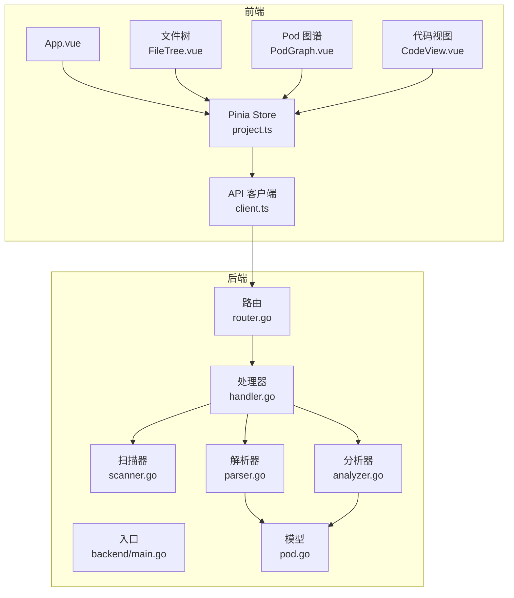
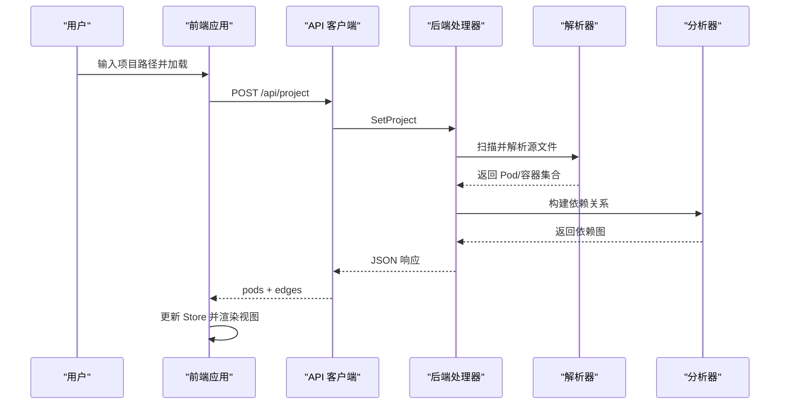
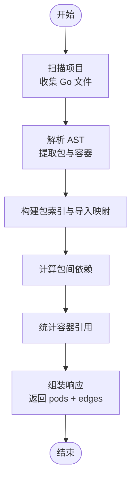
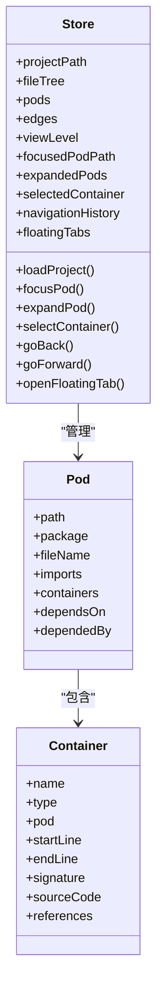
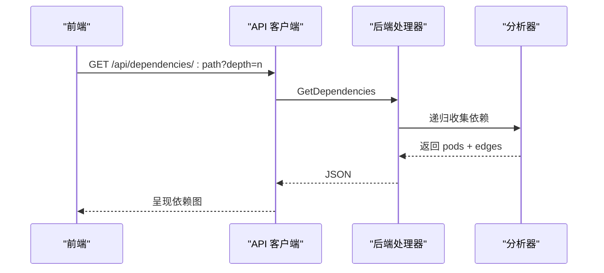
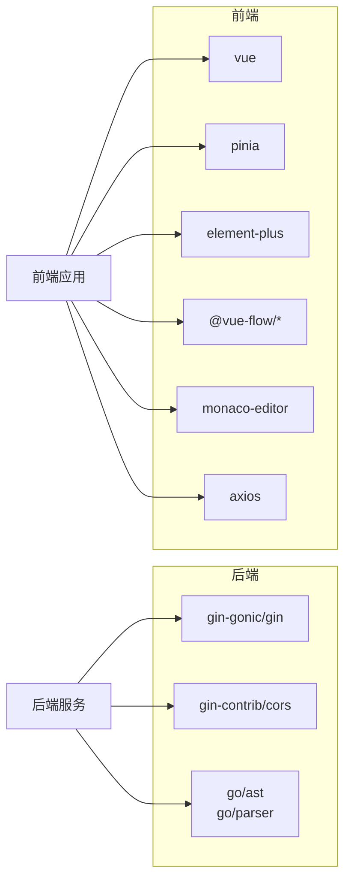

# 核心功能

<cite>
**本文档引用的文件**
- [backend/main.go](file://backend/main.go)
- [backend/internal/api/router.go](file://backend/internal/api/router.go)
- [backend/internal/api/handler.go](file://backend/internal/api/handler.go)
- [backend/internal/parser/parser.go](file://backend/internal/parser/parser.go)
- [backend/internal/parser/analyzer.go](file://backend/internal/parser/analyzer.go)
- [backend/internal/model/pod.go](file://backend/internal/model/pod.go)
- [backend/go.mod](file://backend/go.mod)
- [frontend/src/App.vue](file://frontend/src/App.vue)
- [frontend/src/stores/project.ts](file://frontend/src/stores/project.ts)
- [frontend/src/api/client.ts](file://frontend/src/api/client.ts)
- [frontend/src/components/FileTree/FileTree.vue](file://frontend/src/components/FileTree/FileTree.vue)
- [frontend/src/components/PodGraph/PodGraph.vue](file://frontend/src/components/PodGraph/PodGraph.vue)
- [frontend/src/components/CodeView/CodeView.vue](file://frontend/src/components/CodeView/CodeView.vue)
- [frontend/src/types/index.ts](file://frontend/src/types/index.ts)
- [frontend/package.json](file://frontend/package.json)
</cite>

## 目录
1. [简介](#简介)
2. [项目结构](#项目结构)
3. [核心组件](#核心组件)
4. [架构总览](#架构总览)
5. [详细组件分析](#详细组件分析)
6. [依赖分析](#依赖分析)
7. [性能考虑](#性能考虑)
8. [故障排查指南](#故障排查指南)
9. [结论](#结论)
10. [附录](#附录)

## 简介
本项目为 GoPodView，旨在提供 Go 项目的代码结构可视化与交互式依赖图谱浏览能力。其核心目标是：
- 将 Go 源码解析为“包（Pod）”与“容器（函数/类型/常量/变量）”两级抽象，并建立包间依赖关系。
- 提供全局、聚焦与展开三种视图模式，支持在依赖图中进行交互式导航与代码片段查看。
- 通过前后端分离架构，后端负责项目扫描、AST 解析与依赖分析，前端负责渲染与交互。

## 项目结构
项目采用前后端分离架构：
- 后端：Gin Web 服务，提供 REST 接口；内部包含扫描器、解析器与分析器，负责构建项目模型与依赖图。
- 前端：基于 Vue 3 + TypeScript + Pinia 的单页应用，负责 UI 渲染、状态管理与用户交互。

图表来源
- [backend/main.go:11-30](file://backend/main.go#L11-L30)
- [backend/internal/api/router.go:8-31](file://backend/internal/api/router.go#L8-L31)
- [backend/internal/api/handler.go:31-50](file://backend/internal/api/handler.go#L31-L50)
- [backend/internal/parser/parser.go:23-59](file://backend/internal/parser/parser.go#L23-L59)
- [backend/internal/parser/analyzer.go:19-39](file://backend/internal/parser/analyzer.go#L19-L39)
- [frontend/src/App.vue:10-32](file://frontend/src/App.vue#L10-L32)
- [frontend/src/stores/project.ts:57-76](file://frontend/src/stores/project.ts#L57-L76)
- [frontend/src/api/client.ts:15-28](file://frontend/src/api/client.ts#L15-L28)

章节来源
- [backend/main.go:11-30](file://backend/main.go#L11-L30)
- [backend/internal/api/router.go:8-31](file://backend/internal/api/router.go#L8-L31)
- [frontend/src/App.vue:10-32](file://frontend/src/App.vue#L10-L32)

## 核心组件
- 后端入口与路由
  - 入口程序解析命令行参数，初始化处理器与路由器，启动 HTTP 服务。
  - 路由器定义 /api 下的项目设置、文件树、Pod 列表、Pod/容器详情、依赖图等接口。
- 处理器与数据流
  - 处理器负责加载项目、扫描源文件、解析 AST、构建依赖图，并以 JSON 形式返回给前端。
- 解析与分析
  - 解析器从源码中提取包名、导入、函数与类型声明，生成容器信息。
  - 分析器根据导入路径推断包级依赖，建立双向依赖关系，并统计容器间的引用。
- 前端状态与视图
  - Pinia Store 统一管理项目路径、文件树、Pod 列表、边、视图层级、历史导航、浮动标签等。
  - 文件树组件提供项目路径输入、搜索与节点高亮；Pod 图谱组件负责布局与渲染；代码视图组件集成 Monaco 编辑器展示源码与引用。

章节来源
- [backend/internal/api/router.go:8-31](file://backend/internal/api/router.go#L8-L31)
- [backend/internal/api/handler.go:31-50](file://backend/internal/api/handler.go#L31-L50)
- [backend/internal/parser/parser.go:23-59](file://backend/internal/parser/parser.go#L23-L59)
- [backend/internal/parser/analyzer.go:19-39](file://backend/internal/parser/analyzer.go#L19-L39)
- [frontend/src/stores/project.ts:57-76](file://frontend/src/stores/project.ts#L57-L76)
- [frontend/src/components/FileTree/FileTree.vue:37-48](file://frontend/src/components/FileTree/FileTree.vue#L37-L48)
- [frontend/src/components/PodGraph/PodGraph.vue:79-125](file://frontend/src/components/PodGraph/PodGraph.vue#L79-L125)
- [frontend/src/components/CodeView/CodeView.vue:12-38](file://frontend/src/components/CodeView/CodeView.vue#L12-L38)

## 架构总览
后端负责“数据采集与建模”，前端负责“可视化与交互”。二者通过 REST API 协作，前端通过 Pinia Store 维护本地状态，支持键盘快捷键与 URL 同步。

图表来源
- [frontend/src/stores/project.ts:57-76](file://frontend/src/stores/project.ts#L57-L76)
- [frontend/src/api/client.ts:15-28](file://frontend/src/api/client.ts#L15-L28)
- [backend/internal/api/handler.go:31-50](file://backend/internal/api/handler.go#L31-L50)
- [backend/internal/parser/parser.go:23-59](file://backend/internal/parser/parser.go#L23-L59)
- [backend/internal/parser/analyzer.go:27-39](file://backend/internal/parser/analyzer.go#L27-L39)

## 详细组件分析

### 后端：项目加载与依赖分析流程
- 加载项目
  - 处理器接收项目路径，调用扫描器收集 Go 文件列表，随后交由解析器逐个解析。
- AST 解析
  - 解析器读取文件源码，利用 go/parser 与 go/ast 提取包名、导入、函数与类型声明，生成容器对象。
- 依赖分析
  - 分析器构建包索引与导入映射，解析导入路径到包目录，建立 DependsOn/DependedBy 双向依赖。
  - 针对容器引用，遍历 AST 中的选择表达式，匹配目标容器并记录引用关系。
- 数据输出
  - 处理器将 Pod 列表与边集合并返回，同时提供按深度查询依赖图的能力。

图表来源
- [backend/internal/api/handler.go:31-50](file://backend/internal/api/handler.go#L31-L50)
- [backend/internal/parser/parser.go:32-59](file://backend/internal/parser/parser.go#L32-L59)
- [backend/internal/parser/analyzer.go:27-39](file://backend/internal/parser/analyzer.go#L27-L39)
- [backend/internal/parser/analyzer.go:100-134](file://backend/internal/parser/analyzer.go#L100-L134)
- [backend/internal/parser/analyzer.go:152-217](file://backend/internal/parser/analyzer.go#L152-L217)

章节来源
- [backend/internal/api/handler.go:31-50](file://backend/internal/api/handler.go#L31-L50)
- [backend/internal/parser/parser.go:32-59](file://backend/internal/parser/parser.go#L32-L59)
- [backend/internal/parser/analyzer.go:27-39](file://backend/internal/parser/analyzer.go#L27-L39)
- [backend/internal/parser/analyzer.go:100-134](file://backend/internal/parser/analyzer.go#L100-L134)
- [backend/internal/parser/analyzer.go:152-217](file://backend/internal/parser/analyzer.go#L152-L217)

### 前端：状态管理与交互式图形展示
- 状态管理（Pinia）
  - 统一维护项目路径、文件树、Pod 列表、边、视图层级、历史导航、展开集合、选中的容器与浮动标签。
  - 支持导航历史前进/后退、URL 同步、按需加载容器源码。
- 视图模式
  - 全局：全局布局，强调整体依赖关系。
  - 聚焦：仅显示中心 Pod 及其可达范围。
  - 展开：展开中心 Pod 及其子分支，可选择容器进入代码视图。
- Pod 图谱布局
  - 使用 Vue Flow 渲染节点与边，支持动画边与颜色区分主次关系。
  - 实现分层布局与聚焦分支树布局，自动计算节点尺寸与间距，保证可读性。
- 代码视图
  - 集成 Monaco 编辑器，只读展示容器源码，支持跳转引用与返回展开视图。

图表来源
- [frontend/src/stores/project.ts:14-476](file://frontend/src/stores/project.ts#L14-L476)
- [frontend/src/types/index.ts:21-29](file://frontend/src/types/index.ts#L21-L29)
- [frontend/src/types/index.ts:10-19](file://frontend/src/types/index.ts#L10-L19)

章节来源
- [frontend/src/stores/project.ts:57-76](file://frontend/src/stores/project.ts#L57-L76)
- [frontend/src/stores/project.ts:158-170](file://frontend/src/stores/project.ts#L158-L170)
- [frontend/src/stores/project.ts:231-247](file://frontend/src/stores/project.ts#L231-L247)
- [frontend/src/stores/project.ts:260-284](file://frontend/src/stores/project.ts#L260-L284)
- [frontend/src/stores/project.ts:316-338](file://frontend/src/stores/project.ts#L316-L338)
- [frontend/src/components/PodGraph/PodGraph.vue:79-125](file://frontend/src/components/PodGraph/PodGraph.vue#L79-L125)
- [frontend/src/components/CodeView/CodeView.vue:12-38](file://frontend/src/components/CodeView/CodeView.vue#L12-L38)

### API 工作流与数据流转
- 初始化与加载
  - 前端调用 /api/project 设置项目路径，后端扫描并解析，返回 pods 与 edges。
- 依赖查询
  - 前端可请求 /api/dependencies/{path}?depth=N，后端递归收集指定深度内的依赖 Pod 与边。
- 容器与引用
  - 前端可请求 /api/containers/{path} 获取容器列表，再请求 /api/container/{path}?name=... 获取具体容器及其引用。

图表来源
- [frontend/src/api/client.ts:47-52](file://frontend/src/api/client.ts#L47-L52)
- [backend/internal/api/handler.go:177-209](file://backend/internal/api/handler.go#L177-L209)
- [backend/internal/parser/analyzer.go:211-224](file://backend/internal/parser/analyzer.go#L211-L224)

章节来源
- [frontend/src/api/client.ts:47-52](file://frontend/src/api/client.ts#L47-L52)
- [backend/internal/api/handler.go:177-209](file://backend/internal/api/handler.go#L177-L209)

## 依赖分析
- 后端依赖
  - Gin 用于 HTTP 路由与中间件；CORS 支持跨域；go/ast/go/parser 用于 AST 解析。
- 前端依赖
  - Vue 3 + TypeScript；Pinia 状态管理；Element Plus UI；@vue-flow 渲染图谱；Monaco 编辑器；Axios 发起请求。

图表来源
- [backend/go.mod:5-8](file://backend/go.mod#L5-L8)
- [frontend/package.json:11-22](file://frontend/package.json#L11-L22)

章节来源
- [backend/go.mod:5-8](file://backend/go.mod#L5-L8)
- [frontend/package.json:11-22](file://frontend/package.json#L11-L22)

## 性能考虑
- 并发与锁
  - 处理器使用读写锁保护共享状态，避免并发读写导致的数据竞争。
- 懒加载与缓存
  - 容器源码按需加载，减少初始传输与渲染压力；图谱布局版本号驱动重绘，避免不必要的重排。
- 布局优化
  - 分层布局与聚焦分支树布局结合，控制节点尺寸与间距，提升大规模依赖图的可读性。
- 请求合并
  - 初始加载时并行请求文件树与 Pod 列表，缩短首屏等待时间。

章节来源
- [backend/internal/api/handler.go:15-21](file://backend/internal/api/handler.go#L15-L21)
- [frontend/src/stores/project.ts:57-76](file://frontend/src/stores/project.ts#L57-L76)
- [frontend/src/components/PodGraph/PodGraph.vue:401-498](file://frontend/src/components/PodGraph/PodGraph.vue#L401-L498)

## 故障排查指南
- 后端启动失败
  - 检查端口占用与 CORS 配置是否允许前端开发服务器地址。
- 无法加载项目
  - 确认项目路径有效且包含 Go 源文件；检查后端日志输出的错误信息。
- 前端空白或无数据
  - 检查 /api/filetree 与 /api/pods 是否返回 200；确认代理或跨域配置正确。
- 依赖图不完整
  - 检查导入路径是否规范；确认外部依赖与标准库过滤逻辑符合预期。
- 性能问题
  - 对于大型项目，建议限制初始展开范围与依赖深度；启用懒加载容器源码。

章节来源
- [backend/main.go:21-29](file://backend/main.go#L21-L29)
- [backend/internal/api/router.go:12-17](file://backend/internal/api/router.go#L12-L17)
- [frontend/src/api/client.ts:10-13](file://frontend/src/api/client.ts#L10-L13)

## 结论
GoPodView 通过清晰的前后端职责划分，实现了从 AST 解析到依赖图可视化的完整链路。前端以交互式图形与代码视图为核心体验，后端以可扩展的解析与分析模块为基础，两者协同为 Go 代码分析提供了高效、直观的工具。建议在实际使用中结合项目规模合理设置依赖深度与展开策略，以获得最佳的可视化效果与性能表现。

## 附录
- 快速开始
  - 启动后端：传入项目路径与端口参数，启动 HTTP 服务。
  - 启动前端：安装依赖后运行开发服务器，访问页面并加载项目路径。
- 关键操作
  - 在文件树中选择文件进入聚焦视图；在图谱中点击节点展开；打开容器进入代码视图；使用浮动标签并排查看不同容器。
- 最佳实践
  - 对于大型仓库，优先使用“聚焦”视图定位问题模块，再逐步展开；合理设置依赖深度，避免一次性加载过多节点；利用 URL 同步分享当前视图状态。