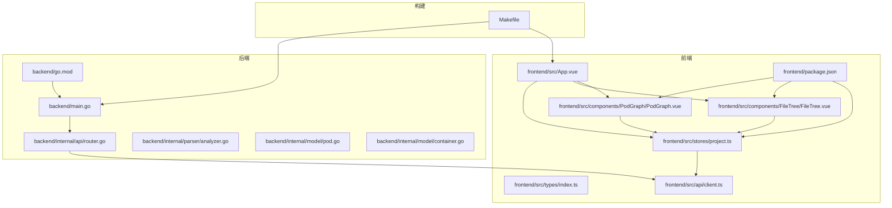
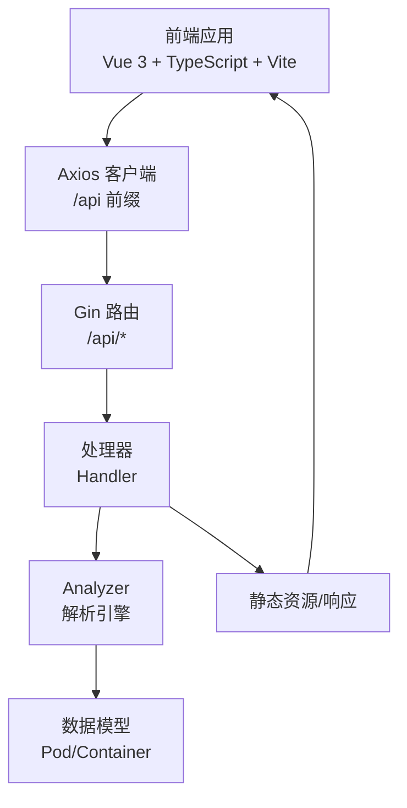
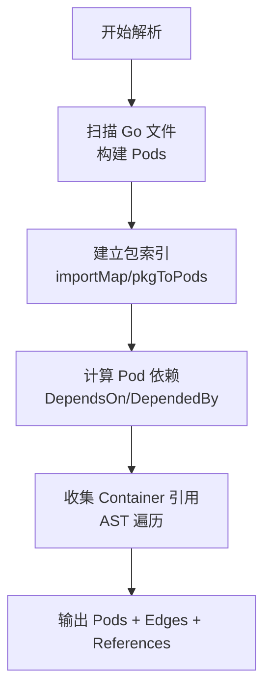
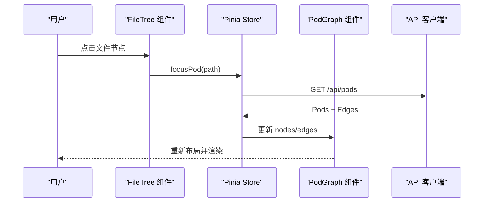
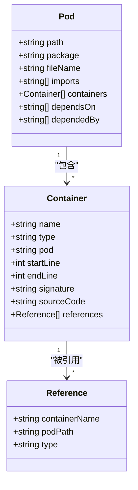
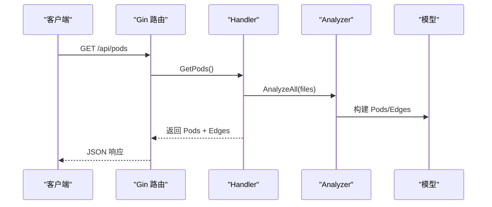
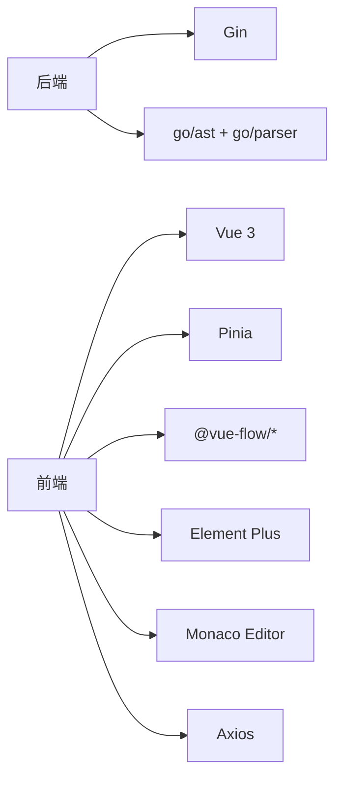

# 项目概述

<cite>
**本文档引用的文件**
- [README.md](file://README.md)
- [README_CN.md](file://README_CN.md)
- [backend/main.go](file://backend/main.go)
- [backend/go.mod](file://backend/go.mod)
- [backend/internal/api/router.go](file://backend/internal/api/router.go)
- [backend/internal/model/pod.go](file://backend/internal/model/pod.go)
- [backend/internal/model/container.go](file://backend/internal/model/container.go)
- [backend/internal/parser/analyzer.go](file://backend/internal/parser/analyzer.go)
- [frontend/src/App.vue](file://frontend/src/App.vue)
- [frontend/src/stores/project.ts](file://frontend/src/stores/project.ts)
- [frontend/src/types/index.ts](file://frontend/src/types/index.ts)
- [frontend/src/components/PodGraph/PodGraph.vue](file://frontend/src/components/PodGraph/PodGraph.vue)
- [frontend/src/components/FileTree/FileTree.vue](file://frontend/src/components/FileTree/FileTree.vue)
- [frontend/src/api/client.ts](file://frontend/src/api/client.ts)
- [frontend/package.json](file://frontend/package.json)
- [Makefile](file://Makefile)
</cite>

## 目录
1. [简介](#简介)
2. [项目结构](#项目结构)
3. [核心组件](#核心组件)
4. [架构总览](#架构总览)
5. [详细组件分析](#详细组件分析)
6. [依赖分析](#依赖分析)
7. [性能考虑](#性能考虑)
8. [故障排除指南](#故障排除指南)
9. [结论](#结论)
10. [附录](#附录)

## 简介
GoPodView 是一个受 Kubernetes Pod 概念启发的 Go 项目代码结构可视化工具。它将每个 Go 源文件抽象为“Pod”，文件内的函数、结构体、接口、常量、变量等声明抽象为“Container”。通过解析项目中的导入依赖关系，系统在交互式图中以节点与连线的形式呈现模块间的依赖关系。用户可以点击任意 Container 直接在浏览器中查看其源代码，并支持 VSCode 风格的导航体验（Cmd+[ 后退、Cmd+] 前进、Cmd+Click 跳转引用）。项目采用前后端分离架构：后端基于 Go 和 Gin 提供 REST API，前端基于 Vue 3、TypeScript、Vite 构建交互式可视化界面。

该工具的核心价值在于帮助开发者快速理解复杂 Go 项目的结构与依赖关系，通过“全局视图—聚焦视图—展开视图”的渐进式探索方式，降低认知负担并提升导航效率。

**章节来源**
- [README.md:1-109](file://README.md#L1-L109)
- [README_CN.md:1-112](file://README_CN.md#L1-L112)

## 项目结构
项目采用前后端分离的组织方式，根目录包含后端（backend）、前端（frontend）、文档（docs）、构建脚本（Makefile）与说明文档（README.md、README_CN.md）。

- 后端（backend）
  - 入口程序：backend/main.go
  - 路由与处理器：backend/internal/api/router.go
  - 数据模型：backend/internal/model/pod.go、backend/internal/model/container.go
  - 解析引擎：backend/internal/parser/analyzer.go
  - 依赖管理：backend/go.mod

- 前端（frontend）
  - 应用入口：frontend/src/App.vue
  - 状态管理：frontend/src/stores/project.ts（Pinia）
  - 类型定义：frontend/src/types/index.ts
  - 组件：
    - Pod 图：frontend/src/components/PodGraph/PodGraph.vue
    - 文件树：frontend/src/components/FileTree/FileTree.vue
    - 代码视图：frontend/src/components/CodeView/CodeView.vue
    - 面包屑导航：frontend/src/components/Breadcrumb/AppBreadcrumb.vue
    - 控制器：frontend/src/components/Controls/DepthControl.vue
  - API 客户端：frontend/src/api/client.ts
  - 依赖管理：frontend/package.json

- 构建与运行
  - Makefile：提供一键启动、分别启动后端与前端、安装依赖、清理等命令

**图表来源**
- [backend/main.go:1-31](file://backend/main.go#L1-L31)
- [backend/internal/api/router.go:1-32](file://backend/internal/api/router.go#L1-L32)
- [backend/internal/parser/analyzer.go:1-236](file://backend/internal/parser/analyzer.go#L1-L236)
- [backend/internal/model/pod.go:1-19](file://backend/internal/model/pod.go#L1-L19)
- [backend/internal/model/container.go:1-37](file://backend/internal/model/container.go#L1-L37)
- [frontend/src/App.vue:1-125](file://frontend/src/App.vue#L1-L125)
- [frontend/src/stores/project.ts:1-476](file://frontend/src/stores/project.ts#L1-L476)
- [frontend/src/types/index.ts:1-74](file://frontend/src/types/index.ts#L1-L74)
- [frontend/src/components/PodGraph/PodGraph.vue:1-581](file://frontend/src/components/PodGraph/PodGraph.vue#L1-L581)
- [frontend/src/components/FileTree/FileTree.vue:1-201](file://frontend/src/components/FileTree/FileTree.vue#L1-L201)
- [frontend/src/api/client.ts:1-53](file://frontend/src/api/client.ts#L1-L53)
- [frontend/package.json:1-33](file://frontend/package.json#L1-L33)
- [Makefile:1-37](file://Makefile#L1-L37)

**章节来源**
- [README.md:79-104](file://README.md#L79-L104)
- [README_CN.md:81-107](file://README_CN.md#L81-L107)

## 核心组件
- 后端解析与 API
  - 解析器 Analyzer：负责扫描项目文件、构建包索引、计算 Pod 间依赖关系、收集 Container 引用信息。
  - 路由与处理器：提供设置项目、获取文件树、获取所有 Pod 及依赖边、获取单个 Pod、获取 Pod 中的 Container、获取指定 Container、获取 N 级依赖等接口。
  - 数据模型：Pod（包含路径、包名、文件名、导入列表、容器集合、依赖其他 Pod 的列表、被哪些 Pod 依赖的列表）、Container（名称、类型、所在 Pod、起止行号、签名、源码、引用列表）。

- 前端状态与视图
  - 状态管理（Pinia）：统一管理项目路径、文件树、Pod 列表、边集合、当前视图级别（全局/聚焦/展开/代码）、聚焦的 Pod、展开的 Pod 集合、选中的 Container、依赖深度、导航历史、浮动代码标签页、URL 状态同步等。
  - Pod 图组件：基于 Vue Flow 渲染交互式图，支持全局布局与聚焦时的思维导图树形布局，动态着色与边样式区分主次关系。
  - 文件树组件：左侧文件树，支持搜索、加载项目、点击文件聚焦对应 Pod。
  - API 客户端：封装 /api 前缀的 HTTP 请求，与后端接口一一对应。

- 运行与开发
  - Makefile：一键启动后端与前端、分别启动、安装依赖、清理。
  - 前端依赖：Vue 3、TypeScript、Vite、Element Plus、Vue Flow、Monaco Editor、Pinia、Axios 等。

**章节来源**
- [backend/internal/parser/analyzer.go:1-236](file://backend/internal/parser/analyzer.go#L1-L236)
- [backend/internal/api/router.go:1-32](file://backend/internal/api/router.go#L1-L32)
- [backend/internal/model/pod.go:1-19](file://backend/internal/model/pod.go#L1-L19)
- [backend/internal/model/container.go:1-37](file://backend/internal/model/container.go#L1-L37)
- [frontend/src/stores/project.ts:1-476](file://frontend/src/stores/project.ts#L1-L476)
- [frontend/src/components/PodGraph/PodGraph.vue:1-581](file://frontend/src/components/PodGraph/PodGraph.vue#L1-L581)
- [frontend/src/components/FileTree/FileTree.vue:1-201](file://frontend/src/components/FileTree/FileTree.vue#L1-L201)
- [frontend/src/api/client.ts:1-53](file://frontend/src/api/client.ts#L1-L53)
- [frontend/package.json:1-33](file://frontend/package.json#L1-L33)
- [Makefile:1-37](file://Makefile#L1-L37)

## 架构总览
系统采用前后端分离架构：前端负责 UI 与交互，后端负责项目解析与数据服务。前端通过 Axios 发起 /api 前缀请求，后端使用 Gin 提供 REST 接口，CORS 允许本地开发环境跨域访问。解析流程由后端 Analyzer 完成，将 AST 结果转换为 Pod/Container 模型，并计算依赖关系与引用关系，最终以 JSON 返回给前端。

**图表来源**
- [frontend/src/api/client.ts:1-53](file://frontend/src/api/client.ts#L1-L53)
- [backend/internal/api/router.go:1-32](file://backend/internal/api/router.go#L1-L32)
- [backend/internal/parser/analyzer.go:1-236](file://backend/internal/parser/analyzer.go#L1-L236)
- [backend/internal/model/pod.go:1-19](file://backend/internal/model/pod.go#L1-L19)
- [backend/internal/model/container.go:1-37](file://backend/internal/model/container.go#L1-L37)

**章节来源**
- [backend/go.mod:1-39](file://backend/go.mod#L1-L39)
- [frontend/package.json:1-33](file://frontend/package.json#L1-L33)

## 详细组件分析

### 后端解析与依赖计算
- 解析流程
  - 扫描项目中的 Go 文件，构建每个文件对应的 Pod。
  - 建立包到 Pod 的映射，解析导入路径，构建模块级依赖关系。
  - 对每个 Container，遍历 AST 查找对其的引用（调用、类型引用、嵌入），填充引用列表。
- 关键算法
  - 包索引与导入解析：根据导入路径推断包目录，建立 importPath → 目录 的映射。
  - 依赖边生成：过滤标准库与外部库，仅保留项目内依赖，双向记录 DependsOn 与 DependedBy。
  - 引用查找：在 Container 的起止行范围内匹配 SelectorExpr，结合 import 别名定位目标 Container 并分类引用类型。

**图表来源**
- [backend/internal/parser/analyzer.go:27-134](file://backend/internal/parser/analyzer.go#L27-L134)

**章节来源**
- [backend/internal/parser/analyzer.go:1-236](file://backend/internal/parser/analyzer.go#L1-L236)

### 前端状态与导航
- 视图级别与状态
  - 视图级别：global（全局）、focused（聚焦）、expanded（展开）、code（代码）。
  - 状态包括：当前项目路径、文件树、Pod 列表、边集合、聚焦 Pod、展开集合、选中 Container、依赖深度、导航历史、浮动标签页、URL 同步开关。
- 导航与布局
  - 支持 Cmd+[ 后退、Cmd+] 前进，键盘事件在 App.vue 中处理。
  - URL 状态同步：项目路径、聚焦文件、视图级别、展开的 Pod 集合写入查询参数，刷新页面可恢复状态。
  - 布局策略：全局视图按拓扑分层布局；聚焦视图构建邻接集合，生成思维导图树形布局；展开视图按 Container 数量动态调整节点尺寸。

**图表来源**
- [frontend/src/components/FileTree/FileTree.vue:37-41](file://frontend/src/components/FileTree/FileTree.vue#L37-L41)
- [frontend/src/stores/project.ts:158-170](file://frontend/src/stores/project.ts#L158-L170)
- [frontend/src/api/client.ts:25-28](file://frontend/src/api/client.ts#L25-L28)
- [frontend/src/components/PodGraph/PodGraph.vue:79-110](file://frontend/src/components/PodGraph/PodGraph.vue#L79-L110)

**章节来源**
- [frontend/src/App.vue:19-28](file://frontend/src/App.vue#L19-L28)
- [frontend/src/stores/project.ts:1-476](file://frontend/src/stores/project.ts#L1-L476)
- [frontend/src/components/FileTree/FileTree.vue:1-201](file://frontend/src/components/FileTree/FileTree.vue#L1-L201)
- [frontend/src/components/PodGraph/PodGraph.vue:1-581](file://frontend/src/components/PodGraph/PodGraph.vue#L1-L581)
- [frontend/src/api/client.ts:1-53](file://frontend/src/api/client.ts#L1-L53)

### 数据模型与类型定义
- Pod：包含路径、包名、文件名、导入列表、容器集合、依赖其他 Pod 的列表、被哪些 Pod 依赖的列表。
- Container：包含名称、类型（func/struct/interface/const/var）、所在 Pod、起止行号、签名、源码、引用列表。
- 引用类型：call（调用）、type_ref（类型引用）、embed（嵌入）。
- 前端类型与后端模型保持一致，确保序列化/反序列化正确性。

**图表来源**
- [backend/internal/model/pod.go:1-19](file://backend/internal/model/pod.go#L1-L19)
- [backend/internal/model/container.go:1-37](file://backend/internal/model/container.go#L1-L37)
- [frontend/src/types/index.ts:10-29](file://frontend/src/types/index.ts#L10-L29)

**章节来源**
- [backend/internal/model/pod.go:1-19](file://backend/internal/model/pod.go#L1-L19)
- [backend/internal/model/container.go:1-37](file://backend/internal/model/container.go#L1-L37)
- [frontend/src/types/index.ts:1-74](file://frontend/src/types/index.ts#L1-L74)

### API 接口与路由
- 后端路由
  - POST /api/project：设置要分析的项目路径
  - GET /api/filetree：获取项目文件树
  - GET /api/pods：获取所有 Pod 及依赖边
  - GET /api/pod/:path：获取单个 Pod 详情
  - GET /api/containers/:path：获取 Pod 内所有 Container（含源码）
  - GET /api/container/:path?name=：获取单个 Container
  - GET /api/dependencies/:path?depth=：获取 N 级依赖
- CORS 配置：允许本地前端地址（如 5173 端口）跨域访问。

**图表来源**
- [backend/internal/api/router.go:19-28](file://backend/internal/api/router.go#L19-L28)
- [backend/internal/parser/analyzer.go:27-39](file://backend/internal/parser/analyzer.go#L27-L39)

**章节来源**
- [backend/internal/api/router.go:1-32](file://backend/internal/api/router.go#L1-L32)
- [README.md:67-78](file://README.md#L67-L78)
- [README_CN.md:69-80](file://README_CN.md#L69-L80)

## 依赖分析
- 后端依赖
  - Gin：Web 框架与路由
  - Gin-CORS：跨域配置
  - go/ast/go/parser：Go 源码解析
- 前端依赖
  - Vue 3、Vue Router、Pinia：框架与状态管理
  - @vue-flow/*：图可视化与控件
  - Element Plus：UI 组件库
  - Monaco Editor：代码编辑器
  - Axios：HTTP 客户端

**图表来源**
- [backend/go.mod:5-38](file://backend/go.mod#L5-L38)
- [frontend/package.json:11-31](file://frontend/package.json#L11-L31)

**章节来源**
- [backend/go.mod:1-39](file://backend/go.mod#L1-L39)
- [frontend/package.json:1-33](file://frontend/package.json#L1-L33)

## 性能考虑
- 解析阶段
  - 使用并发解析多个文件，减少总体等待时间。
  - 引用查找限制在 Container 的起止行范围内，避免全文件扫描。
  - 依赖解析仅针对项目内模块，过滤标准库与外部库，降低边数量。
- 前端渲染
  - Pod 图采用虚拟节点与可见性控制，仅渲染当前可见节点。
  - 边样式区分主次关系，减少视觉干扰，提升可读性。
  - 展开视图按 Container 数量动态调整节点高度，避免过密布局。
- 网络与状态
  - URL 状态同步采用防抖与批量更新，避免频繁历史记录。
  - 浮动标签页支持多开，但需注意内存占用与渲染压力。

[本节为通用指导，无需特定文件来源]

## 故障排除指南
- 无法加载项目
  - 检查后端是否成功启动并监听端口，确认 /api/project 能正常设置项目路径。
  - 确认前端代理或 CORS 配置允许从 5173 端口访问后端。
- 前端空白或无数据
  - 检查 /api/filetree 与 /api/pods 是否返回有效数据。
  - 确认项目路径正确且包含合法的 Go 源文件。
- 导航异常
  - 检查 Cmd+[ / Cmd+] 键盘事件绑定是否生效。
  - 确认 URL 查询参数与状态管理逻辑一致。
- 性能问题
  - 大型项目建议先聚焦到子模块再展开，避免一次性渲染过多节点。
  - 合理设置依赖深度，减少边的数量。

**章节来源**
- [frontend/src/App.vue:19-28](file://frontend/src/App.vue#L19-L28)
- [frontend/src/stores/project.ts:342-378](file://frontend/src/stores/project.ts#L342-L378)
- [backend/internal/api/router.go:12-17](file://backend/internal/api/router.go#L12-L17)

## 结论
GoPodView 将 Kubernetes 的 Pod 概念引入到 Go 代码结构可视化中，通过清晰的数据模型与交互式图谱，帮助开发者高效理解大型项目的模块关系与内部结构。后端专注于解析与建模，前端专注可视化与交互，二者通过 REST API 紧密协作。项目具备良好的扩展性与可维护性，适合用于日常代码审查、架构演进分析与新成员上手学习。

[本节为总结性内容，无需特定文件来源]

## 附录
- 快速开始
  - 一键启动：make run PROJECT=/path/to/your/go/project
  - 分别启动：后端 go run main.go --project /path/to/your/go/project --port 8080；前端 npm install && npm run dev
  - 在浏览器打开 http://localhost:5173
- 技术栈
  - 后端：Go、Gin、go/ast、go/parser
  - 前端：Vue 3、TypeScript、Vite、Element Plus、Vue Flow、Monaco Editor、Pinia
- API 列表
  - /api/project（POST）、/api/filetree（GET）、/api/pods（GET）、/api/pod/:path（GET）、/api/containers/:path（GET）、/api/container/:path?name=（GET）、/api/dependencies/:path?depth=（GET）

**章节来源**
- [README.md:52-66](file://README.md#L52-L66)
- [README_CN.md:54-67](file://README_CN.md#L54-L67)
- [Makefile:6-18](file://Makefile#L6-L18)