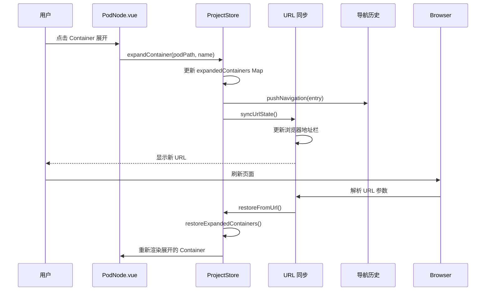

# Struct/Func 展开状态支持计划

## 背景与现状

目前 GoPodView 的前端已经实现了对 **Pod 级别** 展开状态的支持：
- ✅ `expandedPods` 集合记录所有展开的 Pod 路径
- ✅ URL 参数 `expanded` 同步展开的 Pod 列表
- ✅ 导航历史 `navigationHistory` 记录每个状态的展开集合
- ✅ 刷新页面后可从 URL 恢复展开状态

但当前的"展开"仅停留在 **Pod 容器（Container）层面**，用户无法记住哪些 struct/func 是展开的。具体表现为：
- ❌ 展开的 Pod 内部，哪些 Container（struct/func/interface）处于展开状态未被记录
- ❌ 切换视图或刷新后，所有 Container 折叠回默认状态
- ❌ 无法通过 URL 分享包含 Container 展开状态的视图

## 目标

实现对 **Container 级别展开状态** 的完整支持，包括：
1. 在 Store 中维护 Container 展开状态
2. 将 Container 展开状态同步到 URL
3. 导航历史中包含 Container 展开信息
4. 从 URL 恢复时还原 Container 展开状态

---

## 核心设计思路

### 数据结构扩展

当前 Pod 的展开状态使用 `Set<string>` 存储 Pod 路径：
```typescript
const expandedPods = ref<Set<string>>(new Set())
```

需要扩展为支持 Container 的嵌套结构：
```typescript
// 方案 1: 使用 Map 存储 Pod -> Container[] 映射
const expandedContainers = ref<Map<string, Set<string>>>(new Map())
// key: Pod 路径，value: 该 Pod 下展开的 Container 名称集合

// 方案 2: 使用扁平化的路径字符串
const expandedContainers = ref<Set<string>>(new Set())
// key: "podPath:containerName" 组合键
```

**推荐方案 1**：使用 Map 结构更符合层级关系，便于查询和管理。

### URL 参数设计

当前 URL 参数：
```
?project=/path/to/project&file=foo/bar.go&level=expanded&expanded=pod1,pod2,pod3
```

扩展后的 URL 参数：
```
?project=/path/to/project&file=foo/bar.go&level=expanded&expanded=pod1,pod2,pod3&containers=pod1:StructA,pod1:FuncB,pod2:StructC
```

新增参数 `containers`，格式为 `podPath:containerName` 的逗号分隔列表。

### 导航历史记录扩展

当前导航条目：
```typescript
interface NavigationEntry {
  level: ViewLevel
  podPath: string
  expandedPods?: string[]
}
```

扩展后：
```typescript
interface NavigationEntry {
  level: ViewLevel
  podPath: string
  expandedPods?: string[]
  expandedContainers?: Record<string, string[]>  // Pod 路径 -> Container 名称数组
}
```

---

## Task 分解

### Task 1: 类型定义扩展

**修改文件**: `frontend/src/types/index.ts`

1a. 扩展 `NavigationEntry` 接口：
```typescript
export interface NavigationEntry {
  level: ViewLevel
  podPath: string
  expandedPods?: string[]
  expandedContainers?: Record<string, string[]>  // 新增
}
```

1b. （可选）为 `Pod` 添加展开状态字段（如果需要后端支持）：
```typescript
export interface Pod {
  // ... 现有字段
  expandedContainers?: string[]  // 前端使用，无需传给后端
}
```

---

### Task 2: Store 状态管理

**修改文件**: `frontend/src/stores/project.ts`

2a. 新增 Container 展开状态：
```typescript
// 在 store 中添加
const expandedContainers = ref<Map<string, Set<string>>>(new Map())
// Map key: Pod 路径，value: 该 Pod 下展开的 Container 名称集合
```

2b. 新增操作方法：
```typescript
function expandContainer(podPath: string, containerName: string) {
  const newMap = new Map(expandedContainers.value)
  if (!newMap.has(podPath)) {
    newMap.set(podPath, new Set())
  }
  newMap.get(podPath)!.add(containerName)
  expandedContainers.value = newMap
  
  pushNavigation({
    level: viewLevel.value,
    podPath: focusedPodPath.value!,
    expandedPods: snapshotExpandedPods(focusedPodPath.value),
    expandedContainers: snapshotExpandedContainers(),
  })
}

function collapseContainer(podPath: string, containerName: string) {
  if (!expandedContainers.value.has(podPath)) return
  
  const containers = expandedContainers.value.get(podPath)!
  containers.delete(containerName)
  
  if (containers.size === 0) {
    const newMap = new Map(expandedContainers.value)
    newMap.delete(podPath)
    expandedContainers.value = newMap
  } else {
    expandedContainers.value = new Map(expandedContainers.value)
  }
  
  pushNavigation({
    level: viewLevel.value,
    podPath: focusedPodPath.value!,
    expandedPods: snapshotExpandedPods(focusedPodPath.value),
    expandedContainers: snapshotExpandedContainers(),
  })
}

function isContainerExpanded(podPath: string, containerName: string): boolean {
  return expandedContainers.value.get(podPath)?.has(containerName) ?? false
}

function snapshotExpandedContainers(): Record<string, string[]> {
  const result: Record<string, string[]> = {}
  for (const [podPath, containers] of expandedContainers.value.entries()) {
    result[podPath] = Array.from(containers)
  }
  return result
}

function restoreExpandedContainers(snapshot: Record<string, string[]>) {
  const newMap = new Map<string, Set<string>>()
  for (const [podPath, containers] of Object.entries(snapshot)) {
    newMap.set(podPath, new Set(containers))
  }
  expandedContainers.value = newMap
}
```

2c. 在 `expandPod` 和 `collapseInlinePod` 中集成 Container 状态保存：
```typescript
// expandPod 中
pushNavigation({
  level: 'expanded',
  podPath,
  expandedPods: snapshotExpandedPods(podPath),
  expandedContainers: snapshotExpandedContainers(),  // 新增
})

// collapseInlinePod 中
pushNavigation({
  level: 'expanded',
  podPath: focusedPodPath.value,
  expandedPods: snapshotExpandedPods(focusedPodPath.value),
  expandedContainers: snapshotExpandedContainers(),  // 新增
})
```

2d. 在 `applyNavigation` 中恢复 Container 状态：
```typescript
function applyNavigation(entry: NavigationEntry) {
  viewLevel.value = entry.level
  focusedPodPath.value = entry.podPath
  
  if (entry.expandedPods) {
    expandedPods.value = new Set(entry.expandedPods)
  }
  
  if (entry.expandedContainers) {  // 新增
    restoreExpandedContainers(entry.expandedContainers)
  }
  
  selectedContainer.value = null
}
```

2e. 重置视图时清空 Container 状态：
```typescript
function resetView() {
  viewLevel.value = 'global'
  focusedPodPath.value = null
  expandedPods.value = new Set()
  expandedContainers.value = new Map()  // 新增
  selectedContainer.value = null
  // ...
}
```

2f. 在 `focusPod` 时可选择保留或清空 Container 状态（建议清空）：
```typescript
function focusPod(podPath: string) {
  // ...
  expandedPods.value = new Set()
  expandedContainers.value = new Map()  // 新增：聚焦新 Pod 时清空
  // ...
}
```

---

### Task 3: URL 同步逻辑

**修改文件**: `frontend/src/stores/project.ts`

3a. 扩展 `syncUrlState` 函数：
```typescript
function syncUrlState() {
  if (suppressUrlSync.value) return
  
  const params = new URLSearchParams()
  
  if (projectPath.value) {
    params.set('project', projectPath.value)
  }
  
  if (focusedPodPath.value) {
    params.set('file', focusedPodPath.value)
  }
  
  if (viewLevel.value !== 'global') {
    params.set('level', viewLevel.value)
  }
  
  if (viewLevel.value === 'expanded' && focusedPodPath.value) {
    const expanded = snapshotExpandedPods(focusedPodPath.value)
      .filter((path) => path !== focusedPodPath.value)
    
    if (expanded.length > 0) {
      params.set('expanded', expanded.join(','))
    }
    
    // 新增：同步 Container 展开状态
    const containers = snapshotExpandedContainers()
    const containerEntries = Object.entries(containers)
      .flatMap(([podPath, names]) => names.map(name => `${podPath}:${name}`))
    
    if (containerEntries.length > 0) {
      params.set('containers', containerEntries.join(','))
    }
  }
  
  const qs = params.toString()
  const newUrl = qs
    ? `${window.location.pathname}?${qs}`
    : window.location.pathname
  window.history.replaceState(null, '', newUrl)
}
```

3b. 更新 watch 依赖：
```typescript
watch(
  [
    focusedPodPath, 
    viewLevel, 
    projectPath, 
    () => snapshotExpandedPods(focusedPodPath.value).join('|'),
    () => JSON.stringify(snapshotExpandedContainers()),  // 新增
  ],
  syncUrlState,
)
```

---

### Task 4: URL 恢复逻辑

**修改文件**: `frontend/src/stores/project.ts`

4a. 扩展 `restoreFromUrl` 函数：
```typescript
async function restoreFromUrl() {
  const params = new URLSearchParams(window.location.search)
  const project = params.get('project')
  const file = params.get('file')
  const level = params.get('level') as ViewLevel | null
  const expandedParam = params.get('expanded')
  const containersParam = params.get('containers')  // 新增
  
  if (!project) return false
  
  suppressUrlSync.value = true
  
  loading.value = true
  try {
    await api.setProject(project)
    projectPath.value = project
    
    const [tree, podsData] = await Promise.all([
      api.getFileTree(),
      api.getPods(),
    ])
    
    fileTree.value = tree
    pods.value = podsData.pods
    edges.value = podsData.edges
  } finally {
    loading.value = false
  }
  
  suppressUrlSync.value = false
  
  if (file && podMap.value.has(file)) {
    if (level === 'expanded') {
      const expandedList = (expandedParam ?? '')
        .split(',')
        .map((item) => item.trim())
        .filter((item) => item.length > 0 && podMap.value.has(item))
      const expandedListWithRoot = Array.from(new Set([file, ...expandedList]))
      
      await Promise.all(expandedListWithRoot.map((path) => ensurePodSourceCode(path)))
      
      viewLevel.value = 'expanded'
      focusedPodPath.value = file
      expandedPods.value = new Set(expandedListWithRoot)
      
      // 新增：恢复 Container 展开状态
      if (containersParam) {
        const containerMap: Record<string, string[]> = {}
        containersParam.split(',').forEach(entry => {
          const [podPath, containerName] = entry.split(':')
          if (podPath && containerName && podMap.value.has(podPath)) {
            if (!containerMap[podPath]) {
              containerMap[podPath] = []
            }
            containerMap[podPath].push(containerName)
          }
        })
        restoreExpandedContainers(containerMap)
      } else {
        expandedContainers.value = new Map()
      }
      
      selectedContainer.value = null
      navigationHistory.value = [{
        level: 'expanded',
        podPath: file,
        expandedPods: expandedListWithRoot,
        expandedContainers: snapshotExpandedContainers(),
      }]
      historyIndex.value = 0
      syncUrlState()
    } else {
      focusPod(file)
    }
  } else {
    resetView()
  }
  
  return true
}
```

---

### Task 5: PodNode 组件集成

**修改文件**: `frontend/src/components/PodGraph/PodNode.vue`

5a. 引入 Store 方法：
```typescript
import { useProjectStore } from '../../stores/project'

const store = useProjectStore()
```

5b. 在 Container 点击/展开时使用新的状态：
```typescript
function toggleContainer(container: Container) {
  const isExpanded = store.isContainerExpanded(props.pod.path, container.name)
  
  if (isExpanded) {
    store.collapseContainer(props.pod.path, container.name)
  } else {
    store.expandContainer(props.pod.path, container.name)
  }
}
```

5c. 计算属性判断展开状态：
```typescript
const isExpanded = computed(() => {
  return store.isContainerExpanded(props.pod.path, container.name)
})
```

5d. 模板中使用计算属性：
```vue
<div :class="['container-header', { expanded: isExpanded }]" @click="toggleContainer(container)">
  <!-- ... -->
</div>
```

---

### Task 6: 清理与优化

6a. 在 `selectContainer` 中确保 Container 展开：
```typescript
async function selectContainer(podPath: string, containerName: string) {
  // 确保 Container 处于展开状态
  if (!isContainerExpanded(podPath, containerName)) {
    expandContainer(podPath, containerName)
  }
  // ... 现有逻辑
}
```

6b. 性能优化：避免频繁序列化 Map
- 使用计算属性缓存 `snapshotExpandedContainers()` 的结果
- 或使用 lodash 的 `isEqual` 深度比较避免不必要的更新

6c. 考虑是否需要持久化到 localStorage
- 用户偏好设置：是否记住展开状态
- 添加开关：启用/禁用 Container 状态记忆

---

## 数据流图



---

## 风险与挑战

1. **URL 长度限制**
   - 如果展开大量 Container，URL 可能过长
   - 解决方案：限制最大数量或使用 base64 编码压缩

2. **性能问题**
   - Map 的序列化和反序列化可能影响性能
   - 解决方案：防抖处理、缓存计算结果

3. **状态一致性**
   - Pod 被删除或重命名后，Container 状态可能失效
   - 解决方案：恢复时验证 Pod 和 Container 是否存在

4. **向后兼容**
   - 旧 URL 不包含 `containers` 参数时应正常降级
   - 解决方案：可选参数，默认为空

---

## 实施顺序

```
Task 1 (类型定义) — 基础工作，可独立完成
    ↓
Task 2 (Store 状态管理) — 核心逻辑，依赖 Task 1
    ↓
Task 3 (URL 同步) — 依赖 Task 2
    ↓
Task 4 (URL 恢复) — 依赖 Task 2, 3
    ↓
Task 5 (PodNode 集成) — 用户交互，依赖 Task 2
    ↓
Task 6 (清理与优化) — 收尾工作
```

---

## 测试用例

### 功能测试
1. 展开 Pod 中的某个 struct，刷新页面，确认 struct 保持展开
2. 展开多个 Container，后退/前进，确认状态正确恢复
3. 复制包含 `containers` 参数的 URL，在新标签页打开，确认状态一致
4. 聚焦不同 Pod，确认 Container 状态清空

### 边界测试
1. 展开 50+ 个 Container，检查 URL 长度和性能
2. Pod 不存在时，Container 状态应被忽略
3. 空 Pod 或没有 Container 的 Pod，不应出现错误

### 兼容性测试
1. 不带 `containers` 参数的旧 URL 应正常加载
2. 部分 Container 名称无效时应被过滤

---

## 验收标准

✅ 用户可以展开任意 Container 并刷新页面保持状态  
✅ URL 包含 `containers` 参数且格式正确  
✅ 导航历史正确记录和恢复 Container 状态  
✅ 从任意链接分享视图，接收者看到完全相同的状态  
✅ 性能无明显下降，URL 长度在合理范围内  
✅ 代码有完整的 TypeScript 类型定义  

---

## 未来扩展

1. **结构化存储**：使用 JSON 替代扁平化参数，支持更复杂的状态
2. **增量同步**：只同步变化的部分，减少 URL 长度
3. **云同步**：将展开状态保存到云端，跨设备共享
4. **智能记忆**：根据用户习惯自动展开常用的 Container

---

## 总结

本计划通过在 Store 中新增 `expandedContainers` 状态，扩展 URL 参数和导航历史记录，实现了对 Container 级别展开状态的完整支持。实施后，用户可以精确控制和分享每一个 struct/func 的展开状态，获得更加连贯和个性化的浏览体验。
